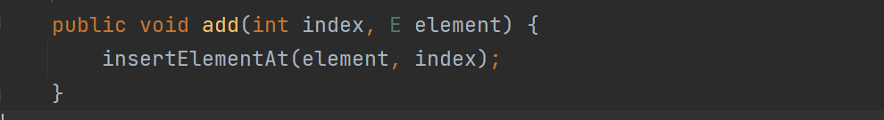
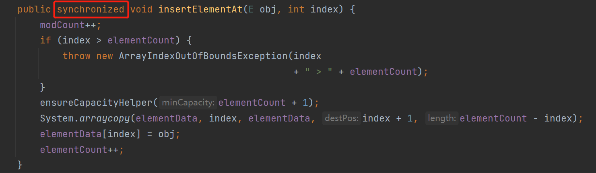
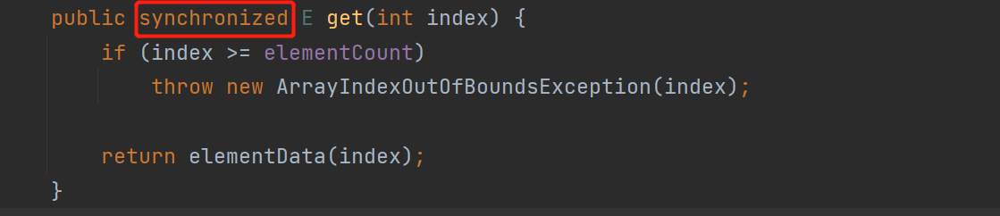
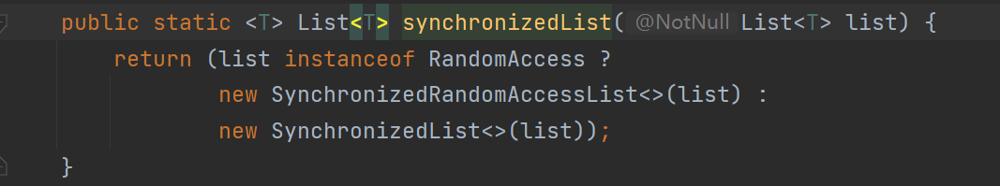
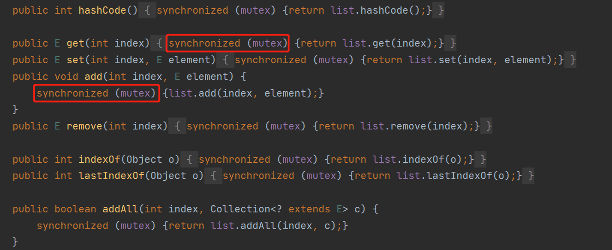
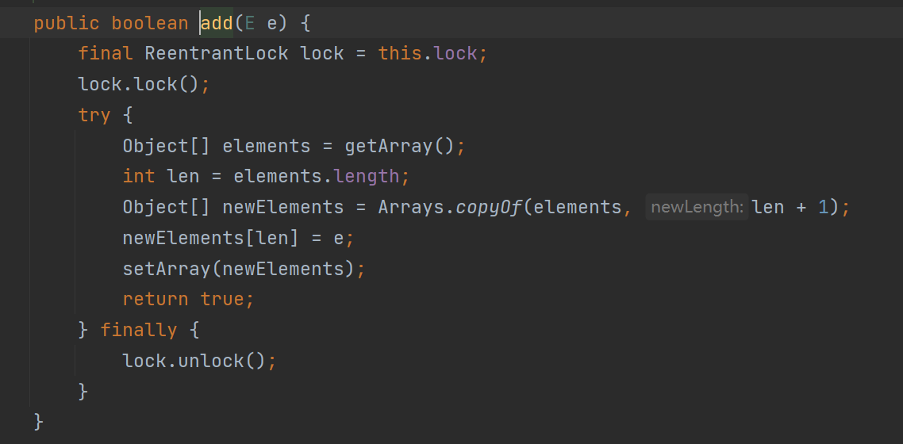
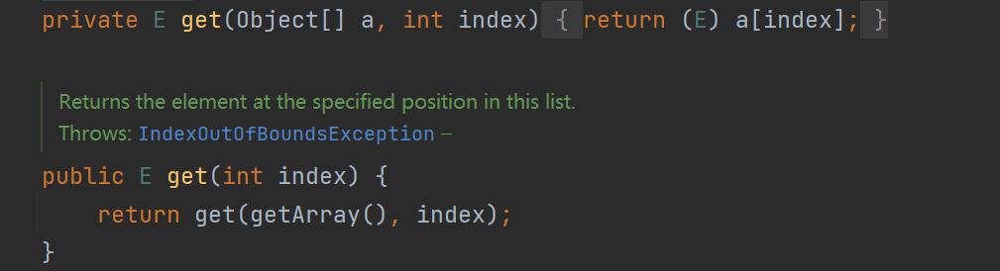

## 线程安全的list解决方案

### Vector

Vector类实现了可扩展的对象数组，并且它是线程安全的。Vector的解决方案很简单,它采用了同步关键词synchronized修饰方法。

### Collections.synchronizedList(list)

无论是读操作还是写操作，它都会进行加锁，当线程的并发级别非常高时就会浪费掉大量的资源，因此某些情况下它并不是一个好的选择。

### CopyOnWriteArrayList

CopyOnwriteArrayList 实现了`读读操作`和`读写操作`不互斥

通过JUC包下的lock来实现线程间的同步的，在面临写操作的时候，CopyOnwriteArrayList会先复制原来的数组并且在新数组上进行修改，最后再将原数组覆盖。如果写操作过程中发生了线程切换。并且切换到读线程，因为此时数组并未发生覆盖，读操作读取的还是原数组。另外，数组定义private transient volatile Object[] array，其中采用volatile修饰，保证内存可见性，读取线程可以马上知道这个修改。

