## Collection接口

Collection 表示一组对象，它是集中、收集的意思。Collection接口的两个子接口是List、Set接口。

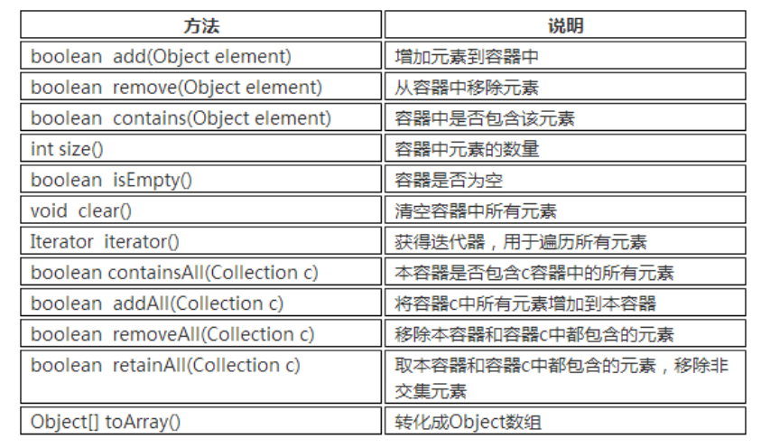

由于List、Set是Collection的子接口，意味着所有List、Set的实现类都有上面的方法。

### List特点和常用方法

List是有序、可重复的容器。

   **有序：**List中每个元素都有索引标记。可以根据元素的索引标记(在List中的位置)访问元素，从而精确控制这些元素。

   **可重复：**List允许加入重复的元素。更确切地讲，List通常允许满足 e1.equals(e2) 的元素重复加入容器。

   除了Collection接口中的方法，List多了一些跟顺序(索引)有关的方法。

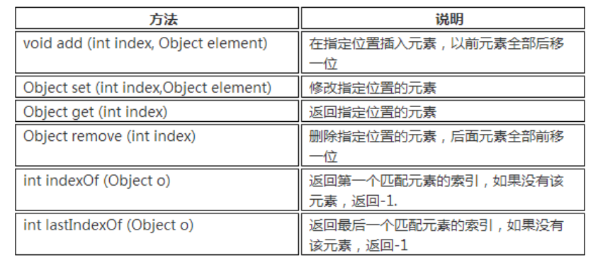

List接口常用的实现类有3个：ArrayList、LinkedList和Vector。

### ArrayList特点和底层实现

ArrayList底层是用数组实现的存储。 特点：查询效率高，增删效率低，线程不安全。

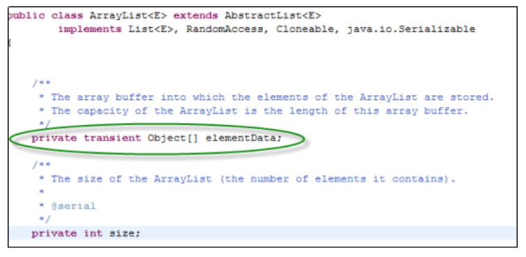

可以看出ArrayList底层使用Object数组来存储元素数据。所有的方法，都围绕这个核心的Object数组来开展。

数组长度是有限的，而ArrayList是可以存放任意数量的对象，长度不受限制，那么它是怎么实现的呢?本质上就是通过定义新的更大的数组，将旧数组中的内容拷贝到新数组，来实现扩容。 ArrayList的Object数组初始化长度为10，如果我们存储满了这个数组，需要存储第11个对象，就会定义新的长度更大的数组，并将原数组内容和新的元素一起加入到新数组中，源码如下：

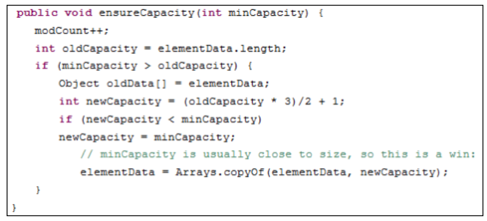

### LinkedList特点和底层实现

LinkedList底层用双向链表实现的存储。特点：查询效率低，增删效率高，线程不安全。

双向链表也叫双链表，是链表的一种，它的每个数据节点中都有两个指针，分别指向前一个节点和后一个节点。 所以，从双向链表中的任意一个节点开始，都可以很方便地找到所有节点。

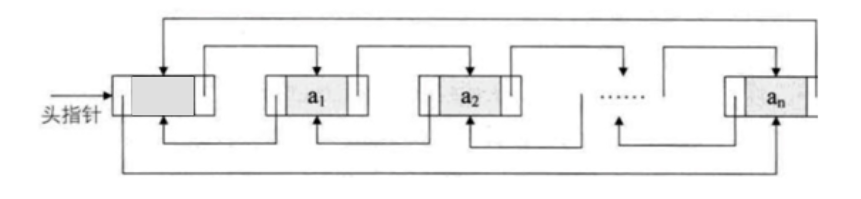

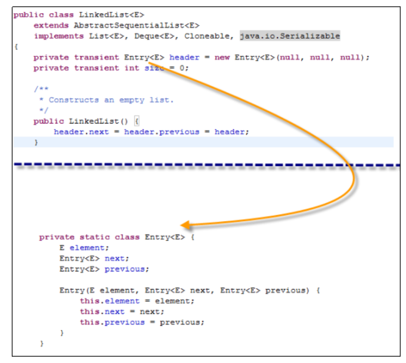

### Vector向量

Vector底层是用数组实现的List，相关的方法都加了同步检查，因此“线程安全,效率低”。 比如，indexOf方法就增加了synchronized同步标记。

如何选用ArrayList、LinkedList、Vector?

1.  需要线程安全时，用Vector。
2. 不存在线程安全问题时，并且查找较多用ArrayList(一般使用它)。
3. 不存在线程安全问题时，增加或删除元素较多用LinkedList。

## Map接口

Map就是用来存储“键(key)-值(value) 对”的。 Map类中存储的“键值对”通过键来标识，所以“键对象”不能重复。

Map 接口的实现类有HashMap、TreeMap、HashTable、Properties等。

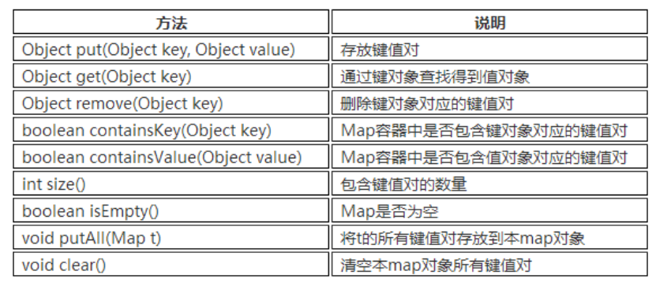

### HashMap和HashTable

HashMap采用哈希算法实现，是Map接口最常用的实现类。 由于底层采用了哈希表存储数据，我们要求键不能重复，如果发生重复，新的键值对会替换旧的键值对。 HashMap在查找、删除、修改方面都有非常高的效率。

HashTable类和HashMap用法几乎一样，底层实现几乎一样，只不过HashTable的方法添加了synchronized关键字确保线程同步检查，效率较低。

**HashMap与HashTable的区别**

1. HashMap: 线程不安全，效率高。允许key或value为null。
2. HashTable: 线程安全，效率低。不允许key或value为null。

### HashMap底层详解

数据结构中由数组和链表来实现对数据的存储，他们各有特点。

1. 数组：占用空间连续。 寻址容易，查询速度快。但是，增加和删除效率非常低。
2. 链表：占用空间不连续。 寻址困难，查询速度慢。但是，增加和删除效率非常高。

哈希表的本质就是“数组+链表”。

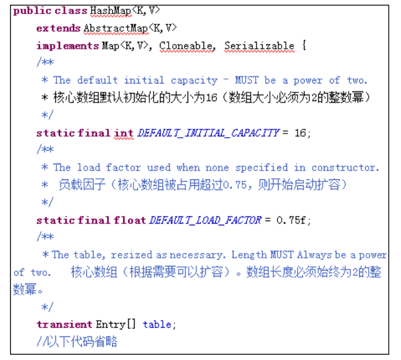

其中的Entry[] table 就是HashMap的核心数组结构，我们也称之为“位桶数组”。我们再继续看Entry是什么，源码如下：

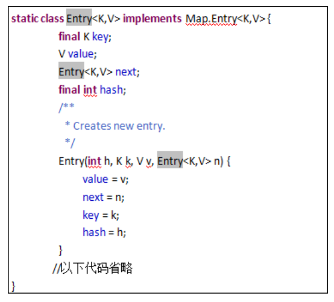

一个Entry对象存储了：

1.  key：键对象 value：值对象
2. next:下一个节点
3. hash: 键对象的hash值

显然每一个Entry对象就是一个单向链表结构，我们使用图形表示一个Entry对象的典型示意：

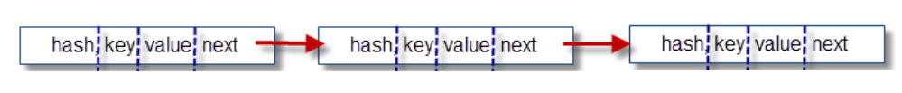

然后，我们画出Entry[]数组的结构(这也是HashMap的结构)：

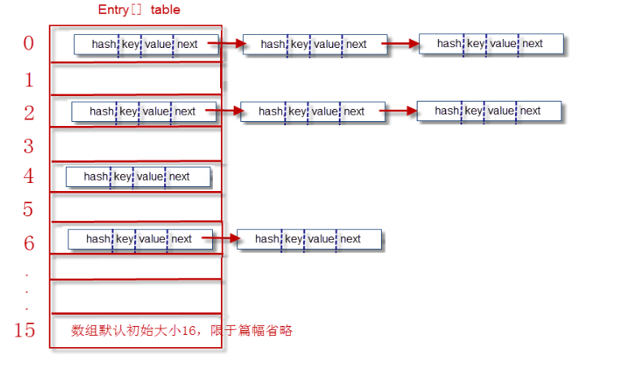

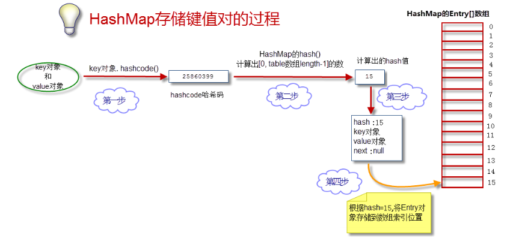

当添加一个元素(key-value)时，首先计算key的hash值，以此确定插入数组中的位置，但是可能存在同一hash值的元素已经被放在数组同一位置了，这时就添加到同一hash值的元素的后面，他们在数组的同一位置，就形成了链表，同一个链表上的Hash值是相同的，所以说数组存放的是链表。 JDK8中，当链表长度大于8时，链表就转换为红黑树，这样又大大提高了查找的效率。

**取数据过程get(key)**

1. 获得key的hashcode，通过hash()散列算法得到hash值，进而定位到数组的位置。
2. 在链表上挨个比较key对象。 调用equals()方法，将key对象和链表上所有节点的key对象进行比较，直到碰到返回true的节点对象为止。
3. 返回equals()为true的节点对象的value对象。

**扩容问题**

HashMap的位桶数组，初始大小为16。实际使用时，显然大小是可变的。如果位桶数组中的元素达到(0.75*数组 length)， 就重新调整数组大小变为原来2倍大小。

扩容很耗时。扩容的本质是定义新的更大的数组，并将旧数组内容挨个拷贝到新数组中。

**JDK8将链表在大于8情况下变为红黑二叉树**

JDK8中，HashMap在存储一个元素时，当对应链表长度大于8时，链表就转换为红黑树，这样又大大提高了查找的效率。

1. 每个节点要么是红色，要么是黑色。
2. 根节点永远是黑色的。
3. 所有的叶节点都是空节点(即 null)，并且是黑色的。
4.  每个红色节点的两个子节点都是黑色。(从每个叶子到根的路径上不会有两个连续的红色节点)
5. 从任一节点到其子树中每个叶子节点的路径都包含相同数量的黑色节点。

这些约束强化了红黑树的关键性质：从根到叶子的最长的可能路径不多于最短的可能路径的两倍长。这样就让树大致上是平衡的。

红黑树是一个更高效的检索二叉树，JDK 提供的集合类 TreeMap、TreeSet 本身就是一个红黑树的实现。

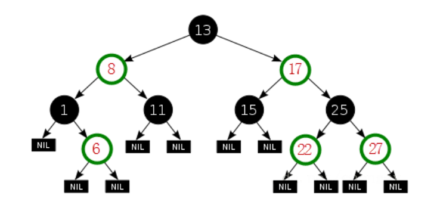

红黑树的基本操作：插入、删除、左旋、右旋、着色。 每插入或者删除一个节点，可能会导致树不在符合红黑树的特征，需要进行修复，进行 “左旋、右旋、着色”操作，使树继续保持红黑树的特性。

### TreeMap

TreeMap和HashMap实现了同样的接口Map，因此，用法对于调用者来说没有区别。HashMap效率高于TreeMap;在需要排序的Map时才选用TreeMap。

## Set接口

Set接口继承自Collection，Set接口中没有新增方法，方法和Collection保持完全一致。我们在前面通过List学习的方法，在Set中仍然适用。

Set容器特点：无序、不可重复。无序指Set中的元素没有索引，我们只能遍历查找;不可重复指不允许加入重复的元素。更确切地讲，新元素如果和Set中某个元素通过equals()方法对比为true，则不能加入;甚至，Set中也只能放入一个null元素，不能多个。

Set常用的实现类有：HashSet、TreeSet等，我们一般使用HashSet。

### HashSet

HashSet是采用哈希算法实现，底层实际是用HashMap实现的(HashSet本质就是一个简化版的HashMap)，因此，查询效率和增删效率都比较高。我们来看一下HashSet的源码：

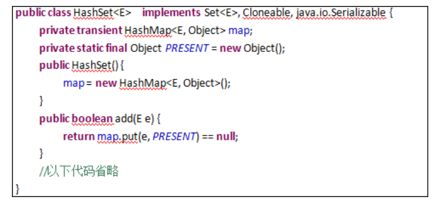

我们发现里面有个map属性，这就是HashSet的核心秘密。我们再看add()方法，发现增加一个元素说白了就是在map中增加一个键值对，键对象就是这个元素，值对象是名为PRESENT的Object对象。说白了，就是“往set中加入元素，本质就是把这个元素作为key加入到了内部的map中”。

由于map中key都是不可重复的，因此，Set天然具有“不可重复”的特性。

### TreeSet

TreeSet底层实际是用TreeMap实现的，内部维持了一个简化版的TreeMap，通过key来存储Set的元素。 TreeSet内部需要对存储的元素进行排序，因此，我们对应的类需要实现Comparable接口。这样，才能根据compareTo()方法比较对象之间的大小，才能进行内部排序。

- 由于是二叉树，需要对元素做内部排序。 如果要放入TreeSet中的类没有实现Comparable接口，则会抛出异常：java.lang.ClassCastException。
- TreeSet中不能放入null元素。

## 迭代器

迭代器为我们提供了统一的遍历容器的方式，参见以下示例代码：

```java
//迭代器遍历List
public class Test {
    public static void main(String[] args) {
        List<String> aList = new ArrayList<String>();
        for (int i = 0; i < 5; i++) {
            aList.add("a" + i);
        }
        System.out.println(aList);
        for (Iterator<String> iter = aList.iterator(); iter.hasNext();) {
            String temp = iter.next();
            System.out.print(temp + "\t");
            if (temp.endsWith("3")) {// 删除3结尾的字符串
                iter.remove();
            }
        }
        System.out.println();
        System.out.println(aList);
    }
}
```

**如果遇到遍历容器时，判断删除元素的情况，使用迭代器遍历!**

```java
//迭代器遍历Set
public class Test {
    public static void main(String[] args) {
        Set<String> set = new HashSet<String>();
        for (int i = 0; i < 5; i++) {
            set.add("a" + i);
        }
        System.out.println(set);
        for (Iterator<String> iter = set.iterator(); iter.hasNext();) {
            String temp = iter.next();
            System.out.print(temp + "\t");
        }
        System.out.println();
        System.out.println(set);
    }
}
```

```java
//迭代器遍历Map
public class Test {
    public static void main(String[] args) {
        Map<String, String> map = new HashMap<String, String>();
        map.put("A", "高淇");
        map.put("B", "高小七");
        Set<Entry<String, String>> ss = map.entrySet();
        for (Iterator<Entry<String, String>> iterator = ss.iterator(); iterator.hasNext();) {
            Entry<String, String> e = iterator.next();
            System.out.println(e.getKey() + "--" + e.getValue());
        }
    }
}
```

```java
//迭代器遍历Map
public class Test {
    public static void main(String[] args) {
        Map<String, String> map = new HashMap<String, String>();
        map.put("A", "高淇");
        map.put("B", "高小七");
        Set<String> ss = map.keySet();
        for (Iterator<String> iterator = ss.iterator(); iterator.hasNext();) {
            String key = iterator.next();
            System.out.println(key + "--" + map.get(key));
        }
    }
}
```

## 遍历集合方法总结

**遍历List方法一：普通for循环**

```java
for(int i=0;i<list.size();i++){//list为集合的对象名
    String temp = (String)list.get(i);
    System.out.println(temp);
}
```

**遍历List方法二：增强for循环(使用泛型!)**

```java
for (String temp : list) {
System.out.println(temp);
}
```

**遍历List方法三：使用Iterator迭代器(1)**

```java
for(Iterator iter= list.iterator();iter.hasNext();){
    String temp = (String)iter.next();
    System.out.println(temp);
}
```

**遍历List方法四：使用Iterator迭代器(2)**

```java
Iterator  iter =list.iterator();
while(iter.hasNext()){
    Object  obj =  iter.next();
    iter.remove();//如果要遍历时，删除集合中的元素，建议使用这种方式！
    System.out.println(obj);
}
```

**遍历Set方法一：增强for循环**

```java
for(String temp:set){
System.out.println(temp);
}
```

**遍历Set方法二：使用Iterator迭代器**

```java
for(Iterator iter = set.iterator();iter.hasNext();){
    String temp = (String)iter.next();
    System.out.println(temp);
}
```

**遍历Map方法一：根据key获取value**

```java
Map<Integer, Man> maps = new HashMap<Integer, Man>();
Set<Integer>  keySet =  maps.keySet();
for(Integer id : keySet){
System.out.println(maps.get(id).name);
}
```

**遍历Map方法二：使用entrySet**

```java
Set<Entry<Integer, Man>>  ss = maps.entrySet();
for (Iterator iterator = ss.iterator(); iterator.hasNext();) {
    Entry e = (Entry) iterator.next(); 
    System.out.println(e.getKey()+"--"+e.getValue());
```

## Collections工具类

类 java.util.Collections 提供了对Set、List、Map进行排序、填充、查找元素的辅助方法。

1. void sort(List) //对List容器内的元素排序，排序的规则是按照升序进行排序。
2. void shuffle(List) //对List容器内的元素进行随机排列。
3.  void reverse(List) //对List容器内的元素进行逆续排列 。
4. void fill(List, Object) //用一个特定的对象重写整个List容器。
5. int binarySearch(List, Object)//对于顺序的List容器，采用折半查找的方法查找特定对象。

## 总结

1. Collection 表示一组对象，它是集中、收集的意思，就是把一些数据收集起来。
2. Collection接口的两个子接口：
   1. List中的元素有顺序，可重复。常用的实现类有ArrayList、LinkedList和 vector。
      1. ArrayList特点：查询效率高，增删效率低，线程不安全。
      2. LinkedList特点：查询效率低，增删效率高，线程不安全。
      3. vector特点：线程安全,效率低,其它特征类似于ArrayList。
   2. Set中的元素没有顺序，不可重复。常用的实现类有HashSet和TreeSet。
      1. HashSet特点：采用哈希算法实现,查询效率和增删效率都比较高。
      2. TreeSet特点：内部需要对存储的元素进行排序。因此，我们对应的类需要实现Comparable接口。这样，才能根据compareTo()方法比较对象之间的大小，才能进行内部排序。
3. 实现Map接口的类用来存储键(key)-值(value) 对。Map 接口的实现类有HashMap和TreeMap等。Map类中存储的键-值对通过键来标识，所以键值不能重复。
4. Iterator对象称作迭代器，用以方便的实现对容器内元素的遍历操作。
5. 类 java.util.Collections 提供了对Set、List、Map操作的工具方法。
6. 如下情况，可能需要我们重写equals/hashCode方法：
   1. 要将我们自定义的对象放入HashSet中处理。
   2. 要将我们自定义的对象作为HashMap的key处理。
   3. 放入Collection容器中的自定义对象后，可能会调用remove、contains等方法时。
7. JDK1.5以后增加了泛型。泛型的好处：
   1. 向集合添加数据时保证数据安全。
   2. 遍历集合元素时不需要强制转换。
