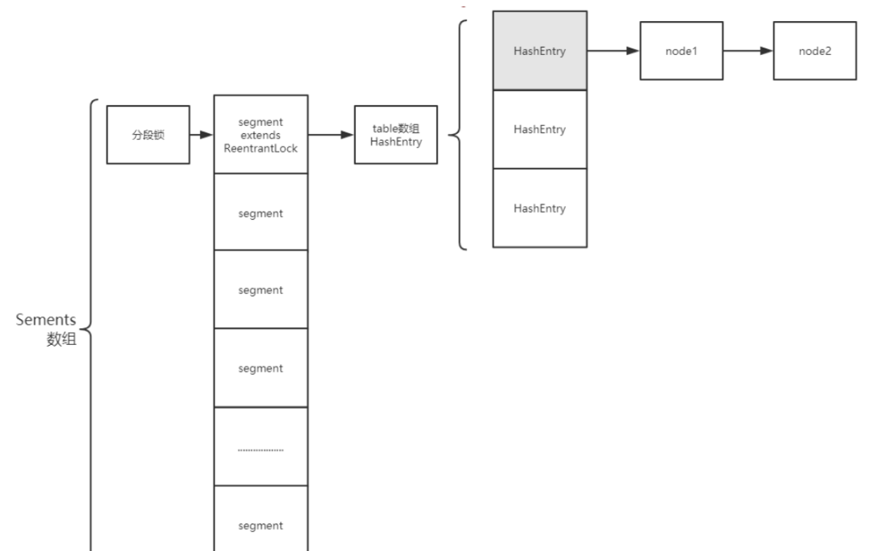

## JDK7 ConcurrentHashMap

在jdk1.7版本的时候ConcurrentHashMap是一个分段锁，采用segments数组+HashEntry数组+链表。

底层一个Segments数组，存储一个Segments对象，每个segment是继承ReentrantLock互斥锁，具有加解锁的功能，一个Segments中储存一个Entry数组，存储的每个Entry对象又是一个链表头结点。

### put

先对key做hash,找到segment数组中的位置index，然后竞争lock锁，如果获取到了锁，那就获取到了segment桶，然后再次hash确定存放的HashEntry数组的位置，然后插入数组到链表中，如果在链表中找到相同节点，则覆盖，没有就放到链表尾部。

### get

get操作不用加锁，先对key做hash,找到segment数组中的位置index，然后再次hash确定存放的HashEntry数组的位置，然后在该位置的链表查找值。

**分段锁 对整个桶数组进行了分割分段(Segment)，每一把锁只锁容器的Segment的数据，多线程访问容器里不同数据段的数据，就不会存在锁竞争，提高并发访问率。**

## JDK8 ConcurrentHashMap

jdk1.8版本的ConcurrentHashMap是Node数组+链表+红黑树，和hashMap1.8版本类似用Synchronzie同步代码块和cas原子操作维护线程安全。

Node数组使用来存放树或者链表的头结点，当一个链表中的数量到达一个数目时，会使查询速率降低，所以到达一定阈值时，会将一个链表转换为一个红黑二叉树，通告查询的速率。

- LOAD_FACTOR: 负载因子, 默认75%, 当table使用率达到75%时, 为减少table的hash碰撞, tabel长度将扩容一倍。负载因子计算: 元素总个数%table.lengh

- TREEIFY_THRESHOLD: 默认8, 当链表长度达到8时, 将结构转变为红黑树。

- UNTREEIFY_THRESHOLD: 默认6, 红黑树转变为链表的阈值。

- MIN_TRANSFER_STRIDE: 默认16, table扩容时, 每个线程最少迁移table的槽位个数。

- MOVED: 值为-1, 当Node.hash为MOVED时, 代表着table正在扩容TREEBIN, 值为-2, 代表此元素后接红黑树。

- nextTable: table迁移过程临时变量, 在迁移过程中将元素全部迁移到nextTable上。

- sizeCtl: 用来标志table初始化和扩容的,不同的取值代表着不同的含义:

  - 0: table还没有被初始化

  - -1: table正在初始化

  - 小于-1: 实际值为resizeStamp(n)<<RESIZE_STAMP_SHIFT+2, 表明table正在扩容

  - 大于0: 初始化完成后, 代表table最大存放元素的个数, 默认为0.75*n

- transferIndex: table容量从n扩到2n时, 是从索引n->1的元素开始迁移,transferIndex代表当前已经迁移的元素下标
- ForwardingNode: 一个特殊的Node节点, 其hashcode=MOVED, 代表着此时table正在做扩容操作。扩容期间, 若table某个元素为null, 那么该元素设置为ForwardingNode, 当下个线程向这个元素插入数据时, 检查hashcode=MOVED, 就会帮着扩容。

### 构造方法

并没有直接new出来一个Node数组，只检查了数值之后确定容量大小，会在第一次put操作的时候判断Node数组是否为空，才会调用intiTable方法进行初始化。

### put

判断Node数组是否为空，如果为空调用initTable方法进行初始化，方法里会用cas操作去修改sizeCtl属性的值，如果一个线程修改成-1（表示正在初始化）成功则对Node数组进行初始化。

初始化成功后，根据key的hash值&位运算找到Node数组的位置index，如果index位置上没有元素，则将根据这个key创建一个Node节点使用cas原子操作写入Node数组中，如果已经存在元素，则进入Synchronize同步代码，如果该节点hash不小于0，开始构建链表，判断链表中是否存在新建的Node，如果存在就覆盖，不存在就插入链表的尾部；如果该节点是TreeBin类型的节点，说明是红黑树结构，则通过putTreeVal方法往红黑树中插入节点； 如果binCount不为0，说明put操作对数据产生了影响，如果当前链表的个数达到8个，并且容量达到64，则通过treeifyBin方法转化为红黑树存储；如果put的时候遇到了数组在扩容（node数组位置的元素是ForwardingNode节点，该节点的hash值为-1，判断hash==move），当前线程会去帮忙迁移，调用helpTransfer()协助扩容。

helpTransfer方法里主要做了如下事情:

- 检查是否扩容完成
- 对sizeCtrl = sizeCtrl+1, 然后调用transfer()进行真正的扩容。

### transfer

扩容的整体步骤就是新建一个nextTab, size是之前的2倍, 将table上的非空元素迁移到nextTab上面去。

### get

根据key的hash值&位运算找到Node数组的位置index，然后在该位置的链表中获取，如果Key的值< 0 ,说明是红黑树

**为什么要用synchronized，cas不是已经可以保证操作的线程安全吗？**
CAS也是适用一些场合的，比如资源竞争小时，是非常适用的，不用进行内核态和用户态之间的线程上下文切换，同时自旋概率也会大大减少，提升性能，但资源竞争激烈时（比如大量线程对同一资源进行写和读操作）并不适用，自旋概率会大大增加，从而浪费CPU资源，降低性能。

## 基础概述

ConcurrentHashMap和HashMap原理基本类似，只是在HashMap的基础上需要支持并发操作，保证多线程情况下对HashMap操作的安全性。当某个线程对集合内的元素进行数据操作时，会锁定这个元素，如果其他线程操作的数据hash得到相同的位置，就必须等到这个线程释放锁之后才能进行操作。

HashMap：非线程安全的，多线程同时访问一个HashMap实例会存在线程安全问题。

HashTable：线程安全的，方法上都加了synchronized锁，能保证线程安全，但是锁的粒度太大，性能低。

为了去优化，在性能和线程安全方面做个平衡，所以引入ConcurrentHashMap，在方法内部代码块上加了synchronized锁。

## 存储结构和实现

jdk7：使用segment分段锁，锁的粒度大
jdk8：使用链表 + 红黑树，针对节点加锁

ConcurrentHashMap和HashMap原理基本类似，只是在HashMap的基础上需要支持并发操作，保证多线程情况下对HashMap操作的安全性。当某个线程对集合内的元素进行数据操作时，会锁定这个元素，如果其他线程操作的数据hash得到相同的位置，就必须等到这个线程释放锁之后才能进行操作。

## 数据结构

- 最外层是初始16位长度的数组，数据达到阈值（16 * 0.75）时会自动扩容（16 >> 1 = 32）
- 插入数据时，先对key进行hash计算得到数据将要插入到数组的位置下标，如果此位置为空，则插入；
- 如果此位置有数据，并且key相同，则替换做修改操作；
- 如果此位置有数据，但key不同，则追加到此下标位置；
- 初始情况下标位置是以单向链表结构存储数据，后续数据追加到链表尾部；
- 当数组长度扩容到64，且某个位置链表长度达到8时，会将单向链表转换为红黑树结构
- 做删除操作时，如果某个位置元素小于8时，会将红黑树转换为单向链表

**为什么扩容因子设置为0.75，链表长度阈值为8？**

遵循泊松分布(Poisson Distribution)，这样可以让链表转红黑树的几率很小，链表转红黑树会有性能损耗。

**扩容过程**（满足两种情况会扩容）：

- 当新增节点后，所在位置链表元素个数达到阈值8，并且数组长度小于64；
- 当增加集合元素后，当前数组内元素个数达到扩容阈值（16 * 0.75）时就会触发扩容；
- 当线程处于扩容状态下，其他线程对集合进行操作时会参与帮助扩容；

默认是16位长度的数组，如果扩容就会新创建一个32位长度的数组，并对数据进行迁移，采用高低位迁移；

## 高低位迁移原理

扩容之后，数据迁移，有些数据需要迁移，有些数据不需要，低位不变，高位迁移；

数据扩容，但是计算存储位置下标的公式不变：i = (n - 1) & hash，所以有些key在扩容前后得到的下标位置相同，而有些key在扩容后hash得到的下标位置发生了改变；

假设：某个key的hash为9，数组长度为16，扩容到32，hash后得到的位置依然是9

假设：某个key，数组长度为16时hash值为4，而扩容为32长度时hash值变成了20

所以，table长度发生变化之后，获取同一个key在集合数组中的位置发生了变化，那么就需要迁移

**链表转红黑树**

当数组长度大于等于64，且某个数组位置的链表长度大于等于8，会把该位置链表转化为红黑树

**hash冲突**

在ConcurrentHashMap中，通过链式寻址解决hash冲突问题。

## jdk7版本HashMap为什么线程不安全？为什么会导致死循环？

HashMap本身是线程不安全的，因为没有加锁保证同一时间点只有一个线程去操作。而jdk7中线程不安全体现在会造成死循环、数据丢失问题。JDK8通过增加loHead和loTail进行了修复。

jdk7版本的HashMap扩容操作中，transfer方法使用头插法将元素迁移到新的数组中，而头插法正是造成死循环的关键。

假如A、B两个线程同时进行HashMap的put操作并触发扩容，当A线程执行一段后时间片切换，线程B完成了扩容插入，然后线程A继续执行，会在HashMap的Entry链表上形成一个循环链（如图中节点3与节点7之间），下次操作时会发生死循环。

此外，线程A在插入过程中，节点5数据丢失。

## 为什么每次扩容乘以2？为什么2可以减少hash冲突？

每次扩容乘以2，这样保证扩容后的数组长度用于是2的幂次方，这样可以减少hash冲突。
因为数组位置下标的计算方式是 (n - 1) & hash，而2的幂次方 - 1 得到的二进制数都是1，hash冲突可能性最小。
比如16 - 1 = 15， 二进制：1111；32 - 1 = 31， 二进制：11111；64 - 1 = 63， 二进制：111111

## 使用方法

computeIfAbsent：如果不存在则修改值
computeIfPresent：如果存在则修改值
compute：computeIfAbsent和computeIfPresent的结合
merge：数据合并

