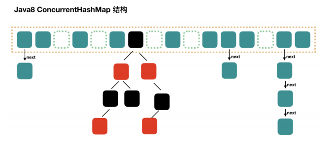
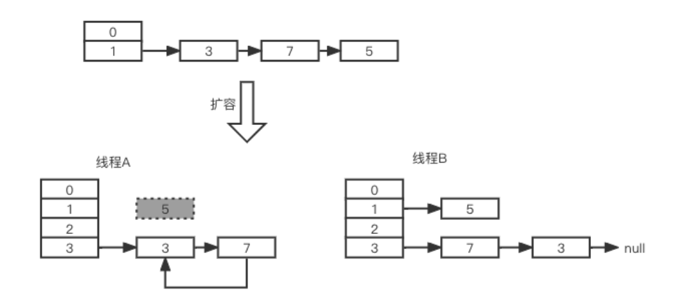

## 基础概述

ConcurrentHashMap和HashMap原理基本类似，只是在HashMap的基础上需要支持并发操作，保证多线程情况下对HashMap操作的安全性。当某个线程对集合内的元素进行数据操作时，会锁定这个元素，如果其他线程操作的数据hash得到相同的位置，就必须等到这个线程释放锁之后才能进行操作。

HashMap：非线程安全的，多线程同时访问一个HashMap实例会存在线程安全问题。

HashTable：线程安全的，方法上都加了synchronized锁，能保证线程安全，但是锁的粒度太大，性能低。

为了去优化，在性能和线程安全方面做个平衡，所以引入ConcurrentHashMap，在方法内部代码块上加了synchronized锁。

### 存储结构和实现

jdk7：使用segment分段锁，锁的粒度大
jdk8：使用链表 + 红黑树，针对节点加锁

ConcurrentHashMap和HashMap原理基本类似，只是在HashMap的基础上需要支持并发操作，保证多线程情况下对HashMap操作的安全性。当某个线程对集合内的元素进行数据操作时，会锁定这个元素，如果其他线程操作的数据hash得到相同的位置，就必须等到这个线程释放锁之后才能进行操作。

### 数据结构

- 最外层是初始16位长度的数组，数据达到阈值（16 * 0.75）时会自动扩容（16 >> 1 = 32）
- 插入数据时，先对key进行hash计算得到数据将要插入到数组的位置下标，如果此位置为空，则插入；
- 如果此位置有数据，并且key相同，则替换做修改操作；
- 如果此位置有数据，但key不同，则追加到此下标位置；
- 初始情况下标位置是以单向链表结构存储数据，后续数据追加到链表尾部；
- 当数组长度扩容到64，且某个位置链表长度达到8时，会将单向链表转换为红黑树结构
- 做删除操作时，如果某个位置元素小于8时，会将红黑树转换为单向链表

**为什么扩容因子设置为0.75，链表长度阈值为8？**

遵循泊松分布(Poisson Distribution)，这样可以让链表转红黑树的几率很小，链表转红黑树会有性能损耗。

**扩容过程**（满足两种情况会扩容）：

- 当新增节点后，所在位置链表元素个数达到阈值8，并且数组长度小于64；
- 当增加集合元素后，当前数组内元素个数达到扩容阈值（16 * 0.75）时就会触发扩容；
- 当线程处于扩容状态下，其他线程对集合进行操作时会参与帮助扩容；

默认是16位长度的数组，如果扩容就会新创建一个32位长度的数组，并对数据进行迁移，采用高低位迁移；

### 高低位迁移原理

扩容之后，数据迁移，有些数据需要迁移，有些数据不需要，低位不变，高位迁移；

数据扩容，但是计算存储位置下标的公式不变：i = (n - 1) & hash，所以有些key在扩容前后得到的下标位置相同，而有些key在扩容后hash得到的下标位置发生了改变；

假设：某个key的hash为9，数组长度为16，扩容到32，hash后得到的位置依然是9

假设：某个key，数组长度为16时hash值为4，而扩容为32长度时hash值变成了20

所以，table长度发生变化之后，获取同一个key在集合数组中的位置发生了变化，那么就需要迁移

**链表转红黑树**

当数组长度大于等于64，且某个数组位置的链表长度大于等于8，会把该位置链表转化为红黑树

**hash冲突**

在ConcurrentHashMap中，通过链式寻址解决hash冲突问题。

### jdk7版本HashMap为什么线程不安全？为什么会导致死循环？

HashMap本身是线程不安全的，因为没有加锁保证同一时间点只有一个线程去操作。而jdk7中线程不安全体现在会造成死循环、数据丢失问题。JDK8通过增加loHead和loTail进行了修复。

jdk7版本的HashMap扩容操作中，transfer方法使用头插法将元素迁移到新的数组中，而头插法正是造成死循环的关键。

假如A、B两个线程同时进行HashMap的put操作并触发扩容，当A线程执行一段后时间片切换，线程B完成了扩容插入，然后线程A继续执行，会在HashMap的Entry链表上形成一个循环链（如图中节点3与节点7之间），下次操作时会发生死循环。

此外，线程A在插入过程中，节点5数据丢失。

### 为什么每次扩容乘以2？为什么2可以减少hash冲突？

每次扩容乘以2，这样保证扩容后的数组长度用于是2的幂次方，这样可以减少hash冲突。
因为数组位置下标的计算方式是 (n - 1) & hash，而2的幂次方 - 1 得到的二进制数都是1，hash冲突可能性最小。
比如16 - 1 = 15， 二进制：1111；32 - 1 = 31， 二进制：11111；64 - 1 = 63， 二进制：111111

### 使用方法

computeIfAbsent：如果不存在则修改值
computeIfPresent：如果存在则修改值
compute：computeIfAbsent和computeIfPresent的结合
merge：数据合并

