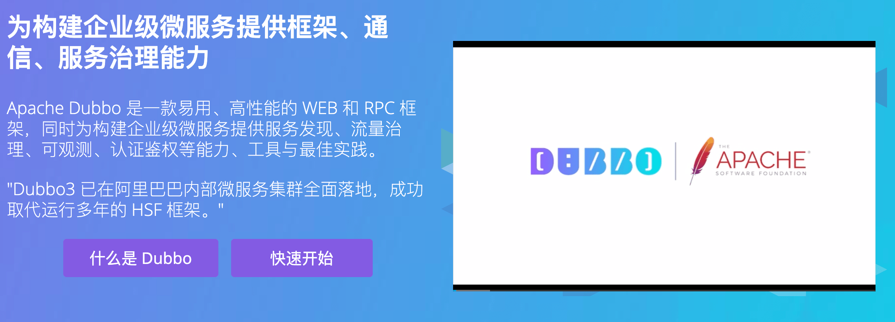
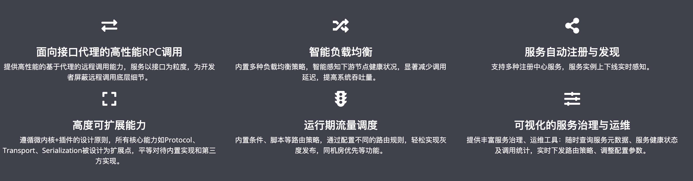
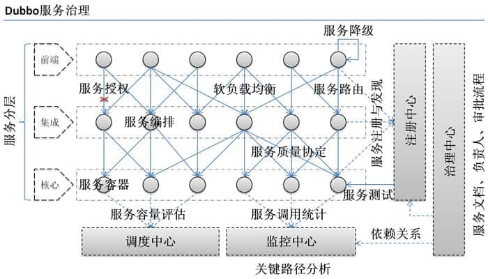
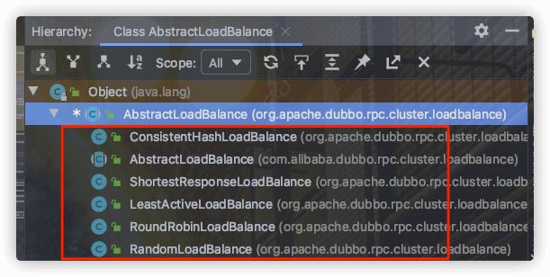

## Dubbo基础

### 什么是Dubbo



根据 Dubbo 官方文档open in new window的介绍，Dubbo 提供了六大核心能力面向接口代理的高性能 RPC 调用。智能容错和负载均衡。服务自动注册和发现。高度可扩展能力。运行期流量调度。可视化的服务治理与运维。



简单来说就是：**Dubbo 不光可以帮助我们调用远程服务，还提供了一些其他开箱即用的功能比如智能负载均衡。**

### 为什么要用Dubbo



Dubbo是一个开源的分布式服务框架，它帮助我们解决了以下几个问题：

1. 服务治理：Dubbo提供了服务注册和发现的功能，可以集中管理和监控分布式环境中的服务，使得服务的调用更加方便和可控。
2. 服务调用：Dubbo支持高性能的远程服务调用，提供了多种通信协议和序列化方式，可以根据需求选择最适合的调用方式，同时还支持负载均衡和容错处理，确保服务调用的高可用性和可靠性。
3. 分布式部署：Dubbo支持服务的分布式部署和扩展，可以将服务部署在不同的节点上，通过配置实现负载均衡和集群管理，提高系统的整体性能和可伸缩性。
4. 监控和管理：Dubbo提供了丰富的监控和管理功能，可以统计和展示服务的调用情况、性能指标和运行状态，方便进行故障排查、性能优化和资源管理。
5. 高可扩展性：Dubbo框架具有高度的可扩展性，可以与其他组件和中间件集成，例如与Spring框架结合使用，与消息队列和缓存系统集成，以满足不同场景下的需求。

总的来说，Dubbo帮助我们解决了分布式系统中的服务治理、服务调用、分布式部署、监控和管理等方面的问题，提供了一套完整的分布式服务框架，简化了分布式系统的开发和维护工作。

## Dubbo架构

### Dubbo架构中的核心角色


在Dubbo架构中，有以下几个核心角色：

1. 服务提供者（Provider）：提供具体的服务实现，将服务发布到注册中心，等待消费者的调用。
2. 服务消费者（Consumer）：消费者通过注册中心获取服务提供者的地址列表，并调用相应的服务。
3. 注册中心（Registry）：用于服务的注册和发现，服务提供者将自己的地址注册到注册中心，消费者从注册中心获取服务提供者的地址列表。
4. 监控中心（Monitor）：用于监控服务的调用情况、性能指标等，收集和展示相关的数据。
5. 配置中心（Config Center）：用于集中管理和配置Dubbo的相关配置信息，方便动态调整和管理。
6. 路由（Router）：用于根据路由规则决定请求的路由方式，可以实现负载均衡、灰度发布等功能。
7. 代理（Proxy）：Dubbo使用动态代理机制实现远程服务的调用，将消费者的调用转发到服务提供者。
8. 序列化（Serialization）：Dubbo支持多种序列化方式，用于将对象转换成字节流进行网络传输。

这些角色在Dubbo架构中协同工作，实现了服务的注册和发现、服务调用、监控和管理等功能，构建了一个分布式服务框架。

### Dubbo中的Invoker概念


在Dubbo中，Invoker是一个核心概念，用于表示服务的调用者和被调用者。它是一个抽象接口，定义了服务调用的方法。

具体来说，Invoker接口包含以下方法：

- `invoke(Invocation invocation)`: 调用服务方法。通过传入Invocation对象，可以获取方法名、参数等调用相关信息。
- `getInterface()`: 获取服务接口的类型。
- `getUrl()`: 获取Invoker对应的URL，URL中包含了服务提供者的地址、协议等信息。

Invoker有两个主要的实现类：

1. `AbstractInvoker`: 是一个抽象类，实现了Invoker接口的一些通用逻辑，如对Invocation的处理、异常处理等。通常情况下，我们不直接使用该类。
2. `AbstractProxyInvoker`: 继承自AbstractInvoker，是服务代理的具体实现类。它通过动态代理机制将服务的接口代理为实际的调用逻辑，实现了服务消费者与服务提供者之间的远程调用。

Invoker的使用是Dubbo进行服务调用的基础，它提供了服务的调用和管理的统一接口，使得服务消费者能够通过Invoker实现与服务提供者之间的通信和交互。

## Dubbo的工作原理

1. 服务提供者向注册中心注册：服务提供者在启动时向注册中心注册自己所提供的服务，包括服务的名称、地址、协议等信息。
2. 服务消费者从注册中心订阅服务：服务消费者在启动时从注册中心订阅所需的服务，获取服务的提供者地址列表。
3. 服务调用过程：
   - 服务消费者通过代理对象调用服务：服务消费者通过生成代理对象来调用远程服务，实际上是调用了代理对象的方法。
   - 代理对象封装调用信息：代理对象将调用的方法、参数等信息封装成一个Invocation对象，并将其发送给远程的服务提供者。
   - 负载均衡选择合适的服务提供者：Dubbo的负载均衡模块从服务提供者列表中选择一个合适的服务提供者来处理请求，可以根据配置的负载均衡策略选择。
   - 远程调用服务提供者：服务消费者通过网络将Invocation对象发送给选择的服务提供者，服务提供者收到请求后执行相应的服务逻辑。
   - 服务提供者返回结果：服务提供者将执行结果封装成一个Response对象，通过网络返回给服务消费者。
   - 服务消费者获取结果：服务消费者接收到服务提供者的响应，将其转换成所需的结果，完成调用过程。

Dubbo还提供了丰富的功能和扩展点，包括负载均衡、集群容错、服务治理、协议适配等，可以根据具体的需求进行配置和扩展。通过这些机制，Dubbo实现了高性能、可扩展和易用性的分布式服务调用框架。


- **config 配置层**：Dubbo 相关的配置。支持代码配置，同时也支持基于 Spring 来做配置，以 `ServiceConfig`, `ReferenceConfig` 为中心
- **proxy 服务代理层**：调用远程方法像调用本地的方法一样简单的一个关键，真实调用过程依赖代理类，以 `ServiceProxy` 为中心。
- **registry 注册中心层**：封装服务地址的注册与发现。
- **cluster 路由层**：封装多个提供者的路由及负载均衡，并桥接注册中心，以 `Invoker` 为中心。
- **monitor 监控层**：RPC 调用次数和调用时间监控，以 `Statistics` 为中心。
- **protocol 远程调用层**：封装 RPC 调用，以 `Invocation`, `Result` 为中心。
- **exchange 信息交换层**：封装请求响应模式，同步转异步，以 `Request`, `Response` 为中心。
- **transport 网络传输层**：抽象 mina 和 netty 为统一接口，以 `Message` 为中心。
- **serialize 数据序列化层**：对需要在网络传输的数据进行序列化。

### Dubbo的SPI机制？如何扩展Dubbo中的默认实现？

Dubbo的SPI（Service Provider Interface）机制是一种基于接口的扩展机制，它允许用户通过配置文件来动态地替换或扩展Dubbo框架中的默认实现。

Dubbo的SPI机制主要由以下几个部分组成：

1. 扩展点接口（Extension Point Interface）：Dubbo框架中的核心组件定义了一些扩展点接口，这些接口通常是通过`@SPI`注解进行标记。例如，`Protocol`接口就是一个扩展点接口，定义了服务暴露和引用的协议。

2. 扩展点接口的扩展实现类：Dubbo提供了一些默认的扩展实现类，用于实现扩展点接口的具体功能。

3. 扩展点接口的配置文件：在`META-INF/dubbo`目录下，Dubbo提供了一个`internal`文件夹，其中包含了各个扩展点接口的配置文件。这些配置文件的命名规则为`扩展点接口全限定名`，例如`com.alibaba.dubbo.rpc.Protocol`。在配置文件中，可以指定该扩展点接口的默认实现类。

4. 扩展点加载和使用：Dubbo在加载扩展点时会根据配置文件中指定的默认实现类来加载扩展点接口的具体实现。用户可以通过`@Adaptive`注解或者配置文件中的`key=value`键值对来选择具体的实现类。

如果要扩展Dubbo中的默认实现，可以按照以下步骤进行操作：

1. 创建一个实现了扩展点接口的新类，该类实现了扩展点接口的功能。
2. 在`META-INF/dubbo`目录下创建一个与扩展点接口对应的配置文件，例如`com.alibaba.dubbo.rpc.Protocol`。
3. 在配置文件中指定新类的名称，并将其设置为默认实现类。

通过以上步骤，Dubbo会根据配置文件中的配置加载新的扩展点实现类，从而替换或扩展默认的实现。

需要注意的是，在Dubbo的SPI机制中，配置文件的加载顺序是根据文件名的字典序进行的，后加载的配置会覆盖先加载的配置。因此，如果有多个配置文件针对同一个扩展点接口，后加载的配置会生效。

总的来说，Dubbo的SPI机制提供了一种灵活的方式来扩展和替换Dubbo框架中的默认实现，使用户能够根据需求自定义和定制Dubbo的功能。

### Dubbo的微内核架构

Dubbo的微内核架构是指Dubbo框架本身只提供了一个轻量级的核心容器，它负责管理和协调各个模块的生命周期，以及提供基础的扩展点机制和配置管理。而具体的功能实现，如协议、注册中心、集群、负载均衡等，则通过扩展点的方式由各个独立的模块来完成。

Dubbo的微内核架构具有以下特点：

1. 核心容器：Dubbo框架提供了一个轻量级的容器，负责加载和管理各个模块的生命周期。它提供了基本的依赖注入和依赖查找的功能，同时还能管理模块的启动和停止。
2. 扩展点机制：Dubbo的扩展点机制允许用户自定义和替换各个模块的实现。每个模块都定义了一个或多个扩展点接口，用户可以通过配置文件或注解来选择具体的实现类。
3. 模块化设计：Dubbo将功能划分为不同的模块，如协议、注册中心、集群、负载均衡等，每个模块都有清晰的责任和接口定义。这种模块化设计使得Dubbo的功能具有良好的解耦和扩展性。
4. 松耦合架构：Dubbo的微内核架构使各个模块之间实现了松耦合，模块之间通过扩展点接口进行交互，可以方便地进行替换和扩展。这样的架构设计使得Dubbo更易于定制和扩展，适应各种场景的需求。

总体来说，Dubbo的微内核架构提供了一种灵活、可扩展的方式来构建分布式应用，它通过模块化的设计和扩展点机制，使得各个功能模块能够独立演进和定制，同时保持了良好的松耦合性和可维护性。

### Dubbo的负载均衡策略

Dubbo提供了多种负载均衡策略，用于在服务消费者和提供者之间选择合适的服务实例进行调用。以下是Dubbo支持的一些负载均衡策略：

1. 随机（Random）：随机选择一个可用的服务提供者进行调用，每个提供者被选择的概率相等。
2. 轮询（RoundRobin）：按照权重轮询选择服务提供者进行调用，权重高的提供者被选择的次数相对多。
3. 最少活跃调用数（LeastActive）：根据当前活跃调用数来选择服务提供者，活跃调用数指的是当前正在处理请求的调用数，选择活跃调用数最少的提供者。
4. 一致性哈希（ConsistentHash）：根据请求的参数或者自定义的键值来进行哈希计算，将哈希结果映射到服务提供者的列表中，选择哈希值最近的提供者。
5. 加权随机（WeightedRandom）：根据提供者的权重进行随机选择，权重越高的提供者被选择的概率越大。
6. 加权轮询（WeightedRoundRobin）：按照权重轮询选择服务提供者进行调用，权重高的提供者被选择的次数相对多。

这些负载均衡策略可以通过Dubbo的配置进行选择，可以根据实际需求和场景选择合适的策略。同时，Dubbo还支持自定义负载均衡策略，用户可以实现自己的策略并注册到Dubbo框架中使用。

在 Dubbo 中，所有负载均衡实现类均继承自 `AbstractLoadBalance`，该类实现了 `LoadBalance` 接口，并封装了一些公共的逻辑。

```java
public abstract class AbstractLoadBalance implements LoadBalance {

    static int calculateWarmupWeight(int uptime, int warmup, int weight) {
    }

    @Override
    public <T> Invoker<T> select(List<Invoker<T>> invokers, URL url, Invocation invocation) {
    }

    protected abstract <T> Invoker<T> doSelect(List<Invoker<T>> invokers, URL url, Invocation invocation);


    int getWeight(Invoker<?> invoker, Invocation invocation) {

    }
}
```

`AbstractLoadBalance` 的实现类有下面这些：



## Dubbo支持哪些序列化方式

Dubbo支持多种序列化方式，包括：

1. Hessian2：基于二进制流的序列化协议，支持跨语言，序列化效率较高。
2. Java Serialization：Java自带的序列化方式，实现简单，但序列化后的数据量大，效率较低。
3. JSON：基于文本的序列化协议，可读性好，但序列化效率相对较低。
4. FST：一种高性能的Java序列化框架，序列化效率较高。
5. Kryo：一种高性能的Java序列化框架，序列化效率较高。
6. Protobuf：Google开发的一种高效的序列化协议，序列化效率高，但使用稍微复杂。
7. Avro：一种基于JSON格式的序列化协议，支持动态数据类型，序列化效率较高。

Dubbo默认使用的是Hessian2序列化协议，但也支持以上列举的其他序列化方式，可以通过配置文件或者API指定使用哪种序列化方式。
