## 入门

### HTTP

#### 创建索引

```
PUT http://localhost:9200/shopping
```

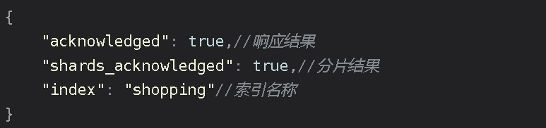

重复请求，会返回错误信息。

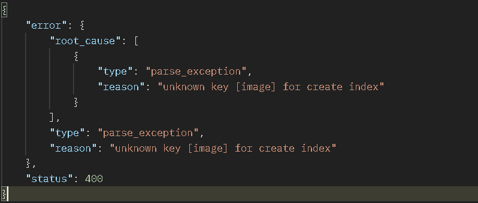

#### 查询索引

##### 查看所有索引

```
GET http://localhost:9200/_cat/indices?v
```

|      表头      |                             含义                             |
| :------------: | :----------------------------------------------------------: |
|     health     | 当前服务器健康状态： green(集群完整) yellow(单点正常、集群不完整) red(单点不正常) |
|     status     |                      索引打开、关闭状态                      |
|     index      |                            索引名                            |
|      uuid      |                         索引统一编号                         |
|      pri       |                          主分片数量                          |
|      rep       |                           副本数量                           |
|   docs.count   |                         可用文档数量                         |
|  docs.deleted  |                   文档删除状态（逻辑删除）                   |
|   store.size   |                 主分片和副分片整体占空间大小                 |
| pri.store.size |                       主分片占空间大小                       |

##### 查看单个索引

```
GET http://localhost:9200/shopping
```

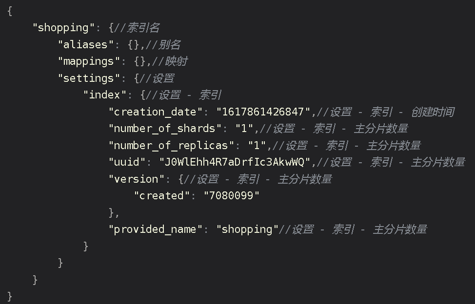

#### 删除索引

```
DELETE http://localhost:9200/shopping
```

#### 创建文档

```
POST http://localhost:9200/shopping/_doc
```

```json
{
    "title":"小米手机",
    "category":"小米",
    "image":"http://xiaomi.com/xm.jpg",
    "price":3999.00
}
```

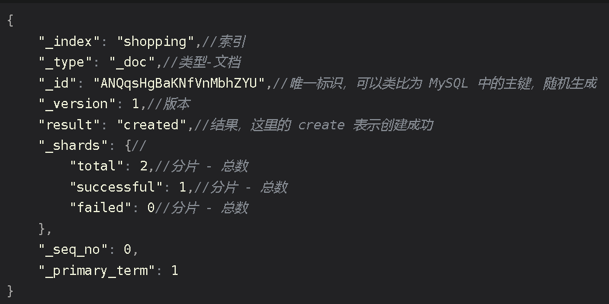

#### 查询

##### 主键查询

```
GET http://localhost:9200/shopping/_doc/1
```

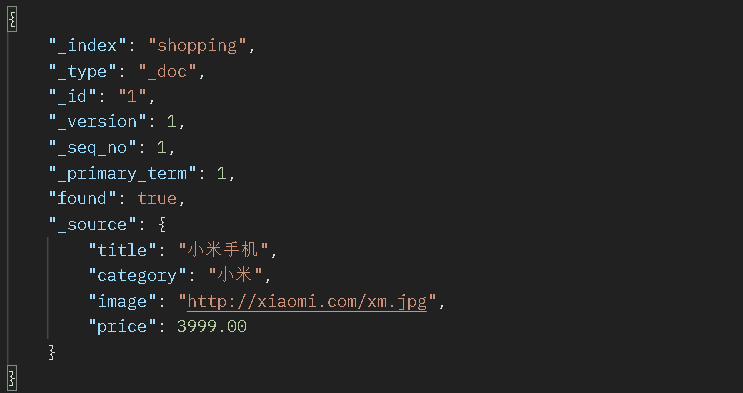

若内容不存在

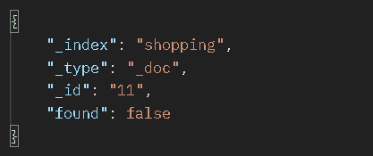

##### 全查询

```
GET http:lcoalhost:9200/shopping/_search
```

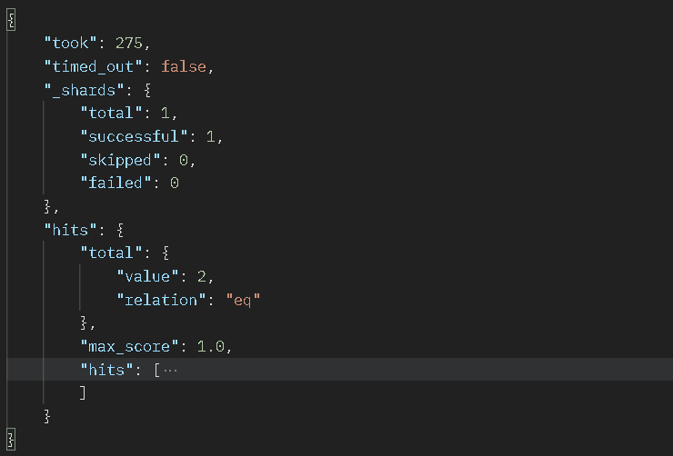

#### 全量修改

和新增文档一样，输入相同的 URL 地址请求，如果请求体变化，会将原有的数据内容覆盖

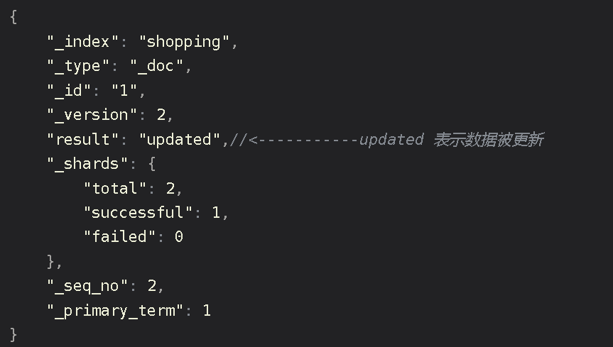

#### 局部修改

修改数据时，也可以只修改某一给条数据的局部信息

```
POST http://localhost:9200/shopping/_update/1
```

#### 删除

删除一个文档不会立即从磁盘上移除，它只是被标记成已删除（逻辑删除）。

```
DELETE http://localhost:9200/shopping/_doc/1
```

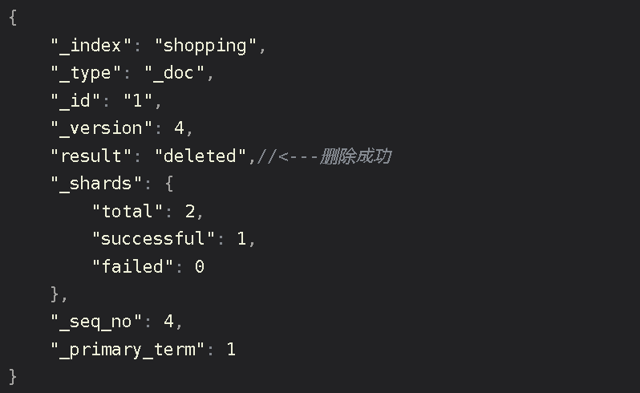

#### 条件查询

```
GET http://localhost:9200/shopping/_search?q=category:小米
```

上述URL带参数形式查询，这很容易让不善者心怀恶意，或者参数值出现中文会出现乱码情况。为了避免这些情况，我们可用使用带JSON请求体请求进行查询。

```
GET http://localhost:9200/shopping/_search
```

```json
{
    "query":{
        "match":{
            "category":"小米"
        }
    }
}
```

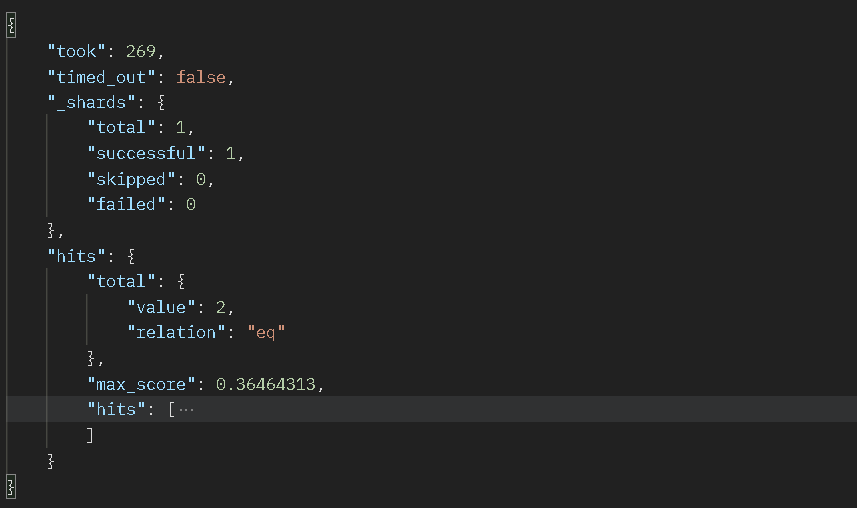

#### 分页查询

```
GET http://localhost:9200/shopping/_search
```

```json
{
    "query":{
        "match_all":{}
    }，
    "from":0,
    "to":2
}
```

#### 查询排序

```
GET http://localhost:9200/shopping/_search
```

```json
{
    "query":{
        "match_all":{}
    },
    "sort":{
        "price":{
            "order":"desc"
        }
    }
}
```

#### 多条件查询

```
GET http://localhost:9200/shopping/_search
```

```json
{
	"query":{
        "bool":{
            "must":[{
                "match":{
                    "category":"小米"
                }
            },{
                "match":{
                	"price":3999.00
            	}
            }]
        }
    }
}
```

- must相当于数据库的&&
- should相当于数据库的||

#### 范围查询

```
GET http:localhost:9200/shopping/_search
```

```json
{
	"query":{
		"bool":{
			"should":[{
				"match":{
					"category":"小米"
				}
			},{
				"match":{
					"category":"华为"
				}
			}],
            "filter":{
            	"range":{
                	"price":{
                    	"gt":2000
                	}
	            }
    	    }
		}
	}
}
```

#### 全文检索

```
GET http://localhost:9200/shopping/_search
```

```json
{
    "query":{
        "match":{
            "category":"小华"
        }
    }
}
```

返回结果带回品牌有"小米"和"华为"的

#### 完全匹配

```
GET http://lcoalhost:9200/shopping/_search
```

```json
{
	"query":{
		"match_phrase":{
			"category" : "为"
		}
	}
}
```

#### 高亮查询

```
GET http://localhost:9200/shopping/_search
```

```json
{
	"query":{
		"match_phrase":{
			"category" : "米"
		}
	},
    "highlight":{
        "fields":{
            "category":{}//<----高亮这字段
        }
    }
}
```

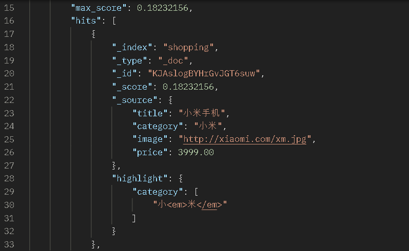

#### 聚合查询

```
GET http://localhost:9200/shopping/_search
```

```json
{
	"aggs":{//聚合操作
		"price_group":{//名称，随意起名
			"terms":{//分组
				"field":"price"//分组字段
			}
		}
	}
}
```

返回结果会附带原始数据的。若不想要不附带原始数据的结果，json需改为

```json
{
	"aggs":{//聚合操作
		"price_group":{//名称，随意起名
			"terms":{//分组
				"field":"price"//分组字段
			}
		}
	},
    "size":0
}
```

**求平均值**

```json
{
	"aggs":{
		"price_avg":{//名称，随意起名
			"avg":{//求平均
				"field":"price"
			}
		}
	},
    "size":0
}
```

#### 映射关系

##### 创建索引

```
PUT http://localhost:9200/user
```

##### 创建映射

```
PUT http://localhost:9200/user/_mapping
```

```json
{
    "properties": {
        "name":{
        	"type": "text",
        	"index": true
        },
        "sex":{
        	"type": "keyword",
        	"index": true
        },
        "tel":{
        	"type": "keyword",
        	"index": false
        }
    }
}
```

##### 查询映射

```
GET http://localhost:9200/user/_mapping
```

##### 增加数据

```
PUT http://localhost:9200/user/_create/1001
```

```json
{
    "name":"小米",
    "sex":"男",
    "tel":"1111"
}
```

##### 查找

```
GET http://localhost:9200/user/_search
```

```json
{
    "query":{
        "match":{
            "name":"小"
        }
    }
}
```

### JavaAPI

#### 创建索引

```java
// 创建客户端对象RestHighLevelClient 
// 创建索引请求对象
 CreateIndexRequest request = new CreateIndexRequest("user2");
// 发送请求 获取响应
```

#### 查询索引

```java
// 查询索引，请求对象
GetIndexRequest request = new GetIndexRequest("user2");
// 发送请求 获取响应
GetIndexResponse response = client.indices().get(request, RequestOptions.DEFAULT);
```

#### 删除索引

```java
// 删除索引 - 请求对象
DeleteIndexRequest request = new DeleteIndexRequest("user2");
// 发送请求，获取响应
AcknowledgedResponse response = client.indices().delete(request,RequestOptions.DEFAULT);
```

#### 新增文档

```java
RestHighLevelClient client = new RestHighLevelClient(
                RestClient.builder(new HttpHost("localhost", 9200, "http")));
// 新增文档 - 请求对象
IndexRequest request = new IndexRequest();
request.index("user").id("1001");
User user = new User("zhangsan",25,"男");
String productJson = new ObjectMapper().writeValueAsString(user);
request.source(productJson,XContentType.JSON);
IndexResponse response = client.index(request, RequestOptions.DEFAULT);
client.close();
```

#### 修改文档

```java
UpdateRequest request = new UpdateRequest();
request.index("user").id("1001");
request.doc(XContentType.JSON, "sex", "女");
UpdateResponse response = client.update(request, RequestOptions.DEFAULT);
```

#### 查询文档

```java
GetRequest request = new GetRequest().index("user").id("1001");
GetResponse response = client.get(request, RequestOptions.DEFAULT);
```

#### 删除文档

```java
DeleteRequest request = new DeleteRequest().index("user").id("1001");
DeleteResponse response = client.delete(request, RequestOptions.DEFAULT);
```

#### 批量新增文档

```java
BulkRequest request = new BulkRequest();
request.add(new IndexRequest().index("user").id("1001").source(XContentType.JSON, "name", "zhangsan"));
request.add(new IndexRequest().index("user").id("1002").source(XContentType.JSON, "name", "lisi"));
request.add(new IndexRequest().index("user").id("1003").source(XContentType.JSON, "name", "wangwu"));
BulkResponse responses = client.bulk(request, RequestOptions.DEFAULT);
```

#### 批量删除文档

```java
BulkRequest request = new BulkRequest();
request.add(new DeleteRequest().index("user").id("1001"));
request.add(new DeleteRequest().index("user").id("1002"));
request.add(new DeleteRequest().index("user").id("1003"));
BulkResponse responses = client.bulk(request, RequestOptions.DEFAULT);
```

#### 高级查询 - 全量查询

```java
SearchRequest request = new SearchRequest();
request.indices("user");
SearchSourceBuilder sourceBuilder = new SearchSourceBuilder();
sourceBuilder.query(QueryBuilders.matchAllQuery());
request.source(sourceBuilder);
SearchResponse response = client.search(request, RequestOptions.DEFAULT);
```

#### 高级查询 - 条件查询

```java
SearchRequest request = new SearchRequest();
request.indices("user");
SearchSourceBuilder sourceBuilder = new SearchSourceBuilder();
sourceBuilder.query(QueryBuilders.termQuery("age", "30"));
request.source(sourceBuilder);
SearchResponse response = client.search(request, RequestOptions.DEFAULT);
```

#### 高级查询 - 分页查询

```java
SearchSourceBuilder sourceBuilder = new SearchSourceBuilder();
sourceBuilder.query(QueryBuilders.matchAllQuery());
sourceBuilder.from(0);
sourceBuilder.size(2);
request.source(sourceBuilder);
SearchResponse response = client.search(request, RequestOptions.DEFAULT);
```

#### 高级查询 - 查询排序

```java
SearchSourceBuilder sourceBuilder = new SearchSourceBuilder();
sourceBuilder.query(QueryBuilders.matchAllQuery());
sourceBuilder.sort("age", SortOrder.ASC);
request.source(sourceBuilder);
SearchResponse response = client.search(request, RequestOptions.DEFAULT);
```

#### 高级查询 - 组合查询

```java
SearchSourceBuilder sourceBuilder = new SearchSourceBuilder();
BoolQueryBuilder boolQueryBuilder = QueryBuilders.boolQuery();
// 必须包含
boolQueryBuilder.must(QueryBuilders.matchQuery("age", "30"));
// 一定不含
boolQueryBuilder.mustNot(QueryBuilders.matchQuery("name", "zhangsan"));
// 可能包含
boolQueryBuilder.should(QueryBuilders.matchQuery("sex", "男"));
sourceBuilder.query(boolQueryBuilder);
request.source(sourceBuilder);
SearchResponse response = client.search(request, RequestOptions.DEFAULT);
```

#### 高级查询 - 范围查询

```java
SearchSourceBuilder sourceBuilder = new SearchSourceBuilder();
RangeQueryBuilder rangeQuery = QueryBuilders.rangeQuery("age");
rangeQuery.lte("40");
sourceBuilder.query(rangeQuery);
request.source(sourceBuilder);
SearchResponse response = client.search(request, RequestOptions.DEFAULT);
```

#### 高级查询 - 模糊查询

```java
SearchSourceBuilder sourceBuilder = new SearchSourceBuilder();
sourceBuilder.query(QueryBuilders.fuzzyQuery("name","wangwu").fuzziness(Fuzziness.ONE));
request.source(sourceBuilder);
SearchResponse response = client.search(request, RequestOptions.DEFAULT);
```

#### 高级查询 - 高亮查询

```java
SearchSourceBuilder sourceBuilder = new SearchSourceBuilder();
TermsQueryBuilder termsQueryBuilder = QueryBuilders.termsQuery("name","zhangsan");
sourceBuilder.query(termsQueryBuilder);
HighlightBuilder highlightBuilder = new HighlightBuilder();
highlightBuilder.preTags("<font color='red'>");//设置标签前缀
highlightBuilder.postTags("</font>");//设置标签后缀
highlightBuilder.field("name");//设置高亮字段
sourceBuilder.highlighter(highlightBuilder);
request.source(sourceBuilder);
SearchResponse response = client.search(request, RequestOptions.DEFAULT);
```

#### 高级查询 - 最大值查询

```java
SearchRequest request = new SearchRequest().indices("user");
SearchSourceBuilder sourceBuilder = new SearchSourceBuilder();
sourceBuilder.aggregation(AggregationBuilders.max("maxAge").field("age"));
request.source(sourceBuilder);
SearchResponse response = client.search(request, RequestOptions.DEFAULT);
```

#### 高级查询 - 分组查询

```java
SearchRequest request = new SearchRequest().indices("user");
SearchSourceBuilder sourceBuilder = new SearchSourceBuilder();
sourceBuilder.aggregation(AggregationBuilders.terms("age_groupby").field("age"));
request.source(sourceBuilder);
SearchResponse response = client.search(request, RequestOptions.DEFAULT);
```

