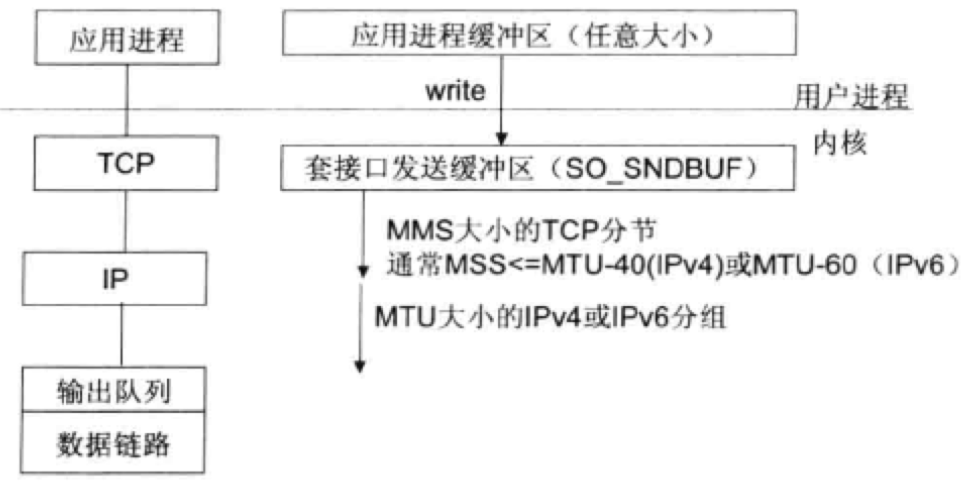

|             | BIO    | 伪异步IO | NIO      | AIO      |
| ----------- | ------ | -------- | -------- | -------- |
| IO线程      | 1:1    | M:N      | M:1      | M:0      |
| 阻塞类型    | 阻塞IO | 阻塞IO   | 非阻塞IO | 非阻塞IO |
| 同步类型    | 同步IO | 同步IO   | 同步IO   | 异步IO   |
| API使用难度 | 简单   | 简单     | 复杂     | 一般     |
| 调试难度    | 简单   | 简单     | 复杂     | 复杂     |
| 可靠性      | 非常差 | 差       | 高       | 高       |
| 吞吐量      | 低     | 中       | 高       | 高       |

## 传统的BIO

### BIO介绍

在基于传统同步阻塞模型开发中，ServerSocket负责绑定IP地址，启动监听端口；Socket负责发起连接操作，连接成功后，双方通过输入流和输出流进行同步组阻塞时通讯。

通常由一个Acceptor线程负责监听客户端的连接，接收到客户端请求后为每个客户端创建一个新的线程进行链路处理，处理完后通过输出流返回数据到客户端，线程销毁。
最大的问题就是缺乏弹性伸缩能力，客户端数量和服务端线程数呈现1：1的比例，会造成虚拟机线程急剧膨胀，从而导致系统效率下降。

### 编程示例

#### 服务端

服务端主要是创建监听来监听客户端的socket请求，对于接入进来的socket创建一个单独的线程进行输入输出处理。

```java
package com.firewolf.java.io.bio.server;

import java.io.IOException;
import java.net.ServerSocket;
import java.net.Socket;

public class TimeServer {

  public static void main(String[] args) throws IOException {
    int port = 8080;
    ServerSocket serverSocket = null;
    try {
      serverSocket = new ServerSocket(port); //1.创建socket监听，如果端口没有被占用，则会启动成功
      System.out.println("时间服务器已经启动了,监听端口为" + port + "......");
      Socket socket = null;
      while (true) {
        socket = serverSocket.accept(); //2. 循环等待客户端进行连接，没有客户端连接进来的时候在此阻塞
        System.out.println("有客户端接入，");
        new Thread(new TimeServerHandler(socket)).start(); //3.开启一个新的线程处理连接进来的客户端
      }

    } finally {
      if (serverSocket != null) {
        serverSocket.close();
      }
    }
  }
}

```

```java
package com.firewolf.java.io.bio.server;

import java.io.BufferedReader;
import java.io.IOException;
import java.io.InputStreamReader;
import java.io.OutputStreamWriter;
import java.io.PrintWriter;
import java.net.Socket;
import java.util.Date;

public class TimeServerHandler implements Runnable {

  private Socket socket;

  public TimeServerHandler(Socket socket) {
    this.socket = socket;
  }

  @Override
  public void run() {
    BufferedReader in = null;
    PrintWriter out = null;
    try {
      in = new BufferedReader(new InputStreamReader(socket.getInputStream()));
      out = new PrintWriter(new OutputStreamWriter(socket.getOutputStream()),true);
      String clientMsg = null;
      while (true) { //1.循环接受客户端的消息
        clientMsg = in.readLine();
        if (clientMsg == null) {
          break;
        }
        System.out.println("收到客户端的消息为: " + clientMsg);
        out.println("当前时间为：" + new Date().toString()); //2.返回信息
      }
    } catch (IOException e) {
      e.printStackTrace();
    } finally {
      System.out.println("客户端下线，释放socket....");
      try {
        if (in != null) {
          in.close();
        }
        if (out != null) {
          out.close();
        }
        if (socket != null) {
          socket.close();
        }
      } catch (IOException e) {
        e.printStackTrace();
      }
    }
  }
}
```

#### 客户端

发起连接请求，发送消息，同时接受服务端返回的数据。

```java
package com.firewolf.java.io.bio.client;

import java.io.BufferedReader;
import java.io.IOException;
import java.io.InputStreamReader;
import java.io.OutputStreamWriter;
import java.io.PrintWriter;
import java.net.Socket;
import java.util.Date;

public class TimeClient {

  public static void main(String[] args) throws Exception {
    Socket socket = new Socket("127.0.0.1", 8080);
    BufferedReader in = null;
    PrintWriter out = null;
    try {
      in = new BufferedReader(new InputStreamReader(socket.getInputStream()));
      out = new PrintWriter(new OutputStreamWriter(socket.getOutputStream()), true);
      out.println("请返回系统当前时间...."); //1.往服务端发送消息
      String serverMsg = in.readLine(); //2.接受服务端返回的消息
      System.out.println("服务端返回的消息为: " + serverMsg);
    } catch (IOException e) {
      e.printStackTrace();
    } finally {
      System.out.println("请求结束，主动释放与服务端的连接....");
      try {
        if (in != null) {
          in.close();
        }
        if (out != null) {
          out.close();
        }
        if (socket != null) {
          socket.close();
        }
      } catch (IOException e) {
        e.printStackTrace();
      }
    }

  }

}
```

在高并发情况下，后端的线程数急剧增长，导致系统性能下降甚至崩溃，这是同步阻塞I/O的最大问题。

## 伪异步IO

### 伪异步I/O介绍

为了解决同步阻塞IO面临的一个链路需要一个线程处理的问题，有人对线程模型进行了优化——后端使用线程池进行处理，形成客户端线程数M：后端线程池最大线程数为N的关系。 其中M远大于N，后端可以灵活的控制线程数量，防止由于海量并发造成的后端线程资源耗尽的问题。

### 编程示例

伪异步io是在BIO的基础上进行了一些改造，就是把每次来socket之后启动一个线程来执行改变成利用线程池来处理，所以这里只改变服务端的代码，客户端不进行改造。

```java
package com.firewolf.java.io.pseudoasync.server;

import com.firewolf.java.io.bio.server.TimeServerHandler;
import java.util.concurrent.ArrayBlockingQueue;
import java.util.concurrent.ExecutorService;
import java.util.concurrent.ThreadPoolExecutor;
import java.util.concurrent.TimeUnit;

public class TimeServerHandlerExecutor {

  private ExecutorService executorService;

  public TimeServerHandlerExecutor(int maxPoolSize, int queueSize) {
    executorService = new ThreadPoolExecutor(Runtime.getRuntime().availableProcessors(), maxPoolSize, 120L,
        TimeUnit.SECONDS, new ArrayBlockingQueue<>(queueSize));
  }


  public void executeTask(TimeServerHandler handler){
    executorService.execute(handler);
  }
}
```

```java
package com.firewolf.java.io.pseudoasync.server;

import com.firewolf.java.io.bio.server.TimeServerHandler;
import java.io.IOException;
import java.net.ServerSocket;
import java.net.Socket;

public class TimeServer {

  public static void main(String[] args) throws IOException {
    int port = 8080;
    ServerSocket serverSocket = null;
    try {
      serverSocket = new ServerSocket(port); //1.创建socket监听，如果端口没有被占用，则会启动成功
      System.out.println("时间服务器已经启动了,监听端口为" + port + "......");
      TimeServerHandlerExecutor timeServerHandlerExecutor = new TimeServerHandlerExecutor(20, 1000);
      Socket socket = null;
      while (true) {
        socket = serverSocket.accept(); //2. 循环等待客户端进行连接，没有客户端连接进来的时候在此阻塞
        System.out.println("有客户端接入，");
        timeServerHandlerExecutor.executeTask(new TimeServerHandler(socket)); //3.使用线程池开启一个新的线程处理连接进来的客户端
      }

    } finally {
      if (serverSocket != null) {
        serverSocket.close();
      }
    }
  }
}
```

伪异步IO能够防止后端服务器因为过多线程导致的资源耗尽的问题，但是，会导致前台的请求产生阻塞，从而导致系统效率依旧不高。

## NIO

### NIO核心概念

1. 缓冲区Buffer
   Buffer是一个对象，包含一些要写入或者读出的数据。在NIO中，所有的数据都是利用Buffer进行处理的。本质上是一个数组，一般是ByteBuffer，但是，他不仅仅是一个数组，还提供了对数据的结构化访问以及维护读和写位置（limit）等信息。ByteBuffer是最常用的缓冲区Buffer，实际上，Java针对每一种基本数据类型都有一个对应的Buffer缓冲区，这些类基本上都拥有相同的功能，只是处理的数据不同而已。

2. 通道Channel
   Channel是一个通道，就像自来水管一样，网络数据使用Channel进行处理，通道和流不同的地方是，流是单向的，而通道是双向的。流只能在一个方向上移动（必须是InputStream或者是OutputStream中的一种），而通道可以用于读、写或者二者同时进行。

3. 多路复用器Selector

   多路复用器Selector是NIO编程的关键，它会不断的轮询注册在他上面的Channel，如果某个Channel上发生读或者写事件，这个Channel就会处于就绪状态，会被Selector轮询出来，然后通过SelectionKey可以获取就绪的Channel集合， 进行IO处理。
   一个Selector可以轮询多个Channel，由于jdk使用了epoll()代替了select()，所以并没有最大连接数句柄1024的限制。所以我们只需要一个线程轮询Selector，就可以接入成千上万的客户端。

### 编程示例

#### 服务端

```java
package com.firewolf.java.io.server;

import java.io.IOException;
import java.net.InetSocketAddress;
import java.nio.ByteBuffer;
import java.nio.channels.SelectionKey;
import java.nio.channels.Selector;
import java.nio.channels.ServerSocketChannel;
import java.nio.channels.SocketChannel;
import java.util.HashMap;
import java.util.Map;
import java.util.Set;

public class ChatServer {

  private int port; //服务监听端口号

  private ServerSocketChannel serverSocketChannel = null; //服务端Socket


  private Selector selector = null; //多路复用器

  //客户端连接Channel列表
  Map<String, SocketChannel> clientChannelMap = new HashMap<>();

  public ChatServer(int port) {
    this.port = port;
    initServer();
  }

  /**
   * 初始化服务，打开监听端口
   */
  private void initServer() {
    try {
      serverSocketChannel = ServerSocketChannel.open();//打开Socket
      selector = Selector.open(); //创建多路复用
      serverSocketChannel.bind(new InetSocketAddress(port));//绑定端口
      serverSocketChannel.configureBlocking(false);//设置非阻塞
      serverSocketChannel.register(selector, SelectionKey.OP_ACCEPT);//准备监听客户端接入
    } catch (IOException e) {
      e.printStackTrace();
    }
  }


  /**
   * 监听客户端请求
   */
  public void listen() {
    try {
      System.out.println("正在进行监听，监听端口为：" + this.port);
      while (true) {
        selector.select(); //轮询直到有事件进入
        Set<SelectionKey> selectionKeys = selector.selectedKeys();
        selectionKeys.forEach(selectionKey -> handleSelectKey(selectionKey)); //对轮询到的事件进行处理
        selectionKeys.clear();//清空轮询了事件
      }
    } catch (IOException e) {
      e.printStackTrace();
    }
  }


  /**
   * 处理轮询到的事件
   */
  private void handleSelectKey(SelectionKey selectionKey) {
    try {
      if (selectionKey.isValid()) {
        if (selectionKey.isAcceptable()) { //有新客户端接入
          handleNewClientConnect(selectionKey);
        } else if (selectionKey.isReadable()) { //有客户端写入数据
          handleClientMessage(selectionKey);
        }
      }
    } catch (IOException e) {
      e.printStackTrace();
    }
  }

  /**
   * 处理新客户端接入
   */
  private void handleNewClientConnect(SelectionKey selectionKey) throws IOException {
    ServerSocketChannel ss = (ServerSocketChannel) selectionKey.channel();
    SocketChannel client = ss.accept();
    System.out.println("有新的客户端接入.....");
    String address = client.getRemoteAddress().toString(); //客户端的地址
    clientChannelMap.put(address, client); //保存客户端的请求
    client.configureBlocking(false);
    client.register(selector, SelectionKey.OP_READ);//准备读取数据
  }


  /**
   * 读取客户端发送的信息，然后进行转发
   */
  private void handleClientMessage(SelectionKey selectionKey) {
    try {
      SocketChannel channel = (SocketChannel) selectionKey.channel();
      ByteBuffer readBuffer = ByteBuffer.allocate(1024);
      int bytes = channel.read(readBuffer);
      if (bytes > 0) {
        readBuffer.flip();
        String message = new String(readBuffer.array(), "UTF-8");
        System.out.println("有客户端发送消息为：" + message);
        //转发消息，正常聊天程序会发送给对应的用户（这个信息是携带在message里面的），这里简单的群发给所有人
        dispathMessage(message);
      }
    } catch (IOException e) {
      e.printStackTrace();
    }
  }

  /**
   * 转发信息
   */
  public void dispathMessage(String message) {
    clientChannelMap.values().forEach(client -> {
      ByteBuffer writeBuffer = ByteBuffer.allocate(message.getBytes().length);
      writeBuffer.put(message.getBytes());
      writeBuffer.flip();
      try {
        client.write(writeBuffer);
      } catch (IOException e) {
        e.printStackTrace();
      }
    });
  }

  public static void main(String[] args) {
    ChatServer server = new ChatServer(8080);
    server.listen();
  }
}
```

#### 客户端

```java
package com.firewolf.java.io.client;

import java.io.IOException;
import java.net.InetSocketAddress;
import java.nio.ByteBuffer;
import java.nio.channels.SelectionKey;
import java.nio.channels.Selector;
import java.nio.channels.SocketChannel;
import java.util.Scanner;
import java.util.Set;

public class ChatClient {


  private Selector selector = null;

  private SocketChannel socketChannel = null;

  public ChatClient(String host, int port) {
    connectServer(host, port);
  }


  private void connectServer(String host, int port) {
    try {
      socketChannel = SocketChannel.open();
      socketChannel.configureBlocking(false);
      selector = Selector.open();
      socketChannel.register(selector, SelectionKey.OP_CONNECT);
      socketChannel.connect(new InetSocketAddress(host, port));//连接客户端
      while (true) {
        selector.select();
        Set<SelectionKey> selectionKeys = selector.selectedKeys();
        selectionKeys.forEach(selectionKey -> handleSelectionKey(selectionKey));
        selectionKeys.clear();//清空事件
      }

    } catch (IOException e) {
      e.printStackTrace();
    }
  }

  /**
   * 处理被轮询到的事件
   */
  private void handleSelectionKey(SelectionKey selectionKey) {
    if (selectionKey.isValid()) {
      if (selectionKey.isConnectable()) { //连接就绪事件
        handleConnection(selectionKey);
      } else if (selectionKey.isReadable()) { //有信息从服务端发过来
        readMessage(selectionKey);
      }
    }
  }


  /**
   * 连接就绪，准备接受用户的输入
   */
  private void handleConnection(SelectionKey selectionKey) {
    try {
      SocketChannel channel = (SocketChannel) selectionKey.channel();
      if (channel.isConnectionPending()) {
        System.out.println("连接已经就绪....");
        channel.finishConnect();
        //启动线程监听客户端输入信息
        new Thread(new Runnable() {
          @Override
          public void run() {
            Scanner scanner = new Scanner(System.in);
            while (true) {
              String message = scanner.nextLine();
              ByteBuffer writeBuffer = ByteBuffer.allocate(message.getBytes().length);
              writeBuffer.put(message.getBytes());
              writeBuffer.flip();
              try {
                channel.write(writeBuffer);
              } catch (IOException e) {
                e.printStackTrace();
              }
            }
          }
        }).start();

        channel.register(selector,SelectionKey.OP_READ);//注册读消息事件
      }
    } catch (IOException e) {
      e.printStackTrace();
    }
  }

  /**
   * 读取服务端发送的消息
   */
  public void readMessage(SelectionKey selectionKey) {
    try {
      SocketChannel socketChannel = (SocketChannel) selectionKey.channel();
      ByteBuffer readBuffer = ByteBuffer.allocate(1024);
      int bytes = socketChannel.read(readBuffer);
      if (bytes > 0) {
        readBuffer.flip();
        System.out.println(new String(readBuffer.array(), "UTF-8"));
      }
    } catch (IOException e) {
      e.printStackTrace();
    }
  }

  public static void main(String[] args) {
    new ChatClient("127.0.0.1", 8080);
  }
}
```

启动服务端后，可以启动多个客户端，能够进行群聊操作。
NIO的优点在于可以进行异步处理了，但是编程的复杂度过高，不太容易编程，更难处理产生的一些bug。

## AIO

### AIO简介

NIO2.0引入了新的异步通道的概念，并提供了异步文件通道和异步套接字通道的实现。异步通道提供一下两种方式获取操作结果：

通过java.util.concurrent.Future类来表示异步操作的结果，使用get()方法来获取结果
在执行异步操作的时候传入一个java.nio.channels.CompletionHandler接口的实现类来作为异步操作结果的方法回调。
NIO2.0的异步套接字是真正的非阻塞I/O，对应于Unix网络编程中的事件驱动I/O（AIO），他不需要多路复用器Selector对注册的通道进行轮循操作即可实现异步操作，从而简化了NIO的模型。

### 编程示例

#### 服务端

```java
package com.firewolf.java.io.aio.server;

import java.net.InetSocketAddress;
import java.nio.ByteBuffer;
import java.nio.channels.AsynchronousChannelGroup;
import java.nio.channels.AsynchronousServerSocketChannel;
import java.nio.channels.AsynchronousSocketChannel;
import java.nio.channels.CompletionHandler;
import java.nio.charset.StandardCharsets;
import java.util.ArrayList;
import java.util.List;
import java.util.concurrent.ExecutorService;
import java.util.concurrent.Executors;

public class AIOServer {

  static final int PORT = 30000;
  final static String UTF_8 = "utf-8";
  //保存客户端请求连接
  static List<AsynchronousSocketChannel> channelList = new ArrayList<>();

  public void startListen() throws InterruptedException, Exception {
    // 创建一个线程池
    ExecutorService executor = Executors.newFixedThreadPool(20);
    // 以指定线程池来创建一个AsynchronousChannelGroup
    AsynchronousChannelGroup channelGroup = AsynchronousChannelGroup.withThreadPool(executor);
    // 以指定线程池来创建一个AsynchronousServerSocketChannel
    AsynchronousServerSocketChannel serverChannel = AsynchronousServerSocketChannel.open(channelGroup)
        // 指定监听本机的PORT端口
        .bind(new InetSocketAddress(PORT));
    // 使用CompletionHandler接受来自客户端的连接请求
    serverChannel.accept(null, new AcceptHandler(serverChannel)); // ①
    Thread.sleep(Long.MAX_VALUE); //睡眠线程，不让线程结束，实战中不需要
  }

  public static void main(String[] args) throws Exception {
    AIOServer server = new AIOServer();
    server.startListen();
  }
}

// 实现自己的CompletionHandler类
class AcceptHandler implements CompletionHandler<AsynchronousSocketChannel, Object> {

  private AsynchronousServerSocketChannel serverChannel;

  public AcceptHandler(AsynchronousServerSocketChannel sc) {
    this.serverChannel = sc;
  }

  // 定义一个ByteBuffer准备读取数据
  ByteBuffer buff = ByteBuffer.allocate(1024);

  // 当实际IO操作完成时候触发该方法
  @Override
  public void completed(final AsynchronousSocketChannel sc, Object attachment) {
    // 记录新连接的进来的Channel
    AIOServer.channelList.add(sc);
    // 准备接受客户端的下一次连接
    serverChannel.accept(null, this);
    sc.read(buff, null, new CompletionHandler<Integer, Object>() // ②
    {
      @Override
      public void completed(Integer result, Object attachment) {
        buff.flip();
        // 将buff中内容转换为字符串
        String content = StandardCharsets.UTF_8.decode(buff).toString();
        // 遍历每个Channel，将收到的信息写入各Channel中
        for (AsynchronousSocketChannel c : AIOServer.channelList) {
          try {
            c.write(ByteBuffer.wrap(content.getBytes(AIOServer.UTF_8))).get();
          } catch (Exception ex) {
            ex.printStackTrace();
          }
        }
        buff.clear();
        // 读取下一次数据
        sc.read(buff, null, this);
      }

      @Override
      public void failed(Throwable ex, Object attachment) {
        System.out.println("读取数据失败: " + ex);
        // 从该Channel读取数据失败，就将该Channel删除
        AIOServer.channelList.remove(sc);
      }
    });
  }

  @Override
  public void failed(Throwable ex, Object attachment) {
    System.out.println("连接失败: " + ex);
  }
}
```

#### 客户端

```java
package com.firewolf.java.io.aio.client;

import java.net.InetSocketAddress;
import java.nio.ByteBuffer;
import java.nio.channels.AsynchronousChannelGroup;
import java.nio.channels.AsynchronousSocketChannel;
import java.nio.channels.CompletionHandler;
import java.nio.charset.StandardCharsets;
import java.util.Scanner;
import java.util.concurrent.ExecutorService;
import java.util.concurrent.Executors;

public class AIOClient {

  final static String UTF_8 = "utf-8";
  final static int PORT = 30000;
  // 与服务器端通信的异步Channel
  AsynchronousSocketChannel clientChannel;

  /**
 1. 监听用户输入信息
   */
  public void listenUserInput() throws Exception {
    Scanner scan = new Scanner(System.in);
    while (scan.hasNextLine()) {
      clientChannel.write(ByteBuffer.wrap(scan.nextLine().getBytes(UTF_8))).get(); // ①
    }
  }

  /**
 2. 连接服务器
   */
  public void connect() throws Exception {
    // 定义一个ByteBuffer准备读取数据
    final ByteBuffer buff = ByteBuffer.allocate(1024);
    // 创建一个线程池
    ExecutorService executor = Executors.newFixedThreadPool(80);
    // 以指定线程池来创建一个AsynchronousChannelGroup
    AsynchronousChannelGroup channelGroup = AsynchronousChannelGroup.withThreadPool(executor);
    // 以channelGroup作为组管理器来创建AsynchronousSocketChannel
    clientChannel = AsynchronousSocketChannel.open(channelGroup);
    // 让AsynchronousSocketChannel连接到指定IP、指定端口
    clientChannel.connect(new InetSocketAddress("127.0.0.1", PORT)).get();
    // jta.append("---与服务器连接成功---\n");
    System.out.println("---与服务器连接成功---");
    buff.clear();
    clientChannel.read(buff, null, new CompletionHandler<Integer, Object>() // ②
    {
      @Override
      public void completed(Integer result, Object attachment) {
        buff.flip();
        // 将buff中内容转换为字符串
        String content = StandardCharsets.UTF_8.decode(buff).toString();
        // 显示从服务器端读取的数据
        // jta.append("某人说：" + content + "\n");
        System.out.println("某人说：" + content);
        buff.clear();
        //读取下一次数据
        clientChannel.read(buff, null, this);
      }

      @Override
      public void failed(Throwable ex, Object attachment) {
        System.out.println("读取数据失败: " + ex);
      }
    });
  }

  public static void main(String[] args) throws Exception {
    AIOClient client = new AIOClient();
    client.connect();
    client.listenUserInput();
  }
}
```

## Netty

### Netty的优势

- API使用简单，开发门槛低
- 功能强大，预置了很多编码解码功能
- 定制能力强，可以对通讯框架进行很多的扩展
- 性能高，通过与其他的NIO框架对比，Netty的综合性能最高
- 成熟，稳定，Netty已经修复了NIO的epoll Bug
- 经历了很多大型商业应用的考验，质量有保证
- 社区活跃，版本迭代周期短，发现的Bug能得到及时修复

### 使用Netty开发群聊

```xml
 <dependency>
     <groupId>io.netty</groupId>
     <artifactId>netty-all</artifactId>
     <version>4.1.29.Final</version>
</dependency>
```

#### 服务端

```java
package com.firewolf.java.io.netty.chat;

import io.netty.bootstrap.ServerBootstrap;
import io.netty.buffer.ByteBuf;
import io.netty.buffer.Unpooled;
import io.netty.channel.Channel;
import io.netty.channel.ChannelFuture;
import io.netty.channel.ChannelHandlerContext;
import io.netty.channel.ChannelInboundHandlerAdapter;
import io.netty.channel.ChannelInitializer;
import io.netty.channel.ChannelOption;
import io.netty.channel.EventLoopGroup;
import io.netty.channel.nio.NioEventLoopGroup;
import io.netty.channel.socket.SocketChannel;
import io.netty.channel.socket.nio.NioServerSocketChannel;
import java.util.HashMap;
import java.util.Map;

public class NettyChatServer {

  public static Map<String, Channel> channels = new HashMap<>();

  public NettyChatServer(int port) {

    //服务端NIO线程组，用于网络事件处理，实际上就是Reactor线程组
    EventLoopGroup bossGroup = new NioEventLoopGroup(); // 用于接受客户端的连接
    EventLoopGroup workGroup = new NioEventLoopGroup(); // 用户SocketChannel进行网络读写请求
    try {
      ServerBootstrap bootstrap = new ServerBootstrap(); //用于启动NIO的辅助启动类
      bootstrap.group(bossGroup, workGroup)
          .channel(NioServerSocketChannel.class) //这个类似于NIO中的NioServerSocketChannel，IO中的ServerSocket，用于绑定端口
          .option(ChannelOption.SO_BACKLOG, 1024) //这是TCP参数，这里是设置了backlog的大小
          //设置网络IO事件处理器信息，如处理器类、编码、解码等等。
          .childHandler(new ChannelInitializer<SocketChannel>() {
            @Override
            protected void initChannel(SocketChannel socketChannel) throws Exception {
              socketChannel.pipeline().addLast(new MessageServerHandler());
            }
          });
      //绑定端口，同时进行阻塞直到服务关闭
      ChannelFuture future = bootstrap.bind(port).sync();
      System.out.println("启动服务端监听端口：" + port);
      //关闭通道
      future.channel().closeFuture().sync();

    } catch (InterruptedException e) {
      e.printStackTrace();
    } finally {
      //优雅退出，释放线程资源
      bossGroup.shutdownGracefully();
      workGroup.shutdownGracefully();
    }

  }


  /**
   * 事件消息处理器，需要继承ChannelInboundHandlerAdapter
   */
  class MessageServerHandler extends ChannelInboundHandlerAdapter {

    //当有客户端连接的时候，会触发
    @Override
    public void handlerAdded(ChannelHandlerContext ctx) throws Exception {
      //保存所有的连接Channel
      channels.put(ctx.channel().id().asLongText(), ctx.channel());
    }

    //读取到数据之后会触发这个方法
    @Override
    public void channelRead(ChannelHandlerContext ctx, Object msg) throws Exception {
      ByteBuf buf = (ByteBuf) msg;
      byte[] bytes = new byte[buf.readableBytes()];
      buf.readBytes(bytes);
      String message = new String(bytes); //把读取到的字节信息转换成字符串
      System.out.println("有客户端消息：" + message);
      buf.release(); //获取到消息后释放ByteBuf
      //转发消息
      dispathMessage(message, ctx.channel());
    }
  }

  private void dispathMessage(String message, Channel channel) {
    String otherResponse = "有人说：" + message;
    String meResponse = "我说：" + message;
    channels.entrySet().forEach(entry -> {
      String response = entry.getKey().equals(channel.id().asLongText()) ? meResponse : otherResponse;
      ByteBuf writeBuf = Unpooled.buffer(response.getBytes().length);
      writeBuf.writeBytes(response.getBytes());
      entry.getValue().writeAndFlush(writeBuf);
    });
  }

  public static void main(String[] args) {
    new NettyChatServer(9999);
  }
}
```

#### 客户端

```java
package com.firewolf.java.io.netty.chat;

import io.netty.bootstrap.Bootstrap;
import io.netty.buffer.ByteBuf;
import io.netty.buffer.Unpooled;
import io.netty.channel.ChannelFuture;
import io.netty.channel.ChannelHandlerContext;
import io.netty.channel.ChannelInboundHandlerAdapter;
import io.netty.channel.ChannelInitializer;
import io.netty.channel.ChannelOption;
import io.netty.channel.nio.NioEventLoopGroup;
import io.netty.channel.socket.SocketChannel;
import io.netty.channel.socket.nio.NioSocketChannel;
import java.net.InetSocketAddress;
import java.util.Scanner;

public class NettyChatClient {


  public NettyChatClient(String host, int port) {
    NioEventLoopGroup group = new NioEventLoopGroup();
    try {
      Bootstrap bootstrap = new Bootstrap();
      bootstrap.group(group)
          .channel(NioSocketChannel.class)
          .option(ChannelOption.TCP_NODELAY, true)
          .handler(new ChannelInitializer<SocketChannel>() {
            @Override
            protected void initChannel(SocketChannel socketChannel) throws Exception {
              socketChannel.pipeline().addLast(new MessageClientHandler());
            }
          });

      ChannelFuture f = bootstrap.connect(new InetSocketAddress(host, port)).sync();
      System.out.println("连接服务器成功-----");
      f.channel().closeFuture().sync();//关闭通道
    } catch (InterruptedException e) {
      e.printStackTrace();
    } finally {
      group.shutdownGracefully();
    }
  }


  class MessageClientHandler extends ChannelInboundHandlerAdapter {

    @Override
    public void channelActive(ChannelHandlerContext ctx) throws Exception {
      //通道准备就绪，可以写入数据
      //启动线程监听用户输入
      new Thread(new Runnable() {
        @Override
        public void run() {
          Scanner scanner = new Scanner(System.in);
          while (true) {
            String message = scanner.nextLine();
            ByteBuf buf = Unpooled.buffer(message.getBytes().length);
            buf.writeBytes(message.getBytes());
            ctx.writeAndFlush(buf);
          }
        }
      }).start();

    }

    //读取数据
    @Override
    public void channelRead(ChannelHandlerContext ctx, Object msg) throws Exception {
      ByteBuf buf = (ByteBuf) msg;
      byte[] bytes = new byte[buf.readableBytes()];
      buf.readBytes(bytes);
      String message = new String(bytes);
      System.out.println(message);
    }
  }


  public static void main(String[] args) {
    new NettyChatClient("127.0.0.1", 9999);
  }
}
```

### Netty核心API

- ServerBootStrap：服务端启动辅助类，用于设置服务器启动的一些参数
- EventLoopGroup：Netty的Reactor线程池，实际上是一个EventLoop数组。EventLoop的责是处理所有注册到本线程多路复用器Selector上的Channel，
- NioServerSocketChannel：相当于NIO中的ServerSocketChannel
- ChannelPipeline：负责处理网络事件的职责连，管理和执行ChannelHandler，典型网络事件如下：

  1. 链路注册；

  2. 链路激活；

  3. 链路断开；

  4. 接受到请求消息；

  5. 请求消息接受并处理完毕；

  6. 发送应答消息；

  7. 链路发生异常；

  8. 发生用户自定义事件；
- ChannelHandler：Netty提供给用户的用于定制和扩展的关键接口。可以用于定制：消息编解码、心跳、安全认证、TSL/SSL认证、流量监控、流量整形等，Netty提供了很多定义好的ChannelHandler，比较实用的有：
     1. MessageToByteEncoder：系统编码框架，用来把POJO转换成ByteBuf
     2. ByteToMessageDecoder：系统解码框架，用来把ByteBuf转换成POJO
     3. ByteToMessageCodec：系统编解码框架
     4. MessageToMessageDecoder：二次解码器，把一种类型的POJO转换成另外一种类型的POJO
     5. LengthFieldBasedFrameDecoder：基于长度的半包解码器
     6. DelimiterBasedFrameDecoder：自定义分隔符解码器
     7. LineBasedFrameDecoder：回车换行符分割包解码器
     8. FixedLengthFrameDecoder：固定长度包解码器
     9. LengthFieldPrepender：会在包的前面添加固定长度
     10. StringDecoder：把包转换成字符串
     11. LoggingHandler：打印码流日志
     12. SslHandler：SSL安全认证
     13. IdleStateHandler：链路空闲检测
     14. Base64Decoder：Base64解码器
     15. Base64Encoder：Base64编码器
- ChannelInboundHandlerAdapter：提供链接事件回调接口，我们通常主要处理这一部分内容
- HttpObjectAggregator：把HttpMessage和HttpContent整合成FullHttpRequest，POST请求的时候，需要使用这个处理器，否则的话，接收不到参数（因为POST请求的参数是携带在请求体里面的）
- HttpRequestDecoder：Http请求编码器
- HttpResponseEncoder：Http响应编码器

### TCP粘包拆包问题

#### TCP粘包拆包问题

TCP是一个“流”协议，所谓流，也就是一串没界限的数字，在TCP底层是连接成一片的，没有界限，因为不知道业务层含义，所以只会根据TCP缓冲区的实际情况进行划分，导致在业务层来看，一个完整的包可能会被TCP拆分成多个包，也可能把多个小的包封装起来，形成一个大的包。

#### 产生的原因

1. 应用程序write写入的字节大小大于套接口发送缓冲区的大小；
2. 进行MSS大小的TCP分段
3. 以太网的payload大于MTU进行IP分片



#### 解决策略

1. 消息定长，例如每个报文的长度为200，不够的时候，使用空格补齐；
2. 在尾部增加回车换行符进行分割，如TCP协议；
3. 在尾部增加特殊的字符进行分割，回车换行就是一种特殊的情况；
4. 将消息分为消息头和消息体，消息头包含表示消息总长度字段；
5. 使用更复杂的应用层协议；

#### TCP粘包拆包问题演示

##### 服务端

```java
package com.firewolf.java.io.netty.packagee.paste.origin;

import io.netty.bootstrap.ServerBootstrap;
import io.netty.buffer.ByteBuf;
import io.netty.channel.Channel;
import io.netty.channel.ChannelFuture;
import io.netty.channel.ChannelHandlerAdapter;
import io.netty.channel.ChannelHandlerContext;
import io.netty.channel.ChannelInboundHandlerAdapter;
import io.netty.channel.ChannelInitializer;
import io.netty.channel.ChannelOption;
import io.netty.channel.EventLoopGroup;
import io.netty.channel.nio.NioEventLoopGroup;
import io.netty.channel.socket.SocketChannel;
import io.netty.channel.socket.nio.NioServerSocketChannel;
import java.util.HashMap;
import java.util.Map;

public class HelloServer {


  public HelloServer(int port) {

    EventLoopGroup bossGroup = new NioEventLoopGroup();
    EventLoopGroup workGroup = new NioEventLoopGroup();
    try {
      ServerBootstrap bootstrap = new ServerBootstrap();
      bootstrap.group(bossGroup, workGroup)
          .channel(NioServerSocketChannel.class)
          .option(ChannelOption.SO_BACKLOG, 1024)
          .childHandler(new ChannelInitializer<SocketChannel>() {
            @Override
            protected void initChannel(SocketChannel socketChannel) throws Exception {
              socketChannel.pipeline()
                  .addLast(new MessageServerHandler());
            }
          });
      ChannelFuture future = bootstrap.bind(port).sync();
      System.out.println("启动服务端监听端口：" + port);
      future.channel().closeFuture().sync();

    } catch (InterruptedException e) {
      e.printStackTrace();
    } finally {
      bossGroup.shutdownGracefully();
      workGroup.shutdownGracefully();
    }

  }

  class MessageServerHandler extends ChannelInboundHandlerAdapter {

    @Override
    public void channelRead(ChannelHandlerContext ctx, Object msg) throws Exception {
      ByteBuf buf = (ByteBuf) msg;
      byte[] bytes = new byte[buf.readableBytes()];
      buf.readBytes(bytes);
      String message = new String(bytes);
      System.out.println("有客户端消息：" + message);
      buf.release();
    }
  }


  public static void main(String[] args) {
    new HelloServer(9999);
  }

}
```

##### 客户端

```java
package com.firewolf.java.io.netty.packagee.paste.origin;

import io.netty.bootstrap.Bootstrap;
import io.netty.buffer.ByteBuf;
import io.netty.buffer.Unpooled;
import io.netty.channel.ChannelFuture;
import io.netty.channel.ChannelHandlerAdapter;
import io.netty.channel.ChannelHandlerContext;
import io.netty.channel.ChannelInboundHandlerAdapter;
import io.netty.channel.ChannelInitializer;
import io.netty.channel.ChannelOption;
import io.netty.channel.nio.NioEventLoopGroup;
import io.netty.channel.socket.SocketChannel;
import io.netty.channel.socket.nio.NioSocketChannel;
import java.net.InetSocketAddress;

public class HelloClient {


  public HelloClient(String host, int port) {
    NioEventLoopGroup group = new NioEventLoopGroup();
    try {
      Bootstrap bootstrap = new Bootstrap();
      bootstrap.group(group)
          .channel(NioSocketChannel.class)
          .option(ChannelOption.TCP_NODELAY, true)
          .handler(new ChannelInitializer<SocketChannel>() {
            @Override
            protected void initChannel(SocketChannel socketChannel) throws Exception {
              socketChannel.pipeline()
                  .addLast(new MessageClientHandler());
            }
          });

      ChannelFuture f = bootstrap.connect(new InetSocketAddress(host, port)).sync();
      System.out.println("连接服务器成功-----");
      f.channel().closeFuture().sync();
    } catch (InterruptedException e) {
      e.printStackTrace();
    } finally {
      group.shutdownGracefully();
    }
  }


  class MessageClientHandler extends ChannelInboundHandlerAdapter {

    @Override
    public void channelActive(ChannelHandlerContext ctx) throws Exception {

      //遍历写出100个字符串
      for (int i = 0; i < 20; i++) {
        String message = "helllo," + i + System.getProperty("line.separator");
        ByteBuf buf = Unpooled.buffer(message.getBytes().length);
        buf.writeBytes(message.getBytes());
        ctx.writeAndFlush(buf);
      }
    }
  }


  public static void main(String[] args) {
    new HelloClient("127.0.0.1", 9999);
  }
}
```

实际上， 服务端一次接受了全部字符串，也就是说，这些包并没有正常的接受到，而是发生了粘包。

#### Netty粘包拆包问题解决

为了解决TCP拆包/粘包导致的半读包问题，Netty默认提供了很多编码解码器用于处理半包。

##### LineBasedFrameDecoder

LineBasedFrameDecoder会对包进行识别，根据包里面的回车(13)换行(10)符进行切割。

**服务端**

```java
package com.firewolf.java.io.netty.packagee.paste.solve;

import io.netty.bootstrap.ServerBootstrap;
import io.netty.buffer.ByteBuf;
import io.netty.channel.Channel;
import io.netty.channel.ChannelFuture;
import io.netty.channel.ChannelHandlerAdapter;
import io.netty.channel.ChannelHandlerContext;
import io.netty.channel.ChannelInboundHandlerAdapter;
import io.netty.channel.ChannelInitializer;
import io.netty.channel.ChannelOption;
import io.netty.channel.EventLoopGroup;
import io.netty.channel.nio.NioEventLoopGroup;
import io.netty.channel.socket.SocketChannel;
import io.netty.channel.socket.nio.NioServerSocketChannel;
import io.netty.handler.codec.LineBasedFrameDecoder;
import io.netty.handler.codec.string.StringDecoder;
import java.util.HashMap;
import java.util.Map;

public class HelloServerSolve {


  public HelloServerSolve(int port) {

    EventLoopGroup bossGroup = new NioEventLoopGroup();
    EventLoopGroup workGroup = new NioEventLoopGroup();
    try {
      ServerBootstrap bootstrap = new ServerBootstrap();
      bootstrap.group(bossGroup, workGroup)
          .channel(NioServerSocketChannel.class)
          .option(ChannelOption.SO_BACKLOG, 1024)
          .childHandler(new ChannelInitializer<SocketChannel>() {
            @Override
            protected void initChannel(SocketChannel socketChannel) throws Exception {
              socketChannel.pipeline()
                  //添加编码器
                  .addLast(new LineBasedFrameDecoder(1024))
                  .addLast(new StringDecoder())
                  .addLast(new MessageServerHandler());
            }
          });
      ChannelFuture future = bootstrap.bind(port).sync();
      System.out.println("启动服务端监听端口：" + port);
      future.channel().closeFuture().sync();

    } catch (InterruptedException e) {
      e.printStackTrace();
    } finally {
      bossGroup.shutdownGracefully();
      workGroup.shutdownGracefully();
    }

  }

  class MessageServerHandler extends ChannelInboundHandlerAdapter {


    @Override
    public void channelRead(ChannelHandlerContext ctx, Object msg) throws Exception {
      //由于StringDecoder的功劳，接受消息的时候，我们可以直接转成String
      String message = (String) msg;
      System.out.println("有客户端消息：" + message);
    }
  }


  public static void main(String[] args) {
    new HelloServerSolve(9999);
  }

}
```

服务端有两处改动

- 给启动类BootStrap添加了消息解码器；
- 接受消息的时候直接使用String接受，这个是由于添加了StringDecoder具有的功能。

客户端没有任何改动。

##### DelimiterBasedFrameDecoder

DelimiterBasedFrameDecoder的功能和LineBasedFrameDecoder类似，只不过会比LineBasedFrameDecoder更加强大，支持我们自己指定用来切割的字符（串），使用方法和LineBasedFrameDecoder几乎是一模一样。

**服务端添加解码器，_$作结尾符**

```java
 socketChannel.pipeline()
                  //添加编码器
                  .addLast(new DelimiterBasedFrameDecoder(1024, Unpooled.copiedBuffer("_$".getBytes())))

```

**发送消息时带上_$结尾符**

```java
    @Override
    public void channelActive(ChannelHandlerContext ctx) throws Exception {

      //遍历写出100个字符串
      for (int i = 0; i < 20; i++) {
        String message = "helllo," + i + "_$";
        ByteBuf buf = Unpooled.buffer(message.getBytes().length);
        buf.writeBytes(message.getBytes());
        ctx.writeAndFlush(buf);
      }
    }
```

##### FixedLengthFrameDecoder

FixedLengthFrameDecoder是固定长度解码器，它能够按照指定的长度对消息进行解码。

**服务端添加解码器**

```java
              socketChannel.pipeline()
                  //添加编码器
                  .addLast(new FixedLengthFrameDecoder(20))

```

客户端不做改动

##### 总结

这些解码器都是继承了ByteToMessageDecoder，对原始获取到的ByteBuf进行了处理，也就是说，我们也可以通过继承ByteToMessageDecoder来实现自己的解码器。

### 编解码技术

#### JDK序列化缺点

1. 无法跨语言；
2. 序列化之后的字节码流太大；
3. 序列化性能较低；

由于JDK序列化的缺点，市面上产生了比较多的编码解码技术，用于传递数据。这里列举几种比较流行的编解码技术：

- MessagePack
- ProtoBuf
- Marshalling

#### MessagePack

#### ProtoBuf

##### ProtoBuf优点

1. 在谷歌内部长期使用，产品成熟度很高；
2. 跨语言、支持多种语言；
3. 编码后的消息更小、更有利于传输和存储；
4. 编解码的性能非常高；
5. 支持不同版本协议的向前兼容；
6. 支持定义可选和必选字段；

##### Netty使用ProtoBuf进行编码解码

###### 编码解码器

```java
package com.firewolf.java.io.protobuf;

import io.netty.buffer.ByteBuf;
import io.netty.channel.ChannelHandlerContext;
import io.netty.handler.codec.ByteToMessageDecoder;
import io.netty.handler.codec.MessageToByteEncoder;
import java.util.List;

public class ProtoBufCODEC {


  public class Encoder extends MessageToByteEncoder<User2> {

    @Override
    protected void encode(ChannelHandlerContext channelHandlerContext, User2 user2, ByteBuf byteBuf) throws Exception {
      byteBuf.writeBytes(user2.toByteArray());
    }
  }

  public class Decoder extends ByteToMessageDecoder {

    @Override
    protected void decode(ChannelHandlerContext channelHandlerContext, ByteBuf byteBuf, List<Object> list)
        throws Exception {
      byte[] bytes = new byte[byteBuf.readableBytes()];
      byteBuf.readBytes(bytes);
      User2 user = User2.parseFrom(bytes);
      list.add(user);

    }
  }

}
```

###### 服务端使用解码器

```java
package com.firewolf.java.io.protobuf;

import io.netty.bootstrap.ServerBootstrap;
import io.netty.channel.ChannelFuture;
import io.netty.channel.ChannelHandlerAdapter;
import io.netty.channel.ChannelHandlerContext;
import io.netty.channel.ChannelInboundHandlerAdapter;
import io.netty.channel.ChannelInitializer;
import io.netty.channel.ChannelOption;
import io.netty.channel.EventLoopGroup;
import io.netty.channel.nio.NioEventLoopGroup;
import io.netty.channel.socket.SocketChannel;
import io.netty.channel.socket.nio.NioServerSocketChannel;
import io.netty.handler.codec.LengthFieldBasedFrameDecoder;
import io.netty.handler.codec.LengthFieldPrepender;

public class User2Server {


  public User2Server(int port) {

    EventLoopGroup bossGroup = new NioEventLoopGroup();
    EventLoopGroup workGroup = new NioEventLoopGroup();
    try {
      ServerBootstrap bootstrap = new ServerBootstrap();
      bootstrap.group(bossGroup, workGroup)
          .channel(NioServerSocketChannel.class)
          .option(ChannelOption.SO_BACKLOG, 1024)
          .childHandler(new ChannelInitializer<SocketChannel>() {
            @Override
            protected void initChannel(SocketChannel socketChannel) throws Exception {
              socketChannel.pipeline()
                  //配合LengthFieldBasedFrameDecoder和LengthFieldPrepender解决半粘包和拆包问题。
                  .addLast("frame", new LengthFieldBasedFrameDecoder(65535, 0, 2, 0, 2))
                  .addLast("lenth", new LengthFieldPrepender(2))
                  //设置解码器
                  .addLast("message decoder", new ProtoBufCODEC().new Decoder())
                  .addLast(new MessageServerHandler());
            }
          });
      ChannelFuture future = bootstrap.bind(port).sync();
      System.out.println("启动服务端监听端口：" + port);
      future.channel().closeFuture().sync();

    } catch (InterruptedException e) {
      e.printStackTrace();
    } finally {
      bossGroup.shutdownGracefully();
      workGroup.shutdownGracefully();
    }

  }
  class MessageServerHandler extends ChannelInboundHandlerAdapter {


    @Override
    public void channelRead(ChannelHandlerContext ctx, Object msg) throws Exception {
      User2 u = (User2) msg; //这里可以直接读取到User对象
      System.out.println(u.getName() + "," + u.getAge());
    }

  }


  public static void main(String[] args) {
    new User2Server(9999);
  }

}
```

###### 客户端使用编码器

```java
package com.firewolf.java.io.protobuf;

import io.netty.bootstrap.Bootstrap;
import io.netty.channel.ChannelFuture;
import io.netty.channel.ChannelHandlerAdapter;
import io.netty.channel.ChannelHandlerContext;
import io.netty.channel.ChannelInboundHandlerAdapter;
import io.netty.channel.ChannelInitializer;
import io.netty.channel.ChannelOption;
import io.netty.channel.nio.NioEventLoopGroup;
import io.netty.channel.socket.SocketChannel;
import io.netty.channel.socket.nio.NioSocketChannel;
import io.netty.handler.codec.LengthFieldBasedFrameDecoder;
import io.netty.handler.codec.LengthFieldPrepender;
import java.net.InetSocketAddress;

public class User2Client {


  public User2Client(String host, int port) {
    NioEventLoopGroup group = new NioEventLoopGroup();
    try {
      Bootstrap bootstrap = new Bootstrap();
      bootstrap.group(group)
          .channel(NioSocketChannel.class)
          .option(ChannelOption.TCP_NODELAY, true)
          .handler(new ChannelInitializer<SocketChannel>() {
            @Override
            protected void initChannel(SocketChannel socketChannel) throws Exception {
              socketChannel.pipeline()
                  //配合LengthFieldBasedFrameDecoder和LengthFieldPrepender解决半粘包和拆包问题。
                  .addLast("frame", new LengthFieldBasedFrameDecoder(65535, 0, 2, 0, 2))
                  .addLast("lenth", new LengthFieldPrepender(2))
                  //设置编码器
                  .addLast("message encoder", new ProtoBufCODEC().new Encoder())
                  .addLast(new MessageClientHandler());
            }
          });

      ChannelFuture f = bootstrap.connect(new InetSocketAddress(host, port)).sync();
      System.out.println("连接服务器成功-----");
      f.channel().closeFuture().sync();
    } catch (InterruptedException e) {
      e.printStackTrace();
    } finally {
      group.shutdownGracefully();
    }
  }


  class MessageClientHandler extends ChannelInboundHandlerAdapter {

    @Override
    public void channelActive(ChannelHandlerContext ctx) throws Exception {
      for (int i = 0; i < 10; i++) {
        User2 user2 = User2.newBuilder().setAge(10 + 10 * i).setName("李四" + i).build();
        ctx.writeAndFlush(user2); //直接写出对象
      }
    }
  }

  public static void main(String[] args) {
    new User2Client("127.0.0.1", 9999);
  }
}
```

### Http协议支持 - websocket

#### http缺点

1. HTTP是半双工协议，也就是说，数据可在客户端和服务端两个方向上传输，但是，不能同时传输。
2. HTTP消息冗长繁琐，HTTP消息包括请求头、消息体、换行符等。
3. 为了实现消息推送，需要采用轮训方式由浏览器向客户端发送请求，来获取服务器信息，效率很低。

#### websocket

由于http的一些缺点，引入了websocket，来解决浏览器和服务器交互的一些问题，websocket具有以下特点：

1. 单一的tcp连接，采用全双工通讯模式；
2. 对代理、防火墙和路由器透明；
3. 无头部信息、Cookie和身份验证；
4. 无安全开销；
5. 通过"ping / pong " 帧保持链路激活；
6. 服务器可以主动传送消息给客户端，不用再通过轮训来获取服务端信息；

#### Netty开发websocket

##### 服务端

```java
package com.firewolf.java.io.http.websocket;

import static io.netty.handler.codec.http.HttpHeaderNames.CONTENT_TYPE;
import static io.netty.handler.codec.http.HttpResponseStatus.OK;

import com.firewolf.java.io.http.utils.NettyHttpUtils;
import io.netty.bootstrap.ServerBootstrap;
import io.netty.buffer.Unpooled;
import io.netty.channel.Channel;
import io.netty.channel.ChannelHandlerContext;
import io.netty.channel.ChannelInitializer;
import io.netty.channel.ChannelOption;
import io.netty.channel.EventLoopGroup;
import io.netty.channel.SimpleChannelInboundHandler;
import io.netty.channel.nio.NioEventLoopGroup;
import io.netty.channel.socket.SocketChannel;
import io.netty.channel.socket.nio.NioServerSocketChannel;
import io.netty.handler.codec.http.DefaultFullHttpResponse;
import io.netty.handler.codec.http.FullHttpRequest;
import io.netty.handler.codec.http.FullHttpResponse;
import io.netty.handler.codec.http.HttpObjectAggregator;
import io.netty.handler.codec.http.HttpRequest;
import io.netty.handler.codec.http.HttpServerCodec;
import io.netty.handler.codec.http.HttpUtil;
import io.netty.handler.codec.http.websocketx.CloseWebSocketFrame;
import io.netty.handler.codec.http.websocketx.PingWebSocketFrame;
import io.netty.handler.codec.http.websocketx.PongWebSocketFrame;
import io.netty.handler.codec.http.websocketx.TextWebSocketFrame;
import io.netty.handler.codec.http.websocketx.WebSocketFrame;
import io.netty.handler.codec.http.websocketx.WebSocketServerHandshaker;
import io.netty.handler.codec.http.websocketx.WebSocketServerHandshakerFactory;
import io.netty.handler.stream.ChunkedWriteHandler;
import java.io.BufferedReader;
import java.io.File;
import java.io.FileNotFoundException;
import java.io.FileReader;
import java.util.HashMap;
import java.util.Map;

public final class NettyWebChatServer {

  private String chatHtml = System.getProperty("user.dir")
      + "/netty-04-http/src/main/java/com/firewolf/java/io/http/websocket/chat.html";

  //创建websocket连接的工厂
  private WebSocketServerHandshakerFactory factory = null;

  //保存所有的连接
  private Map<Channel, WebSocketServerHandshaker> webConnections = new HashMap<>();

  private int port;

  public NettyWebChatServer(int port) {
    this.port = port;
  }

  public void startUp() {
    EventLoopGroup bossGroup = new NioEventLoopGroup(1);
    EventLoopGroup workerGroup = new NioEventLoopGroup();
    try {
      ServerBootstrap b = new ServerBootstrap();
      b.option(ChannelOption.SO_BACKLOG, 1024);
      b.group(bossGroup, workerGroup)
          .channel(NioServerSocketChannel.class)
          .childHandler(
              new ChannelInitializer<SocketChannel>() {
                @Override
                protected void initChannel(SocketChannel socketChannel) throws Exception {
                  socketChannel.pipeline()
                      .addLast(new HttpServerCodec()) //请求解码器和响应编码器，等价于下面两行
                      .addLast(new HttpObjectAggregator(65535))
                      .addLast(new ChunkedWriteHandler())
                      .addLast(new NettyWebChatServerHandler());
                }
              }

          );
      Channel ch = b.bind(port).sync().channel();
      System.out.println(String.format("聊天服务已经启动，端口号为：%s", port));
      ch.closeFuture().sync();
    } catch (Exception e) {
      e.printStackTrace();

    } finally {
      //关闭服务
      bossGroup.shutdownGracefully();
      workerGroup.shutdownGracefully();
    }
  }


  class NettyWebChatServerHandler extends SimpleChannelInboundHandler<Object> {

    @Override
    public void channelRead0(ChannelHandlerContext ctx, Object msg) {
      //传统的Http介入,
      if (msg instanceof FullHttpRequest) {
        handleHttpRequest(ctx, (FullHttpRequest) msg);
      } else if (msg instanceof WebSocketFrame) {
        //WebSocket信息接入
        handleWebMessage(ctx, (WebSocketFrame) msg);
      }
    }

    @Override
    public void exceptionCaught(ChannelHandlerContext ctx, Throwable cause) {
      cause.printStackTrace();
      ctx.close();
    }

    /**
     * 处理http请求
     */
    private void handleHttpRequest(ChannelHandlerContext ctx, FullHttpRequest request) {
      if ("/".equals(request.uri())) {//如果请求的是主页：localhost:8888/，那么就返回聊天页面，
        responseChatPage(ctx, request);
      } else {
        //其他情况认为是前端发起了websocket连接
        handWebConnect(ctx, request);
      }
    }

    private void responseChatPage(ChannelHandlerContext ctx, HttpRequest req) {
      try {
        boolean keepAlive = HttpUtil.isKeepAlive(req);
        BufferedReader br = new BufferedReader(new FileReader(new File(chatHtml)));
        StringBuffer result = new StringBuffer();
        String line = null;
        while ((line = br.readLine()) != null) {
          result.append(line);
        }
        //构造响应数据
        FullHttpResponse response = new DefaultFullHttpResponse(req.protocolVersion(), OK,
            Unpooled.wrappedBuffer(result.toString().getBytes()));
        response.headers()
            .set(CONTENT_TYPE, "text/html;charset=UTF-8"); //设置响应类型
        //给客户端响应信息
        NettyHttpUtils.sendResponse(ctx, req, keepAlive, response);
      } catch (Exception e) {
        e.printStackTrace();
      }

    }

    /**
     * 处理web连接
     */
    private void handWebConnect(ChannelHandlerContext ctx, FullHttpRequest request) {
      if (!"websocket".equals(request.headers().get("Upgrade"))) { //不是websock握手请求，不建立连接
        return;
      }
      if (factory == null) {
        factory = new WebSocketServerHandshakerFactory("ws://localhost:8888/websocket",
            null, false);
      }
      //建立websocket连接
      WebSocketServerHandshaker handlerShaker = factory.newHandshaker(request);
      if (handlerShaker == null) {
        WebSocketServerHandshakerFactory.sendUnsupportedVersionResponse(ctx.channel());
      } else {
        handlerShaker.handshake(ctx.channel(), request);
        webConnections.put(ctx.channel(), handlerShaker);
      }
    }

    /**
     * 处理webSocket信息
     */
    private void handleWebMessage(ChannelHandlerContext ctx, WebSocketFrame frame) {
      if (frame instanceof CloseWebSocketFrame) { //关闭连接
        webConnections.get(ctx.channel()).close(ctx.channel(), ((CloseWebSocketFrame) frame).retain());
        webConnections.remove(ctx.channel());
      } else if (frame instanceof PingWebSocketFrame) { //Ping信息，返回Pong
        ctx.channel().writeAndFlush(new PongWebSocketFrame());
      } else if (frame instanceof TextWebSocketFrame) { //文本信息，进行转发
        TextWebSocketFrame textFrame = (TextWebSocketFrame) frame;
        webConnections.keySet().forEach(x -> {
          String prefix = "有人说： ";
          if (x.id().asShortText().equals(ctx.channel().id().asShortText())) {
            prefix = "我说： ";
          }
          x.writeAndFlush(new TextWebSocketFrame(prefix + textFrame.text()));
        });
      } else { //其他的类型，不进行支持
        System.out.println("信息暂时不支持");
        ctx.channel().writeAndFlush(new TextWebSocketFrame("您的消息内容暂时不支持!!!"));
      }

    }

  }
  public static void main(String[] args) throws Exception {
    new NettyWebChatServer(8888).startUp();
  }
}
```

##### 页面

```html
<html>
<head>
  <meta http-equiv="Content-Type" content="text/html; charset = utf-8"/>
  <title>WebSocket客户端</title>
  <script type="text/javascript">
    var socket;
    if (!window.WebSocket) {
      window.WebSocket = window.MozWebSocket;
    }

    if (window.WebSocket) {
      socket = new WebSocket("ws://127.0.0.1:8888/websocket");
      socket.onmessage = function (event) {
        var ta = document.getElementById('responseContent');
        ta.value += event.data + "\r\n";
      };

      socket.onopen = function (event) {
        var ta = document.getElementById('responseContent');
        ta.value = "你当前的浏览器支持WebSocket,请进行后续操作\r\n";
      };

      socket.onclose = function (event) {
        var ta = document.getElementById('responseContent');
        ta.value = "";
        ta.value = "WebSocket连接已经关闭\r\n";
      };
    } else {
      alert("您的浏览器不支持WebSocket");
    }

    function send(message) {
      if (!window.WebSocket) {
        return;
      }
      if (socket.readyState == WebSocket.OPEN) {
        socket.send(message);
        document.getElementById("inputMessage").value = "";
      } else {
        alert("WebSocket连接没有建立成功！！");
      }
    }
  </script>
</head>
<body style="padding-left: 300px;padding-top: 80px;">
<form onSubmit="return false;">
  <h2 style="color: red;">Web群聊聊天大厅!!!</h2><br>
  <textarea id="responseContent" style="width:500px; height:300px" readonly></textarea>
  <br/><br/>
  <input type="text" id="inputMessage" name="message" value="" style="width: 390px; height: 30px;"/>
  <button style="width: 100px; height: 30px;margin-left: 10px;" onClick="send(this.form.message.value)"> 发送消息</button>
</form>
</body>
</html>
```

