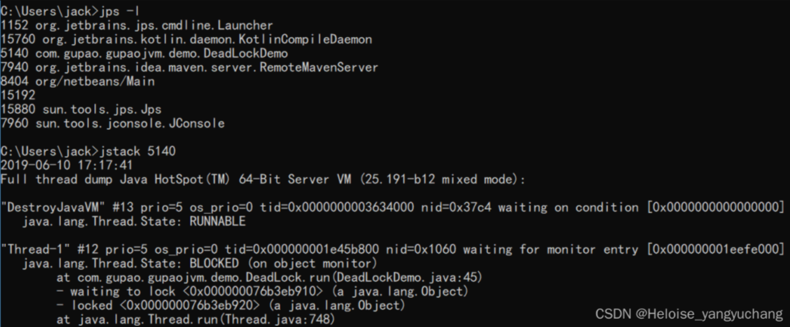
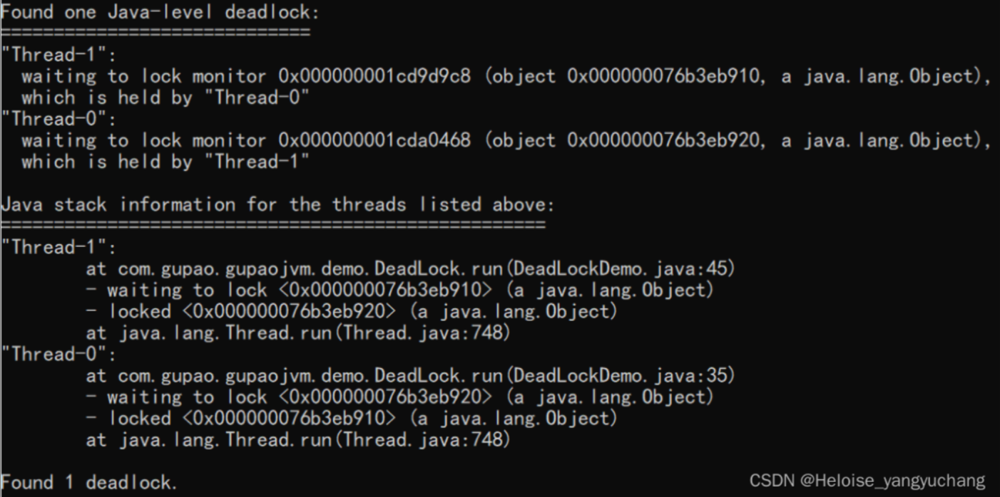
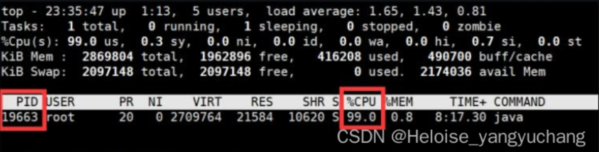
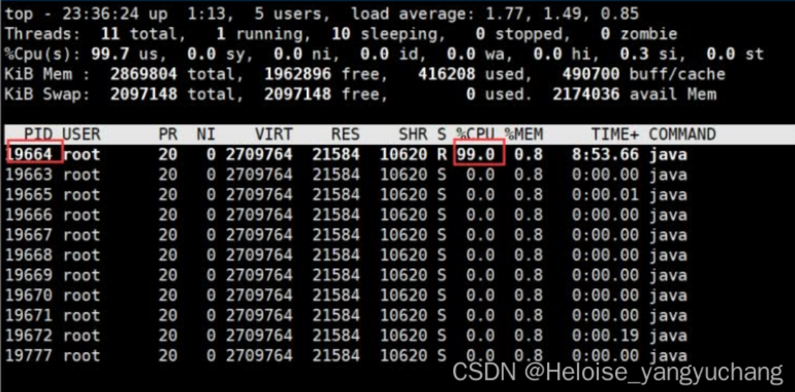
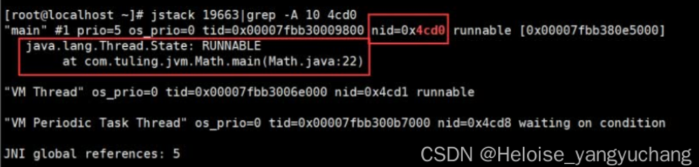
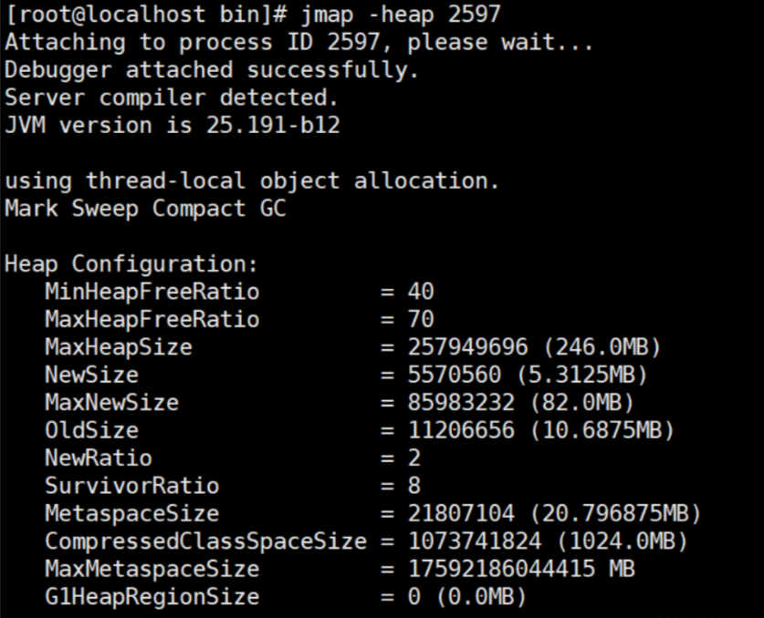
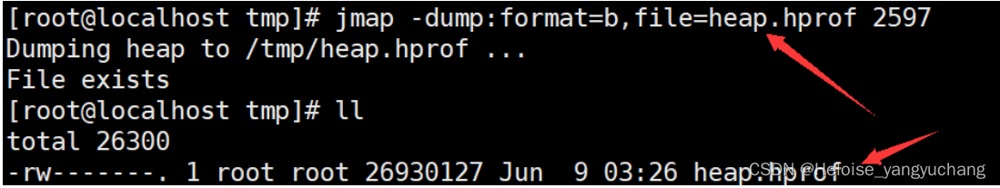
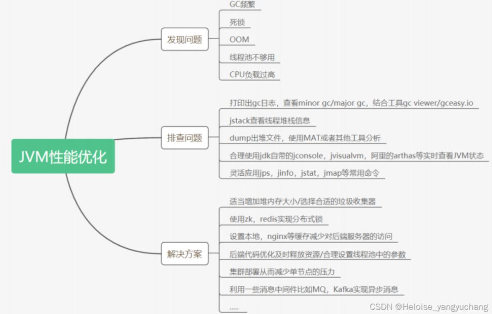

## JVM命令

### 常用命令

- jps

  ```shell
  jps # 显示进程的ID 和 类的名称
  jps –l # 输出输出完全的包名，应用主类名，jar的完全路径名 
  jps –v # 输出jvm参数
  jps –q # 显示java进程号
  jps -m # main 方法
  jps -l xxx.xxx.xx.xx # 远程查看 
  ```

- jinfo

  ```shell
  # 输出当前 jvm 进程的全部参数和系统属性
  jinfo 2815
  
  # 输出所有的参数
  jinfo -flags 2815
  
  # 查看指定的 jvm 参数的值
  jinfo -flag PrintGC 2815
  
  # 开启/关闭指定的JVM参数
  jinfo -flag +PrintGC 2815
  
  # 设置flag的参数
  jinfo -flag name=value 2815
  
  # 输出当前 jvm 进行的全部的系统属性
  jinfo -sysprops 2815
  ```

  

- jstat

  查看类装载信息
  jstat -class PID 1000 10 查看某个java进程的类装载信息，每1000毫秒输出一次，共输出10次

  查看垃圾收集信息
  jstat -gc PID 1000 10

- jstack

  ```shell
  # 基本
  jstack 2815
  
  -l #长列表. 打印关于锁的附加信息,例如属于java.util.concurrent 的 ownable synchronizers列表.
  
  -F #当’jstack [-l] pid’没有相应的时候强制打印栈信息
  
  -m #打印java和native c/c++框架的所有栈信息.
  
  -h | -help #打印帮助信息
  ```

### 排查死锁案例





jstack找出占用cpu最高的线程堆栈信息

1. 使用命令top -p 显示你的java进程的内存情况，pid是你的java进程号，比如19663

   

2. 按H，获取每个线程的内存情况

   

3. 找到内存和cpu占用最高的线程tid，比如19664

4. 转为十六进制得到0x4cd0，此为线程id的十六进制表示

5. 执行 jstack 19663|grep -A 10 4cd0，得到线程堆栈信息中 4cd0 这个线程所在行的后面10行

6. 从堆栈中可以发现导致cpu飙高的调用方法，查看对应的堆栈信息找出可能存在问题的代码

   

jmap打印出堆内存相关信息

jmap -heap PID



dump出堆内存相关信息

jmap -dump:format=b,file=heap.hprof PID



一般在开发中，JVM参数可以加上下面两句，这样内存溢出时，会自动dump出该文件

```shell
-XX:+HeapDumpOnOutOfMemoryError -XX:HeapDumpPath=heap.hprof
```

## JVM问题排查

### CPU飙高，load高，响应很慢

一个请求过程中多次dump；

对比多次dump文件的runnable线程，如果执行的方法有比较大变化，说明比较正常。如果在执行同一个方法，就有一些问题了；

### 查找占用CPU最多的线程

1. top
2. top -H -p PID
3. 查看进程中占用CPU高的线程id，即tid
4. jstack PID | grep tid

使用命令：top -H -p pid（pid为被测系统的进程号），找到导致CPU高的线程ID，对应thread dump信息中线程的nid，只不过一个是十进制，一个是十六进制；
在thread dump中，根据top命令查找的线程id，查找对应的线程堆栈信息；

### CPU使用率不高但是响应很慢

进行dump，查看是否有很多thread struck在了i/o、数据库等地方，定位瓶颈原因；

### 请求无法响应

多次dump，对比是否所有的runnable线程都一直在执行相同的方法，如果是，那就是锁住了。

#### 死锁

死锁经常表现为程序的停顿，或者不再响应用户的请求。从操作系统上观察，对应进程的CPU占用率为零，很快会从top或prstat的输出中消失。

线程 Dump中可以直接报告出 Java级别的死锁

#### 活锁

其表现特征为：由于多个线程对临界区，或者锁的竞争，可能出现：

- 频繁的线程的上下文切换：从操作系统对线程的调度来看，当线程在等待资源而阻塞的时候，操作系统会将之切换出来，放到等待的队列，当线程获得资源之后，调度算法会将这个线程切换进去，放到执行队列中。
- 大量的系统调用：因为线程的上下文切换，以及热锁的竞争，或者临界区的频繁的进出，都可能导致大量的系统调用。
- 大部分CPU开销用在“系统态”：线程上下文切换，和系统调用，都会导致 CPU在 “系统态 ”运行，换而言之，虽然系统很忙碌，但是CPU用在 “用户态 ”的比例较小，应用程序得不到充分的 CPU资源。
- 随着CPU数目的增多，系统的性能反而下降。因为CPU数目多，同时运行的线程就越多，可能就会造成更频繁的线程上下文切换和系统态的CPU开销，从而导致更糟糕的性能。

从整体的性能指标看，由于线程热锁的存在，程序的响应时间会变长，吞吐量会降低。

解决方法：

- 一个重要的方法是结合操作系统的各种工具观察系统资源使用状况
- 以及收集Java线程的DUMP信息，看线程都阻塞在什么方法上，了解原因，才能找到对应的解决方法。

### JVM性能优化方向



> 参考资料来源：
>
> https://blog.csdn.net/qq_35958391/article/details/124367061?spm=1001.2014.3001.5502
>
> https://blog.csdn.net/qq_35958391/article/details/124367955