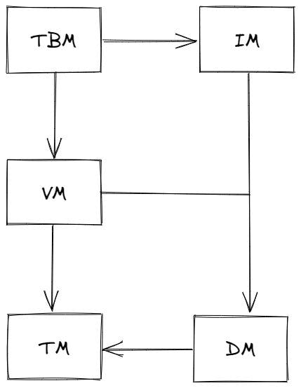

## Quick Start

```shell
# 编译源码
mvn compile
```

```shell
# 以 /tmp/javadb 作为路径创建数据库：
mvn exec:java -Dexec.mainClass="javadb.backend.Launcher" -Dexec.args="-create /tmp/javadb"
```

```shell
# 以默认参数启动数据库服务：
mvn exec:java -Dexec.mainClass="javadb.backend.Launcher" -Dexec.args="-open /tmp/javadb"
```

```shell
# 这时数据库服务就已经启动在本机的 9999 端口。重新启动一个终端，执行以下命令启动客户端连接数据库：
mvn exec:java -Dexec.mainClass="javadb.client.Launcher"
```

## 整体架构

JavaDB分为后端和前端，前后端通过 socket 进行交互。前端（客户端）的职责很单一，读取用户输入，并发送到后端执行，输出返回结果，并等待下一次输入。JavaDB后端则需要解析 SQL，如果是合法的 SQL，就尝试执行并返回结果。不包括解析器，JavaDB的后端划分为五个模块，每个模块都又一定的职责，通过接口向其依赖的模块提供方法。五个模块如下：

1. Transaction Manager（TM）
2. Data Manager（DM）
3. Version Manager（VM）
4. Index Manager（IM）
5. Table Manager（TBM）

五个模块的依赖关系如下：



每个模块的职责如下：

1. TM 通过维护 XID 文件来维护事务的状态，并提供接口供其他模块来查询某个事务的状态。
2. DM 直接管理数据库 DB 文件和日志文件。DM 的主要职责有：1) 分页管理 DB 文件，并进行缓存；2) 管理日志文件，保证在发生错误时可以根据日志进行恢复；3) 抽象 DB 文件为 DataItem 供上层模块使用，并提供缓存。
3. VM 基于两段锁协议实现了调度序列的可串行化，并实现了 MVCC 以消除读写阻塞。同时实现了两种隔离级别。
4. IM 实现了基于 B+ 树的索引，BTW，目前 where 只支持已索引字段。
5. TBM 实现了对字段和表的管理。同时，解析 SQL 语句，并根据语句操作表。

## TM-Transaction Manager

**TM 通过维护 XID 文件来维护事务的状态，并提供接口供其他模块来查询某个事务的状态。**

### XID文件

在 JavaDB 中，每一个事务都有一个 XID，这个 ID 唯一标识了这个事务。事务的 XID 从 1 开始标号，并自增，不可重复。并特殊规定 XID 0 是一个超级事务（Super Transaction）。当一些操作想在没有申请事务的情况下进行，那么可以将操作的 XID 设置为 0。XID 为 0 的事务的状态永远是 committed。

TransactionManager 维护了一个 XID 格式的文件，用来记录各个事务的状态。JavaDB中，每个事务都有下面的三种状态：

1. active，正在进行，尚未结束
2. committed，已提交
3. aborted，已撤销（回滚）

XID 文件给每个事务分配了一个字节的空间，用来保存其状态。同时，在 XID 文件的头部，还保存了一个 8 字节的数字，记录了这个 XID 文件管理的事务的个数。于是，事务 xid 在文件中的状态就存储在 (xid-1)+8 字节处，xid-1 是因为 xid 0（Super XID） 的状态不需要记录。

TransactionManager 提供了一些接口供其他模块调用，用来创建事务和查询事务状态。更具体的：

```java
public interface TransactionManager {
    long begin();                       // 开启一个新事务
    void commit(long xid);              // 提交一个事务
    void abort(long xid);               // 取消一个事务
    boolean isActive(long xid);         // 查询一个事务的状态是否是正在进行的状态
    boolean isCommitted(long xid);      // 查询一个事务的状态是否是已提交
    boolean isAborted(long xid);        // 查询一个事务的状态是否是已取消
    void close();                       // 关闭TM
}
```

### 实现

**一些必要的常量**

```java
// XID文件头长度
static final int LEN_XID_HEADER_LENGTH = 8;
// 每个事务的占用长度
private static final int XID_FIELD_SIZE = 1;
// 事务的三种状态
private static final byte FIELD_TRAN_ACTIVE   = 0;
private static final byte FIELD_TRAN_COMMITTED = 1;
private static final byte FIELD_TRAN_ABORTED  = 2;
// 超级事务，永远为commited状态
public static final long SUPER_XID = 0;
// XID 文件后缀
static final String XID_SUFFIX = ".xid";
```

在构造函数创建了一个 TransactionManager 之后，首先要对 XID 文件进行校验，以保证这是一个合法的 XID 文件。校验的方式：通过文件头的 8 字节数字反推文件的理论长度，与文件的实际长度做对比。如果不同则认为 XID 文件不合法。

```java
private void checkXIDCounter() {
    long fileLen = 0;
    try {
        fileLen = file.length();
    } catch (IOException e1) {
        Panic.panic(Error.BadXIDFileException);
    }
    if(fileLen < LEN_XID_HEADER_LENGTH) {
        Panic.panic(Error.BadXIDFileException);
    }

    ByteBuffer buf = ByteBuffer.allocate(LEN_XID_HEADER_LENGTH);
    try {
        fc.position(0);
        fc.read(buf);
    } catch (IOException e) {
        Panic.panic(e);
    }
    this.xidCounter = Parser.parseLong(buf.array());
    long end = getXidPosition(this.xidCounter + 1);
    if(end != fileLen) {
        Panic.panic(Error.BadXIDFileException);
    }
}
```

对于校验没有通过的，会直接通过 panic 方法，强制停机。在一些基础模块中出现错误都会如此处理，无法恢复的错误只能直接停机。

getXidPosition()方法，用来获取 xid 的状态在文件中的偏移。

```java
// 根据事务xid取得其在xid文件中对应的位置
private long getXidPosition(long xid) {
    return LEN_XID_HEADER_LENGTH + (xid-1)*XID_FIELD_SIZE;
}
```

begin() 方法会开始一个事务，更具体的，首先设置 xidCounter+1 事务的状态为 committed，随后 xidCounter 自增，并更新文件头。

```java
// 开始一个事务，并返回XID
public long begin() {
    counterLock.lock();
    try {
        long xid = xidCounter + 1;
        updateXID(xid, FIELD_TRAN_ACTIVE);
        incrXIDCounter();
        return xid;
    } finally {
        counterLock.unlock();
    }
}

// 更新xid事务的状态为status
private void updateXID(long xid, byte status) {
    long offset = getXidPosition(xid);
    byte[] tmp = new byte[XID_FIELD_SIZE];
    tmp[0] = status;
    ByteBuffer buf = ByteBuffer.wrap(tmp);
    try {
        fc.position(offset);
        fc.write(buf);
    } catch (IOException e) {
        Panic.panic(e);
    }
    try {
        fc.force(false);
    } catch (IOException e) {
        Panic.panic(e);
    }
}

// 将XID加一，并更新XID Header
private void incrXIDCounter() {
    xidCounter ++;
    ByteBuffer buf = ByteBuffer.wrap(Parser.long2Byte(xidCounter));
    try {
        fc.position(0);
        fc.write(buf);
    } catch (IOException e) {
        Panic.panic(e);
    }
    try {
        fc.force(false);
    } catch (IOException e) {
        Panic.panic(e);
    }
}
```

**注意，这里的所有文件操作，在执行后都需要立刻刷入文件中，防止在崩溃后文件丢失数据，fileChannel 的 force() 方法，强制同步缓存内容到文件中，类似于 BIO 中的 flush() 方法。force 方法的参数是一个布尔，表示是否同步文件的元数据（例如最后修改时间等）。**

commit() 和 abort() 方法就可以直接借助 updateXID() 方法实现。

同样，isActive()、isCommitted() 和 isAborted() 都是检查一个 xid 的状态，可以用一个通用的方法解决。

```java
// 检测XID事务是否处于status状态
private boolean checkXID(long xid, byte status) {
    long offset = getXidPosition(xid);
    ByteBuffer buf = ByteBuffer.wrap(new byte[XID_FIELD_SIZE]);
    try {
        fc.position(offset);
        fc.read(buf);
    } catch (IOException e) {
        Panic.panic(e);
    }
    return buf.array()[0] == status;
}
```

当然，检查之间记得排除 SUPER_XID。

另外就是两个静态方法： create() 和 open() ，分别表示创建一个 xid 文件并创建 TM 和从一个已有的 xid 文件来创建 TM。从零创建 XID 文件时需要写一个空的 XID 文件头，即设置 xidCounter 为 0，否则后续在校验时会不合法。

```java
public static TransactionManagerImpl create(String path) {
    ...
    // 写空XID文件头
    ByteBuffer buf = ByteBuffer.wrap(new byte[TransactionManagerImpl.LEN_XID_HEADER_LENGTH]);
    try {
        fc.position(0);
        fc.write(buf);
    } catch (IOException e) {
        Panic.panic(e);
    }
    ...
}
```

## DM-Data Manager

### 引用计数缓存框架和共享内存数组

DM 直接管理数据库 DB 文件和日志文件。

DM 的主要职责有：

1. 分页管理 DB 文件，并进行缓存；
2. 管理日志文件，保证在发生错误时可以根据日志进行恢复；
3. 抽象 DB 文件为 DataItem 供上层模块使用，并提供缓存。

DM 的功能其实可以归纳为两点：

1. 上层模块和文件系统之间的一个抽象层，向下直接读写文件，向上提供数据的包装；
2. 日志功能。

可以注意到，无论是向上还是向下，DM 都提供了一个缓存的功能，用内存操作来保证效率。

#### 引用计数缓存框架

**为什么使用引用计数策略，而不使用LRU？**

如果使用 LRU 缓存，那么只需要设计一个 get(key) 接口即可，释放缓存可以在缓存满了之后自动完成。设想这样一个场景：某个时刻缓存满了，缓存驱逐了一个资源，这时上层模块想要将某个资源强制刷回数据源，这个资源恰好是刚刚被驱逐的资源。那么上层模块就发现，这个数据在缓存里消失了，这时候就陷入了一种尴尬的境地：是否有必要做回源操作？

1. 不回源。由于没法确定缓存被驱逐的时间，更没法确定被驱逐之后数据项是否被修改，这样是极其不安全的
2. 回源。如果数据项被驱逐时的数据和现在又是相同的，那就是一次无效回源
3. 放回缓存里，等下次被驱逐时回源。看起来解决了问题，但是此时缓存已经满了，这意味着你还需要驱逐一个资源才能放进去。这有可能会导致缓存抖动问题

可以记录下资源的最后修改时间，并且让缓存记录下资源被驱逐的时间。但是“如无必要，勿增实体”。

问题的根源还是，LRU 策略中，资源驱逐不可控，上层模块无法感知。而引用计数策略正好解决了这个问题，只有上层模块主动释放引用，缓存在确保没有模块在使用这个资源了，才会去驱逐资源。

这就是引用计数法了。增加了一个方法 release(key) ，用于在上册模块不使用某个资源时，释放对资源的引用。当引用归零时，缓存就会驱逐这个资源。

同样，在缓存满了之后，引用计数法无法自动释放缓存，此时应该直接报错（和 JVM 似的，直接 OOM）。

#### 实现

AbstractCache<T> 是一个抽象类，内部有两个抽象方法，留给实现类去实现具体的操作：

```java
/**
 * 当资源不在缓存时的获取行为
 */
protected abstract T getForCache(long key) throws Exception;
/**
 * 当资源被驱逐时的写回行为
 */
protected abstract void releaseForCache(T obj);
```

引用计数嘛，除了普通的缓存功能，还需要另外维护一个计数。除此以外，为了应对多线程场景，还需要记录哪些资源正在从数据源获取中（从数据源获取资源是一个相对费时的操作）。于是有下面三个 Map：

```java
private HashMap<Long, T> cache;                     // 实际缓存的数据
private HashMap<Long, Integer> references;          // 资源的引用个数
private HashMap<Long, Boolean> getting;             // 正在被获取的资源
```

于是，在通过 get() 方法获取资源时，首先进入一个死循环，来无限尝试从缓存里获取。首先就需要检查这个时候是否有其他线程正在从数据源获取这个资源，如果有，就过会再来看看：

```java
while(true) {
    lock.lock();
    if(getting.containsKey(key)) {
        // 请求的资源正在被其他线程获取
        lock.unlock();
        try {
            Thread.sleep(1);
        } catch (InterruptedException e) {
            e.printStackTrace();
            continue;
        }
        continue;
    }
    ...
}
```

当然如果资源在缓存中，就可以直接获取并返回了，记得要给资源的引用数 +1。否则，如果缓存没满的话，就在 getting 中注册一下，该线程准备从数据源获取资源了。

```java
while(true) {
    if(cache.containsKey(key)) {
        // 资源在缓存中，直接返回
        T obj = cache.get(key);
        references.put(key, references.get(key) + 1);
        lock.unlock();
        return obj;
    }

    // 尝试获取该资源
    if(maxResource > 0 && count == maxResource) {
        lock.unlock();
        throw Error.CacheFullException;
    }
    count ++;
    getting.put(key, true);
    lock.unlock();
    break;
}
```

从数据源获取资源就比较简单了，直接调用那个抽象方法即可，获取完成记得从 getting 中删除 key。

```java
T obj = null;
try {
    obj = getForCache(key);
} catch(Exception e) {
    lock.lock();
    count --;
    getting.remove(key);
    lock.unlock();
    throw e;
}

lock.lock();
getting.remove(key);
cache.put(key, obj);
references.put(key, 1);
lock.unlock();
```

释放一个缓存就简单多了，直接从 references 中减 1，如果已经减到 0 了，就可以回源，并且删除缓存中所有相关的结构了：

```java
/**
 * 强行释放一个缓存
 */
protected void release(long key) {
    lock.lock();
    try {
        int ref = references.get(key)-1;
        if(ref == 0) {
            T obj = cache.get(key);
            releaseForCache(obj);
            references.remove(key);
            cache.remove(key);
            count --;
        } else {
            references.put(key, ref);
        }
    } finally {
        lock.unlock();
    }
}
```

缓存应当还有以一个安全关闭的功能，在关闭时，需要将缓存中所有的资源强行回源。

```java
lock.lock();
try {
    Set<Long> keys = cache.keySet();
    for (long key : keys) {
        release(key);
        references.remove(key);
        cache.remove(key);
    }
} finally {
    lock.unlock();
}
```

这样，一个简单的缓存框架就实现完了，其他的缓存只需要继承这个类，并实现那两个抽象方法即可。

#### 共享内存数组

在 Java 中，当执行类似 subArray 的操作时，只会在底层进行一个复制，无法共用同一片内存。

```java
public class SubArray {
    public byte[] raw;
    public int start;
    public int end;

    public SubArray(byte[] raw, int start, int end) {
        this.raw = raw;
        this.start = start;
        this.end = end;
    }
}
```

### 数据页的缓存与管理

DM 模块向下对文件系统的抽象部分：DM 将文件系统抽象成页面，每次对文件系统的读写都是以页面为单位的。同样，从文件系统读进来的数据也是以页面为单位进行缓存的。

#### 页面缓存

定义一个页面如下：

```java
public class PageImpl implements Page {
    private int pageNumber;
    private byte[] data;
    private boolean dirty;
    private Lock lock;

    private PageCache pc;
}
```

其中，pageNumber 是这个页面的页号，**该页号从 1 开始**。data 就是这个页实际包含的字节数据。dirty 标志着这个页面是否是脏页面，在缓存驱逐的时候，脏页面需要被写回磁盘。这里保存了一个 PageCache（还未定义）的引用，用来方便在拿到 Page 的引用时可以快速对这个页面的缓存进行释放操作。

定义页面缓存的接口如下：

```java
public interface PageCache {
    int newPage(byte[] initData);
    Page getPage(int pgno) throws Exception;
    void close();
    void release(Page page);

    void truncateByBgno(int maxPgno);
    int getPageNumber();
    void flushPage(Page pg);
}
```

页面缓存的具体实现类，需要继承抽象缓存框架，并且实现 getForCache() 和 releaseForCache() 两个抽象方法。由于数据源就是文件系统，getForCache() 直接从文件中读取，并包裹成 Page 即可：

```java
@Override
protected Page getForCache(long key) throws Exception {
    int pgno = (int)key;
    long offset = PageCacheImpl.pageOffset(pgno);

    ByteBuffer buf = ByteBuffer.allocate(PAGE_SIZE);
    fileLock.lock();
    try {
        fc.position(offset);
        fc.read(buf);
    } catch(IOException e) {
        Panic.panic(e);
    }
    fileLock.unlock();
    return new PageImpl(pgno, buf.array(), this);
}

private static long pageOffset(int pgno) {
    // 页号从 1 开始
    return (pgno-1) * PAGE_SIZE;
}
```

而 releaseForCache() 驱逐页面时，也只需要根据页面是否是脏页面，来决定是否需要写回文件系统：

```java
@Override
protected void releaseForCache(Page pg) {
    if(pg.isDirty()) {
        flush(pg);
        pg.setDirty(false);
    }
}

private void flush(Page pg) {
    int pgno = pg.getPageNumber();
    long offset = pageOffset(pgno);

    fileLock.lock();
    try {
        ByteBuffer buf = ByteBuffer.wrap(pg.getData());
        fc.position(offset);
        fc.write(buf);
        fc.force(false);
    } catch(IOException e) {
        Panic.panic(e);
    } finally {
        fileLock.unlock();
    }
}
```

PageCache 还使用了一个 AtomicInteger，来记录了当前打开的数据库文件有多少页。这个数字在数据库文件被打开时就会被计算，并在新建页面时自增。

```java
public int newPage(byte[] initData) {
    int pgno = pageNumbers.incrementAndGet();
    Page pg = new PageImpl(pgno, initData, null);
    flush(pg);  // 新建的页面需要立刻写回
    return pgno;
}
```

**同一条数据是不允许跨页存储的，这意味着，单条数据的大小不能超过数据库页面的大小。**

#### 数据页管理

##### 第一页

数据库文件的第一页，通常用作一些特殊用途，比如存储一些元数据，用来启动检查什么的。JavaDB的第一页，只是用来做启动检查。具体的原理是，在每次数据库启动时，会生成一串随机字节，存储在 100 ~ 107 字节。在数据库正常关闭时，会将这串字节，拷贝到第一页的 108 ~ 115 字节。

这样数据库在每次启动时，就会检查第一页两处的字节是否相同，以此来判断上一次是否正常关闭。如果是异常关闭，就需要执行数据的恢复流程。

启动时设置初始字节：

```java
public static void setVcOpen(Page pg) {
    pg.setDirty(true);
    setVcOpen(pg.getData());
}

private static void setVcOpen(byte[] raw) {
    System.arraycopy(RandomUtil.randomBytes(LEN_VC), 0, raw, OF_VC, LEN_VC);
}
```

关闭时拷贝字节：

```java
public static void setVcClose(Page pg) {
    pg.setDirty(true);
    setVcClose(pg.getData());
}

private static void setVcClose(byte[] raw) {
    System.arraycopy(raw, OF_VC, raw, OF_VC+LEN_VC, LEN_VC);
}
```

校验字节：

```java
public static boolean checkVc(Page pg) {
    return checkVc(pg.getData());
}

private static boolean checkVc(byte[] raw) {
    return Arrays.equals(Arrays.copyOfRange(raw, OF_VC, OF_VC+LEN_VC), Arrays.copyOfRange(raw, OF_VC+LEN_VC, OF_VC+2*LEN_VC));
}
```

##### 普通页

JavaDB对于普通数据页的管理就比较简单了。一个普通页面以一个 2 字节无符号数起始，表示这一页的空闲位置的偏移。剩下的部分都是实际存储的数据。

所以对普通页的管理，基本都是围绕着对 FSO（Free Space Offset）进行的。例如向页面插入数据：

```java
// 将raw插入pg中，返回插入位置
public static short insert(Page pg, byte[] raw) {
    pg.setDirty(true);
    short offset = getFSO(pg.getData());
    System.arraycopy(raw, 0, pg.getData(), offset, raw.length);
    setFSO(pg.getData(), (short)(offset + raw.length));
    return offset;
}
```

在写入之前获取 FSO，来确定写入的位置，并在写入之后更新 FSO。FSO 的操作如下：

```java
private static void setFSO(byte[] raw, short ofData) {
    System.arraycopy(Parser.short2Byte(ofData), 0, raw, OF_FREE, OF_DATA);
}

// 获取pg的FSO
public static short getFSO(Page pg) {
    return getFSO(pg.getData());
}

private static short getFSO(byte[] raw) {
    return Parser.parseShort(Arrays.copyOfRange(raw, 0, 2));
}

// 获取页面的空闲空间大小
public static int getFreeSpace(Page pg) {
    return PageCache.PAGE_SIZE - (int)getFSO(pg.getData());
}
```

剩余两个函数 recoverInsert() 和 recoverUpdate() 用于在数据库崩溃后重新打开时，恢复例程直接插入数据以及修改数据使用。

```java
// 将raw插入pg中的offset位置，并将pg的offset设置为较大的offset
public static void recoverInsert(Page pg, byte[] raw, short offset) {
    pg.setDirty(true);
    System.arraycopy(raw, 0, pg.getData(), offset, raw.length);

    short rawFSO = getFSO(pg.getData());
    if(rawFSO < offset + raw.length) {
        setFSO(pg.getData(), (short)(offset+raw.length));
    }
}

// 将raw插入pg中的offset位置，不更新update
public static void recoverUpdate(Page pg, byte[] raw, short offset) {
    pg.setDirty(true);
    System.arraycopy(raw, 0, pg.getData(), offset, raw.length);
}
```

### 日志文件与恢复策略

崩溃后的数据恢复功能：DM 层在每次对底层数据操作时，都会记录一条日志到磁盘上。在数据库奔溃之后，再次启动时，可以根据日志的内容，恢复数据文件，保证其一致性。

#### 日志读写

日志的二进制文件，按照如下的格式进行排布：

> [XChecksum] [Log1] [Log2] [Log3]...[LogN] [BadTail]

其中 XChecksum 是一个四字节的整数，是对后续所有日志计算的校验和。Log1 ~ LogN 是常规的日志数据，BadTail 是在数据库崩溃时，没有来得及写完的日志数据，这个 BadTail 不一定存在。

每条日志的格式如下：

> [Size] [Checksum] [Data]

其中，Size 是一个四字节整数，标识了 Data 段的字节数。Checksum 则是该条日志的校验和。

单条日志的校验和，其实就是通过一个指定的种子实现的：

```java
private int calChecksum(int xCheck, byte[] log) {
    for (byte b : log) {
        xCheck = xCheck * SEED + b;
    }
    return xCheck;
}
```

这样，对所有日志求出校验和，求和就能得到日志文件的校验和了。

Logger 被实现成迭代器模式，通过 next() 方法，不断地从文件中读取下一条日志，并将其中的 Data 解析出来并返回。next() 方法的实现主要依靠 internNext()，大致如下，其中 position 是当前日志文件读到的位置偏移：

```java
private byte[] internNext() {
    if(position + OF_DATA >= fileSize) {
        return null;
    }
    // 读取size
    ByteBuffer tmp = ByteBuffer.allocate(4);
    fc.position(position);
    fc.read(tmp);
    int size = Parser.parseInt(tmp.array());
    if(position + size + OF_DATA > fileSize) {
        return null;
    }

    // 读取checksum+data
    ByteBuffer buf = ByteBuffer.allocate(OF_DATA + size);
    fc.position(position);
    fc.read(buf);
    byte[] log = buf.array();

    // 校验 checksum
    int checkSum1 = calChecksum(0, Arrays.copyOfRange(log, OF_DATA, log.length));
    int checkSum2 = Parser.parseInt(Arrays.copyOfRange(log, OF_CHECKSUM, OF_DATA));
    if(checkSum1 != checkSum2) {
        return null;
    }
    position += log.length;
    return log;
}
```

在打开一个日志文件时，需要首先校验日志文件的 XChecksum，并移除文件尾部可能存在的 BadTail，由于 BadTail 该条日志尚未写入完成，文件的校验和也就不会包含该日志的校验和，去掉 BadTail 即可保证日志文件的一致性。

```java
private void checkAndRemoveTail() {
    rewind();

    int xCheck = 0;
    while(true) {
        byte[] log = internNext();
        if(log == null) break;
        xCheck = calChecksum(xCheck, log);
    }
    if(xCheck != xChecksum) {
        Panic.panic(Error.BadLogFileException);
    }

    // 截断文件到正常日志的末尾
    truncate(position);
    rewind();
}
```

向日志文件写入日志时，也是首先将数据包裹成日志格式，写入文件后，再更新文件的校验和，更新校验和时，会刷新缓冲区，保证内容写入磁盘。

```java
public void log(byte[] data) {
    byte[] log = wrapLog(data);
    ByteBuffer buf = ByteBuffer.wrap(log);
    lock.lock();
    try {
        fc.position(fc.size());
        fc.write(buf);
    } catch(IOException e) {
        Panic.panic(e);
    } finally {
        lock.unlock();
    }
    updateXChecksum(log);
}

private void updateXChecksum(byte[] log) {
    this.xChecksum = calChecksum(this.xChecksum, log);
    fc.position(0);
    fc.write(ByteBuffer.wrap(Parser.int2Byte(xChecksum)));
    fc.force(false);
}

private byte[] wrapLog(byte[] data) {
    byte[] checksum = Parser.int2Byte(calChecksum(0, data));
    byte[] size = Parser.int2Byte(data.length);
    return Bytes.concat(size, checksum, data);
}
```

#### 恢复策略

DM 为上层模块，提供了两种操作，分别是插入新数据（I）和更新现有数据（U）。

**在进行 I 和 U 操作之前，必须先进行对应的日志操作，在保证日志写入磁盘后，才进行数据操作。**

这个日志策略，使得 DM 对于数据操作的磁盘同步，可以更加随意。日志在数据操作之前，保证到达了磁盘，那么即使该数据操作最后没有来得及同步到磁盘，数据库就发生了崩溃，后续也可以通过磁盘上的日志恢复该数据。

对于两种数据操作，DM 记录的日志如下：

- (Ti, I, A, x)，表示事务 Ti 在 A 位置插入了一条数据 x
- (Ti, U, A, oldx, newx)，表示事务 Ti 将 A 位置的数据，从 oldx 更新成 newx

##### 单线程

由于单线程，Ti、Tj 和 Tk 的日志永远不会相交。这种情况下利用日志恢复很简单，假设日志中最后一个事务是 Ti：

1. 对 Ti 之前所有的事务的日志，进行重做（redo）
2. 接着检查 Ti 的状态（XID 文件），如果 Ti 的状态是已完成（包括 committed 和 aborted），就将 Ti 重做，否则进行撤销（undo）

接着，是如何对事务 T 进行 redo：

1. 正序扫描事务 T 的所有日志
2. 如果日志是插入操作 (Ti, I, A, x)，就将 x 重新插入 A 位置
3. 如果日志是更新操作 (Ti, U, A, oldx, newx)，就将 A 位置的值设置为 newx

undo 也很好理解：

1. 倒序扫描事务 T 的所有日志
2. 如果日志是插入操作 (Ti, I, A, x)，就将 A 位置的数据删除
3. 如果日志是更新操作 (Ti, U, A, oldx, newx)，就将 A 位置的值设置为 oldx

注意，JavaDB中其实没有真正的删除操作，对于插入操作的 undo，只是将其中的标志位设置为 invalid。

##### 多线程

第一种情况：

> T1 begin
> T2 begin
> T2 U(x)
> T1 R(x)
> ...
> T1 commit
> JavaDB break down

在系统崩溃时，T2 仍然是活跃状态。那么当数据库重新启动，执行恢复例程时，会撤销 T2，它对数据库的影响会被消除。但是由于 T1 读取了 T2 更新的值，既然 T2 被撤销，那么 T1 也应当被撤销。这种情况，就是级联回滚。但是，T1 已经 commit 了，所有 commit 的事务的影响，应当被持久化。这里就造成了矛盾。所以这里需要保证：

> 规定1：正在进行的事务，不会读取其他任何未提交的事务产生的数据。

第二种情况，假设 x 的初值是 0：

>  T1 begin
> T2 begin
> T1 set x = x+1 // 产生的日志为(T1, U, A, 0, 1)
> T2 set x = x+1 // 产生的日志为(T1, U, A, 1, 2)
> T2 commit
> JavaDB break down

在系统崩溃时，T1 仍然是活跃状态。那么当数据库重新启动，执行恢复例程时，会对 T1 进行撤销，对 T2 进行重做，但是，无论撤销和重做的先后顺序如何，x 最后的结果，要么是 0，要么是 2，这都是错误的。

解决方法有两种：

1. 增加日志种类
2. 限制数据库操作

JavaDB采用的是限制数据库操作，需要保证：

> 规定2：正在进行的事务，不会修改其他任何未提交的事务修改或产生的数据。

有了这两条规定，并发情况下日志的恢复也就很简单了：

1. 重做所有崩溃时已完成（committed 或 aborted）的事务
2. 撤销所有崩溃时未完成（active）的事务

在恢复后，数据库就会恢复到所有已完成事务结束，所有未完成事务尚未开始的状态。

#### 实现

规定两种日志的格式：

```java
private static final byte LOG_TYPE_INSERT = 0;
private static final byte LOG_TYPE_UPDATE = 1;

// updateLog:
// [LogType] [XID] [UID] [OldRaw] [NewRaw]

// insertLog:
// [LogType] [XID] [Pgno] [Offset] [Raw]
```

和原理中描述的类似，recover 例程主要也是两步：重做所有已完成事务，撤销所有未完成事务：

```java
private static void redoTranscations(TransactionManager tm, Logger lg, PageCache pc) {
    lg.rewind();
    while(true) {
        byte[] log = lg.next();
        if(log == null) break;
        if(isInsertLog(log)) {
            InsertLogInfo li = parseInsertLog(log);
            long xid = li.xid;
            if(!tm.isActive(xid)) {
                doInsertLog(pc, log, REDO);
            }
        } else {
            UpdateLogInfo xi = parseUpdateLog(log);
            long xid = xi.xid;
            if(!tm.isActive(xid)) {
                doUpdateLog(pc, log, REDO);
            }
        }
    }
}

private static void undoTranscations(TransactionManager tm, Logger lg, PageCache pc) {
    Map<Long, List<byte[]>> logCache = new HashMap<>();
    lg.rewind();
    while(true) {
        byte[] log = lg.next();
        if(log == null) break;
        if(isInsertLog(log)) {
            InsertLogInfo li = parseInsertLog(log);
            long xid = li.xid;
            if(tm.isActive(xid)) {
                if(!logCache.containsKey(xid)) {
                    logCache.put(xid, new ArrayList<>());
                }
                logCache.get(xid).add(log);
            }
        } else {
            UpdateLogInfo xi = parseUpdateLog(log);
            long xid = xi.xid;
            if(tm.isActive(xid)) {
                if(!logCache.containsKey(xid)) {
                    logCache.put(xid, new ArrayList<>());
                }
                logCache.get(xid).add(log);
            }
        }
    }

    // 对所有active log进行倒序undo
    for(Entry<Long, List<byte[]>> entry : logCache.entrySet()) {
        List<byte[]> logs = entry.getValue();
        for (int i = logs.size()-1; i >= 0; i --) {
            byte[] log = logs.get(i);
            if(isInsertLog(log)) {
                doInsertLog(pc, log, UNDO);
            } else {
                doUpdateLog(pc, log, UNDO);
            }
        }
        tm.abort(entry.getKey());
    }
}
```

updateLog 和 insertLog 的重做和撤销处理，分别合并成一个方法来实现：

```java
private static void doUpdateLog(PageCache pc, byte[] log, int flag) {
    int pgno;
    short offset;
    byte[] raw;
    if(flag == REDO) {
        UpdateLogInfo xi = parseUpdateLog(log);
        pgno = xi.pgno;
        offset = xi.offset;
        raw = xi.newRaw;
    } else {
        UpdateLogInfo xi = parseUpdateLog(log);
        pgno = xi.pgno;
        offset = xi.offset;
        raw = xi.oldRaw;
    }
    Page pg = null;
    try {
        pg = pc.getPage(pgno);
    } catch (Exception e) {
        Panic.panic(e);
    }
    try {
        PageX.recoverUpdate(pg, raw, offset);
    } finally {
        pg.release();
    }
}

private static void doInsertLog(PageCache pc, byte[] log, int flag) {
    InsertLogInfo li = parseInsertLog(log);
    Page pg = null;
    try {
        pg = pc.getPage(li.pgno);
    } catch(Exception e) {
        Panic.panic(e);
    }
    try {
        if(flag == UNDO) {
            DataItem.setDataItemRawInvalid(li.raw);
        }
        PageX.recoverInsert(pg, li.raw, li.offset);
    } finally {
        pg.release();
    }
}
```

注意，doInsertLog() 方法中的删除，使用的是 DataItem.setDataItemRawInvalid(li.raw);，大致的作用，就是将该条 DataItem 的有效位设置为无效，来进行逻辑删除。

### 页面索引与DM的实现

#### 页面索引

页面索引，缓存了每一页的空闲空间。用于在上层模块进行插入操作时，能够快速找到一个合适空间的页面，而无需从磁盘或者缓存中检查每一个页面的信息。

JavaDB 用一个比较粗略的算法实现了页面索引，将一页的空间划分成了 40 个区间。在启动时，就会遍历所有的页面信息，获取页面的空闲空间，安排到这 40 个区间中。insert 在请求一个页时，会首先将所需的空间向上取整，映射到某一个区间，随后取出这个区间的任何一页，都可以满足需求。

PageIndex 的实现也很简单，一个 List 类型的数组。

```java
public class PageIndex {
    // 将一页划成40个区间
    private static final int INTERVALS_NO = 40;
    private static final int THRESHOLD = PageCache.PAGE_SIZE / INTERVALS_NO;

    private List[] lists;
}
```

从 PageIndex 中获取页面也很简单，算出区间号，直接取即可：

```java
public PageInfo select(int spaceSize) {
    int number = spaceSize / THRESHOLD;
    if(number < INTERVALS_NO) number ++;
    while(number <= INTERVALS_NO) {
        if(lists[number].size() == 0) {
            number ++;
            continue;
        }
        return lists[number].remove(0);
    }
    return null;
}
```

返回的 PageInfo 中包含页号和空闲空间大小的信息。

可以注意到，被选择的页，会直接从 PageIndex 中移除，这意味着，同一个页面是不允许并发写的。在上层模块使用完这个页面后，需要将其重新插入 PageIndex：

```java
public void add(int pgno, int freeSpace) {
    int number = freeSpace / THRESHOLD;
    lists[number].add(new PageInfo(pgno, freeSpace));
}
```

在 DataManager 被创建时，需要获取所有页面并填充 PageIndex：

```java
// 初始化pageIndex
void fillPageIndex() {
    int pageNumber = pc.getPageNumber();
    for(int i = 2; i <= pageNumber; i ++) {
        Page pg = null;
        try {
            pg = pc.getPage(i);
        } catch (Exception e) {
            Panic.panic(e);
        }
        pIndex.add(pg.getPageNumber(), PageX.getFreeSpace(pg));
        pg.release();
    }
}
```

注意在使用完 Page 后需要及时 release，否则可能会撑爆缓存。

#### DataItem

DataItem 是 DM 层向上层提供的数据抽象。上层模块通过地址，向 DM 请求到对应的 DataItem，再获取到其中的数据。

DataItem 的实现：

```java
public class DataItemImpl implements DataItem {
    private SubArray raw;
    private byte[] oldRaw;
    private DataManagerImpl dm;
    private long uid;
    private Page pg;
}
```

保存一个 dm 的引用是因为其释放依赖 dm 的释放（dm 同时实现了缓存接口，用于缓存 DataItem），以及修改数据时落日志。

DataItem 中保存的数据，结构如下：

> [ValidFlag] [DataSize] [Data]

其中 ValidFlag 占用 1 字节，标识了该 DataItem 是否有效。删除一个 DataItem，只需要简单地将其有效位设置为 0。DataSize 占用 2 字节，标识了后面 Data 的长度。

上层模块在获取到 DataItem 后，可以通过 data() 方法，该方法返回的数组是数据共享的，而不是拷贝实现的，所以使用了 SubArray。

```java
@Override
public SubArray data() {
    return new SubArray(raw.raw, raw.start+OF_DATA, raw.end);
}
```

在上层模块试图对 DataItem 进行修改时，需要遵循一定的流程：在修改之前需要调用 before() 方法，想要撤销修改时，调用 unBefore() 方法，在修改完成后，调用 after() 方法。整个流程，主要是为了保存前相数据，并及时落日志。DM 会保证对 DataItem 的修改是原子性的。

```java
@Override
public void before() {
    wLock.lock();
    pg.setDirty(true);
    System.arraycopy(raw.raw, raw.start, oldRaw, 0, oldRaw.length);
}

@Override
public void unBefore() {
    System.arraycopy(oldRaw, 0, raw.raw, raw.start, oldRaw.length);
    wLock.unlock();
}

@Override
public void after(long xid) {
    dm.logDataItem(xid, this);
    wLock.unlock();
}
```

after() 方法，主要就是调用 dm 中的一个方法，对修改操作落日志。

在使用完 DataItem 后，也应当及时调用 release() 方法，释放掉 DataItem 的缓存（由 DM 缓存 DataItem）。

```java
@Override
public void release() {
    dm.releaseDataItem(this);
}
```

#### 实现

DataManager 是 DM 层直接对外提供方法的类，同时，也实现成 DataItem 对象的缓存。DataItem 存储的 key，是由页号和页内偏移组成的一个 8 字节无符号整数，页号和偏移各占 4 字节。

DataItem 缓存，getForCache()，只需要从 key 中解析出页号，从 pageCache 中获取到页面，再根据偏移，解析出 DataItem 即可：

```java
@Override
protected DataItem getForCache(long uid) throws Exception {
    short offset = (short)(uid & ((1L << 16) - 1));
    uid >>>= 32;
    int pgno = (int)(uid & ((1L << 32) - 1));
    Page pg = pc.getPage(pgno);
    return DataItem.parseDataItem(pg, offset, this);
}
```

DataItem 缓存释放，需要将 DataItem 写回数据源，由于对文件的读写是以页为单位进行的，只需要将 DataItem 所在的页 release 即可：

```java
@Override
protected void releaseForCache(DataItem di) {
    di.page().release();
}
```

从已有文件创建 DataManager 和从空文件创建 DataManager 的流程稍有不同，除了 PageCache 和 Logger 的创建方式有所不同以外，从空文件创建首先需要对第一页进行初始化，而从已有文件创建，则是需要对第一页进行校验，来判断是否需要执行恢复流程。并重新对第一页生成随机字节。

```java
public static DataManager create(String path, long mem, TransactionManager tm) {
    PageCache pc = PageCache.create(path, mem);
    Logger lg = Logger.create(path);
    DataManagerImpl dm = new DataManagerImpl(pc, lg, tm);
    dm.initPageOne();
    return dm;
}

public static DataManager open(String path, long mem, TransactionManager tm) {
    PageCache pc = PageCache.open(path, mem);
    Logger lg = Logger.open(path);
    DataManagerImpl dm = new DataManagerImpl(pc, lg, tm);
    if(!dm.loadCheckPageOne()) {
        Recover.recover(tm, lg, pc);
    }
    dm.fillPageIndex();
    PageOne.setVcOpen(dm.pageOne);
    dm.pc.flushPage(dm.pageOne);
    return dm;
}
```

其中，初始化第一页，和校验第一页，基本都是调用 PageOne 类中的方法实现的：

```java
// 在创建文件时初始化PageOne
void initPageOne() {
    int pgno = pc.newPage(PageOne.InitRaw());
    assert pgno == 1;
    try {
        pageOne = pc.getPage(pgno);
    } catch (Exception e) {
        Panic.panic(e);
    }
    pc.flushPage(pageOne);
}

// 在打开已有文件时时读入PageOne，并验证正确性
boolean loadCheckPageOne() {
    try {
        pageOne = pc.getPage(1);
    } catch (Exception e) {
        Panic.panic(e);
    }
    return PageOne.checkVc(pageOne);
}
```

DM 层提供了三个功能供上层使用，分别是读、插入和修改。修改是通过读出的 DataItem 实现的，于是 DataManager 只需要提供 read() 和 insert() 方法。

read() 根据 UID 从缓存中获取 DataItem，并校验有效位：

```java
@Override
public DataItem read(long uid) throws Exception {
    DataItemImpl di = (DataItemImpl)super.get(uid);
    if(!di.isValid()) {
        di.release();
        return null;
    }
    return di;
}
```

insert() 方法，在 pageIndex 中获取一个足以存储插入内容的页面的页号，获取页面后，首先需要写入插入日志，接着才可以通过 pageX 插入数据，并返回插入位置的偏移。最后需要将页面信息重新插入 pageIndex。

```java
@Override
public long insert(long xid, byte[] data) throws Exception {
    byte[] raw = DataItem.wrapDataItemRaw(data);
    if(raw.length > PageX.MAX_FREE_SPACE) {
        throw Error.DataTooLargeException;
    }

    // 尝试获取可用页
    PageInfo pi = null;
    for(int i = 0; i < 5; i ++) {
        pi = pIndex.select(raw.length);
        if (pi != null) {
            break;
        } else {
            int newPgno = pc.newPage(PageX.initRaw());
            pIndex.add(newPgno, PageX.MAX_FREE_SPACE);
        }
    }
    if(pi == null) {
        throw Error.DatabaseBusyException;
    }

    Page pg = null;
    int freeSpace = 0;
    try {
        pg = pc.getPage(pi.pgno);
        // 首先做日志
        byte[] log = Recover.insertLog(xid, pg, raw);
        logger.log(log);
        // 再执行插入操作
        short offset = PageX.insert(pg, raw);

        pg.release();
        return Types.addressToUid(pi.pgno, offset);

    } finally {
        // 将取出的pg重新插入pIndex
        if(pg != null) {
            pIndex.add(pi.pgno, PageX.getFreeSpace(pg));
        } else {
            pIndex.add(pi.pgno, freeSpace);
        }
    }
}
```

DataManager 正常关闭时，需要执行缓存和日志的关闭流程，不要忘了设置第一页的字节校验：

```java
@Override
public void close() {
    super.close();
    logger.close();

    PageOne.setVcClose(pageOne);
    pageOne.release();
    pc.close();
}
```

## VM-Version Manager

### 记录的版本与事务隔离

**VM 基于两段锁协议实现了调度序列的可串行化，并实现了 MVCC 以消除读写阻塞。同时实现了两种隔离级别。**

#### 2PL与MVCC

##### 冲突与2PL

首先来定义数据库的冲突，暂时不考虑插入操作，只看更新操作（U）和读操作（R），两个操作只要满足下面三个条件，就可以说这两个操作相互冲突：

1. 这两个操作是由不同的事务执行的
2. 这两个操作操作的是同一个数据项
3. 这两个操作至少有一个是更新操作

那么这样，对同一个数据操作的冲突，其实就只有下面这两种情况：

1. 两个不同事务的 U 操作冲突
2. 两个不同事务的 U、R 操作冲突

VM 的一个很重要的职责，就是实现了调度序列的可串行化。JavaDB 采用两段锁协议（2PL）来实现。当采用 2PL 时，如果某个事务 i 已经对 x 加锁，且另一个事务 j 也想操作 x，但是这个操作与事务 i 之前的操作相互冲突的话，事务 j 就会被阻塞。譬如，T1 已经因为 U1(x) 锁定了 x，那么 T2 对 x 的读或者写操作都会被阻塞，T2 必须等待 T1 释放掉对 x 的锁。

由此来看，2PL 确实保证了调度序列的可串行话，但是不可避免地导致了事务间的相互阻塞，甚至可能导致死锁。JavaDB为了提高事务处理的效率，降低阻塞概率，实现了 MVCC。

##### MVCC

DM 层向上层提供了数据项（Data Item）的概念，VM 通过管理所有的数据项，向上层提供了记录（Entry）的概念。上层模块通过 VM 操作数据的最小单位，就是记录。VM 则在其内部，为每个记录，维护了多个版本（Version）。每当上层模块对某个记录进行修改时，VM 就会为这个记录创建一个新的版本。

JavaDB 通过 MVCC，降低了事务的阻塞概率。譬如，T1 想要更新记录 X 的值，于是 T1 需要首先获取 X 的锁，接着更新，也就是创建了一个新的 X 的版本，假设为 x3。假设 T1 还没有释放 X 的锁时，T2 想要读取 X 的值，这时候就不会阻塞，JavaDB 会返回一个较老版本的 X，例如 x2。这样最后执行的结果，就等价于，T2 先执行，T1 后执行，调度序列依然是可串行化的。如果 X 没有一个更老的版本，那只能等待 T1 释放锁了。所以只是降低了概率。 

通过2PL和MVCC可以满足这两个规则：

> 规定 1：正在进行的事务，不会读取其他任何未提交的事务产生的数据。
> 规定 2：正在进行的事务，不会修改其他任何未提交的事务修改或产生的数据。

#### 记录的实现

对于一条记录来说，JavaDB 使用 Entry 类维护了其结构。虽然理论上，MVCC 实现了多版本，但是在实现中，VM 并没有提供 Update 操作，对于字段的更新操作由后面的表和字段管理（TBM）实现。所以在 VM 的实现中，一条记录只有一个版本。

一条记录存储在一条 Data Item 中，所以 Entry 中保存一个 DataItem 的引用即可：

```java
public class Entry {
    private static final int OF_XMIN = 0;
    private static final int OF_XMAX = OF_XMIN+8;
    private static final int OF_DATA = OF_XMAX+8;

    private long uid;
    private DataItem dataItem;
    private VersionManager vm;

    public static Entry loadEntry(VersionManager vm, long uid) throws Exception {
        DataItem di = ((VersionManagerImpl)vm).dm.read(uid);
        return newEntry(vm, di, uid);
    }

    public void remove() {
        dataItem.release();
    }
}
```

我们规定，一条 Entry 中存储的数据格式如下：

> [XMIN] [XMAX] [DATA]

XMIN 是创建该条记录（版本）的事务编号，而 XMAX 则是删除该条记录（版本）的事务编号。它们的作用将在下一节中说明。DATA 就是这条记录持有的数据。根据这个结构，在创建记录时调用的 wrapEntryRaw() 方法如下：

```java
public static byte[] wrapEntryRaw(long xid, byte[] data) {
    byte[] xmin = Parser.long2Byte(xid);
    byte[] xmax = new byte[8];
    return Bytes.concat(xmin, xmax, data);
}
```

同样，如果要获取记录中持有的数据，也就需要按照这个结构来解析：

```java
// 以拷贝的形式返回内容
public byte[] data() {
    dataItem.rLock();
    try {
        SubArray sa = dataItem.data();
        byte[] data = new byte[sa.end - sa.start - OF_DATA];
        System.arraycopy(sa.raw, sa.start+OF_DATA, data, 0, data.length);
        return data;
    } finally {
        dataItem.rUnLock();
    }
}
```

这里以拷贝的形式返回数据，如果需要修改的话，需要对 DataItem 执行 before() 方法，这个在设置 XMAX 的值中体现了：

```java
public void setXmax(long xid) {
    dataItem.before();
    try {
        SubArray sa = dataItem.data();
        System.arraycopy(Parser.long2Byte(xid), 0, sa.raw, sa.start+OF_XMAX, 8);
    } finally {
        dataItem.after(xid);
    }
}
```

#### 事务的隔离级别

##### 读提交

JavaDB 实现读提交，为每个版本维护了两个变量，就是上面提到的 XMIN 和 XMAX：

- XMIN：创建该版本的事务编号
- XMAX：删除该版本的事务编号

XMIN 应当在版本创建时填写，而 XMAX 则在版本被删除，或者有新版本出现时填写。

XMAX 这个变量，也就解释了为什么 DM 层不提供删除操作，当想删除一个版本时，只需要设置其 XMAX，这样，这个版本对每一个 XMAX 之后的事务都是不可见的，也就等价于删除了。

如此，在读提交下，版本对事务的可见性逻辑如下：

> (XMIN == Ti and                             // 由Ti创建且
>     XMAX == NULL                            // 还未被删除
> )
> or                                          // 或
> (XMIN is commited and                       // 由一个已提交的事务创建且
>     (XMAX == NULL or                        // 尚未删除或
>     (XMAX != Ti and XMAX is not commited)   // 由一个未提交的事务删除
> ))

若条件为 true，则版本对 Ti 可见。那么获取 Ti 适合的版本，只需要从最新版本开始，依次向前检查可见性，如果为 true，就可以直接返回。

以下方法判断某个记录对事务 t 是否可见：

```java
private static boolean readCommitted(TransactionManager tm, Transaction t, Entry e) {
    long xid = t.xid;
    long xmin = e.getXmin();
    long xmax = e.getXmax();
    if(xmin == xid && xmax == 0) return true;

    if(tm.isCommitted(xmin)) {
        if(xmax == 0) return true;
        if(xmax != xid) {
            if(!tm.isCommitted(xmax)) {
                return true;
            }
        }
    }
    return false;
}
```

##### 可重复读

不可重复读，会导致一个事务在执行期间对同一个数据项的读取得到不同结果。如下面的结果，加入 X 初始值为 0：

> T1 begin
> R1(X) // T1 读得 0
> T2 begin
> U2(X) // 将 X 修改为 1
> T2 commit
> R1(X) // T1 读的 1

T1 在第二次读取的时候，读到了已经提交的 T2 修改的值，导致了这个问题。于是我们可以规定：

> 事务只能读取它开始时, 就已经结束的那些事务产生的数据版本

这条规定，增加于，事务需要忽略：

1. 在本事务后开始的事务的数据;
2. 本事务开始时还是 active 状态的事务的数据

对于第一条，只需要比较事务 ID，即可确定。而对于第二条，则需要在事务 Ti 开始时，记录下当前活跃的所有事务 SP(Ti)，如果记录的某个版本，XMIN 在 SP(Ti) 中，也应当对 Ti 不可见。

于是，可重复读的判断逻辑如下：

> (XMIN == Ti and                 // 由Ti创建且
>  (XMAX == NULL or               // 尚未被删除
> ))
> or                              // 或
> (XMIN is commited and           // 由一个已提交的事务创建且
>  XMIN < XID and                 // 这个事务小于Ti且
>  XMIN is not in SP(Ti) and      // 这个事务在Ti开始前提交且
>  (XMAX == NULL or               // 尚未被删除或
>   (XMAX != Ti and               // 由其他事务删除但是
>    (XMAX is not commited or     // 这个事务尚未提交或
> XMAX > Ti or                    // 这个事务在Ti开始之后才开始或
> XMAX is in SP(Ti)               // 这个事务在Ti开始前还未提交
> ))))

于是，需要提供一个结构，来抽象一个事务，以保存快照数据：

```java
public class Transaction {
    public long xid;
    public int level;
    public Map<Long, Boolean> snapshot;
    public Exception err;
    public boolean autoAborted;

    public static Transaction newTransaction(long xid, int level, Map<Long, Transaction> active) {
        Transaction t = new Transaction();
        t.xid = xid;
        t.level = level;
        if(level != 0) {
            t.snapshot = new HashMap<>();
            for(Long x : active.keySet()) {
                t.snapshot.put(x, true);
            }
        }
        return t;
    }

    public boolean isInSnapshot(long xid) {
        if(xid == TransactionManagerImpl.SUPER_XID) {
            return false;
        }
        return snapshot.containsKey(xid);
    }
}
```

构造方法中的 active，保存着当前所有 active 的事务。于是，可重复读的隔离级别下，一个版本是否对事务可见的判断如下：

```java
private static boolean repeatableRead(TransactionManager tm, Transaction t, Entry e) {
    long xid = t.xid;
    long xmin = e.getXmin();
    long xmax = e.getXmax();
    if(xmin == xid && xmax == 0) return true;

    if(tm.isCommitted(xmin) && xmin < xid && !t.isInSnapshot(xmin)) {
        if(xmax == 0) return true;
        if(xmax != xid) {
            if(!tm.isCommitted(xmax)  xmax > xid  t.isInSnapshot(xmax)) {
                return true;
            }
        }
    }
    return false;
}
```

### 死锁检测与VM的实现

#### 版本跳跃问题

MVCC 的实现，使得 JavaDB 在撤销或是回滚事务很简单：只需要将这个事务标记为 aborted 即可。每个事务都只能看到其他 committed 的事务所产生的数据，一个 aborted 事务产生的数据，就不会对其他事务产生任何影响了，也就相当于，这个事务不曾存在过。

版本跳跃问题，考虑如下的情况，假设 X 最初只有 x0 版本，T1 和 T2 都是可重复读的隔离级别：

> T1 begin
> T2 begin
> R1(X) // T1读取x0
> R2(X) // T2读取x0
> U1(X) // T1将X更新到x1
> T1 commit
> U2(X) // T2将X更新到x2
> T2 commit

这种情况实际运行起来是没问题的，但是逻辑上不太正确。T1 将 X 从 x0 更新为了 x1，这是没错的。但是 T2 则是将 X 从 x0 更新成了 x2，跳过了 x1 版本。

读提交是允许版本跳跃的，而可重复读则是不允许版本跳跃的。解决版本跳跃的思路也很简单：如果 Ti 需要修改 X，而 X 已经被 Ti 不可见的事务 Tj 修改了，那么要求 Ti 回滚。

Ti 不可见的 Tj，有两种情况：

1. XID(Tj) > XID(Ti)
2. Tj in SP(Ti)

于是版本跳跃的检查也就很简单了，取出要修改的数据 X 的最新提交版本，并检查该最新版本的创建者对当前事务是否可见：

```java
public static boolean isVersionSkip(TransactionManager tm, Transaction t, Entry e) {
    long xmax = e.getXmax();
    if(t.level == 0) {
        return false;
    } else {
        return tm.isCommitted(xmax) && (xmax > t.xid  t.isInSnapshot(xmax));
  }
}
```

#### 死锁检测

2PL 会阻塞事务，直至持有锁的线程释放锁。可以将这种等待关系抽象成有向边，例如 Tj 在等待 Ti，就可以表示为 Tj --> Ti。这样，无数有向边就可以形成一个图（不一定是连通图）。检测死锁也就简单了，只需要查看这个图中是否有环即可。

JavaDB使用一个 LockTable 对象，在内存中维护这张图。维护结构如下：

```java
public class LockTable {

    private Map<Long, List<Long>> x2u;  // 某个XID已经获得的资源的UID列表
    private Map<Long, Long> u2x;        // UID被某个XID持有
    private Map<Long, List<Long>> wait; // 正在等待UID的XID列表
    private Map<Long, Lock> waitLock;   // 正在等待资源的XID的锁
    private Map<Long, Long> waitU;      // XID正在等待的UID
    private Lock lock;

    ...
}
```

在每次出现等待的情况时，就尝试向图中增加一条边，并进行死锁检测。如果检测到死锁，就撤销这条边，不允许添加，并撤销该事务。

```java
// 不需要等待则返回null，否则返回锁对象
// 会造成死锁则抛出异常
public Lock add(long xid, long uid) throws Exception {
    lock.lock();
    try {
        if(isInList(x2u, xid, uid)) {
            return null;
        }
        if(!u2x.containsKey(uid)) {
            u2x.put(uid, xid);
            putIntoList(x2u, xid, uid);
            return null;
        }
        waitU.put(xid, uid);
        putIntoList(wait, xid, uid);
        if(hasDeadLock()) {
            waitU.remove(xid);
            removeFromList(wait, uid, xid);
            throw Error.DeadlockException;
        }
        Lock l = new ReentrantLock();
        l.lock();
        waitLock.put(xid, l);
        return l;
    } finally {
        lock.unlock();
    }
}
```

调用 add，如果需要等待的话，会返回一个上了锁的 Lock 对象。调用方在获取到该对象时，需要尝试获取该对象的锁，由此实现阻塞线程的目的，例如：

```java
Lock l = lt.add(xid, uid);
if(l != null) {
    l.lock();   // 阻塞在这一步
    l.unlock();
}
```

查找图中是否有环的算法也非常简单，就是一个深搜，只是需要注意这个图不一定是连通图。思路就是为每个节点设置一个访问戳，都初始化为 -1，随后遍历所有节点，以每个非 -1 的节点作为根进行深搜，并将深搜该连通图中遇到的所有节点都设置为同一个数字，不同的连通图数字不同。这样，如果在遍历某个图时，遇到了之前遍历过的节点，说明出现了环。

实现：

```java
private boolean hasDeadLock() {
    xidStamp = new HashMap<>();
    stamp = 1;
    for(long xid : x2u.keySet()) {
        Integer s = xidStamp.get(xid);
        if(s != null && s > 0) {
            continue;
        }
        stamp ++;
        if(dfs(xid)) {
            return true;
        }
    }
    return false;
}

private boolean dfs(long xid) {
    Integer stp = xidStamp.get(xid);
    if(stp != null && stp == stamp) {
        return true;
    }
    if(stp != null && stp < stamp) {
        return false;
    }
    xidStamp.put(xid, stamp);

    Long uid = waitU.get(xid);
    if(uid == null) return false;
    Long x = u2x.get(uid);
    assert x != null;
    return dfs(x);
}
```

在一个事务 commit 或者 abort 时，就可以释放所有它持有的锁，并将自身从等待图中删除。

```java
public void remove(long xid) {
    lock.lock();
    try {
        List<Long> l = x2u.get(xid);
        if(l != null) {
            while(l.size() > 0) {
                Long uid = l.remove(0);
                selectNewXID(uid);
            }
        }
        waitU.remove(xid);
        x2u.remove(xid);
        waitLock.remove(xid);
    } finally {
        lock.unlock();
    }
}
```

while 循环释放掉了这个线程所有持有的资源的锁，这些资源可以被等待的线程所获取：

```java
// 从等待队列中选择一个xid来占用uid
private void selectNewXID(long uid) {
    u2x.remove(uid);
    List<Long> l = wait.get(uid);
    if(l == null) return;
    assert l.size() > 0;
    while(l.size() > 0) {
        long xid = l.remove(0);
        if(!waitLock.containsKey(xid)) {
            continue;
        } else {
            u2x.put(uid, xid);
            Lock lo = waitLock.remove(xid);
            waitU.remove(xid);
            lo.unlock();
            break;
        }
    }
    if(l.size() == 0) wait.remove(uid);
}
```

从 List 开头开始尝试解锁，还是个公平锁。解锁时，将该 Lock 对象 unlock 即可，这样业务线程就获取到了锁，就可以继续执行了。

#### VM的实现

VM 层通过 VersionManager 接口，向上层提供功能，如下：

```java
public interface VersionManager {
    byte[] read(long xid, long uid) throws Exception;
    long insert(long xid, byte[] data) throws Exception;
    boolean delete(long xid, long uid) throws Exception;

    long begin(int level);
    void commit(long xid) throws Exception;
    void abort(long xid);
}
```

同时，VM 的实现类还被设计为 Entry 的缓存，需要继承 `AbstractCache<Entry>`。需要实现的获取到缓存和从缓存释放的方法很简单：

```java
@Override
protected Entry getForCache(long uid) throws Exception {
    Entry entry = Entry.loadEntry(this, uid);
    if(entry == null) {
        throw Error.NullEntryException;
    }
    return entry;
}

@Override
protected void releaseForCache(Entry entry) {
    entry.remove();
}
```

begin() 开启一个事务，并初始化事务的结构，将其存放在 activeTransaction 中，用于检查和快照使用：

```java
@Override
public long begin(int level) {
    lock.lock();
    try {
        long xid = tm.begin();
        Transaction t = Transaction.newTransaction(xid, level, activeTransaction);
        activeTransaction.put(xid, t);
        return xid;
    } finally {
        lock.unlock();
    }
}
```

commit() 方法提交一个事务，主要就是 free 掉相关的结构，并且释放持有的锁，并修改 TM 状态：

```java
@Override
public void commit(long xid) throws Exception {
    lock.lock();
    Transaction t = activeTransaction.get(xid);
    lock.unlock();
    try {
        if(t.err != null) {
            throw t.err;
        }
    } catch(NullPointerException n) {
        System.out.println(xid);
        System.out.println(activeTransaction.keySet());
        Panic.panic(n);
    }
    lock.lock();
    activeTransaction.remove(xid);
    lock.unlock();
    lt.remove(xid);
    tm.commit(xid);
}
```

abort 事务的方法则有两种，手动和自动。手动指的是调用 abort() 方法，而自动，则是在事务被检测出出现死锁时，会自动撤销回滚事务；或者出现版本跳跃时，也会自动回滚：

```java
private void internAbort(long xid, boolean autoAborted) {
    lock.lock();
    Transaction t = activeTransaction.get(xid);
    if(!autoAborted) {
        activeTransaction.remove(xid);
    }
    lock.unlock();
    if(t.autoAborted) return;
    lt.remove(xid);
    tm.abort(xid);
}
```

read() 方法读取一个 entry，注意判断下可见性即可：

```java
@Override
public byte[] read(long xid, long uid) throws Exception {
    lock.lock();
    Transaction t = activeTransaction.get(xid);
    lock.unlock();
    if(t.err != null) {
        throw t.err;
    }
    Entry entry = super.get(uid);
    try {
        if(Visibility.isVisible(tm, t, entry)) {
            return entry.data();
        } else {
            return null;
        }
    } finally {
        entry.release();
    }
}
```

insert() 则是将数据包裹成 Entry，无脑交给 DM 插入即可：

```java
@Override
public long insert(long xid, byte[] data) throws Exception {
    lock.lock();
    Transaction t = activeTransaction.get(xid);
    lock.unlock();
    if(t.err != null) {
        throw t.err;
    }
    byte[] raw = Entry.wrapEntryRaw(xid, data);
    return dm.insert(xid, raw);
}
```

delete() 方法看起来略为复杂：

```java
@Override
public boolean delete(long xid, long uid) throws Exception {
    lock.lock();
    Transaction t = activeTransaction.get(xid);
    lock.unlock();

    if(t.err != null) {
        throw t.err;
    }
    Entry entry = super.get(uid);
    try {
        if(!Visibility.isVisible(tm, t, entry)) {
            return false;
        }
        Lock l = null;
        try {
            l = lt.add(xid, uid);
        } catch(Exception e) {
            t.err = Error.ConcurrentUpdateException;
            internAbort(xid, true);
            t.autoAborted = true;
            throw t.err;
        }
        if(l != null) {
            l.lock();
            l.unlock();
        }
        if(entry.getXmax() == xid) {
            return false;
        }
        if(Visibility.isVersionSkip(tm, t, entry)) {
            t.err = Error.ConcurrentUpdateException;
            internAbort(xid, true);
            t.autoAborted = true;
            throw t.err;
        }
        entry.setXmax(xid);
        return true;
    } finally {
        entry.release();
    }
}
```

实际上主要是前置的三件事：一是可见性判断，二是获取资源的锁，三是版本跳跃判断。删除的操作只有一个设置 XMAX。

## IM-Index Manager

### 索引管理

IM，即 Index Manager，索引管理器，为 JavaDB 提供了基于 B+ 树的聚簇索引。目前 JavaDB 只支持基于索引查找数据，不支持全表扫描。在依赖关系图中可以看到，IM 直接基于 DM，而没有基于 VM。索引的数据被直接插入数据库文件中，而不需要经过版本管理。

#### 二叉树索引

二叉树由一个个 Node 组成，每个 Node 都存储在一条 DataItem 中。结构如下：

> [LeafFlag] [KeyNumber] [SiblingUid]
> [Son0] [Key0] [Son1] [Key1]...[SonN] [KeyN]

其中 LeafFlag 标记了该节点是否是个叶子节点；KeyNumber 为该节点中 key 的个数；SiblingUid 是其兄弟节点存储在 DM 中的 UID。后续是穿插的子节点（SonN）和 KeyN。最后的一个 KeyN 始终为 MAX_VALUE，以此方便查找。

Node 类持有了其 B+ 树结构的引用，DataItem 的引用和 SubArray 的引用，用于方便快速修改数据和释放数据。

```java
public class Node {
    BPlusTree tree;
    DataItem dataItem;
    SubArray raw;
    long uid;
    ...
}
```

于是生成一个根节点的数据可以写成如下：

```java
static byte[] newRootRaw(long left, long right, long key)  {
    SubArray raw = new SubArray(new byte[NODE_SIZE], 0, NODE_SIZE);
    setRawIsLeaf(raw, false);
    setRawNoKeys(raw, 2);
    setRawSibling(raw, 0);
    setRawKthSon(raw, left, 0);
    setRawKthKey(raw, key, 0);
    setRawKthSon(raw, right, 1);
    setRawKthKey(raw, Long.MAX_VALUE, 1);
    return raw.raw;
}
```

该根节点的初始两个子节点为 left 和 right, 初始键值为 key。

类似的，生成一个空的根节点数据：

```java
static byte[] newNilRootRaw()  {
    SubArray raw = new SubArray(new byte[NODE_SIZE], 0, NODE_SIZE);
    setRawIsLeaf(raw, true);
    setRawNoKeys(raw, 0);
    setRawSibling(raw, 0);
    return raw.raw;
}
```

Node 类有两个方法，用于辅助 B+ 树做插入和搜索操作，分别是 searchNext 方法和 leafSearchRange 方法。

searchNext 寻找对应 key 的 UID, 如果找不到, 则返回兄弟节点的 UID。

```java
public SearchNextRes searchNext(long key) {
    dataItem.rLock();
    try {
        SearchNextRes res = new SearchNextRes();
        int noKeys = getRawNoKeys(raw);
        for(int i = 0; i < noKeys; i ++) {
            long ik = getRawKthKey(raw, i);
            if(key < ik) {
                res.uid = getRawKthSon(raw, i);
                res.siblingUid = 0;
                return res;
            }
        }
        res.uid = 0;
        res.siblingUid = getRawSibling(raw);
        return res;
    } finally {
        dataItem.rUnLock();
    }
}
```

leafSearchRange 方法在当前节点进行范围查找，范围是 [leftKey, rightKey]，这里约定如果 rightKey 大于等于该节点的最大的 key, 则还同时返回兄弟节点的 UID，方便继续搜索下一个节点。

```java
public LeafSearchRangeRes leafSearchRange(long leftKey, long rightKey) {
    dataItem.rLock();
    try {
        int noKeys = getRawNoKeys(raw);
        int kth = 0;
        while(kth < noKeys) {
            long ik = getRawKthKey(raw, kth);
            if(ik >= leftKey) {
                break;
            }
            kth ++;
        }
        List<Long> uids = new ArrayList<>();
        while(kth < noKeys) {
            long ik = getRawKthKey(raw, kth);
            if(ik <= rightKey) {
                uids.add(getRawKthSon(raw, kth));
                kth ++;
            } else {
                break;
            }
        }
        long siblingUid = 0;
        if(kth == noKeys) {
            siblingUid = getRawSibling(raw);
        }
        LeafSearchRangeRes res = new LeafSearchRangeRes();
        res.uids = uids;
        res.siblingUid = siblingUid;
        return res;
    } finally {
        dataItem.rUnLock();
    }
}
```

由于 B+ 树在插入删除时，会动态调整，根节点不是固定节点，于是设置一个 bootDataItem，该 DataItem 中存储了根节点的 UID。可以注意到，IM 在操作 DM 时，使用的事务都是 SUPER_XID。

```java
public class BPlusTree {
    DataItem bootDataItem;

    private long rootUid() {
        bootLock.lock();
        try {
            SubArray sa = bootDataItem.data();
            return Parser.parseLong(Arrays.copyOfRange(sa.raw, sa.start, sa.start+8));
        } finally {
            bootLock.unlock();
        }
    }

    private void updateRootUid(long left, long right, long rightKey) throws Exception {
        bootLock.lock();
        try {
            byte[] rootRaw = Node.newRootRaw(left, right, rightKey);
            long newRootUid = dm.insert(TransactionManagerImpl.SUPER_XID, rootRaw);
            bootDataItem.before();
            SubArray diRaw = bootDataItem.data();
            System.arraycopy(Parser.long2Byte(newRootUid), 0, diRaw.raw, diRaw.start, 8);
            bootDataItem.after(TransactionManagerImpl.SUPER_XID);
        } finally {
            bootLock.unlock();
        }
    }
}
```

IM 对上层模块主要提供两种能力：插入索引和搜索节点。

IM 为什么不提供删除索引的能力。当上层模块通过 VM 删除某个 Entry，实际的操作是设置其 XMAX。如果不去删除对应索引的话，当后续再次尝试读取该 Entry 时，是可以通过索引寻找到的，但是由于设置了 XMAX，寻找不到合适的版本而返回一个找不到内容的错误。

#### 可能的错误与恢复

B+ 树在操作过程中，可能出现两种错误，分别是节点内部错误和节点间关系错误。

当节点内部错误发生时，即当 Ti 在对节点的数据进行更改时，JavaDB 发生了崩溃。由于 IM 依赖于 DM，在数据库重启后，Ti 会被撤销（undo），对节点的错误影响会被消除。

如果出现了节点间错误，那么一定是下面这种情况：某次对 u 节点的插入操作创建了新节点 v, 此时 sibling(u)=v，但是 v 却并没有被插入到父节点中。

> [parent]
>
>     v
>
>    [u] -> [v]

正确的状态应该如下：

> [ parent ]
>
>  v      v
> [u] -> [v]

这时，如果要对节点进行插入或者搜索操作，如果失败，就会继续迭代它的兄弟节点，最终还是可以找到 v 节点。唯一的缺点仅仅是，无法直接通过父节点找到 v 了，只能间接地通过 u 获取到 v。

## TBM-Table Manager

TBM，即表管理器的实现。TBM 实现了对字段结构和表结构的管理。同时简要介绍 JavaDB 使用的类 SQL 语句的解析。

### SQL解析器

Parser 实现了对类 SQL 语句的结构化解析，将语句中包含的信息封装为对应语句的类，这些类可见 javadb.backend.parser.statement 包。

JavaDB 实现的 SQL 语句语法如下：

> <begin statement>
>     begin [isolation level (read committedrepeatable read)]
>         begin isolation level read committed
>
> <commit statement>
>     commit
>
> <abort statement>
>     abort
>
> <create statement>
>     create table <table name>
>     <field name> <field type>
>     <field name> <field type>
>     ...
>     <field name> <field type>
>     [(index <field name list>)]
>         create table students
>         id int32,
>         name string,
>         age int32,
>         (index id name)
>
> <drop statement>
>     drop table <table name>
>         drop table students
>
> <select statement>
>     select (*<field name list>) from <table name> [<where statement>]
>         select * from student where id = 1
>         select name from student where id > 1 and id < 4
>         select name, age, id from student where id = 12
>
> <insert statement>
>     insert into <table name> values <value list>
>         insert into student values 5 "Zhang Yuanjia" 22
>
> <delete statement>
>     delete from <table name> <where statement>
>         delete from student where name = "Zhang Yuanjia"
>
> <update statement>
>     update <table name> set <field name>=<value> [<where statement>]
>         update student set name = "ZYJ" where id = 5
>
> <where statement>
>     where <field name> (><=) <value> [(andor) <field name> (><=) <value>]
>         where age > 10 or age < 3
>
> <field name> <table name>
>     [a-zA-Z][a-zA-Z0-9_]*
>
> <field type>
>     int32 int64 string
>
> <value>
>     .*

parser 包的 Tokenizer 类，对语句进行逐字节解析，根据空白符或者上述词法规则，将语句切割成多个 token。对外提供了 peek()、pop() 方法方便取出 Token 进行解析。

Parser 类则直接对外提供了 Parse(byte[] statement) 方法，核心就是一个调用 Tokenizer 类分割 Token，并根据词法规则包装成具体的 Statement 类并返回。

### 字段与表管理

这里的字段与表管理，不是管理各个条目中不同的字段的数值等信息，而是管理表和字段的结构数据，例如表名、表字段信息和字段索引等。

由于 TBM 基于 VM，单个字段信息和表信息都是直接保存在 Entry 中。字段的二进制表示如下：

> [FieldName] [TypeName] [IndexUid]

这里 FieldName 和 TypeName，以及后面的表明，存储的都是字节形式的字符串。这里规定一个字符串的存储方式，以明确其存储边界。

> [StringLength] [StringData]

TypeName 为字段的类型，限定为 int32、int64 和 string 类型。如果这个字段有索引，那个 IndexUID 指向了索引二叉树的根，否则该字段为 0。

根据这个结构，通过一个 UID 从 VM 中读取并解析如下：

```java
public static Field loadField(Table tb, long uid) {
    byte[] raw = null;
    try {
        raw = ((TableManagerImpl)tb.tbm).vm.read(TransactionManagerImpl.SUPER_XID, uid);
    } catch (Exception e) {
        Panic.panic(e);
    }
    assert raw != null;
    return new Field(uid, tb).parseSelf(raw);
}

private Field parseSelf(byte[] raw) {
    int position = 0;
    ParseStringRes res = Parser.parseString(raw);
    fieldName = res.str;
    position += res.next;
    res = Parser.parseString(Arrays.copyOfRange(raw, position, raw.length));
    fieldType = res.str;
    position += res.next;
    this.index = Parser.parseLong(Arrays.copyOfRange(raw, position, position+8));
    if(index != 0) {
        try {
            bt = BPlusTree.load(index, ((TableManagerImpl)tb.tbm).dm);
        } catch(Exception e) {
            Panic.panic(e);
        }
    }
    return this;
}
```

创建一个字段的方法类似，将相关的信息通过 VM 持久化即可：

```java
private void persistSelf(long xid) throws Exception {
    byte[] nameRaw = Parser.string2Byte(fieldName);
    byte[] typeRaw = Parser.string2Byte(fieldType);
    byte[] indexRaw = Parser.long2Byte(index);
    this.uid = ((TableManagerImpl)tb.tbm).vm.insert(xid, Bytes.concat(nameRaw, typeRaw, indexRaw));
}
```

一个数据库中存在多张表，TBM 使用链表的形式将其组织起来，每一张表都保存一个指向下一张表的 UID。表的二进制结构如下：

```java
[TableName][NextTable]
[Field1Uid][Field2Uid]...[FieldNUid]
```

这里由于每个 Entry 中的数据，字节数是确定的，于是无需保存字段的个数。根据 UID 从 Entry 中读取表数据的过程和读取字段的过程类似。

对表和字段的操作，有一个很重要的步骤，就是计算 Where 条件的范围，目前 JavaDB 的 Where 只支持两个条件的与和或。例如有条件的 Delete，计算 Where，最终就需要获取到条件范围内所有的 UID。JavaDB 只支持已索引字段作为 Where 的条件。计算 Where 的范围，具体可以查看 Table 的 parseWhere() 和 calWhere() 方法，以及 Field 类的 calExp() 方法。

由于 TBM 的表管理，使用的是链表串起的 Table 结构，所以就必须保存一个链表的头节点，即第一个表的 UID，这样在 JavaDB 启动时，才能快速找到表信息。

JavaDB 使用 Booter 类和 bt 文件，来管理 JavaDB 的启动信息，虽然现在所需的启动信息，只有一个：头表的 UID。Booter 类对外提供了两个方法：load 和 update，并保证了其原子性。update 在修改 bt 文件内容时，没有直接对 bt 文件进行修改，而是首先将内容写入一个 bt_tmp 文件中，随后将这个文件重命名为 bt 文件。以期通过操作系统重命名文件的原子性，来保证操作的原子性。

```java
public void update(byte[] data) {
    File tmp = new File(path + BOOTER_TMP_SUFFIX);
    try {
        tmp.createNewFile();
    } catch (Exception e) {
        Panic.panic(e);
    }
    if(!tmp.canRead()  !tmp.canWrite()) {
        Panic.panic(Error.FileCannotRWException);
    }
    try(FileOutputStream out = new FileOutputStream(tmp)) {
        out.write(data);
        out.flush();
    } catch(IOException e) {
        Panic.panic(e);
    }
    try {
        Files.move(tmp.toPath(), new File(path+BOOTER_SUFFIX).toPath(), StandardCopyOption.REPLACE_EXISTING);
    } catch(IOException e) {
        Panic.panic(e);
    }
    file = new File(path+BOOTER_SUFFIX);
    if(!file.canRead()  !file.canWrite()) {
        Panic.panic(Error.FileCannotRWException);
    }
}
```

### Table Manager

```java
public interface TableManager {
    BeginRes begin(Begin begin);
    byte[] commit(long xid) throws Exception;
    byte[] abort(long xid);

    byte[] show(long xid);
    byte[] create(long xid, Create create) throws Exception;

    byte[] insert(long xid, Insert insert) throws Exception;
    byte[] read(long xid, Select select) throws Exception;
    byte[] update(long xid, Update update) throws Exception;
    byte[] delete(long xid, Delete delete) throws Exception;
}
```

由于 TableManager 已经是直接被最外层 Server 调用（JavaDB 是 C/S 结构），这些方法直接返回执行的结果，例如错误信息或者结果信息的字节数组（可读）。

值得注意的一个小点是，在创建新表时，采用的时头插法，所以每次创建表都需要更新 Booter 文件。

## 服务端客户端的实现及其通信规则

JavaDB 被设计为 C/S 结构，类似于 MySQL。支持启动一个服务器，并有多个客户端去连接，通过 socket 通信，执行 SQL 返回结果。

### C/S通信

JavaDB使用了一种特殊的二进制格式，用于客户端和服务端通信。当然如果嫌麻烦的话，其实直接用明文也不是不可以。

传输的最基本结构，是 Package：

```java
public class Package {
    byte[] data;
    Exception err;
}
```

每个 Package 在发送前，由 Encoder 编码为字节数组，在对方收到后同样会由 Encoder 解码成 Package 对象。编码和解码的规则如下：

> [Flag] [data]

若 flag 为 0，表示发送的是数据，那么 data 即为这份数据本身；如果 flag 为 1，表示发送的是错误，data 是 Exception.getMessage() 的错误提示信息。如下：

```java
public class Encoder {
    public byte[] encode(Package pkg) {
        if(pkg.getErr() != null) {
            Exception err = pkg.getErr();
            String msg = "Intern server error!";
            if(err.getMessage() != null) {
                msg = err.getMessage();
            }
            return Bytes.concat(new byte[]{1}, msg.getBytes());
        } else {
            return Bytes.concat(new byte[]{0}, pkg.getData());
        }
    }

    public Package decode(byte[] data) throws Exception {
        if(data.length < 1) {
            throw Error.InvalidPkgDataException;
        }
        if(data[0] == 0) {
            return new Package(Arrays.copyOfRange(data, 1, data.length), null);
        } else if(data[0] == 1) {
            return new Package(null, new RuntimeException(new String(Arrays.copyOfRange(data, 1, data.length))));
        } else {
            throw Error.InvalidPkgDataException;
        }
    }
}
```

编码之后的信息会通过 Transporter 类，写入输出流发送出去。为了避免特殊字符造成问题，这里会将数据转成十六进制字符串（Hex String），并为信息末尾加上换行符。这样在发送和接收数据时，就可以很简单地使用 BufferedReader 和 Writer 来直接按行读写了。

```java
public class Transporter {
    private Socket socket;
    private BufferedReader reader;
    private BufferedWriter writer;

    public Transporter(Socket socket) throws IOException {
        this.socket = socket;
        this.reader = new BufferedReader(new InputStreamReader(socket.getInputStream()));
        this.writer = new BufferedWriter(new OutputStreamWriter(socket.getOutputStream()));
    }

    public void send(byte[] data) throws Exception {
        String raw = hexEncode(data);
        writer.write(raw);
        writer.flush();
    }

    public byte[] receive() throws Exception {
        String line = reader.readLine();
        if(line == null) {
            close();
        }
        return hexDecode(line);
    }

    public void close() throws IOException {
        writer.close();
        reader.close();
        socket.close();
    }

    private String hexEncode(byte[] buf) {
        return Hex.encodeHexString(buf, true)+"n";
    }

    private byte[] hexDecode(String buf) throws DecoderException {
        return Hex.decodeHex(buf);
    }
}
```

Packager 则是 Encoder 和 Transporter 的结合体，直接对外提供 send 和 receive 方法：

```java
public class Packager {
    private Transporter transpoter;
    private Encoder encoder;

    public Packager(Transporter transpoter, Encoder encoder) {
        this.transpoter = transpoter;
        this.encoder = encoder;
    }

    public void send(Package pkg) throws Exception {
        byte[] data = encoder.encode(pkg);
        transpoter.send(data);
    }

    public Package receive() throws Exception {
        byte[] data = transpoter.receive();
        return encoder.decode(data);
    }

    public void close() throws Exception {
        transpoter.close();
    }
}
```

### Server和Client的实现

Server 启动一个 ServerSocket 监听端口，当有请求到来时直接把请求丢给一个新线程处理。这部分应该直接背板了。

HandleSocket 类实现了 Runnable 接口，在建立连接后初始化 Packager，随后就循环接收来自客户端的数据并处理：

```java
Packager packager = null;
try {
    Transporter t = new Transporter(socket);
    Encoder e = new Encoder();
    packager = new Packager(t, e);
} catch(IOException e) {
    e.printStackTrace();
    try {
        socket.close();
    } catch (IOException e1) {
        e1.printStackTrace();
    }
    return;
}
Executor exe = new Executor(tbm);
while(true) {
    Package pkg = null;
    try {
        pkg = packager.receive();
    } catch(Exception e) {
        break;
    }
    byte[] sql = pkg.getData();
    byte[] result = null;
    Exception e = null;
    try {
        result = exe.execute(sql);
    } catch (Exception e1) {
        e = e1;
        e.printStackTrace();
    }
    pkg = new Package(result, e);
    try {
        packager.send(pkg);
    } catch (Exception e1) {
        e1.printStackTrace();
        break;
    }
}
```

处理的核心是 Executor 类，Executor 调用 Parser 获取到对应语句的结构化信息对象，并根据对象的类型，调用 TBM 的不同方法进行处理。

javadb.backend.Launcher 类，则是服务器的启动入口。这个类解析了命令行参数。很重要的参数就是 -open 或者 -create。Launcher 根据两个参数，来决定是创建数据库文件，还是启动一个已有的数据库。

```java
private static void createDB(String path) {
    TransactionManager tm = TransactionManager.create(path);
    DataManager dm = DataManager.create(path, DEFALUT_MEM, tm);
    VersionManager vm = new VersionManagerImpl(tm, dm);
    TableManager.create(path, vm, dm);
    tm.close();
    dm.close();
}

private static void openDB(String path, long mem) {
    TransactionManager tm = TransactionManager.open(path);
    DataManager dm = DataManager.open(path, mem, tm);
    VersionManager vm = new VersionManagerImpl(tm, dm);
    TableManager tbm = TableManager.open(path, vm, dm);
    new Server(port, tbm).start();
}
```

客户端连接服务器的过程，也是背板。客户端有一个简单的 Shell，实际上只是读入用户的输入，并调用 Client.execute()。

```java
public byte[] execute(byte[] stat) throws Exception {
    Package pkg = new Package(stat, null);
    Package resPkg = rt.roundTrip(pkg);
    if(resPkg.getErr() != null) {
        throw resPkg.getErr();
    }
    return resPkg.getData();
}
```

RoundTripper 类实际上实现了单次收发动作：

```java
public Package roundTrip(Package pkg) throws Exception {
    packager.send(pkg);
    return packager.receive();
}
```

最后附上客户端的启动入口，很简单，把 Shell run 起来即可：

```java
public class Launcher {
    public static void main(String[] args) throws UnknownHostException, IOException {
        Socket socket = new Socket("127.0.0.1", 9999);
        Encoder e = new Encoder();
        Transporter t = new Transporter(socket);
        Packager packager = new Packager(t, e);

        Client client = new Client(packager);
        Shell shell = new Shell(client);
        shell.run();
    }
}
```

