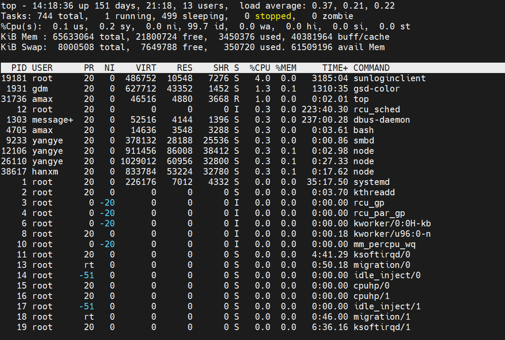

## 输出解析

### 第一行

| 14:18:36                       | 系统当前时间                                                 |
| ------------------------------ | ------------------------------------------------------------ |
| up 151 days, 21:18             | 系统运行时间为 151 天 21 小时 18 分钟                        |
| 13 users                       | 当前登录用户数                                               |
| load average: 0.37, 0.21, 0.22 | CPU 负载，即任务队列的平均长度。 三个数值分别为 1 分钟、5 分钟、15 分钟前到现在的平均值。 |

### 第二行

进程信息汇总

| Tasks: 744 total | 进程总数         |
| ---------------- | ---------------- |
| 1 running        | 正在运行的进程数 |
| 499 sleeping     | 睡眠的进程数     |
| 0 stopped        | 停止的进程数     |
| 0 zombie         | 僵尸进程数       |

### 第三行

CPU 使用率

| %Cpu(s):  0.1 us, | 用户空间占用 CPU 百分比                       |
| ----------------- | --------------------------------------------- |
| 0.2 sy            | 内核空间占用 CPU 百分比                       |
| 0.0 ni            | 用户进程空间内改变过优先级的进程占用CPU百分比 |
| 99.7 id           | 空闲 CPU 百分比                               |
| 0.0 wa            | 等待输入输出的CPU时间百分比                   |
| 0.0 hi            | hardware IRQ，硬中断占用 CPU 时间百分比       |
| 0.0 si            | software IRQ，软中断占用CPU的百分比           |
| 0.0 st            | Steal Time                                    |

### 第四行和第五行

内存占用情况

| KiB Mem : 65633064 total, | 物理内存总量                                                 |
| ------------------------- | ------------------------------------------------------------ |
| 21800724 free,            | 空闲内存总量                                                 |
| 3450376 used,             | 使用的物理内存总量                                           |
| 40381964 buff/cache       | 用作内核缓存的内存量                                         |
| KiB Swap:  8000508 total, | 交换区总量                                                   |
| 7649788 free,             | 空闲交换区总量                                               |
| 350720 used               | 使用的交换区总量                                             |
| 61509196 avail Mem        | 缓冲的交换区总量。 内存中的内容被换出到交换区，而后又被换入到内存，但使用过的交换区尚未被覆盖， 该数值即为这些**内容已存在于内存中**的交换区的大小。相应的内存再次被换出时可不必再对交换区写入。 |

### 第六行

剩余的为进程详细信息

| PID     | 进程 ID 号                                                   |
| ------- | ------------------------------------------------------------ |
| USER    | 进程所有者的用户名                                           |
| PR      | 进程优先级                                                   |
| NI      | nice 值，负值表示高优先级，正值表示低优先级                  |
| VIRT    | 进程使用的虚拟内存总量，单位kb。VIRT = SWAP + RES            |
| RES     | 进程使用的、未被换出的物理内存大小，单位 kb。RES = CODE + DATA |
| SHR     | 共享内存大小，单位 kb                                        |
| S       | 进程状态。D=不可中断的睡眠状态，R=运行，S=睡眠，T=跟踪/停止，Z=僵尸进程 |
| %CPU    | 上次更新到现在的 CPU 时间占用百分比                          |
| %MEM    | 进程使用的物理内存百分比                                     |
| TIME+   | 进程使用的 CPU 时间总计，单位 1/100 秒                       |
| COMMAND | 启动进程对应的命令                                           |

## 命令方法

### 快捷方式

运行 top 之后，可以按下边对应的字母（区分大小写）进行一些功能的切换

- h 或者?  : 显示帮助画面，给出一些简短的命令总结说明。
- i：忽略闲置和僵死进程。这是一个开关式命令。
- c：  切换显示命令名称和完整命令行。 显示完整的命令。 
- M ： 根据驻留内存大小进行排序。
- P：根据CPU使用百分比大小进行排序。
- T： 根据时间/累计时间进行排序。
- k  ：终止一个进程。系统将提示用户输入需要终止的进程PID，以及需要发送给该进程什么样的信号。一般的终止进程可以使用15信号；如果不能正常结束那就使用信号9强制结束该进程。默认值是信号15。在安全模式中此命令被屏蔽。
- q：  退出程序。
- r：  重新安排一个进程的优先级别。系统提示用户输入需要改变的进程PID以及需要设置的进程优先级值。输入一个正值将使优先级降低，反之则可以使该进程拥有更高的优先权。默认值是10。
- S：切换到累计模式。
- s :  改变两次刷新之间的延迟时间。系统将提示用户输入新的时间，单位为s。如果有小数，就换算成ms。输入0值则系统将不断刷新，默认值是5 s。需要注意的是如果设置太小的时间，很可能会引起不断刷新，从而根本来不及看清显示的情况，而且系统负载也会大大增加。
- f 或者 F :从当前显示中添加或者删除项目。
- o 或者 O  :改变显示项目的顺序。
- l: 切换显示平均负载和启动时间信息。即显示影藏第一行
- m： 切换显示内存信息。即显示影藏内存行
- t ： 切换显示进程和CPU状态信息。即显示影藏CPU行
- W：  将当前设置写入~/.toprc文件中。

### 命令行参数

- -hv ：输出帮助信息以及版本信息
- -bcHiOSs：输出一些关键字
- -d：调整输出刷新间隔，单位为秒
- -n：指定更新次数
- **-u：监控指定用户的进程**
- **-p：监控指定进程**
- -o：指定通过哪些字段进行排序，如内存、CPU等
- -w：输出的宽度

