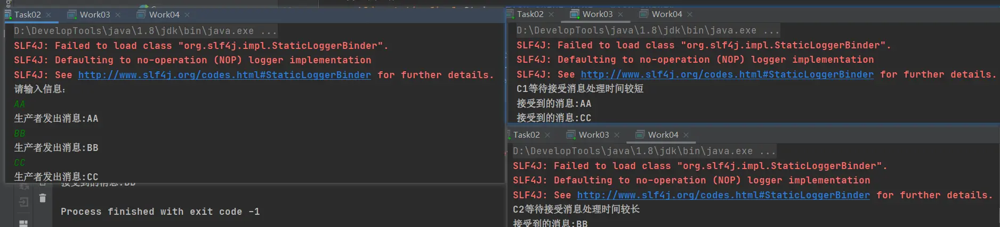
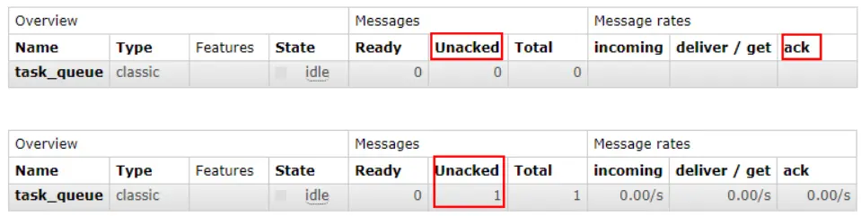
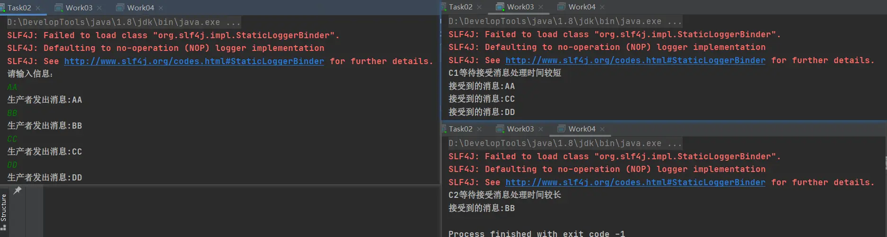
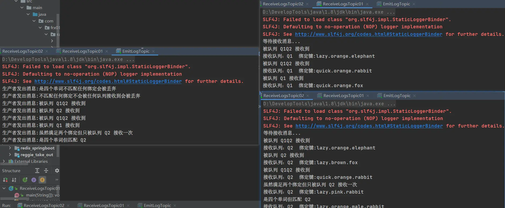
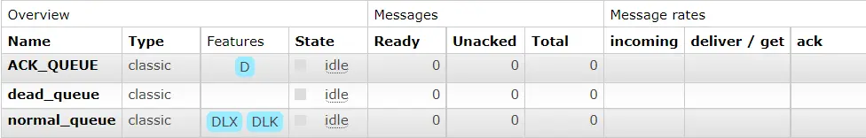
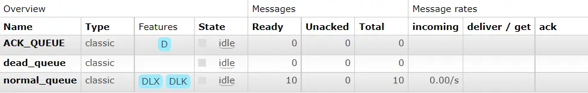
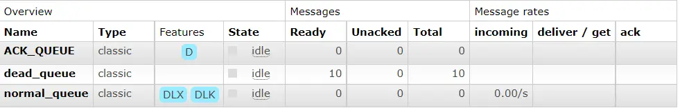
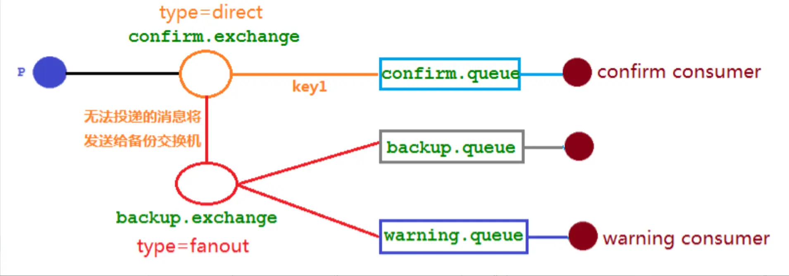

## MQ的分类

1. ActiveMQ

   优点：单机吞吐量万级，时效性 ms 级，可用性高，基于主从架构实现高可用性，消息可靠性较

   低的概率丢失数据。

   缺点:官方社区现在对 ActiveMQ 5.x 维护越来越少，高吞吐量场景较少使用。

2. RabbitMQ

   优点:由于 erlang 语言的高并发特性，性能较好；吞吐量到万级，MQ 功能比较完备,健壮、稳定、易
   用、跨平台、支持多种语言 如：Python、Ruby、.NET、Java、JMS、C、PHP、ActionScript、XMPP、STOMP
   等，支持 AJAX 文档齐全；开源提供的管理界面非常棒，用起来很好用,社区活跃度高；更新频率相当高。

   缺点：商业版需要收费,学习成本较高。

3. Kafka

   优点: 性能卓越，单机写入 TPS 约在百万条/秒，最大的优点，就是吞吐量高。时效性 ms 级可用性非
   常高，kafka 是分布式的，一个数据多个副本，少数机器宕机，不会丢失数据，不会导致不可用,消费者采
   用 Pull 方式获取消息, 消息有序, 通过控制能够保证所有消息被消费且仅被消费一次;有优秀的第三方Kafka
   Web 管理界面 Kafka-Manager；在日志领域比较成熟，被多家公司和多个开源项目使用；功能支持： 功能
   较为简单，主要支持简单的 MQ 功能，在大数据领域的实时计算以及日志采集被大规模使用。

   缺点：Kafka 单机超过 64 个队列/分区，Load 会发生明显的飙高现象，队列越多，load 越高，发送消
   息响应时间变长，使用短轮询方式，实时性取决于轮询间隔时间，消费失败不支持重试；支持消息顺序，
   但是一台代理宕机后，就会产生消息乱序，社区更新较慢。

3. RocketMQ

   优点:单机吞吐量十万级,可用性非常高，分布式架构,消息可以做到 0 丢失,MQ 功能较为完善，还是分
   布式的，扩展性好,支持 10 亿级别的消息堆积，不会因为堆积导致性能下降,源码是 java 我们可以自己阅
   读源码，定制自己公司的 MQ。

   缺点：支持的客户端语言不多，目前是 java 及 c++，其中 c++不成熟；社区活跃度一般,没有在MQ
   核心中去实现 JMS 等接口,有些系统要迁移需要修改大量代码。

## MQ的选择

1. RabbitMQ

   结合 erlang 语言本身的并发优势，性能好时效性微秒级，社区活跃度也比较高，管理界面用起来十分
   方便，如果你的数据量没有那么大，中小型公司优先选择功能比较完备的 RabbitMQ。

2. Kafka

   Kafka 主要特点是基于Pull 的模式来处理消息消费，追求高吞吐量，一开始的目的就是用于日志收集
   和传输，适合产生大量数据的互联网服务的数据收集业务。大型公司建议可以选用，如果有日志采集功能，
   肯定是首选 kafka 了。

3. RocketMQ

   天生为金融互联网领域而生，对于可靠性要求很高的场景，尤其是电商里面的订单扣款，以及业务削
   峰，在大量交易涌入时，后端可能无法及时处理的情况。RoketMQ 在稳定性上可能更值得信赖，这些业务
   场景在阿里双 11 已经经历了多次考验，如果你的业务有上述并发场景，建议可以选择 RocketMQ。

| 特性              | ActiveMQ     | RabbitMQ               | Kafka                | RocketMQ       |
| ----------------- | ------------ | ---------------------- | -------------------- | -------------- |
| 所属社区/公司     | Apache       | Mozilla Public License | Apache               | Apache/Ali     |
| 成熟度            | 成熟         | 成熟                   | 成熟                 | 比较成熟       |
| 生产者-消费者模式 | 支持         | 支持                   | 支持                 | 支持           |
| 发布-订阅         | 支持         | 支持                   | 支持                 | 支持           |
| REQUEST-REPLY     | 支持         | 支持                   | -                    | 支持           |
| API完备性         | 高           | 高                     | 高                   | 低（静态配置） |
| 多语言支持        | 支持JAVA优先 | 语言无关               | 支持，JAVA优先       | 支持           |
| 单机呑吐量        | 万级（最差） | 万级                   | **十万级**           | 十万级（最高） |
| 消息延迟          | -            | 微秒级                 | **毫秒级**           | -              |
| 可用性            | 高（主从）   | 高（主从）             | **非常高（分布式）** | 高             |
| 消息丢失          | -            | 低                     | **理论上不会丢失**   | -              |
| 消息重复          | -            | 可控制                 | 理论上会有重复       | -              |
| 事务              | 支持         | 不支持                 | 支持                 | 支持           |
| 文档的完备性      | 高           | 高                     | 高                   | 中             |
| 提供快速入门      | 有           | 有                     | 有                   | 无             |
| 首次部署难度      | -            | 低                     | 中                   | 高             |

## RabbitMQ

**名词介绍**

1. Broker：接收和分发消息的应用，RabbitMQ Server 就是 Message Broker
2. Virtual host：出于多租户和安全因素设计的，把 AMQP 的基本组件划分到一个虚拟的分组中，类似
   于网络中的 namespace 概念。当多个不同的用户使用同一个 RabbitMQ server 提供的服务时，可以划分出
   多个 vhost，每个用户在自己的 vhost 创建 exchange／queue 等
3. Connection：publisher／consumer 和 broker 之间的 TCP 连接
4. Channel：如果每一次访问 RabbitMQ 都建立一个 Connection，在消息量大的时候建立 TCP
   Connection 的开销将是巨大的，效率也较低。Channel 是在 connection 内部建立的逻辑连接，如果应用程
   序支持多线程，通常每个 thread 创建单独的 channel 进行通讯，AMQP method 包含了 channel id 帮助客
   户端和 message broker 识别 channel，所以 channel 之间是完全隔离的。Channel 作为轻量级的
   Connection 极大减少了操作系统建立 TCP connection 的开销
5. Exchange：message 到达 broker 的第一站，根据分发规则，匹配查询表中的 routing key，分发
   消息到 queue 中去。常用的类型有：direct (point-to-point 点对点), topic (publish-subscribe 发布订阅) and fanout(multicast 广播)
6. Queue：消息最终被送到这里等待 consumer 取走
7. Binding：exchange 和 queue 之间的虚拟连接，binding 中可以包含 routing key，Binding 信息被保
   存到 exchange 中的查询表中，用于 message 的分发依据

**工作队列**

Work Queues 工作队列(又称任务队列)的主要思想是避免立即执行资源密集型任务，而不得不等待它完成。相反我们安排任务在之后执行。我们把任务封装为消息并将其发送到队列。在后台运行的工作进程将弹出任务并最终执行作业。当有多个工作线程时，这些工作线程将一起处理这些任务。

### 消息应答

消费者完成一个任务可能需要一段时间，如果其中一个消费者处理一个长的任务并仅只完成了部分突然它挂掉了，会发生什么情况。RabbitMQ 一旦向消费者传递了一条消息，便立即将该消息标记为删除。在这种情况下，突然有个消费者挂掉了，我们将丢失正在处理的消息。以及后续发送给该消费这的消息，因为它无法接收到。为了保证消息在发送过程中不丢失，rabbitmq 引入消息应答机制，消息应答就是:消费者在接收到消息并且处理该消息之后，告诉 rabbitmq 它已经处理了，rabbitmq 可以把该消息删除了。

#### 自动应答

消息发送后立即被认为已经传送成功，这种模式需要在高吞吐量和数据传输安全性方面做权
衡,因为这种模式如果消息在接收到之前，消费者那边出现连接或者 channel 关闭，那么消息就丢失 了,当然另一方面这种模式消费者那边可以传递过载的消息，没有对传递的消息数量进行限制，当
然这样有可能使得消费者这边由于接收太多还来不及处理的消息，导致这些消息的积压，最终使
得内存耗尽，最终这些消费者线程被操作系统杀死，所以这种模式仅适用在消费者可以高效并以
某种速率能够处理这些消息的情况下使用。

**消息应答的方法**

1. Channel.basicAck(用于肯定确认)，RabbitMQ已知道该消息并且成功的处理消息，可以将其丢弃了
2. Channel.basicNack(用于否定确认)
3. Channel.basicReject(用于否定确认)，与 Channel.basicNack 相比少一个参数，不处理该消息了直接拒绝，可以将其丢弃了

**multiple的解释**

手动应答的好处是可以批量应答并且减少网络拥堵

multiple 的 true 和 false 代表不同意思

- true 代表批量应答 channel 上未应答的消息，比如说 channel 上有传送 tag 的消息 5,6,7,8 当前 tag 是8 那么此时，5-8 的这些还未应答的消息都会被确认收到消息应答
- false 同上面相比，只会应答 tag=8 的消息 5,6,7 这三个消息依然不会被确认收到消息应答

**消息自动重新入队**

如果消费者由于某些原因失去连接(其通道已关闭，连接已关闭或 TCP 连接丢失)，导致消息未发送 ACK 确认，RabbitMQ 将了解到消息未完全处理，并将对其重新排队。如果此时其他消费者可以处理，它将很快将其重新分发给另一个消费者。这样，即使某个消费者偶尔死亡，也可以确保不会丢失任何消息。

#### 手动应答

默认消息采用的是自动应答，所以我们要想实现消息消费过程中不丢失，需要把自动应答改为手动应答。

```java
// 生产者
public class Task02 {

    //队列名称
    public static final String TASK_QUEUE_NAME = "ACK_QUEUE";

    public static void main(String[] args) throws IOException, TimeoutException {
        Channel channel = RabbitMQUtils.getChannel();

        //声明队列
        channel.queueDeclare(TASK_QUEUE_NAME,false,false,false,null);
        //在控制台中输入信息
        Scanner scanner = new Scanner(System.in);
        System.out.println("请输入信息：");
        while (scanner.hasNext()){
            String message = scanner.next();
            channel.basicPublish("",TASK_QUEUE_NAME,null,message.getBytes("UTF-8"));
            System.out.println("生产者发出消息:"+ message);
        }
    }
}
```

```java
// 消费者1
public class Work03 {

    //队列名称
    public static final String TASK_QUEUE_NAME = "ACK_QUEUE";

    //接受消息
    public static void main(String[] args) throws IOException, TimeoutException {
        Channel channel = RabbitMQUtils.getChannel();
        System.out.println("C1等待接受消息处理时间较短");

        DeliverCallback deliverCallback =(consumerTag,message) ->{

            //沉睡1S
            SleepUtils.sleep(1);
            System.out.println("接受到的消息:"+new String(message.getBody(),"UTF-8"));
            //手动应答
            /**
             * 1.消息的标记Tag
             * 2.是否批量应答 false表示不批量应答信道中的消息
             */
            channel.basicAck(message.getEnvelope().getDeliveryTag(),false);

        };

        CancelCallback cancelCallback = (consumerTag -> {
            System.out.println(consumerTag + "消费者取消消费接口回调逻辑");

        });
        //采用手动应答
        boolean autoAck = false;
        channel.basicConsume(TASK_QUEUE_NAME,autoAck,deliverCallback,cancelCallback);
    }
}
```

```java
// 消费者2
public class Work03 {

    //队列名称
    public static final String TASK_QUEUE_NAME = "ACK_QUEUE";

    //接受消息
    public static void main(String[] args) throws IOException, TimeoutException {
        Channel channel = RabbitMQUtils.getChannel();
        System.out.println("C2等待接受消息处理时间较长");

        DeliverCallback deliverCallback =(consumerTag,message) ->{

            //沉睡10S
            SleepUtils.sleep(10);
            System.out.println("接受到的消息:"+new String(message.getBody(),"UTF-8"));
            //手动应答
            /**
             * 1.消息的标记Tag
             * 2.是否批量应答 false表示不批量应答信道中的消息
             */
            channel.basicAck(message.getEnvelope().getDeliveryTag(),false);

        };

        CancelCallback cancelCallback = (consumerTag -> {
            System.out.println(consumerTag + "消费者取消消费接口回调逻辑");

        });
        //采用手动应答
        boolean autoAck = false;
        channel.basicConsume(TASK_QUEUE_NAME,autoAck,deliverCallback,cancelCallback);
    }
}
```



当发送者发送消息 DD 到队列，此时是 second 来消费该消息，但是由于它处理时间较长，在还未处理完时间里停止运行，也就是说 second 还没有执行到 ack 代码的时候，second 被停掉了，此时会看到消息被 first 接收到了，说明消息 DD 被重新入队，然后分配给能处理消息的 first 处理了。





### 持久化

当 RabbitMQ 服务停掉以后，消息生产者发送过来的消息不丢失要如何保障？默认情况下 RabbitMQ 退出或由于某种原因崩溃时，它忽视队列和消息，除非告知它不要这样做。确保消息不会丢失需要做两件事：我们需要将队列和消息都标记为持久化。

#### 队列持久化

```java
//RabbitMQ 如果重启的话，非持久化的队列就会被删除掉，如果要队列实现持久化需要在声明队列的时候把 durable 参数设置为true，代表开启持久化，如果之前声明的队列不是持久化的，需要把原先队列先删除，或者重新创建一个持久化的队列
channel.queueDeclare(TASK_QUEUE_NAME,durable,false,false,null);
```

#### 消息持久化

```java
//需要在消息生产者发布消息的时候，开启消息的持久化
//设置生产者发送消息为持久化消息(要求保存到磁盘上)
channel.basicPublish("",TASK_QUEUE_NAME,MessageProperties.PERSISTENT_TEXT_PLAIN,message.getBytes("UTF-8"));
```

将消息标记为持久化并不能完全保证不会丢失消息。尽管它告诉 RabbitMQ 将消息保存到磁盘，但是这里依然存在当消息刚准备存储在磁盘的时候 但是还没有存储完，消息还在缓存的一个间隔点。此时并没 有真正写入磁盘。持久性保证并不强，但是对于我们的简单任务队列而言，这已经绰绰有余了。

### 不公平分发

比方说有两个消费者在处理任务，其中有个消费者 1 处理任务的速度非常快，而另外一个消费者 2 处理速度却很慢，这个时候我们还是采用轮询分发的化就会到这处理速度快的这个消费者很大一部分时间处于空闲状态，而处理慢的那个消费者一直在干活，这种分配方式在这种情况下其实就不太好，但是 RabbitMQ 并不知道这种情况它依然很公平的进行分发。

为了避免这种情况，在消费者中消费消息之前，设置参数 channel.basicQos(1);

```java
public class Work03 {

    //队列名称
    public static final String TASK_QUEUE_NAME = "ACK_QUEUE";

    //接受消息
    public static void main(String[] args) throws IOException, TimeoutException {
        Channel channel = RabbitMQUtils.getChannel();
        System.out.println("C1等待接受消息处理时间较短");

        DeliverCallback deliverCallback =(consumerTag,message) ->{

            //沉睡1S
            SleepUtils.sleep(1);
            System.out.println("接受到的消息:"+new String(message.getBody(),"UTF-8"));
            //手动应答
            /**
             * 1.消息的标记Tag
             * 2.是否批量应答 false表示不批量应答信道中的消息
             */
            channel.basicAck(message.getEnvelope().getDeliveryTag(),false);

        };

        CancelCallback cancelCallback = (consumerTag -> {
            System.out.println(consumerTag + "消费者取消消费接口回调逻辑");

        });
        //设置不公平分发
        int prefetchCount = 1;
        channel.basicQos(prefetchCount);
        //采用手动应答
        boolean autoAck = false;
        channel.basicConsume(TASK_QUEUE_NAME,autoAck,deliverCallback,cancelCallback);
    }
}
```

不公平分发思想：如果一个工作队列还没有处理完或者没有应答签收一个消息，则不拒绝 RabbitMQ 分配新的消息到该工作队列。此时 RabbitMQ 会优先分配给其他已经处理完消息或者空闲的工作队列。如果所有的消费者都没有完成手上任务，队列还在不停的添加新任务，队列有可能就会遇到队列被撑满的情况，这个时候就只能添加新的 worker (工作队列)或者改变其他存储任务的策略。

### 预取值分发

带权的消息分发。

默认消息的发送是异步发送的，所以在任何时候，channel 上不止只有一个消息来自消费者的手动确认，所以本质上是异步的。因此这里就存在一个未确认的消息缓冲区，因此希望开发人员能限制此缓冲区的大小，以避免缓冲区里面无限制的未确认消息问题。这个时候就可以通过使用 basic.qos 方法设置「预取计数」值来完成的。

该值定义通道上允许的未确认消息的最大数量。一旦数量达到配置的数量， RabbitMQ 将停止在通道上传递更多消息，除非至少有一个未处理的消息被确认，例如，假设在通道上有未确认的消息 5、6、7，8，并且通道的预取计数设置为 4，此时 RabbitMQ 将不会在该通道上再传递任何消息，除非至少有一个未应答的消息被 ack。比方说 tag=6 这个消息刚刚被确认 ACK，RabbitMQ 将会感知这个情况到并再发送一条消息。消息应答和 QoS 预取值对用户吞吐量有重大影响。

通常，增加预取将提高向消费者传递消息的速度。虽然自动应答传输消息速率是最佳的，但是，在这种情况下已传递但尚未处理的消息的数量也会增加，从而增加了消费者的 RAM 消耗(随机存取存储器)应该小心使用具有无限预处理的自动确认模式或手动确认模式，消费者消费了大量的消息如果没有确认的话，会导致消费者连接节点的内存消耗变大，所以找到合适的预取值是一个反复试验的过程，不同的负载该值取值也不同 100 到 300 范围内的值通常可提供最佳的吞吐量，并且不会给消费者带来太大的风险。

预取值为 1 是最保守的。当然这将使吞吐量变得很低，特别是消费者连接延迟很严重的情况下，特别是在消费者连接等待时间较长的环境 中。对于大多数应用来说，稍微高一点的值将是最佳的。

**不公平分发和预取值分发都用到 basic.qos 方法，如果取值为 1，代表不公平分发，取值不为1，代表预取值分发。**

### 发布确认

生产者将信道设置成 confirm 模式，一旦信道进入 confirm 模式，所有在该信道上面发布的消息都将会被指派一个唯一的 ID(从 1 开始)，一旦消息被投递到所有匹配的队列之后，broker 就会发送一个确认给生产者(包含消息的唯一 ID)，这就使得生产者知道消息已经正确到达目的队列了，如果消息和队列是可持久化的，那么确认消息会在将消息写入磁盘之后发出，broker 回传给生产者的确认消息中 delivery-tag 域包含了确认消息的序列号，此外 broker 也可以设置 basic.ack 的 multiple 域，表示到这个序列号之前的所有消息都已经得到了处理。

confirm 模式最大的好处在于是异步的，一旦发布一条消息，生产者应用程序就可以在等信道返回确认的同时继续发送下一条消息，当消息最终得到确认之后，生产者应用便可以通过回调方法来处理该确认消息，如果RabbitMQ 因为自身内部错误导致消息丢失，就会发送一条 nack 消息， 生产者应用程序同样可以在回调方法中处理该 nack 消息。

```java
//发布确认默认是没有开启的，如果要开启需要调用方法 confirmSelect，每当你要想使用发布确认，都需要在 channel 上调用该方法
//开启发布确认
channel.confirmSelect();
```

#### 单个确认发布

这是一种简单的确认方式，它是一种同步确认发布的方式，也就是发布一个消息之后只有它被确认发布，后续的消息才能继续发布，waitForConfirmsOrDie(long) 这个方法只有在消息被确认的时候才返回，如果在指定时间范围内这个消息没有被确认那么它将抛出异常。

这种确认方式有一个最大的缺点就是：发布速度特别的慢，因为如果没有确认发布的消息就会阻塞所有后续消息的发布，这种方式最多提供每秒不超过数百条发布消息的吞吐量。当然对于某些应用程序来说这可能已经足够了。

```java
public class ConfirmMessage {

    //单个发消息的个数
    public static final int MESSAGE_COUNT = 1000; //Ctrl+Shift+U 变大写

    public static void main(String[] args) throws InterruptedException, TimeoutException, IOException {
        publishMessageIndividually();//发布1000个单独确认消息，耗时:599ms
    }
    //单个确认
    public static void publishMessageIndividually() throws IOException, TimeoutException, InterruptedException {
        Channel channel = RabbitMQUtils.getChannel();
        //队列的声明
        String queueName = UUID.randomUUID().toString();
        channel.queueDeclare(queueName,false,true,false,null);

        //开启发布确认
        channel.confirmSelect();
        //开始时间
        long begin = System.currentTimeMillis();

        //批量发消息
        for (int i = 0; i < 1000; i++) {
            String message = i+"";
            channel.basicPublish("",queueName,null,message.getBytes());
            //单个消息就马上进行发布确认
            boolean flag = channel.waitForConfirms();
            if(flag){
                System.out.println("消息发送成功");
            }
        }
        //结束时间
        long end = System.currentTimeMillis();
        System.out.println("发布"+MESSAGE_COUNT+"个单独确认消息，耗时:"+(end-begin)+"ms");
        
    }
}
```

**确认发布指的是成功发送到了队列，并不是消费者消费了消息。**

#### 批量确认发布

单个确认发布方式非常慢，与单个等待确认消息相比，先发布一批消息然后一起确认可以极大地提高吞吐量，当然这种方式的缺点就是：当发生故障导致发布出现问题时，不知道是哪个消息出问题了，我们必须将整个批处理保存在内存中，以记录重要的信息而后重新发布消息。当然这种方案仍然是同步的，也一样阻塞消息的发布。

```java
public class ConfirmMessage2 {

    //批量发消息的个数
    public static final int MESSAGE_COUNT = 1000; //Ctrl+Shift+U 变大写

    public static void main(String[] args) throws InterruptedException, TimeoutException, IOException {
        publishMessageBatch(); //发布1000个批量确认消息，耗时:111ms
    }

    //批量发布确认
    public static void publishMessageBatch() throws IOException, TimeoutException, InterruptedException {
        Channel channel = RabbitMQUtils.getChannel();
        //队列的声明
        String queueName = UUID.randomUUID().toString();
        channel.queueDeclare(queueName, false, true, false, null);

        //开启发布确认
        channel.confirmSelect();
        //开始时间
        long begin = System.currentTimeMillis();

        //批量确认消息大小
        int batchSize =100;

        //批量发送消息，批量发布确认
        for (int i = 0; i < MESSAGE_COUNT; i++) {
            String message=i+"";
            channel.basicPublish("",queueName,null,message.getBytes());

            //判断达到100条消息的时候，批量确认一次
            if((i+1)%batchSize==0){
                //发布确认
                channel.waitForConfirms();
            }
        }
        //结束时间
        long end = System.currentTimeMillis();
        System.out.println("发布"+MESSAGE_COUNT+"个批量确认消息，耗时:"+(end-begin)+"ms");
    }
}
```

#### 异步发布确认

异步确认虽然编程逻辑比上两个要复杂，但是性价比最高，无论是可靠性还是效率都很好，利用了回调函数来达到消息可靠性传递的，也是通过函数回调来保证是否投递成功。

```java
public class ConfirmMessage3 {

    public static final int MESSAGE_COUNT = 1000; //Ctrl+Shift+U 变大写
    
    public static void main(String[] args) throws Exception {
        publishMessageAsync(); //发布1000个异步发布确认消息，耗时:43ms
    }

    //异步发布确认
    public static void publishMessageAsync() throws Exception{

        Channel channel = RabbitMQUtils.getChannel();
        //队列的声明
        String queueName = UUID.randomUUID().toString();
        channel.queueDeclare(queueName, false, true, false, null);

        //开启发布确认
        channel.confirmSelect();
        //开始时间
        long begin = System.currentTimeMillis();

        //消息确认回调的函数
        ConfirmCallback ackCallback = (deliveryTag,multiple) ->{
            System.out.println("确认的消息:"+deliveryTag);
        };
        /**
         * 1.消息的标记
         * 2.是否为批量确认
         */
        //消息确认失败回调函数
        ConfirmCallback nackCallback= (deliveryTag,multiple) ->{
            System.out.println("未确认的消息:"+deliveryTag);
        };

        //准备消息的监听器 监听那些消息成功了，哪些消息失败了
        /**
         * 1.监听哪些消息成功了
         * 2.监听哪些消息失败了
         */
        channel.addConfirmListener(ackCallback,nackCallback);//异步通知

        //批量发送消息
        for (int i = 0; i < MESSAGE_COUNT; i++) {
            String message=i+"消息";
            channel.basicPublish("",queueName,null,message.getBytes());
        }

        //结束时间
        long end = System.currentTimeMillis();
        System.out.println("发布"+MESSAGE_COUNT+"个异步发布确认消息，耗时:"+(end-begin)+"ms");
    }
}
```

**如何处理异步未确认消息？**

最好的解决的解决方案就是把未确认的消息放到一个基于内存的能被发布线程访问的队列，比如说用 ConcurrentLinkedQueue 这个队列在 confirm callbacks 与发布线程之间进行消息的传递。

```java
public class ConfirmMessage3 {

    public static final int MESSAGE_COUNT = 1000; //Ctrl+Shift+U 变大写
    
    public static void main(String[] args) throws Exception {
        publishMessageAsync(); //发布1000个异步发布确认消息，耗时:43ms
    }

    //异步发布确认
    public static void publishMessageAsync() throws Exception{

        Channel channel = RabbitMQUtils.getChannel();
        //队列的声明
        String queueName = UUID.randomUUID().toString();
        channel.queueDeclare(queueName, false, true, false, null);

        //开启发布确认
        channel.confirmSelect();

        /**
         * 线程安全有序的一个哈希表，适用于高并发的情况下
         * 1.轻松的将序号与消息进行关联
         * 2.轻松批量删除条目 只要给到序号
         * 3.支持高并发(多线程)
         */
        ConcurrentSkipListMap<Long,String> outstandingConfirms=
                new ConcurrentSkipListMap<>();

        //消息确认回调的函数
        ConfirmCallback ackCallback = (deliveryTag,multiple) ->{
            if(multiple) {
                //2.删除掉已经确认的消息 剩下的就是未确认的消息
                ConcurrentNavigableMap<Long, String> confirmed =
                        outstandingConfirms.headMap(deliveryTag);
                confirmed.clear();
            }else {
                outstandingConfirms.remove(deliveryTag);
            }
            System.out.println("确认的消息:" + deliveryTag);
        };
        /**
         * 1.消息的标记
         * 2.是否为批量确认
         */
        //消息确认失败回调函数
        ConfirmCallback nackCallback= (deliveryTag,multiple) ->{
            //3.打印一下未确认的消息都有哪些
            String message = outstandingConfirms.remove(deliveryTag);
            System.out.println("未确认的消息是:"+message+":::未确认的消息tag:"+deliveryTag);
        };

        //准备消息的监听器 监听那些消息成功了，哪些消息失败了
        /**
         * 1.监听哪些消息成功了
         * 2.监听哪些消息失败了
         */
        channel.addConfirmListener(ackCallback,nackCallback);//异步通知

        //开始时间
        long begin = System.currentTimeMillis();

        //批量发送消息
        for (int i = 0; i < MESSAGE_COUNT; i++) {
            String message=i+"消息";
            channel.basicPublish("",queueName,null,message.getBytes());
            //1.此处记录下所有要发送的消息 消息的总和
            outstandingConfirms.put(channel.getNextPublishSeqNo(),message);
        }

        //结束时间
        long end = System.currentTimeMillis();
        System.out.println("发布"+MESSAGE_COUNT+"个异步发布确认消息，耗时:"+(end-begin)+"ms");
    }
}

```

- 单独发布消息

  同步等待确认，简单，但吞吐量非常有限。

- 批量发布消息

  批量同步等待确认，简单，合理的吞吐量，一旦出现问题但很难推断出是那条消息出现了问题。

- 异步处理

  最佳性能和资源使用，在出现错误的情况下可以很好地控制，但是实现起来稍微难些

#### 应答和发布区别

应答功能属于消费者，消费完消息告诉 RabbitMQ 已经消费成功。

发布功能属于生产者，生产消息到 RabbitMQ，RabbitMQ 需要告诉生产者已经收到消息。

### 交换机

#### Exchange

RabbitMQ 消息传递模型的核心思想是: 生产者生产的消息从不会直接发送到队列。实际上，通常生产者甚至都不知道这些消息传递传递到了哪些队列中。

相反，生产者只能将消息发送到交换机(exchange)，交换机工作的内容非常简单，一方面它接收来自生产者的消息，另一方面将它们推入队列。交换机必须确切知道如何处理收到的消息。是应该把这些消息放到特定队列还是说把他们到许多队列中还是说应该丢弃它们。这就的由交换机的类型来决定。

#### Exchange的类型

- 直接(direct)：处理路由键。需要将一个队列绑定到交换机上，要求该消息与一个特定的路由键完全匹配。这是一个完整的匹配。如果一个队列绑定到该交换机上要求路由键 abc ，则只有被标记为 abc 的消息才被转发，不会转发 abc.def，也不会转发 dog.ghi，只会转发 abc。

- 主题(topic)：将路由键和某模式进行匹配。此时队列需要绑定要一个模式上。符号“#”匹配一个或多个词，符号 * 匹配不多不少一个词。因此 abc.# 能够匹配到 abc.def.ghi，但是 abc.* 只会匹配到 abc.def。

- 标题(headers)：不处理路由键。而是根据发送的消息内容中的headers属性进行匹配。在绑定 Queue 与 Exchange 时指定一组键值对；当消息发送到RabbitMQ 时会取到该消息的 headers 与 Exchange 绑定时指定的键值对进行匹配；如果完全匹配则消息会路由到该队列，否则不会路由到该队列。headers 属性是一个键值对，可以是 Hashtable，键值对的值可以是任何类型。而 fanout，direct，topic 的路由键都需要要字符串形式的。

  匹配规则 x-match 有下列两种类型：
  x-match = all ：表示所有的键值对都匹配才能接受到消息
  x-match = any ：表示只要有键值对匹配就能接受到消息

- 扇出(fanout)：不处理路由键。你只需要简单的将队列绑定到交换机上。一个发送到交换机的消息都会被转发到与该交换机绑定的所有队列上。很像子网广播，每台子网内的主机都获得了一份复制的消息。Fanout 交换机转发消息是最快的。

**默认exchange**

通过空字符串("")进行标识的交换机是默认交换。

```java
channel.basicPublish("", TASK_QUEUE_NAME, null, message.getBytes("UTF-8"));
```

第一个参数是交换机的名称。空字符串 表示默认或无名称交换机：消息能路由发送到队列中其实是由 routingKey(bindingkey) 绑定指定的 key。

#### 临时队列

每当我们连接到 Rabbit 时，我们都需要一个全新的空队列，为此我们可以创建一个具有**随机名称的队列**，或者能让服务器为我们选择一个随机队列名称那就更好了。其次一旦我们断开了消费者的连接，队列将被自动删除。

```java
String queueName = channel.queueDeclare().getQueue();

```

#### 绑定bindings

binding 是 exchange 和 queue 之间的桥梁，它告诉我们 exchange 和那个队列进行了绑定关系。也可以这么理解： **队列只对它绑定的交换机的消息感兴趣**。绑定用参数：routingKey 来表示也可称该参数为 binding key， 创建绑定我们用代码:channel.queueBind(queueName, EXCHANGE_NAME, "routingKey");

绑定之后的意义由其交换类型决定。

#### Fanout实战

```java
//消费者1
public class ReceiveLogs01 {

    //交换机名称
    private static  final String EXCHANGE_NAME = "logs";

    public static void main(String[] args) throws IOException, TimeoutException {
        Channel channel = RabbitMQUtils.getChannel();
        //声明一个交换机
        channel.exchangeDeclare(EXCHANGE_NAME,"fanout");
        //声明一个队列 临时队列
        /**
         * 生成一个临时的队列，队列的名称是随机的
         * 当消费者断开与队列的连接的时候 队列就自动删除
         */
        String queueName = channel.queueDeclare().getQueue();
        /**
         * 绑定交换机与队列
         */
        channel.queueBind(queueName,EXCHANGE_NAME,"");
        System.out.println("等待接收消息，把接收到的消息打印在屏幕上...");
        //接收消息
        //消费者取消消息时回调接口
        DeliverCallback deliverCallback = (consumerTag,message) ->{
            System.out.println("控制台打印接收到的消息:"+new String(message.getBody(),"UTF-8"));
        };
        channel.basicConsume(queueName,true,deliverCallback,consumerTag -> {});
    }
}

```

```java
//负责进行发消息给交换机

public class EmitLog {

    //交换机名称
    public static final String EXCHANGE_NAME = "logs";

    public static void main(String[] args) throws IOException, TimeoutException {
        Channel channel = RabbitMQUtils.getChannel();
        /**
         * 声明一个exchange
         * 1.exchange的名称
         * 2.exchange的类型
         */
        channel.exchangeDeclare(EXCHANGE_NAME,"fanout");
        Scanner scanner = new Scanner(System.in);
        while (scanner.hasNext()){
            String message = scanner.next();
            channel.basicPublish(EXCHANGE_NAME,"",null,message.getBytes("UTF-8"));
            System.out.println("生产者发出消息:"+message);
        }
    }
}

```

#### Direct实战

direct 这种类型的工作方式是，消息只去到它绑定的 routingKey 队列中去。如果 exchange 的绑定类型是direct，**但是它绑定的多个队列的 key 如果都相同**，在这种情况下虽然绑定类型是 direct **但是它表现的就和 fanout 有点类似了**，就跟广播差不多

```java
public class DirectLogs {

    //交换机名称
    public static final String EXCHANGE_NAME = "direct_logs";

    public static void main(String[] args) throws IOException, TimeoutException {
        Channel channel = RabbitMQUtils.getChannel();


        Scanner scanner = new Scanner(System.in);
        while (scanner.hasNext()){
            String message = scanner.next();
            channel.basicPublish(EXCHANGE_NAME,"info",null,message.getBytes("UTF-8"));
            System.out.println("生产者发出消息:"+message);
        }
    }
}

```

```java
public class ReceiveLogsDirect01 {

    public static final String EXCHANGE_NAME="direct_logs";

    public static void main(String[] args) throws IOException, TimeoutException {
        Channel channel = RabbitMQUtils.getChannel();
        //声明一个direct交换机
        channel.exchangeDeclare(EXCHANGE_NAME, BuiltinExchangeType.DIRECT);
        //声明一个队列
        channel.queueDeclare("console",false,false,false,null);
        channel.queueBind("console",EXCHANGE_NAME,"info");
        channel.queueBind("console",EXCHANGE_NAME,"warning");
        //接收消息
        DeliverCallback deliverCallback = (consumerTag,message) -> {
          System.out.println("ReceiveLogsDirect01控制台打印接收到的消息:"+new String(message.getBody(),"UTF-8"));
        };
        //消费者取消消息时回调接口
        channel.basicConsume("console",true,deliverCallback,consumerTag -> {});

    }
}

```

```java
public class ReceiveLogsDirect02 {

    public static final String EXCHANGE_NAME="direct_logs";

    public static void main(String[] args) throws IOException, TimeoutException {
        Channel channel = RabbitMQUtils.getChannel();
        //声明一个direct交换机
        channel.exchangeDeclare(EXCHANGE_NAME, BuiltinExchangeType.DIRECT);
        //声明一个队列
        channel.queueDeclare("disk",false,false,false,null);
        channel.queueBind("disk",EXCHANGE_NAME,"error");

        //接收消息
        DeliverCallback deliverCallback = (consumerTag,message) -> {
          System.out.println("ReceiveLogsDirect02控制台打印接收到的消息:"+new String(message.getBody(),"UTF-8"));
        };
        //消费者取消消息时回调接口
        channel.basicConsume("disk",true,deliverCallback,consumerTag -> {});

    }
}

```

#### Topic实战

发送到类型是 topic 交换机的消息的 routing_key 不能随意写，必须满足一定的要求，它必须是**一个单词列表**，**以点号分隔开**。这些单词可以是任意单词，最多不能超过 255 个字节。

- ***(星号)可以代替一个位置**
- **#(井号)可以替代零个或多个位置**

当一个队列绑定键是 #，那么这个队列将接收所有数据，就有点像 fanout 了

如果队列绑定键当中没有 # 和 * 出现，那么该队列绑定类型就是 direct 了

```java
public class EmitLogTopic {

    //交换机的名称
    public static final String EXCHANGE_NAME = "topic_logs";

    public static void main(String[] args) throws IOException, TimeoutException {
        Channel channel = RabbitMQUtils.getChannel();
        /**
         * Q1-->绑定的是
         *      中间带 orange 带 3 个单词的字符串(*.orange.*)
         * Q2-->绑定的是
         *      最后一个单词是 rabbit 的 3 个单词(*.*.rabbit)
         *      第一个单词是 lazy 的多个单词(lazy.#)
         */
        HashMap<String, String> bindingKeyMap = new HashMap<>();
        bindingKeyMap.put("quick.orange.rabbit", "被队列 Q1Q2 接收到");
        bindingKeyMap.put("lazy.orange.elephant", "被队列 Q1Q2 接收到");
        bindingKeyMap.put("quick.orange.fox", "被队列 Q1 接收到");
        bindingKeyMap.put("lazy.brown.fox", "被队列 Q2 接收到");
        bindingKeyMap.put("lazy.pink.rabbit", "虽然满足两个绑定但只被队列 Q2 接收一次");
        bindingKeyMap.put("quick.brown.fox", "不匹配任何绑定不会被任何队列接收到会被丢弃");
        bindingKeyMap.put("quick.orange.male.rabbit", "是四个单词不匹配任何绑定会被丢弃");
        bindingKeyMap.put("lazy.orange.male.rabbit", "是四个单词但匹配 Q2");
        for (Map.Entry<String,String> bindingKeyEntry : bindingKeyMap.entrySet()){
            String routingKey = bindingKeyEntry.getKey();
            String message = bindingKeyEntry.getValue();

            channel.basicPublish(EXCHANGE_NAME,routingKey,null,message.getBytes("UTF-8"));
            System.out.println("生产者发出消息:"+message);
        }
    }
}

```

```java
public class ReceiveLogsTopic01 {

    //交换机的名称
    public static final String EXCHANGE_NAME = "topic_logs";

    //接收消息
    public static void main(String[] args) throws IOException, TimeoutException {
        Channel channel = RabbitMQUtils.getChannel();
        //声明交换机
        channel.exchangeDeclare(EXCHANGE_NAME, BuiltinExchangeType.TOPIC);
        //声明队列
        String queueName = "Q1";
        channel.queueDeclare(queueName,false,false,false,null);
        channel.queueBind(queueName,EXCHANGE_NAME,"*.orange.*");
        System.out.println("等待接收消息...");

        DeliverCallback deliverCallback = (consumerTag,message) -> {
            System.out.println(new String(message.getBody(),"UTF-8"));
            System.out.println("接收队列："+queueName+"  绑定键:"+message.getEnvelope().getRoutingKey());
        };
        //接收消息
        channel.basicConsume(queueName,true,deliverCallback,consumerTag ->{});
    }
}

```

```java
public class ReceiveLogsTopic02 {

    //交换机的名称
    public static final String EXCHANGE_NAME = "topic_logs";

    //接收消息
    public static void main(String[] args) throws IOException, TimeoutException {
        Channel channel = RabbitMQUtils.getChannel();
        //声明交换机
        channel.exchangeDeclare(EXCHANGE_NAME, BuiltinExchangeType.TOPIC);
        //声明队列
        String queueName = "Q2";
        channel.queueDeclare(queueName,false,false,false,null);
        channel.queueBind(queueName,EXCHANGE_NAME,"*.*.rabbit");
        channel.queueBind(queueName,EXCHANGE_NAME,"lazy.#");

        System.out.println("等待接收消息...");
        
        DeliverCallback deliverCallback = (consumerTag,message) -> {
            System.out.println(new String(message.getBody(),"UTF-8"));
            System.out.println("接收队列："+queueName+"  绑定键:"+message.getEnvelope().getRoutingKey());
        };
        //接收消息
        channel.basicConsume(queueName,true,deliverCallback,consumerTag ->{});
    }
}

```



### 死信队列

死信，顾名思义就是无法被消费的消息，字面意思可以这样理解，一般来说，producer 将消息投递到 broker 或者直接到queue 里了，consumer 从 queue 取出消息 进行消费，但某些时候由于特定的原因**导致 queue 中的某些消息无法被消费**，这样的消息如果没有后续的处理，就变成了死信，有死信自然就有了死信队列。

**死信的来源**

- 消息TTL过期
- 队列达到最大长度
- 消息被拒绝

#### 消息TTL过期

```java
public class Producer {
    //普通交换机的名称
    public static final String NORMAL_EXCHANGE = "normal_exchange";

    public static void main(String[] args) throws IOException, TimeoutException {
        Channel channel = RabbitMQUtils.getChannel();

        //死信消息 设置ttl时间 live to time 单位是ms
        AMQP.BasicProperties properties =
                new AMQP.BasicProperties().builder().expiration("10000").build();
        for (int i = 1; i <11 ; i++) {
            String message = "info"+i;
            channel.basicPublish(NORMAL_EXCHANGE,"zhangsan",properties,message.getBytes());
        }
    }
}

```

```java
//启动之后关闭该消费者 模拟其接收不到消息
public class Consumer01 {

    //普通交换机的名称
    public static final String NORMAL_EXCHANGE = "normal_exchange";
    //死信交换机的名称
    public static final String DEAD_EXCHANGE = "dead_exchange";

    //普通队列的名称
    public static final String NORMAL_QUEUE = "normal_queue";
    //死信队列的名称
    public static final String DEAD_QUEUE = "dead_queue";

    public static void main(String[] args) throws IOException, TimeoutException {

        Channel channel = RabbitMQUtils.getChannel();

        //声明死信和普通交换机，类型为direct
        channel.exchangeDeclare(NORMAL_EXCHANGE, BuiltinExchangeType.DIRECT);
        channel.exchangeDeclare(DEAD_EXCHANGE, BuiltinExchangeType.DIRECT);

        //声明普通队列
        Map<String,Object> arguments = new HashMap<>();
        //过期时间 10s 由生产者指定 更加灵活
        //arguments.put("x-message-ttl",10000);
        //正常的队列设置死信交换机
        arguments.put("x-dead-letter-exchange",DEAD_EXCHANGE);//图中红箭头
        //设置死信routingKey
        arguments.put("x-dead-letter-routing-key","lisi");

        channel.queueDeclare(NORMAL_QUEUE,false,false,false,arguments);
        /////////////////////////////////////////////////////////////////////////
        //声明死信队列
        channel.queueDeclare(DEAD_QUEUE,false,false,false,null);

        //绑定普通的交换机与队列
        channel.queueBind(NORMAL_QUEUE,NORMAL_EXCHANGE,"zhangsan");

        //绑定死信的交换机与死信的队列
        channel.queueBind(DEAD_QUEUE,DEAD_EXCHANGE,"lisi");
        System.out.println("等待接收消息...");

        DeliverCallback deliverCallback = (consumerTag,message) ->{
            System.out.println("Consumer01接受的消息是："+new String(message.getBody(),"UTF-8"));
        };

        channel.basicConsume(NORMAL_QUEUE,true,deliverCallback,consumerTag -> {});
    }

}

```







```java
public class Consumer02 {

    //死信队列的名称
    public static final String DEAD_QUEUE = "dead_queue";

    public static void main(String[] args) throws IOException, TimeoutException {

        Channel channel = RabbitMQUtils.getChannel();

        System.out.println("等待接收死信消息...");

        DeliverCallback deliverCallback = (consumerTag, message) ->{
            System.out.println("Consumer02接受的消息是："+new String(message.getBody(),"UTF-8"));
        };

        channel.basicConsume(DEAD_QUEUE,true,deliverCallback,consumerTag -> {});
    }
}

```

#### 队列最大长度

```java
public class Producer {
    //普通交换机的名称
    public static final String NORMAL_EXCHANGE = "normal_exchange";

    public static void main(String[] args) throws IOException, TimeoutException {
        Channel channel = RabbitMQUtils.getChannel();

        //死信消息 设置ttl时间 live to time 单位是ms
        //AMQP.BasicProperties properties =
        //        new AMQP.BasicProperties().builder().expiration("10000").build();
        for (int i = 1; i <11 ; i++) {
            String message = "info"+i;
     		//消息生产者代码去掉 TTL 属性，basicPublish 的第三个参数改为 null       
            channel.basicPublish(NORMAL_EXCHANGE,"zhangsan",null,message.getBytes());
        }
    }
}

```

```java
//启动之后关闭该消费者 模拟其接收不到消息
public class Consumer01 {

    //普通交换机的名称
    public static final String NORMAL_EXCHANGE = "normal_exchange";
    //死信交换机的名称
    public static final String DEAD_EXCHANGE = "dead_exchange";

    //普通队列的名称
    public static final String NORMAL_QUEUE = "normal_queue";
    //死信队列的名称
    public static final String DEAD_QUEUE = "dead_queue";

    public static void main(String[] args) throws IOException, TimeoutException {

        Channel channel = RabbitMQUtils.getChannel();

        //声明死信和普通交换机，类型为direct
        channel.exchangeDeclare(NORMAL_EXCHANGE, BuiltinExchangeType.DIRECT);
        channel.exchangeDeclare(DEAD_EXCHANGE, BuiltinExchangeType.DIRECT);

        //声明普通队列
        Map<String,Object> arguments = new HashMap<>();
        //过期时间 10s 由生产者指定 更加灵活
        //arguments.put("x-message-ttl",10000);
        //正常的队列设置死信交换机
        arguments.put("x-dead-letter-exchange",DEAD_EXCHANGE);//图中红箭头
        //设置死信routingKey
        arguments.put("x-dead-letter-routing-key","lisi");
        //设置正常队列长度的限制，例如发送10个消息，6个为正常，4个为死信
        arguments.put("x-max-length",6);
        
        channel.queueDeclare(NORMAL_QUEUE,false,false,false,arguments);
        /////////////////////////////////////////////////////////////////////////
        //声明死信队列
        channel.queueDeclare(DEAD_QUEUE,false,false,false,null);

        //绑定普通的交换机与队列
        channel.queueBind(NORMAL_QUEUE,NORMAL_EXCHANGE,"zhangsan");

        //绑定死信的交换机与死信的队列
        channel.queueBind(DEAD_QUEUE,DEAD_EXCHANGE,"lisi");
        System.out.println("等待接收消息...");

        DeliverCallback deliverCallback = (consumerTag,message) ->{
            System.out.println("Consumer01接受的消息是："+new String(message.getBody(),"UTF-8"));
        };

        channel.basicConsume(NORMAL_QUEUE,true,deliverCallback,consumerTag -> {});
    }

}

```

```java
//C2 消费者代码不变
public class Consumer02 {

    //死信队列的名称
    public static final String DEAD_QUEUE = "dead_queue";

    public static void main(String[] args) throws IOException, TimeoutException {

        Channel channel = RabbitMQUtils.getChannel();

        System.out.println("等待接收死信消息...");

        DeliverCallback deliverCallback = (consumerTag, message) ->{
            System.out.println("Consumer02接受的消息是："+new String(message.getBody(),"UTF-8"));
        };

        channel.basicConsume(DEAD_QUEUE,true,deliverCallback,consumerTag -> {});
    }
}
```

#### 消息被拒绝

```java
public class Producer {
    //普通交换机的名称
    public static final String NORMAL_EXCHANGE = "normal_exchange";

    public static void main(String[] args) throws IOException, TimeoutException {
        Channel channel = RabbitMQUtils.getChannel();

        //死信消息 设置ttl时间 live to time 单位是ms
        //AMQP.BasicProperties properties =
        //        new AMQP.BasicProperties().builder().expiration("10000").build();
        for (int i = 1; i <11 ; i++) {
            String message = "info"+i;
     		//消息生产者代码去掉 TTL 属性，basicPublish 的第三个参数改为 null       
            channel.basicPublish(NORMAL_EXCHANGE,"zhangsan",null,message.getBytes());
        }
    }
}
```

```java
//启动之后关闭该消费者 模拟其接收不到消息
public class Consumer01 {

    //普通交换机的名称
    public static final String NORMAL_EXCHANGE = "normal_exchange";
    //死信交换机的名称
    public static final String DEAD_EXCHANGE = "dead_exchange";

    //普通队列的名称
    public static final String NORMAL_QUEUE = "normal_queue";
    //死信队列的名称
    public static final String DEAD_QUEUE = "dead_queue";

    public static void main(String[] args) throws IOException, TimeoutException {

        Channel channel = RabbitMQUtils.getChannel();

        //声明死信和普通交换机，类型为direct
        channel.exchangeDeclare(NORMAL_EXCHANGE, BuiltinExchangeType.DIRECT);
        channel.exchangeDeclare(DEAD_EXCHANGE, BuiltinExchangeType.DIRECT);

        //声明普通队列
        Map<String,Object> arguments = new HashMap<>();
        //过期时间 10s 由生产者指定 更加灵活
        //arguments.put("x-message-ttl",10000);
        //正常的队列设置死信交换机
        arguments.put("x-dead-letter-exchange",DEAD_EXCHANGE);//图中红箭头
        //设置死信routingKey
        arguments.put("x-dead-letter-routing-key","lisi");
        //设置正常队列长度的限制，例如发送10个消息，6个为正常，4个为死信
        //arguments.put("x-max-length",6);

        channel.queueDeclare(NORMAL_QUEUE,false,false,false,arguments);
        /////////////////////////////////////////////////////////////////////////
        //声明死信队列
        channel.queueDeclare(DEAD_QUEUE,false,false,false,null);

        //绑定普通的交换机与队列
        channel.queueBind(NORMAL_QUEUE,NORMAL_EXCHANGE,"zhangsan");

        //绑定死信的交换机与死信的队列
        channel.queueBind(DEAD_QUEUE,DEAD_EXCHANGE,"lisi");
        System.out.println("等待接收消息...");

        DeliverCallback deliverCallback = (consumerTag,message) ->{
            String msg = new String(message.getBody(), "UTF-8");
            if(msg.equals("info5")){
                System.out.println("Consumer01接受的消息是："+msg+"： 此消息是被C1拒绝的");
                //requeue 设置为 false 代表拒绝重新入队 该队列如果配置了死信交换机将发送到死信队列中
                channel.basicReject(message.getEnvelope().getDeliveryTag(), false);
            }else {
                System.out.println("Consumer01接受的消息是："+msg);
                channel.basicAck(message.getEnvelope().getDeliveryTag(), false);
            }

        };
        //开启手动应答，也就是关闭手动应答
        channel.basicConsume(NORMAL_QUEUE,false,deliverCallback,consumerTag -> {});
    }

}

```

```java
//C2 消费者代码不变
public class Consumer02 {

    //死信队列的名称
    public static final String DEAD_QUEUE = "dead_queue";

    public static void main(String[] args) throws IOException, TimeoutException {

        Channel channel = RabbitMQUtils.getChannel();

        System.out.println("等待接收死信消息...");

        DeliverCallback deliverCallback = (consumerTag, message) ->{
            System.out.println("Consumer02接受的消息是："+new String(message.getBody(),"UTF-8"));
        };

        channel.basicConsume(DEAD_QUEUE,true,deliverCallback,consumerTag -> {});
    }
}
```

### 延迟队列

延时队列,队列内部是有序的，最重要的特性就体现在它的延时属性上，延时队列中的元素是希望 在指定时间到了以后或之前取出和处理，简单来说，延时队列就是用来存放需要在指定时间被处理的元素的队列。

**延迟队列使用场景：**

1. 订单在十分钟之内未支付则自动取消
2. 新创建的店铺，如果在十天内都没有上传过商品，则自动发送消息提醒
3. 用户注册成功后，如果三天内没有登陆则进行短信提醒
4. 用户发起退款，如果三天内没有得到处理则通知相关运营人员
5. 预定会议后，需要在预定的时间点前十分钟通知各个与会人员参加会议

#### TTL的两种设置

TTL 是什么呢？TTL 是 RabbitMQ 中一个消息或者队列的属性，表明一条消息或者该队列中的所有消息的最大存活时间，单位是毫秒。

换句话说，如果一条消息设置了 TTL 属性或者进入了设置 TTL 属性的队列，那么这条消息如果在 TTL 设置的时间内没有被消费，则会成为「死信」。如果同时配置了队列的 TTL 和消息的 TTL，那么较小的那个值将会被使用，有两种方式设置 TTL。

- 队列设置TTL

```java
Map<String, Object> params = new HashMap<>();
params.put("x-message-ttl",5000);
return QueueBuilder.durable("QA").withArguments(args).build(); // QA 队列的最大存活时间位 5000 毫秒
```

- 消息设置TTL

```java
rabbitTemplate.converAndSend("X","XC",message,correlationData -> {
    correlationData.getMessageProperties().setExpiration("5000");
});
```

如果设置了队列的 TTL 属性，那么一旦消息过期，就会被队列丢弃(如果配置了死信队列被丢到死信队列中)，而第二种方式，消息即使过期，也不一定会被马上丢弃，因为消息是否过期是在即将投递到消费者之前判定的，如果当前队列有严重的消息积压情况，则已过期的消息也许还能存活较长时间。

如果不设置 TTL，表示消息永远不会过期，如果将 TTL 设置为 0，则表示除非此时可以直接投递该消息到消费者，否则该消息将会被丢弃。

#### 队列TTL

```java
// 配置文件类代码
@Configuration
public class TtlQueueConfig {

    //普通交换机的名称
    public static final String X_EXCHANGE="X";
    //死信交换机的名称
    public static final String Y_DEAD_LETTER_EXCHANGE="Y";
    //普通队列的名称
    public static final String QUEUE_A="QA";
    public static final String QUEUE_B="QB";
    //死信队列的名称
    public static final String DEAD_LETTER_QUEUE="QD";

    //声明xExchange  别名
    @Bean("xExchange")
    public DirectExchange xExchange(){
        return new DirectExchange(X_EXCHANGE);
    }

    //声明yExchange 别名
    @Bean("yExchange")
    public DirectExchange yExchange(){
        return new DirectExchange(Y_DEAD_LETTER_EXCHANGE);
    }

    //声明普通队列  要有ttl 为10s
    @Bean("queueA")
    public Queue queueA(){
        Map<String,Object> arguments = new HashMap<>(3);
        //设置死信交换机
        arguments.put("x-dead-letter-exchange",Y_DEAD_LETTER_EXCHANGE);
        //设置死信RoutingKey
        arguments.put("x-dead-letter-routing-key","YD");
        //设置TTL 10s 单位是ms
        arguments.put("x-message-ttl",10000);
        return QueueBuilder.durable(QUEUE_A).withArguments(arguments).build();
    }

    //声明普通队列  要有ttl 为40s
    @Bean("queueB")
    public Queue queueB(){
        Map<String,Object> arguments = new HashMap<>(3);
        //设置死信交换机
        arguments.put("x-dead-letter-exchange",Y_DEAD_LETTER_EXCHANGE);
        //设置死信RoutingKey
        arguments.put("x-dead-letter-routing-key","YD");
        //设置TTL 10s 单位是ms
        arguments.put("x-message-ttl",40000);
        return QueueBuilder.durable(QUEUE_B).withArguments(arguments).build();
    }

    //声明死信队列  要有ttl 为40s
    @Bean("queueD")
    public Queue queueD(){
        return QueueBuilder.durable(DEAD_LETTER_QUEUE).build();
    }

    //声明队列 QA 绑定 X 交换机
    @Bean
    public Binding queueABindingX(@Qualifier("queueA") Queue queueA,
                                  @Qualifier("xExchange") DirectExchange xExchange){
        return BindingBuilder.bind(queueA).to(xExchange).with("XA");
    }

    //声明队列 QB 绑定 X 交换机
    @Bean
    public Binding queueBBindingX(@Qualifier("queueB") Queue queueB,
                                  @Qualifier("xExchange") DirectExchange xExchange){
        return BindingBuilder.bind(queueB).to(xExchange).with("XB");
    }

    //声明队列 QD 绑定 Y 交换机
    @Bean
    public Binding queueDBindingY(@Qualifier("queueD") Queue queueD,
                                  @Qualifier("yExchange") DirectExchange yExchange){
        return BindingBuilder.bind(queueD).to(yExchange).with("YD");
    }

}

```

```java
//发送延迟消息
@Slf4j
@RestController
@RequestMapping("/ttl")
public class SendMsgController {

    @Autowired
    private RabbitTemplate rabbitTemplate;
    //开始发消息
    @GetMapping("/sendMsg/{message}")
    public void sendMsg(@PathVariable("message") String message){
        log.info("当前时间:{},发送一条信息给两个TTL队列：{}",new Date().toString(),message);
        rabbitTemplate.convertAndSend("X","XA","消息来自ttl为10s的队列:"+message);
        rabbitTemplate.convertAndSend("X","XB","消息来自ttl为40s的队列:"+message);

    }
}

```

#### 队列TTL优化

```java
@Configuration
public class MsgTtlQueueConfig {

    //普通队列的名称
    public static final String QUEUE_C = "QC";

    //死信交换机的名称
    public static final String Y_DEAD_LETTER_EXCHANGE="Y";

    //声明QC
    @Bean("queueC")
    public Queue QueueC(){
        Map<String,Object> arguments = new HashMap<>(3);
        //设置死信交换机
        arguments.put("x-dead-letter-exchange",Y_DEAD_LETTER_EXCHANGE);
        //设置死信RoutingKey
        arguments.put("x-dead-letter-routing-key","XC");
        return QueueBuilder.durable(QUEUE_C).withArguments(arguments).build();
    }
    //声明队列 QC 绑定 X 交换机
    @Bean
    public Binding queueCBindingX(@Qualifier("queueC") Queue queueC,
                                  @Qualifier("xExchange")DirectExchange xExchange){
        return BindingBuilder.bind(queueC).to(xExchange).with("XC");
    }

}

```

```java
@Slf4j
@RestController
@RequestMapping("/ttl")
public class SendMsgController {

    @Autowired
    private RabbitTemplate rabbitTemplate;
    //开始发消息
    @GetMapping("/sendMsg/{message}")
    public void sendMsg(@PathVariable("message") String message){
        log.info("当前时间:{},发送一条信息给两个TTL队列：{}",new Date().toString(),message);
        rabbitTemplate.convertAndSend("X","XA","消息来自ttl为10s的队列:"+message);
        rabbitTemplate.convertAndSend("X","XB","消息来自ttl为40s的队列:"+message);

    }

    //开始发消息 发TTL
    @GetMapping("/sendExpirationMsg/{message}/{ttlTime}")
    public void sendMsg(@PathVariable("message") String message,
                        @PathVariable("ttlTime") String ttlTime){
        log.info("当前时间:{},发送一条时长是{}毫秒TTL信息给队列QC：{}",
                new Date().toString(),ttlTime,message);
        rabbitTemplate.convertAndSend("X","XC",message,msg -> {
            //发送消息的时候的延迟时长
            msg.getMessageProperties().setExpiration(ttlTime);
            return msg;
        });
    }
}

```

如果使用在消息属性上设置 TTL 的方式，消息可能并不会按时“死亡”。

因为 RabbitMQ 只会检查第一个消息是否过期，如果过期则丢到死信队列， 如果第一个消息的延时时长很长，而第二个消息的延时时长很短，第二个消息并不会优先得到执行。

#### 小结

延时队列在需要延时处理的场景下非常有用，使用 RabbitMQ 来实现延时队列可以很好的利用 RabbitMQ 的特性，如：消息可靠发送、消息可靠投递、死信队列来保障消息至少被消费一次以及未被正确处理的消息不会被丢弃。另外，通过 RabbitMQ 集群的特性，可以很好的解决单点故障问题，不会因为单个节点挂掉导致延时队列不可用或者消息丢失。

### 发布确认高级

#### SpringBoot版本

首先发布消息后进行备份在缓存里，如果消息成功发布确认到交换机，则从缓存里删除该消息，如果没有成功发布，则设置一个定时任务，重新从缓存里获取消息发布到交换机，直到成功发布到交换机。

```yaml
server:
  port: 8888
spring:
  rabbitmq:
    host: 192.168.91.200
    port: 5672
    username: root
    password: 123
    publisher-confirm-type: correlated
# NONE 值是禁用发布确认模式，是默认值
# CORRELATED 值是发布消息成功到交换器后会触发回调方法
# SIMPLE 值经测试有两种效果，其一效果和 CORRELATED 值一样会触发回调方法，其二在发布消息成功后使用rabbitTemplate 调用 waitForConfirms 或 waitForConfirmsOrDie 方法等待 broker 节点返回发送结果，根据返回结果来判定下一步的逻辑，要注意的点是 waitForConfirmsOrDie 方法如果返回 false 则会关闭 channel，则接下来无法发送消息到 broker
```

```java
@Configuration
public class ConfirmConfig {

    //交换机
    public static final String CONFIRM_EXCHANGE_NAME = "confirm_exchange";
    //队列
    public static final String CONFIRM_QUEUE_NAME = "confirm_queue";
    //routingKey
    public static final String CONFIRM_ROUTING_KEY = "key1";

    //声明交换机
    @Bean("confirmExchange")
    public DirectExchange confirmExchange(){
        return new DirectExchange(CONFIRM_EXCHANGE_NAME);
    }

    //声明队列
    @Bean("confirmQueue")
    public Queue confirmQueue(){
        return QueueBuilder.durable(CONFIRM_QUEUE_NAME).build();
    }

    //绑定
    @Bean
    public Binding queueBindingExchange(@Qualifier("confirmQueue") Queue confirmQueue,
                                        @Qualifier("confirmExchange") DirectExchange confirmExchange){
        return BindingBuilder.bind(confirmQueue).to(confirmExchange).with(CONFIRM_ROUTING_KEY);
    }
}

```

```java
@Slf4j
@RequestMapping("/confirm")
@RestController
public class ProductController {

    @Autowired
    private RabbitTemplate rabbitTemplate;

    //开始发消息,测试确认
    @GetMapping("/sendMessage/{message}")
    public void sendMessage(@PathVariable("message") String message){
        //指定消息 id 为 1
        CorrelationData correlationData1 = new CorrelationData("1");
        rabbitTemplate.convertAndSend(ConfirmConfig.CONFIRM_EXCHANGE_NAME,
                ConfirmConfig.CONFIRM_ROUTING_KEY,message+"key1",correlationData1);
        log.info("发送消息内容:{}",message+"key1");

        //指定消息 id 为 2
        CorrelationData correlationData2 = new CorrelationData("2");
        String CONFIRM_ROUTING_KEY = "key2";
        rabbitTemplate.convertAndSend(ConfirmConfig.CONFIRM_EXCHANGE_NAME,
                CONFIRM_ROUTING_KEY,message+"key2",correlationData2);
        log.info("发送消息内容:{}",message+"key2");
    }

}

```

```java
@Slf4j
@Component
public class Consumer {

    @RabbitListener(queues = ConfirmConfig.CONFIRM_QUEUE_NAME)
    public void receiveConfirmMessage(Message message){
        String msg = new String(message.getBody());
        log.info("接受到的队列confirm.queue消息:{}",msg);
    }
}

```

```java
//回调接口
@Slf4j
@Component
public class MyCallBack implements RabbitTemplate.ConfirmCallback {

    //注入
    @Autowired
    private RabbitTemplate rabbitTemplate;

    @PostConstruct
    public void init(){
        //注入
        rabbitTemplate.setConfirmCallback(this);
    }
    /**
     * 交换机不管是否收到消息的一个回调方法
     * 1. 发消息 交换机接收到了 回调
     * @param correlationData  保存回调信息的Id及相关信息
     * @param ack              交换机收到消息 为true
     * @param cause            未收到消息的原因
     *
     */
    @Override
    public void confirm(CorrelationData correlationData, boolean ack,String cause) {
        String id = correlationData!=null?correlationData.getId():"";
        if(ack){
            log.info("交换机已经收到了ID为:{}的消息",id);
        }else {
            log.info("交换机还未收到ID为:{}的消息，由于原因:{}",id,cause);
        }
    }
}

```

#### 回退消息

获取回退的消息，首先在配置文件开启该功能，然后需要自定义类实现 RabbitTemplate.ReturnsCallback 接口，并且初始化时，使用该自定义类作为回退消息的处理类，同时开启 Mandatory，设置为 true。

```yaml
# 配置文件类开启
# 新版
spring:
  rabbitmq:
  	template:
      mandatory: true
      
# 旧版
spring:
  rabbitmq:
    mandatory: true

```

```java
//代码中开启
rabbitTemplate.setMandatory(true);

```

在仅开启了生产者确认机制的情况下，交换机接收到消息后，会直接给消息生产者发送确认消息，如果发现该消息不可路由，那么消息会被直接丢弃，此时生产者是不知道消息被丢弃这个事件的。通过设置 mandatory 参数可以在当消息传递过程中不可达目的地时将消息返回给生产者。

```yaml
spring:
    rabbitmq:
        host: 192.168.91.200
        port: 5672
        username: root
        password: 123
        publisher-confirm-type: correlated
        publisher-returns: true
        template:
            mandatory: true
server:
    port: 8888

```

```java
//回调接口
@Slf4j
@Component
public class MyCallBack implements RabbitTemplate.ConfirmCallback,RabbitTemplate.ReturnsCallback {

    //注入
    @Autowired
    private RabbitTemplate rabbitTemplate;

    @PostConstruct
    public void init(){
        //注入
        rabbitTemplate.setConfirmCallback(this);
        rabbitTemplate.setReturnsCallback(this);
    }
    /**
     * 交换机不管是否收到消息的一个回调方法
     * 1. 发消息 交换机接收到了 回调
     * @param correlationData  保存回调信息的Id及相关信息
     * @param ack              交换机收到消息 为true
     * @param cause            未收到消息的原因
     *
     */
    @Override
    public void confirm(CorrelationData correlationData, boolean ack,String cause) {
        String id = correlationData!=null?correlationData.getId():"";
        if(ack){
            log.info("交换机已经收到了ID为:{}的消息",id);
        }else {
            log.info("交换机还未收到ID为:{}的消息，由于原因:{}",id,cause);
        }
    }


    //可以在当消息传递过程中不可达目的地时将消息返回给生产者
    //只有不可达目的地的时候 才进行回退
    /**
     * 当消息无法路由的时候的回调方法
     *  message      消息
     *  replyCode    编码
     *  replyText    退回原因
     *  exchange     从哪个交换机退回
     *  routingKey   通过哪个路由 key 退回
     */
    @Override
    public void returnedMessage(ReturnedMessage returned) {
        log.error("消息{},被交换机{}退回，退回原因:{},路由key:{}",
                new String(returned.getMessage().getBody()),returned.getExchange(),
                returned.getReplyText(),returned.getRoutingKey());
    }
}

```

#### 备份交换机

备份交换机可以理解为 RabbitMQ 中交换机的“备胎”，当我们为某一个交换机声明一个对应的备份交换机时，就是为它创建一个备胎，当交换机接收到一条不可路由消息时，将会把这条消息转发到备份交换机中，由备份交换机来进行转发和处理，通常备份交换机的类型为 Fanout ，这样就能把所有消息都投递到与其绑定的队列中，然后我们在备份交换机下绑定一个队列，这样所有那些原交换机无法被路由的消息，就会都进 入这个队列了。当然，我们还可以建立一个报警队列，用独立的消费者来进行监测和报警。



```java
@Configuration
public class ConfirmConfig {

    //交换机
    public static final String CONFIRM_EXCHANGE_NAME = "confirm_exchange";
    //队列
    public static final String CONFIRM_QUEUE_NAME = "confirm_queue";
    //routingKey
    public static final String CONFIRM_ROUTING_KEY = "key1";

    //关于备份的
    //交换机
    public static final String BACKUP_EXCHANGE_NAME = "backup_exchange";
    //队列
    public static final String BACKUP_QUEUE_NAME = "backup_queue";
    //报警队列
    public static final String WARNING_QUEUE_NAME = "warning_queue";


    //声明交换机,设置该交换机的备份交换机
    @Bean("confirmExchange")
    public DirectExchange confirmExchange(){
        return ExchangeBuilder.directExchange(CONFIRM_EXCHANGE_NAME)
                .durable(true).withArgument("alternate-exchange",BACKUP_EXCHANGE_NAME).build();
    }

    //声明队列
    @Bean("confirmQueue")
    public Queue confirmQueue(){
        return QueueBuilder.durable(CONFIRM_QUEUE_NAME).build();
    }

    //绑定
    @Bean
    public Binding queueBindingExchange(@Qualifier("confirmQueue") Queue confirmQueue,
                                        @Qualifier("confirmExchange") DirectExchange confirmExchange){
        return BindingBuilder.bind(confirmQueue).to(confirmExchange).with(CONFIRM_ROUTING_KEY);
    }

    //备份交换机的创建
    @Bean("backupExchange")
    public FanoutExchange backupExchange(){
        return new FanoutExchange(BACKUP_EXCHANGE_NAME);
    }

    //声明备份队列
    @Bean("backupQueue")
    public Queue backupQueue(){
        return QueueBuilder.durable(BACKUP_QUEUE_NAME).build();
    }

    //声明报警队列
    @Bean("warningQueue")
    public Queue warningQueue(){
        return QueueBuilder.durable(WARNING_QUEUE_NAME).build();
    }

    //绑定 备份队列绑定备份交换机
    @Bean
    public Binding backupQueueBindingBackupExchange(@Qualifier("backupQueue") Queue backupQueue,
                                        @Qualifier("backupExchange") FanoutExchange backupExchange){
        return BindingBuilder.bind(backupQueue).to(backupExchange);
    }

    //绑定 报警队列绑定备份交换机
    @Bean
    public Binding warningQueueBindingBackupExchange(@Qualifier("warningQueue") Queue warningQueue,
                                                    @Qualifier("backupExchange") FanoutExchange backupExchange){
        return BindingBuilder.bind(warningQueue).to(backupExchange);
    }

}

```

```java
//报警消费者
@Slf4j
@Component
public class WarningConsumer {

    //接收报警信息
    @RabbitListener(queues = ConfirmConfig.WARNING_QUEUE_NAME)
    public void receiveWarningMsg(Message message){
        String msg = new String(message.getBody());
        log.error("报警发现不可路由消息:{}",msg);
    }
}

```

### 补充

#### 幂等性

消费者在消费 MQ 中的消息时，MQ 已把消息发送给消费者，消费者在给 MQ 返回 ack 时网络中断， 故 MQ 未收到确认信息，该条消息会重新发给其他的消费者，或者在网络重连后再次发送给该消费者，但实际上该消费者已成功消费了该条消息，造成消费者消费了重复的消息。

- 唯一 ID+ 指纹码机制,利用数据库主键去重

  指纹码：我们的一些规则或者时间戳加别的服务给到的唯一信息码,它并不一定是我们系统生成的，基本都是由我们的业务规则拼接而来，但是一定要保证唯一性，然后就利用查询语句进行判断这个 id 是否存在数据库中，优势就是实现简单就一个拼接，然后查询判断是否重复；劣势就是在高并发时，如果是单个数据库就会有写入性能瓶颈当然也可以采用分库分表提升性能，但也不是我们最推荐的方式。

- Redis 的原子性

  利用 redis 执行 setnx 命令，天然具有幂等性。从而实现不重复消费

#### 优先级队列

队列实现优先级需要做的事情有如下：队列需要设置为优先级队列，消息需要设置消息的优先级，消费者需要等待消息已经发送到队列中才去消费，因为这样才有机会对消息进行排序

```java
public class PriorityProducer {

    private static final String QUEUE_NAME = "priority_queue";

    public static void main(String[] args) throws IOException, TimeoutException {
        Channel channel = RabbitMQUtils.getChannel();

        //给消息赋予一个priority属性
        AMQP.BasicProperties properties =
                new AMQP.BasicProperties().builder().priority(10).build();

        for (int i = 1; i < 11; i++) {
            String message = "info"+i;
            if(i==5){
                channel.basicPublish("",QUEUE_NAME,properties,message.getBytes());
            }else {
                channel.basicPublish("",QUEUE_NAME,null,message.getBytes());
            }
            System.out.println("消息发送完成："+message);
        }
    }
}

```

```java
public class PriorityConsumer {

    private final static String QUEUE_NAME = "priority_queue";

    public static void main(String[] args) throws IOException, TimeoutException {
        Channel channel = RabbitMQUtils.getChannel();

        //设置队列的最大优先级 最大可以设置到255 官网推荐1-10 如果设置太高比较吃内存和CPU
        Map<String, Object> params = new HashMap<>();
        params.put("x-max-priority",10);
        channel.queueDeclare(QUEUE_NAME,true,false,false,params);

        //推送消息如何进行消费的接口回调
        DeliverCallback deliverCallback = (consumerTag, delivery) ->{
            String message = new String(delivery.getBody());
            System.out.println("消费的消息: "+message);
        };

        //取消消费的一个回调接口 如在消费的时候队列被删除掉了
        CancelCallback cancelCallback = (consumerTag) ->{
            System.out.println("消息消费被中断");
        };

        channel.basicConsume(QUEUE_NAME,true,deliverCallback,cancelCallback);
    }
}

```


#### 惰性队列

惰性队列会尽可能的将消息存入磁盘中，而在消费者消费到相应的消息时才会被加载到内存中，它的一个重要的设计目标是能够支持更长的队列，即支持更多的消息存储。当消费者由于各种各样的原因(比如消费者下线、宕机亦或者是由于维护而关闭等)而致使长时间内不能消费消息造成堆积时，惰性队列就很有必要了。

默认情况下，当生产者将消息发送到 RabbitMQ 的时候，队列中的消息会尽可能的存储在内存之中，这样可以更加快速的将消息发送给消费者。即使是持久化的消息，在被写入磁盘的同时也会在内存中驻留一份备份。当 RabbitMQ 需要释放内存的时候，会将内存中的消息换页至磁盘中，这个操作会耗费较长的时间，也会阻塞队列的操作，进而无法接收新的消息。

队列具备两种模式：default 和 lazy。默认的为 default 模式，在 3.6.0 之前的版本无需做任何变更。lazy 模式即为惰性队列的模式，可以通过调用 channel.queueDeclare 方法的时候在参数中设置，也可以通过 Policy 的方式设置，如果一个队列同时使用这两种方式设置的话，那么 Policy 的方式具备更高的优先级。如果要通过声明的方式改变已有队列的模式的话，那么只能先删除队列，然后再重新声明一个新的。

## Kafka

Kafka 是一个**分布式**的基于**发布 / 订阅模式**的**消息队列**（Message Queue），主要应用于大数据实时处理领域。

**使用消息队列的好处**

1. 解耦（类似 Spring 的 IOC）

   允许你独立的扩展或修改两边的处理过程，只要确保它们遵守同样的接口约束。

2. 可恢复性

   系统的一部分组件失效时，不会影响到整个系统。消息队列降低了进程间的耦合度，所以即使一个处理消息的进程挂掉，加入队列中的消息仍然可以在系统恢复后被处理。

3. 缓冲

   有助于控制和优化数据流经过系统的速度， 解决生产消息和消费消息的处理速度不一致的情况。

4. 灵活性 & 峰值处理能力（削峰）

   在访问量剧增的情况下，应用仍然需要继续发挥作用，但是这样的突发流量并不常见。如果为以能处理这类峰值访问为标准来投入资源随时待命无疑是巨大的浪费。使用消息队列能够使关键组件顶住突发的访问压力，而不会因为突发的超负荷的请求而完全崩溃。

5. 异步通信

   很多时候，用户不想也不需要立即处理消息。消息队列提供了异步处理机制，允许用户把一个消息放入队列，但并不立即处理它。想向队列中放入多少消息就放多少，然后在需要的时候再去处理它们。

### 消息队列的两种模式

#### 点对点模式

- 每个消息只有一个接收者（Consumer）(即一旦被消费，消息就不再在消息队列中)
- 发送者和接收者间没有依赖性，发送者发送消息之后，不管有没有接收者在运行，都不会影响到发送者下次发送消息；
- 接收者在成功接收消息之后需向队列应答成功，以便消息队列删除当前接收的消息；

#### 发布订阅模式

- 每个消息可以有多个订阅者；
- 发布者和订阅者之间有时间上的依赖性。针对某个主题（Topic）的订阅者，它必须创建一个订阅者之后，才能消费发布者的消息。
- 为了消费消息，订阅者需要提前订阅该角色主题，并保持在线运行；

### 基础架构


1. Zookeeper： 用来管理和协调broker，并且存储了Kafka的元数据，主要用于通知生产者和消费者Kafka集群中有新的broker加入、或者Kafka集群中出现故障的broker。
2. **Producer** ： 消息生产者，就是向 Kafka ；
3. **Consumer** ： 消息消费者，向 Kafka broker 取消息的客户端；
4. **Consumer Group （CG）**： 消费者组，由多个 consumer 组成。 消费者组内每个消费者负责消费不同分区的数据，一个分区只能由一个组内消费者消费；消费者组之间互不影响。 所有的消费者都属于某个消费者组，即消费者组是逻辑上的一个订阅者。
5. **Broker** ：经纪人 一台 Kafka 服务器就是一个 broker。一个集群由多个 broker 组成。一个 broker 可以容纳多个 topic。
6. **Topic** ： 话题，可以理解为一个队列， 生产者和消费者面向的都是一个 topic；
7. **Partition**： 为了实现扩展性，一个非常大的 topic 可以分布到多个 broker（即服务器）上，一个 topic 可以分为多个 partition，每个 partition 是一个有序的队列；
8. **Replica**： 副本（Replication），为保证集群中的某个节点发生故障时， 该节点上的 partition 数据不丢失，且 Kafka 仍然能够继续工作， Kafka 提供了副本机制，一个 topic 的每个分区都有若干个副本，一个 leader 和若干个 follower。
9. Offset:： offset记录着下一条将要发送给Consumer的消息的序号，默认Kafka将offset存储在ZooKeeper中，在一个分区中，消息是有顺序的方式存储着，每个在分区的消费都是有一个递增的id。这个就是偏移量offset偏移量在分区中才是有意义的。在分区之间，offset是没有任何意义的
10. **Leader**： 每个分区多个副本的 “主”，生产者发送数据的对象，以及消费者消费数据的对象都是 leader。
11. **Follower**： 每个分区多个副本中的 “从”，实时从 leader 中同步数据，保持和 leader 数据的同步。 leader 发生故障时，某个 Follower 会成为新的 leader。

### Java编程Kafka

```java
public class KafkaProducerTest {
    public static void main(String[] args) {
        // 1. 创建用于连接Kafka的Properties配置
        Properties props = new Properties();
        props.put("bootstrap.servers", "192.168.88.100:9092");
        props.put("acks", "all");
        props.put("key.serializer", "org.apache.kafka.common.serialization.StringSerializer");
        props.put("value.serializer", "org.apache.kafka.common.serialization.StringSerializer");

        // 2. 创建一个生产者对象KafkaProducer
        KafkaProducer<String, String> producer = new KafkaProducer<String, String>(props);

        // 3. 调用send发送1-100消息到指定Topic test
        for(int i = 0; i < 100; ++i) {
            try {
                // 获取返回值Future，该对象封装了返回值
                Future<RecordMetadata> future = producer.send(new ProducerRecord<String, String>("test", null, i + ""));
              //"test"：这个参数是指定 Kafka 主题（topic）的名称，表示这条记录将被发送到哪个主题中。
              //null：这个参数表示记录的键（key）。在 Kafka 中，每条消息都可以有一个键值对，键是一个可选参数，如果没有设置，则为 null。
              //i + ""：这个参数表示记录的值（value）。这里的 i 是一个整数，通过将它转换为字符串来设置记录的值。这个值将被序列化为字节数组并被发送到 Kafka 集群。

//综上所述，这行代码的含义是：创建一个 Kafka 生产者记录对象，将该记录的值设置为 i 的字符串形式，并指定该记录将被发送到名为 "test" 的主题中，键为 null。
                // 调用一个Future.get()方法等待响应
                future.get();
            } catch (InterruptedException e) {
                e.printStackTrace();
            } catch (ExecutionException e) {
                e.printStackTrace();
            }
        }

        // 5. 关闭生产者
        producer.close();
    }
}

```

```java
package cn.itcast.kafka;

import org.apache.kafka.clients.consumer.ConsumerRecord;
import org.apache.kafka.clients.consumer.ConsumerRecords;
import org.apache.kafka.clients.consumer.KafkaConsumer;

import java.time.Duration;
import java.util.Arrays;
import java.util.Properties;

public class KafkaConsumerTest {
    public static void main(String[] args) {
        Properties props = new Properties();
        props.setProperty("bootstrap.servers", "10.211.55.8:9092");
        props.setProperty("group.id", "test");
        props.setProperty("enable.auto.commit", "true");
        props.setProperty("auto.commit.interval.ms", "1000");
        props.setProperty("key.deserializer", "org.apache.kafka.common.serialization.StringDeserializer");
        props.setProperty("value.deserializer", "org.apache.kafka.common.serialization.StringDeserializer");

        //创建kafka消费者
        KafkaConsumer kafkaConsumer = new KafkaConsumer<>(props);
        //订阅要消费的主题
        //指定消费者从哪个topic中拉取数据
        kafkaConsumer.subscribe(Arrays.asList("test"));
        //使用一个while循环，不断从kafka的topic中拉取消息
        while(true){
            //kafka一次拉取一批数据
            ConsumerRecords<String,String> poll = kafkaConsumer.poll(Duration.ofSeconds(5));
            //将记录record的offset、key、value都打印出来
            for (ConsumerRecord<String,String>consumerRecord:poll){
                //主题
                String topic = consumerRecord.topic();
                //offset:这条消息处于kafka分区中的哪个位置
                long offset=consumerRecord.offset();
                //key\value
                String key=consumerRecord.key();
                String value=consumerRecord.value();
                System.out.println("topic:"+topic+"offset:"+offset+"key:"+key+"value:"+value);
            }
        }
    }
}

```

如果我们想获取生产者消息是否成功，或者成功生产消息到`Kafka`中后，执行一些其他动作。此时，可以很方便地使用带有回调函数来发送消息。

```java

package cn.itcast.kafka;

import org.apache.kafka.clients.producer.Callback;
import org.apache.kafka.clients.producer.KafkaProducer;
import org.apache.kafka.clients.producer.ProducerRecord;
import org.apache.kafka.clients.producer.RecordMetadata;

import java.util.Properties;
import java.util.concurrent.ExecutionException;
import java.util.concurrent.Future;

public class KafkaProducerTest {
    public static void main(String[] args) {
        // 1. 创建用于连接Kafka的Properties配置
        Properties props = new Properties();
        props.put("bootstrap.servers", "node1.itcast.cn:9092");
        props.put("acks", "all");
        props.put("key.serializer", "org.apache.kafka.common.serialization.StringSerializer");
        props.put("value.serializer", "org.apache.kafka.common.serialization.StringSerializer");

        // 2. 创建一个生产者对象KafkaProducer
        KafkaProducer<String, String> producer = new KafkaProducer<String, String>(props);

        // 3. 调用send发送1-100消息到指定Topic test
        for(int i = 0; i < 100; ++i) {
            // 一、同步方式
            // 获取返回值Future，该对象封装了返回值
            // Future<RecordMetadata> future = producer.send(new ProducerRecord<String, String>("test", null, i + ""));
            // 调用一个Future.get()方法等待响应
            // future.get();

            // 二、带回调函数异步方式
            producer.send(new ProducerRecord<String, String>("test", null, i + ""), new Callback() {
                @Override
                public void onCompletion(RecordMetadata metadata, Exception exception) {
                    if(exception != null) {
                        System.out.println("发送消息出现异常");
                    }
                    else {
                        String topic = metadata.topic();
                        int partition = metadata.partition();
                        long offset = metadata.offset();

                        System.out.println("发送消息到Kafka中的名字为" + topic + "的主题，第" + partition + "分区，第" + offset + "条数据成功!");
                    }
                }
            });
        }

        // 5. 关闭生产者
        producer.close();
    }
}


```

### Kafka生产者幂等性与事务

#### 幂等性

在生产者生产消息时，如果出现retry时，有可能会一条消息被发送了多次，如果Kafka不具备幂等性的，就有可能会在partition中保存多条一模一样的消息。

```java
//配置幂等性
props.put("enable.idempotence",true);
```

为了实现生产者的幂等性，Kafka引入了 Producer ID（PID）和 Sequence Number的概念。

PID：每个Producer在初始化时，都会分配一个唯一的PID，这个PID对用户来说，是透明的。

Sequence Number：针对每个生产者（对应PID）发送到指定主题分区的消息都对应一个从0开始递增的Sequence Number。

#### Kafka事务

Kafka事务指的是生产者生产消息以及消费者提交offset的操作可以在一个原子操作中，要么都成功，要么都失败。尤其是在生产者、消费者并存时，事务的保障尤其重要。（consumer-transform-producer模式）

Producer接口中定义了以下5个事务相关方法：

1. initTransactions（初始化事务）：要使用Kafka事务，必须先进行初始化操作
2. beginTransaction（开始事务）：启动一个Kafka事务
3. sendOffsetsToTransaction（提交偏移量）：批量地将分区对应的offset发送到事务中，方便后续一块提交
4. commitTransaction（提交事务）：提交事务
5. abortTransaction（放弃事务）：取消事务

```java
package cn.itcast.kafka;

import org.apache.kafka.clients.consumer.*;
import org.apache.kafka.clients.producer.KafkaProducer;
import org.apache.kafka.clients.producer.Producer;
import org.apache.kafka.clients.producer.ProducerRecord;
import org.apache.kafka.common.TopicPartition;

import java.time.Duration;
import java.util.Arrays;
import java.util.HashMap;
import java.util.Map;
import java.util.Properties;

public class AffairTest {
    // 1. 创建消费者
    public static Consumer<String, String> createConsumer() {
        // 1. 创建Kafka消费者配置
        Properties props = new Properties();
        props.setProperty("bootstrap.servers", "10.211.55.8:9092");
        props.setProperty("group.id", "ods_user");
        props.put("isolation.level","read_committed");
        props.setProperty("enable.auto.commit", "false");
        props.setProperty("key.deserializer", "org.apache.kafka.common.serialization.StringDeserializer");
        props.setProperty("value.deserializer", "org.apache.kafka.common.serialization.StringDeserializer");

        // 2. 创建Kafka消费者
        KafkaConsumer<String, String> consumer = new KafkaConsumer<>(props);

        // 3. 订阅要消费的主题
        consumer.subscribe(Arrays.asList("ods_user"));

        return consumer;
    }

    public static Producer<String, String> createProducer() {
        // 1. 创建生产者配置
        Properties props = new Properties();
        props.put("bootstrap.servers", "10.211.55.8:9092");
        props.put("transactional.id", "dwd_user");
        props.put("key.serializer", "org.apache.kafka.common.serialization.StringSerializer");
        props.put("value.serializer", "org.apache.kafka.common.serialization.StringSerializer");

        // 2. 创建生产者
        Producer<String, String> producer = new KafkaProducer<>(props);
        return producer;
    }


    public static void main(String[] args) {
        Consumer<String, String> consumer = createConsumer();
        Producer<String, String> producer = createProducer();
        // 初始化事务
        producer.initTransactions();

        while(true) {
            try {
                // 1. 开启事务
                producer.beginTransaction();
                // 2. 定义Map结构，用于保存分区对应的offset
                Map<TopicPartition, OffsetAndMetadata> offsetCommits = new HashMap<>();
                // 2. 拉取消息
                ConsumerRecords<String, String> records = consumer.poll(Duration.ofSeconds(2));
                for (ConsumerRecord<String, String> record : records) {
                    // 3. 保存偏移量
                    offsetCommits.put(new TopicPartition(record.topic(), record.partition()),
                            new OffsetAndMetadata(record.offset() + 1));
                    // 4. 进行转换处理
                    String[] fields = record.value().split(",");
                    fields[1] = fields[1].equalsIgnoreCase("1") ? "男":"女";
                    String message = fields[0] + "," + fields[1] + "," + fields[2];

                    // 5. 生产消息到dwd_user
                    producer.send(new ProducerRecord<>("dwd_user", message));
                }
                // 6. 提交偏移量到事务
                producer.sendOffsetsToTransaction(offsetCommits, "ods_user");
                // 7. 提交事务
                producer.commitTransaction();
            } catch (Exception e) {
                // 8. 放弃事务
                producer.abortTransaction();
            }
        }
    }


}

```

### 分区和副本机制

#### 生产者分区写入策略


#### 消费者组Rebalance机制

#### 消费者组分区分配策略

#### 副本机制

### 高级API与低级API

### Kafka原理

### Kafka数据清理

### Kafka配额限速机制


## ActiveMQ


