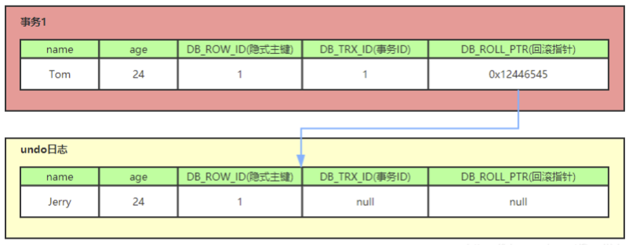
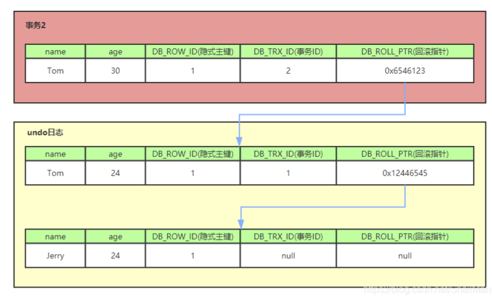
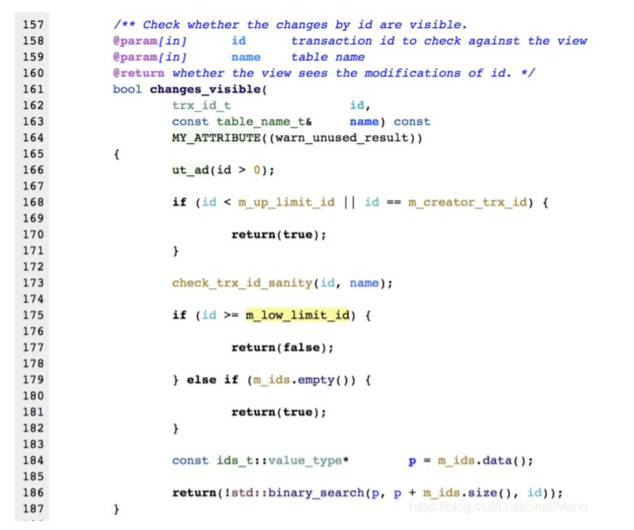
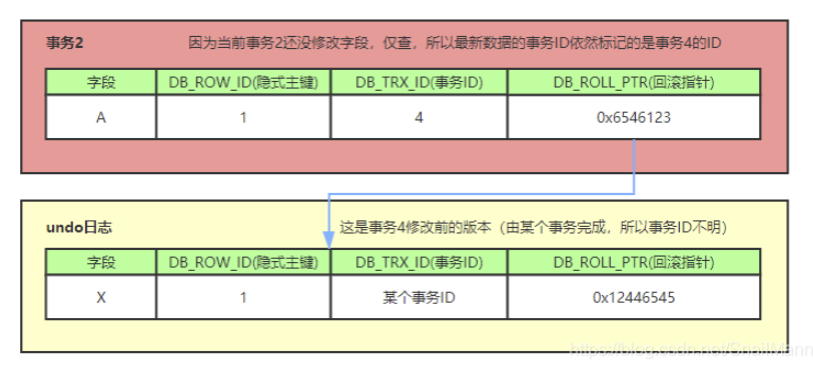
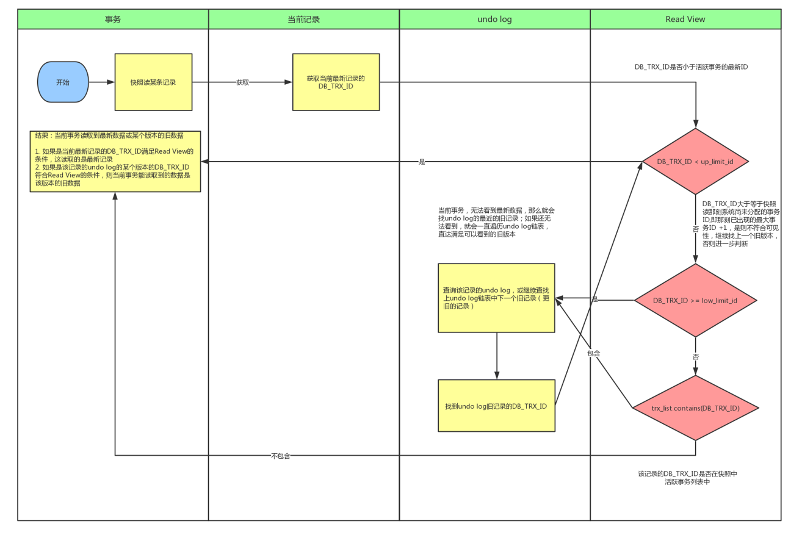

## 什么是MVCC

MVCC即多版本并发控制，MVCC是一种并发控制的方法，一般在数据库管理系统中，实现对数据库的并发访问，在编程语言中实现事务内存。

**MVCC**在**MySQL InnoDB**中的实现主要是**为了提高数据库的并发性能，用更好的方式去处理读-写冲突**，做到==**即使有读写冲突时**，**也能做到不加锁，非阻塞并发读**==。

## 什么是当前读和快照读

- 当前读

  就像 `select lock in share mode（共享锁）`，`select for update`；`update，insert，delete（排他锁）`；这些操作都是一种当前读，为什么叫当前读？因为它读取的记录都是目前数据库中最新的版本，**读取时**还要**保证其它并发事务==不能修改当前记录==**，所以**会对读取数据加锁**。

- 快照读

  像不加锁的`select`操作就是快照读，即**不加锁的非阻塞读**，快照读的前提是隔离级别不是**串行级别**，**串行级别下的快照读会退化成当前读**。

  之所以出现快照读的情况，是基于提高并发性能的考虑，**快照读的实现是基于==多版本并发控制(MVCC)==**。

  所以我们可以认为**MVCC是行锁的一个变种**，但**MVCC在==很多情况下它避免了加锁==，降低了开销**，既然是基于多版本的，所以快照读不一定读到的就是最新版本的记录，而是可能为之前的历史版本。

## 当前读，快照读和MVCC的关系

- 准确的说，**MVCC多版本并发控制是指**：“==维持**一个数据的多个版本**，使得**读写操作没有冲突**”这么一个概念==，听起来特别像我们JAVA中的那个写时复制，但这只是一个理想概念。
- 而在**MySQL**中，实现这么一个**MVCC**理想概念，我们就需要**MySQL**提供具体的功能去实现它，而==快照读就是**MySQL**为我们实现**MVCC**理想模型的其中一个具体非阻塞读功能==不**同的快照，可以看作不同的数据版本**。而相对而言，**当前读就是悲观锁的具体功能实现**。
- 要说得再细致一点，快照读本身也是一个抽象概念，再深入研究。**MVCC**模型在**MySQL**中的具体实现则是由**四个隐式字段**，**undo日志**，**read view** 等去完成的。

## MVCC的好处

**多版本并发控制（MVCC）**是一种用来解决 读-写 冲突的无所并发控制，也就是为事务分配单向增长的时间戳，为每个修改保存一个版本，版本与事务时间戳关联，也就是==每个事务都有一个对应版本的快照，快照版本按照单向增长的时间戳来决定先后顺序==。

在这样的情况下，读操作，我们只读该事务开始前的数据库快照，**并不去读取正在修改的数据**，我们读取事务开始前的最新版本。

所以解决了数据库在并发读取时的问题，即可以做到在读操作时不用阻塞写操作，写操作也不用阻塞读操作，提高了数据库并发读写的性能，同时还可以**解决脏读，不可重复读，幻读等事务隔离级别带来的问题**。但==不能解决更新丢失问题==。

总之，**MVCC**就是因为大牛们，不满意只让数据库采用悲观锁这些性能不佳的形式去解决读-写冲突问题，而提出的解决方案，所以在数据库中，因为有了MVCC，所以我们可以形成两个组合：

- **MVCC** + **悲观锁** MVCC解决读写冲突，悲观锁解决写-写冲突。
- **MVCC** + **乐观锁** MVCC解决读写冲突，乐观锁解决写-写冲突。

## MVCC的实现原理

**MVCC**的目的就是**多版本的并发控制**，在数据库中的实现，就是为了**解决读-写冲突**的问题，它的实现原理主要是**依赖记录中的 3个隐式字段、undo日志、read view 来实现的。**

#### 隐式字段

每行记录除了我们自定义的字段外，还有数据库隐式定义的**DB_TRXID, DB_ROLL, DB_ROW_ID**等字段。

- **DB_ROW_ID**：
  - ==6byte==，**隐含的自增ID（隐藏主键）**，如果数据表**没有主键**，**InnoDB**会自动以**DB_ROW_ID**生成一个**聚簇索引**。
- **DB_TRX_ID：**
  - ==6byte==，最近修改（修改、插入）事务ID：记录创建这条记录以及最后一次修改该记录的事务的ID，**是一个指针**。
- **DB_ROLL_PTR：**
  - ==7byte==，回滚指针，指向这条记录的上一个版本（上一个版本存储于，rollback segment里）。
- **DELETED_BIT：**
  - ==1byte==，记录被更新或删除并不代表真的删除，而是删除flag变了，相当于记录一次逻辑删除。

就拿上图来解释这几个字段，**DB_ROW_ID** 是数据库默认为该行记录生成的唯一隐式主键；**DB_TRX_ID** 是当前操作该条记录的事务的ID；**DB_ROLL_PTR** 是一个回滚指针，用于配合 **undo日志**，指向该条记录的上一个版本；**DELETED_FLAG** 字段没有展示出来。

#### UNDO日志

**InnoDB**把这些为了回滚而记录的这些东西称之为 **undo log**。

值得注意的是，由于**查询操作（SELECT）并不会修改任何用户记录**，所以在查询操作时，并**不需要记录相应的 undo log**。

**undo log** 主要分为以下三种：

- **insert undo log：**
  - 插入一条记录时，==至少把这条记录的**主键**记录下来==，之后回滚的时候只需要把**主键对应的记录删除即可**。
- **update undo log：**
  - 修改一条记录时，==至少要把**修改这条记录前的旧值**都记录下来==，在回滚的时候再把这条记录的值更新为旧值就好了。
- **delete undo log：**
  - 删除一条记录时，==至少要把**这条记录中的全部内容**都记录下来==，这样在之后回滚的时候再重新将这些内容组成的记录插入到表中就好了。
  - ==删除操作都只是**设置一下老记录的 DELETE_BIT**，**并不是真正将其删除**，类似于数据库提供的专门的**逻辑删除**==。
  - 为了节省磁盘空间，**InnoDB**有专门的 **purge（清除）线程**来清理 **DELETED_BIT** 为 **true** 的记录。
  - 为了**不影响==MVCC==的正常工作**，**purge线程**自己也维护了一个 **read view**（==这个 **read view** 相当于**当前系统**中**最老活跃**的**事务的 read view**==）。
  - 如果某个记录的 **DELETED_BIT 为 true**，并且 **DB_TRX_ID（最后一个操作的事务ID） 相对于 purge线程的 read view 可见**，那么这条记录一定是可以被安全清除的。

对 **MVCC** **有实质上帮助的是 update undo log**，**undo log** 实际上就是**存在于 rollback segment 中的旧纪录链**。

一个例子：

1. **比如一个事务往 persion表 中插入了一条新纪录，记录如下，name = jerry，age = 24；**

   **隐式主键 = 1，事务ID和回滚指针都假设为 NULL；**

2. **现在来了另一个事务1对该记录的 name 做出了修改，改为 tom；**
   1. 在该 **事务1** 修改该行记录数据的同时，数据库会**先对该行加排他锁（InnoDB引擎会自动对DML语言影响的记录上写锁|独占锁）**。
   2. 上锁完毕后，将该行数据拷贝到 **undo log** 中，作为旧记录，即在 **undo log** 中有当前行的拷贝副本。
   3. 拷贝完毕后，修改该行的 **name** 为 **tom**，并且修改隐藏字段的 **事务ID** 为当前 **事务1的ID**，这里我们默认是从1开始递增，回滚指针指向拷贝到 **undo log** 的副本记录，即表示我的上一个版本就是他。
   4. 事务提交后，释放锁。

3. **又来了一个事务2修改persion表的同一个记录，将 age 修改为 30岁**；
   1. 在**事务2**修改该行数据之前，数据库继续给他上排他锁。
   2. 上锁完毕之后，把该行数据拷贝到 **undo log** 中，作为旧记录，发现**操作的这行记录**已经有**undo log** 的记录了，那么最新的旧数据作为链表的表头，插在这行记录的 **undo log** 日志的最前面。
   3. 修改该行**age为30岁**，并且修改隐藏字段的**事务ID为当前事务2的ID**，那就是**2**，回滚指针指向刚刚拷贝到 undo log 的副本记录。
   4. 事务提交，释放锁。

从上面几个例子可以看出，不同事物或者相同事务对同一个记录的修改，会导致该记录的 **undo log 成为一条版本记录链**。**undo log 的链首就是最新的旧记录**，**尾部就是最旧的记录**（当然，就像之前所说的该 ==**undo log 的节点可能是会被 purge线程 清除掉的**==，像图中的第一条 **insert undo log**， 其实在事务提交之后可能就被删除丢失了，不过这里为了演示所以还放在这里，假设没被清除）。

#### Read View（读视图）

什么是 Read View？

 Read View 就是==**事务进行快照读操作的时候**生产的**读视图**==，在当前事务**执行快照读**的那一刻，会生成数据库系统当前的一个快照，记录并维护系统当前活跃事务的ID（当每个事务开启时，都会被分配一个ID，这个ID是默认递增的，所以事务越新，ID越大）。

所以我们可以知道 **Read View** 主要是用来做==**可见性判断**==的，即当我们**某个事物执行快照读的时候**，**对读取的该记录创建一个 Read View 视图**，==把它当作条件，用来**判断当前事务能够看到哪个版本的数据**，既可能是当前最新的数据（也就是该快照），也可能是该行记录的 undo log 日志里的某个版本的数据==。

**Read View 遵循一个可见性算法：**

**==事务ID查询就不会新增，只有DML语言才会导致事务ID增加。==**

主要是**将==被修改的数据的最新记录==中的 ==DB_TRX_ID（当前事务ID）取出来==**，**与系统==当前其它活跃事务==的ID去对比（由 Read View 维护）**，如果 **DB_TRX_ID** 跟 **Read View** 的属性**做了某些比较之后==不符合可见性==**，那就通过 **DB_ROLL_PRT** 回滚指针去取出 **undo log** 中的 **DB_TRX_ID** 再比较，也就是说遍历 **undo log** 链表的 **DB_TRX_ID** 找到==特定条件的事务ID的版本==，那么这个 **DB_TRX_ID** 所在的旧记录就是当前事务能看见的最新老版本。

那么这个判断条件是什么呢？

如上，他是一段 MySQL 判断可见性的一段源码。即 changes_visible 方法（不完全，但是能看出大致逻辑），该方法展示了我们拿 DB_TRX_ID 去跟 Read View 某些属性进行怎么样的比较。

在介绍前，我们先简化一下 **Read View** ，我们可以把 **Read View 简单的理解成有三个全局属性**：

- **trx_list**：**未提交事务 ID 列表**，用来维护 Read View 生成时刻系统正处于活跃状态的事务ID。
- **up_limit_id**：记录 **trx_list** 事务ID列表中 **最小的ID**，也就是最初修改该记录的事务。
- **low_limit_id**：**Read View 生成时刻系统尚未分配的下一个事务ID**，也就是等于**==目前出现过的最大事务ID + 1==**。

方法大致流程（对比上面代码）：

- 首先判断 `DB_TRX_ID < up_limit_id` ：
  - 大于：进入下一个判断。
  - 小于：则当前事务能看到 **DB_TRX_ID** 所在记录。

- 判断 `DB_TRX_ID >= low_limit_id`：
  - 大于：代表 **DB_TRX_ID** 所在的记录是在 **Read View 生成之后才出现的**，那**对当前事务肯定不可见**。
  - 小于：进入下一个判断。

- 判断 **DB_TRX_ID** 是否在活跃事务中 `trx_list.contains(DB_TRX_ID)`：
  - 在：代表 **Read View** 生成的时候，你这个事务还在活跃状态，并没有 commit，你修改的数据，我当前的事务是看不见的（**RR隔离级别**）。
  - 不在：说明你这个事务在 **Read View** 生成之前就已经 commit 了，你修改的结果，我当前事务是看得见的。

- ==**可以这样理解 Read View ：不应该让当前事务看到的记录版本，这些记录版本对应的事务ID都在Read View 中**。==

==<u>**以 Repeatable Read （RR隔离级别）举个例子吧，要求读一个值，一直读都是同一个值：**</u>==

- 这种隔离级别下，开启事务的时候开启一个 **Read View** ，在当前事务执行的整个过程中都用这个 **Read View**。
- 当前 **事务ID = 10**，`ReadView 就是（4，8, 10）`，因为**当前事务10**正在执行，所以自己也活跃，此时 `up_limit_id=4，low_limit_id=11`。
- 如果 **当前事务10 **读到一个数据的 **事务ID = 1**，==小于== **活跃列表的最小值（`up_limit_id=4`）**，可见。
- 为什么？
  - 因为在 **事务10** 开启的时候生成的 **Read View** ，除了4，8，10，**其他事务**都已经提交了（不处于活跃状态了），所以==事务1的版本 **<** 事务4的版本==，以及5、6、7、9，都是肯定在我开启的时候已经提交了（==事务ID单调递增==）。
  - 所以这些版本的的数据，再怎么读都不会变，可以放心的读。
- 但如果我读到一个数据的 **事务ID = 12**，说明他在我创建 **Read View** 之后提交的，我不应该看见这个值，应该去 **undo log** 里找这个数据的**前面的版本**，如果找到 **事务ID < 4的版本**，或者 **事务ID = (5、6、7、9)的版本** 都是安全的，可以读。
- 如果我读到一个数据 ==**事务ID**在**活跃列表的范围**内：==
  - 如果当前事务就是活跃的事务之一，比如说是8，说明这个数据在我开启事务之后，才被其它活跃事务更改（提交或未提交），那么这个我不能看见，应该去 **undo log** 中找上一个版本来读，假设说是 7，7也是在这个活跃范围里，但是**并不是活跃事务之一**，这个版本是在当前事务开启事务之前由事务7提交的，所以这个版本可见。

<u>==**再举个读已提交的例子：**==</u>

- 在这个隔离级别是每次读都采用新的 **Read View**。
- **事务10** 开启。
- 读一个数据，**事务ID = 9**，假设此时**Read View** 中 **活跃事务ID =（4，8，10）**，按照规则，可见。
- 过一会再读这个数据，发现此时 **事务ID = 11**，而此时**活跃事务ID =（4，8，10）**，但是因为开启了**新的 Read View**，**==当前系统最大事务ID >11(因为我们已经读到11了嘛)==**，根据判断规则，**事务11不在活跃ID列表**并且 `（事务11ID = 11） < (low_limit_id = 12)`，所以可见。这回就读到了这个数据的新版本了。

## 整体流程

当 `事务2` 对某行数据**执行了快照读**，数据库**为该行数据生成一个 Read View （读视图）**，假设`当前事务ID为2`，此时还有`事务1和事务3在活跃状态中`，==`事务4`在`事务2`**快照读前一刻提交了更新**，所以 **Read View 记录了系统当前活跃事务1，3的ID**==，维护在一个列表上，假设我们称这个列表为 **trx_list**:

|  事务1   |   事务2    |  事务3   |    事务4     |
| :------: | :--------: | :------: | :----------: |
| 事务开始 |  事务开始  | 事务开始 |   事务开始   |
|   ...    |    ...     |   ...    | 修改且已提交 |
|  进行中  | ==快照读== |  进行中  |              |
|   ...    |    ...     |   ...    |              |

**ReadView** 不仅仅会通过一个列表 trx_list 来维护事务2执行快照读那刻系统中正在活跃的事务ID，还会有两个属性 up_limit_id，low_limit_id；所以在这里的例子中，`up_limit_id = 1, low_limit_id = 4+1 = 5`，trx_list集合的值是1，3，Read View 如下图。

我们的例子中，只有**事务4**修改过该行记录，并在**事务2 **==执行快照读前==，就**提交了事务**。

所以，当前该行数据的 **undo log** 就如下图所示。

我们的**事务2**，在快照读该行记录的时候，就会拿该行记录的 **DB_TRX_ID** 去和 **up_limit_id**，**low_limit_id** 和 **trx_list**（活跃事务ID列表）进行比较，==判断**当前事务2**能看到的记录是哪个版本==。

## MVCC相关问题

### RR是如何再RC级的基础上解决不可重复读的？

当前读和快照读在 RR级别 下的区别：

|             事务A             |                   事务B                    |
| :---------------------------: | :----------------------------------------: |
|           开启事务            |                  开启事务                  |
| 快照读（无影响）查询金额为500 |     ==快照读（无影响）查询金额为500==      |
|         更新金额为400         |                    ---                     |
|            commit             |                    ---                     |
|              ---              |        **select 快照读 金额为500**         |
|              ---              | select lock in share mode 当前读 金额为400 |

|             事务A             |                   事务B                    |
| :---------------------------: | :----------------------------------------: |
|           开启事务            |                  开启事务                  |
| 快照读（无影响）查询金额为500 |                    ---                     |
|         更新金额为400         |                    ---                     |
|            commit             |                    ---                     |
|              ---              |        ==select 快照读 金额为400==         |
|              ---              | select lock in share mode 当前读 金额为400 |

**<u>在第二个表中，为什么事务B在事务A的提交后，快照读和当前读都是400呢？</u>**

这里与第一个表的唯一区别仅仅是表一的事务A修改金额前快照读过一次金额数据，而表二的事务B在事务A提交前并没进行过快照读。

所以我们知道，**事务中快照读的结果非常依赖事务首次出现快照读的地方**，==即某个事务中**首次出现快照读的地方十分的关键**，**它可以决定该事务后续快照读结果的能力**==。

我们这里测试的是更新，同时删除和更新也是一样的，如果事务B的快照读是在事务A操作之后进行的，事务B的快照读也是能读取到最新的数据的。

### RC,RR级别下的InnoDB快照读有什么不同？

正式因为 **Read View** 的生成时间不同。

- 在 ==RR 级别==下的某个事务对某条记录的第一次快照读会创建一个快照以及 **Read View**，记录当前系统中活跃的其它事务，此后在调用快照读的时候，**还是用的同一个 Read View**，所以只要当前事务在其它事务提交更新之前使用过快照读，那么之后的快照读使用的都是同一个 **Read View**，所以对之后的修改不可见。
  - 即 RR 级别下，快照读生成 **Read View** 时，**Read View** 会记录所有当前其它所有活跃事务的快照，这些食物的修改对于当前事务都是不可见的，而早于 **Read View** 创建的事务所作的修改均可见。
- 在 ==RC 级别==下，事务中，每次快照都都会生成一个新的 **Read View** 和最新快照，这就是我们在 RC级别下的事务中可以看到别的事务提交更新的原因。

**反正总而言之就是 ==RC 隔离级别== 下，每个快照读都会生成新的 Read View 以及快照，而在 ==RR隔离级== 别下，则是同一个事务中的第一个快照读才会创建Read View, 之后的快照读获取的都是同一个Read View**。