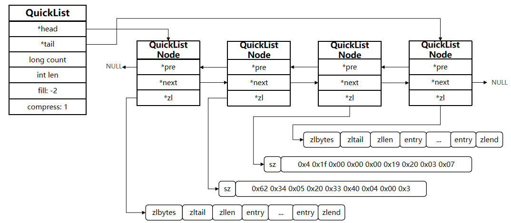
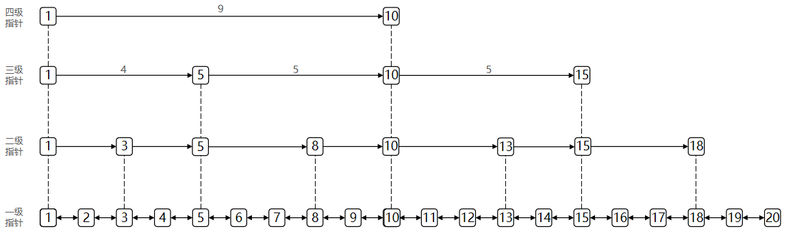
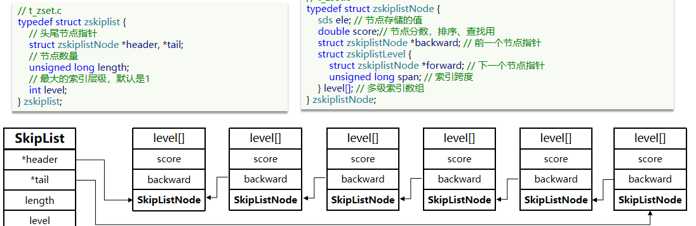
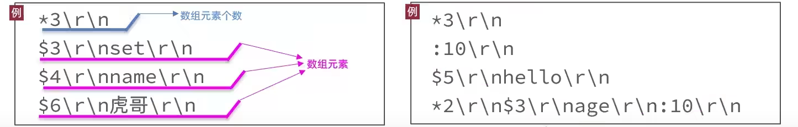

## 认识Redis

Redis是一个基于内存的键值对NoSQL数据库。

特征：

- 键值（key-value）型，value支持多种不同数据结构，功能丰富
- 单线程，每个命令具备原子性
- 低延迟，速度快（基于内存.IO多路复用.良好的编码）。
- 支持数据持久化
- 支持主从集群.分片集群
- 支持多语言客户端

### Redis数据结构

Redis是一个key-value的数据库，key一般是String类，不过value的类型多种多样：

1. String：hello world
   Redis中最简单的存储类型。
2. Hash：{name:"Jack", age:21}
   可以将对象中的每个字段独立存储，可以针对单个字段做CRUD
3. List：{A->B->C->C}
   既可以支持正向检索和也可以支持反向检索。
   有序
   元素可以重复
   插入和删除快
   查询速度一般
   常用来存储一个有序数据
4. Set：{A, B, C}
   无序
   元素不可重复
   查找快
   支持交集.并集.差集等功能
5. SortedSet：{A: 1, B: 2, C: 3}
   可排序
   元素不重复
   查询速度快
6. GEO：{A:{120.3, 30.5}}
7. BitMap：0110110101110101011
8. HyperLog：0110110101110101011

### Redis命令

#### 通用命令

- KEYS：查看符合模板的所有key
- DEL：删除一个指定的key
- EXISTS：判断key是否存在
- EXPIRE：给一个key设置有效期，有效期到期时该key会被自动删除
- TTL：查看一个KEY的剩余有效期

#### String命令

* SET：添加或者修改已经存在的一个String类型的键值对
* GET：根据key获取String类型的value
* MSET：批量添加多个String类型的键值对
* MGET：根据多个key获取多个String类型的value
* INCR：让一个整型的key自增1
* INCRBY:让一个整型的key自增并指定步长，例如：incrby num 2 让num值自增2
* INCRBYFLOAT：让一个浮点类型的数字自增并指定步长
* SETNX：添加一个String类型的键值对，前提是这个key不存在，否则不执行
* SETEX：添加一个String类型的键值对，并且指定有效期

#### Hash命令

- HSET key field value：添加或者修改hash类型key的field的值

- HGET key field：获取一个hash类型key的field的值

- HMSET：批量添加多个hash类型key的field的值

- HMGET：批量获取多个hash类型key的field的值

- HGETALL：获取一个hash类型的key中的所有的field和value
- HKEYS：获取一个hash类型的key中的所有的field
- HINCRBY:让一个hash类型key的字段值自增并指定步长
- HSETNX：添加一个hash类型的key的field值，前提是这个field不存在，否则不执行

#### List命令

- LPUSH key element ... ：向列表左侧插入一个或多个元素
- LPOP key：移除并返回列表左侧的第一个元素，没有则返回nil
- RPUSH key element ... ：向列表右侧插入一个或多个元素
- RPOP key：移除并返回列表右侧的第一个元素
- LRANGE key star end：返回一段角标范围内的所有元素
- BLPOP和BRPOP：与LPOP和RPOP类似，只不过在没有元素时等待指定时间，而不是直接返回nil

#### Set命令

* SADD key member ... ：向set中添加一个或多个元素
* SREM key member ... : 移除set中的指定元素
* SCARD key： 返回set中元素的个数
* SISMEMBER key member：判断一个元素是否存在于set中
* SMEMBERS：获取set中的所有元素
* SINTER key1 key2 ... ：求key1与key2的交集
* SDIFF key1 key2 ... ：求key1与key2的差集
* SUNION key1 key2 ..：求key1和key2的并集

#### SortedSet命令

- ZADD key score member：添加一个或多个元素到sorted set ，如果已经存在则更新其score值
- ZREM key member：删除sorted set中的一个指定元素
- ZSCORE key member : 获取sorted set中的指定元素的score值
- ZRANK key member：获取sorted set 中的指定元素的排名
- ZCARD key：获取sorted set中的元素个数
- ZCOUNT key min max：统计score值在给定范围内的所有元素的个数
- ZINCRBY key increment member：让sorted set中的指定元素自增，步长为指定的increment值
- ZRANGE key min max：按照score排序后，获取指定排名范围内的元素
- ZRANGEBYSCORE key min max：按照score排序后，获取指定score范围内的元素
- ZDIFF.ZINTER.ZUNION：求差集.交集.并集

所有的排名默认都是升序，如果要降序则在命令的Z后面添加REV即可

## 分布式缓存

基于Redis集群解决单机Redis存在的问题。

1. 数据丢失问题：实现Redis数据持久化。
2. 并发能力问题：搭建主从集群，实现读写分离。
3. 故障恢复问题：利用Redis哨兵，实现健康检测和自动恢复。
4. 存储能力问题：搭建分片集群，利用插槽机制实现动态扩容。

### Redis持久化

#### RDB持久化

RDB全称Redis Database Backup file（Redis数据备份文件），也被叫做Redis数据快照。简单来说就是把内存中的所有数据都记录到磁盘中。当Redis实例故障重启后，从磁盘读取快照文件，恢复数据。快照文件称为RDB文件，默认是保存在当前运行目录。

##### 执行时机

RDB持久化在四种情况下会执行：

1. 执行save命令
   save命令会导致主进程执行RDB，这个过程中其它所有命令都会被阻塞。只有在数据迁移时可能用到。

2. 执行bgsave命令
   bgsave命令执行后会开启独立进程完成RDB，主进程可以持续处理用户请求，不受影响。
3. Redis停机时
   Redis停机时会执行一次save命令，实现RDB持久化。
4. 触发RDB条件时
   redis.conf文件配置

```properties
# 900秒内，如果至少有1个key被修改，则执行bgsave ， 如果是save "" 则表示禁用RDB
save 900 1  
save 300 10  
save 60 10000 
```

##### RDB原理

bgsave开始时会fork主进程得到子进程，子进程共享主进程的内存数据。完成fork后读取内存数据并写入 RDB 文件。

fork采用的是copy-on-write技术：

- 当主进程执行读操作时，访问共享内存；
- 当主进程执行写操作时，则会拷贝一份数据，执行写操作。

##### 小结

RDB方式bgsave的基本流程？

- fork主进程得到一个子进程，共享内存空间
- 子进程读取内存数据并写入新的RDB文件
- 用新RDB文件替换旧的RDB文件

RDB会在什么时候执行？save 60 1000代表什么含义？

- 默认是服务停止时
- 代表60秒内至少执行1000次修改则触发RDB

RDB的缺点？

- RDB执行间隔时间长，两次RDB之间写入数据有丢失的风险
- fork子进程、压缩、写出RDB文件都比较耗时

#### AOF持久化

AOF全称为Append Only File（追加文件）。Redis处理的每一个写命令都会记录在AOF文件，可以看做是命令日志文件。

##### AOF配置

```properties
# 是否开启AOF功能，默认是no
appendonly yes
# AOF文件的名称
appendfilename "appendonly.aof"
# 表示每执行一次写命令，立即记录到AOF文件
appendfsync always 
# 写命令执行完先放入AOF缓冲区，然后表示每隔1秒将缓冲区数据写到AOF文件，是默认方案
appendfsync everysec 
# 写命令执行完先放入AOF缓冲区，由操作系统决定何时将缓冲区内容写回磁盘
appendfsync no
```

|          | 刷盘时机     | 优点                   | 缺点                         |
| -------- | ------------ | ---------------------- | ---------------------------- |
| always   | 同步刷盘     | 可靠性高，几乎不丢数据 | 性能影响大                   |
| everysec | 每秒刷盘     | 性能适中               | 最多丢失1秒数据              |
| no       | 操作系统控制 | 性能最好               | 可靠性较差，可能丢失大量数据 |

##### AOF文件重写

因为是记录命令，AOF文件会比RDB文件大的多。而且AOF会记录对同一个key的多次写操作，但只有最后一次写操作才有意义。通过执行bgrewriteaof命令，可以让AOF文件执行重写功能，用最少的命令达到相同效果。

Redis也会在触发阈值时自动去重写AOF文件。阈值也可以在redis.conf中配置：

```properties
# AOF文件比上次文件 增长超过多少百分比则触发重写
auto-aof-rewrite-percentage 100
# AOF文件体积最小多大以上才触发重写 
auto-aof-rewrite-min-size 64mb 
```

#### RDB与AOF对比

|                | RDB                                          | AOF                                                    |
| -------------- | -------------------------------------------- | ------------------------------------------------------ |
| 持久化方式     | 定时对整个内存做快照                         | 记录每一次执行的命令                                   |
| 数据完整性     | 不完整，两次备份之间会丢失                   | 相对完整，取决于刷盘策略                               |
| 文件大小       | 会有压缩，文件体积小                         | 记录命令，文件体积很大                                 |
| 宕机恢复速度   | 很快                                         | 慢                                                     |
| 数据恢复优先级 | 低，因为数据完整性不如AOF                    | 高，因为数据完整性更高                                 |
| 系统资源占用   | 高，大量CPU和内存消耗                        | 低，主要是磁盘IO资源，但AOF重写会占用大量CPU和内存资源 |
| 使用场景       | 可以容忍数分钟的数据丢失，追求更快的启动速度 | 对数据安全性要求较高常见                               |

### Redis主从

#### 主从数据同步原理

##### 全量同步

主从第一次建立连接时，会执行**全量同步**，将master节点的所有数据都拷贝给slave节点。流程如下：


1.0 执行replicaof命令，建立连接

1.1 slave向master请求数据同步

1.2 master判断是否是第一次同步

1.3 是第一次，返回master的数据版本信息

1.4 保存版本信息

2.1 执行bgsave，生成RDB

2.1.1 repl_baklog记录RDB期间的所有命令

2.2 发送RDB命令

2.3 清空本地数据，加载RDB文件

3.1 发送repl_baklog中的命令

3.2 执行接收到的命令

**master如何得知salve是第一次来连接呢？**

- **Replication Id**：简称replid，是数据集的标记，id一致则说明是同一数据集。每一个master都有唯一的replid，slave则会继承master节点的replid
- **offset**：偏移量，随着记录在repl_baklog中的数据增多而逐渐增大。slave完成同步时也会记录当前同步的offset。如果slave的offset小于master的offset，说明slave数据落后于master，需要更新。

因此slave做数据同步，必须向master声明自己的replication id 和offset，master才可以判断到底需要同步哪些数据。

**master判断一个节点是否是第一次同步的依据，就是看replid是否一致。**

完整流程描述：

- slave节点请求增量同步
- master节点判断replid，发现不一致，拒绝增量同步
- master将完整内存数据生成RDB，发送RDB到slave
- slave清空本地数据，加载master的RDB
- master将RDB期间的命令记录在repl_baklog，并持续将log中的命令发送给slave
- slave执行接收到的命令，保持与master之间的同步

##### 增量同步

只更新slave与master存在差异的部分数据。


1.0 slave重启

1.1 slave psync replid offset

1.2 master判断replid是否一直

1.3 不是第一次同步，回复continue

2.1 去repl_baklog中获取offset后的数据

2.2 发送offset后的命令

2.3 执行命令

repl_baklog文件是一个固定大小的数组，只不过数组是环形，也就是说**角标到达数组末尾后，会再次从0开始读写**，这样数组头部的数据就会被覆盖。

repl_baklog中会记录Redis处理过的命令日志及offset，包括master当前的offset，和slave已经拷贝到的offset。

slave与master的offset之间的差异，就是slave需要增量拷贝的数据了。

随着不断有数据写入，master的offset逐渐变大，slave也不断的拷贝，追赶master的offset，直到数组被填满，此时，如果有新的数据写入，就会覆盖数组中的旧数据。不过，如果旧的数据已经被同步到slave中，那被覆盖了也没什么影响。但是，如果slave出现网络阻塞，导致master的offset远远超过了slave的offset，如果master继续写入新数据，其offset就会覆盖旧的数据，直到将slave现在的offset也覆盖，此时如果slave恢复，需要同步，却发现自己的offset都没有了，无法完成增量同步了。只能做全量同步。


#### 主从同步优化

主从同步可以保证主从数据的一致性，非常重要。

可以从以下几个方面来优化Redis主从集群：

- 在master中配置repl-diskless-sync yes启用无磁盘复制，避免全量同步时的磁盘IO。（全量同步慢很大原因就是因为过程中大部分主要是通过RDB完成的，而RDB要操作磁盘，因此效率较低，所以无磁盘复制，通过网络来传输数据的效率会高很多，但是对网络要求高，如果断网之类的则会失效）
- Redis单节点上的内存占用不要太大，减少RDB导致的过多磁盘IO
- 适当提高repl_baklog的大小，发现slave宕机时尽快实现故障恢复，尽可能避免全量同步
- 限制一个master上的slave节点数量，如果实在是太多slave，则可以采用主-从-从链式结构，减少master压力


#### 小结

简述全量同步和增量同步区别？

- 全量同步：master将完整内存数据生成RDB，发送RDB到slave。后续命令则记录在repl_baklog，逐个发送给slave。
- 增量同步：slave提交自己的offset到master，master获取repl_baklog中从offset之后的命令给slave

什么时候执行全量同步？

- slave节点第一次连接master节点时
- slave节点断开时间太久，repl_baklog中的offset已经被覆盖时

什么时候执行增量同步？

- slave节点断开又恢复，并且在repl_baklog中能找到offset时

### 哨兵


哨兵的作用如下：

- **监控**：Sentinel 会不断检查您的master和slave是否按预期工作
- **自动故障恢复**：如果master故障，Sentinel会将一个slave提升为master。当故障实例恢复后也以新的master为主
- **通知**：Sentinel充当Redis客户端的服务发现来源，当集群发生故障转移时，会将最新信息推送给Redis的客户端

#### 集群监控原理

Sentinel基于心跳机制监测服务状态，每隔1秒向集群的每个实例发送ping命令：

•主观下线：如果某sentinel节点发现某实例未在规定时间响应，则认为该实例**主观下线**。

•客观下线：若超过指定数量（quorum）的sentinel都认为该实例主观下线，则该实例**客观下线**。quorum值最好超过Sentinel实例数量的一半。


#### 集群故障恢复原理

一旦发现master故障，sentinel需要在salve中选择一个作为新的master，选择依据是这样的：

- 首先会判断slave节点与master节点断开时间长短，如果超过指定值（down-after-milliseconds * 10）则会排除该slave节点
- 然后判断slave节点的slave-priority值，越小优先级越高，如果是0则永不参与选举
- 如果slave-prority一样，则判断slave节点的offset值，越大说明数据越新，优先级越高
- 最后是判断slave节点的运行id大小，越小优先级越高。

当选出一个新的master后，该如何实现切换呢？流程如下：

- sentinel给备选的slave1节点发送slaveof no one命令，让该节点成为master
- sentinel给所有其它slave发送slaveof 192.168.150.101 7002 命令，让这些slave成为新master的从节点，开始从新的master上同步数据。
- 最后，sentinel将故障节点标记为slave，当故障节点恢复后会自动成为新的master的slave节点


#### 小结

Sentinel的三个作用是什么？

- 监控
- 故障转移
- 通知

Sentinel如何判断一个redis实例是否健康？

- 每隔1秒发送一次ping命令，如果超过一定时间没有相向则认为是主观下线
- 如果大多数sentinel都认为实例主观下线，则判定服务下线

故障转移步骤有哪些？

- 首先选定一个slave作为新的master，执行slaveof no one
- 然后让所有节点都执行slaveof 新master
- 修改故障节点配置，添加slaveof 新master

### Redis分片集群

主从和哨兵可以解决高可用、高并发读的问题。但是依然有两个问题没有解决：

- 海量数据存储问题

- 高并发写的问题

使用分片集群可以解决上述问题。

分片集群特征：

- 集群中有多个master，每个master保存不同数据
- 每个master都可以有多个slave节点
- master之间通过ping监测彼此健康状态
- 客户端请求可以访问集群任意节点，最终都会被转发到正确节点


#### 散列插槽

##### 插槽原理

Redis会把每一个master节点映射到0~16383共16384个插槽（hash slot）上，数据key不是与节点绑定，而是与插槽绑定。redis会根据key的有效部分计算插槽值，分两种情况：

- key中包含"{}"，且“{}”中至少包含1个字符，“{}”中的部分是有效部分
- key中不包含“{}”，整个key都是有效部分

##### 小结

Redis如何判断某个key应该在哪个实例？

- 将16384个插槽分配到不同的实例
- 根据key的有效部分计算哈希值，对16384取余
- 余数作为插槽，寻找插槽所在实例即可

如何将同一类数据固定的保存在同一个Redis实例？

- 这一类数据使用相同的有效部分，例如key都以{typeId}为前缀

#### 集群伸缩

redis-cli --cluster提供了很多操作集群的命令，可以通过下面方式查看：


**添加新节点到redis**

```shell
redis-cli --cluster add-node  192.168.150.101:7004 192.168.150.101:7001
```

**通过命令查看集群状态**

```shell
redis-cli -p 7001 cluster nodes
```

但是，可以看到7004节点的插槽数量为0，因此没有任何数据可以存储到7004上


**查看num的插槽**


将0~3000的插槽从7001转移到7004，命令格式如下：


具体命令如下：

建立连接：


得到下面的反馈：


询问要移动多少个插槽，我们计划是3000个：


哪个node来接收这些插槽？


复制这个id，然后拷贝到刚才的控制台后：


这里询问，你的插槽是从哪里移动过来的？

- all：代表全部，也就是三个节点各转移一部分
- 具体的id：目标节点的id
- done：没有了

这里我们要从7001获取，因此填写7001的id：


填完后，点击done，这样插槽转移就准备好了：


确认要转移吗？输入yes：

然后，通过命令查看结果：


可以看到： 


#### 故障转移

集群初识状态是这样的：


其中7001、7002、7003都是master，我们计划让7002宕机。

##### 自动故障转移

直接停止一个redis实例，例如7002：

```shell
redis-cli -p 7002 shutdown
```

1. 首先是该实例与其它实例失去连接

2. 然后是疑似宕机：


3. 最后是确定下线，自动提升一个slave为新的master：


4. 当7002再次启动，就会变为一个slave节点了：


##### 手动故障转移

利用cluster failover命令可以手动让集群中的某个master宕机，切换到执行cluster failover命令的这个slave节点，实现无感知的数据迁移。其流程如下：


这种failover命令可以指定三种模式：

- 缺省：默认的流程，如图1~6歩
- force：省略了对offset的一致性校验
- takeover：直接执行第5歩，忽略数据一致性、忽略master状态和其它master的意见

在7002这个slave节点执行手动故障转移，重新夺回master地位

步骤如下：

1. 利用redis-cli连接7002这个节点

2. 执行cluster failover命令


## 最佳实践

### Redis键值设计

#### 优雅的key结构

Redis的Key虽然可以自定义，但最好遵循下面的几个最佳实践约定：

- 遵循基本格式：[业务名称]:[数据名]:[id]
- 长度不超过44字节
- 不包含特殊字符

这样设计的好处：

- 可读性强
- 避免key冲突
- 方便管理
- 更节省内存： key是string类型，底层编码包含int、embstr和raw三种。embstr在小于44字节使用，采用连续内存空间，内存占用更小。当字节数大于44字节时，会转为raw模式存储，在raw模式下，内存空间不是连续的，而是采用一个指针指向了另外一段内存空间，在这段空间里存储SDS内容，这样空间不连续，访问的时候性能也就会收到影响，还有可能产生内存碎片

#### 拒绝BigKey

BigKey通常以Key的大小和Key中成员的数量来综合判定，例如：

- Key本身的数据量过大：一个String类型的Key，它的值为5 MB
- Key中的成员数过多：一个ZSET类型的Key，它的成员数量为10,000个
- Key中成员的数据量过大：一个Hash类型的Key，它的成员数量虽然只有1,000个但这些成员的Value（值）总大小为100 MB

推荐值：

- 单个key的value小于10KB
- 对于集合类型的key，建议元素数量小于1000

BigKey的危害：

- 网络阻塞
  - 对BigKey执行读请求时，少量的QPS就可能导致带宽使用率被占满，导致Redis实例，乃至所在物理机变慢
- 数据倾斜
  - BigKey所在的Redis实例内存使用率远超其他实例，无法使数据分片的内存资源达到均衡
- Redis阻塞
  - 对元素较多的hash、list、zset等做运算会耗时较旧，使主线程被阻塞
- CPU压力
  - 对BigKey的数据序列化和反序列化会导致CPU的使用率飙升，影响Redis实例和本机其它应用

如何发现BigKey

1. redis-cli --bigkeys
2. scan扫描
3. 第三方工具，如 Redis-Rdb-Tools 分析RDB快照文件，全面分析内存使用情况
4. 网络监控

如何删除BigKey

- redis 3.0 及以下版本
  - 如果是集合类型，则遍历BigKey的元素，先逐个删除子元素，最后删除BigKey
- Redis 4.0以后
  - Redis在4.0后提供了异步删除的命令：unlink

#### 恰当的数据类型

#### 总结

- Key的最佳实践
  - 固定格式：[业务名]:[数据名]:[id]
  - 足够简短：不超过44字节
  - 不包含特殊字符
- Value的最佳实践：
  - 合理的拆分数据，拒绝BigKey
  - 选择合适数据结构
  - Hash结构的entry数量不要超过1000
  - 设置合理的超时时间

### 批处理优化

#### Pipeline

##### 客户端与服务器交互

单个命令的执行流程


N条命令的执行流程


redis处理指令是很快的，主要花费的时候在于网络传输。于是乎很容易想到将多条指令批量的传输给redis


##### MSet

Redis提供了很多Mxxx这样的命令，可以实现批量插入数据，例如：

- mset
- hmset

利用mset批量插入10万条数据

```java
@Test
void testMxx() {
    String[] arr = new String[2000];
    int j;
    long b = System.currentTimeMillis();
    for (int i = 1; i <= 100000; i++) {
        j = (i % 1000) << 1;
        arr[j] = "test:key_" + i;
        arr[j + 1] = "value_" + i;
        if (j == 0) {
            jedis.mset(arr);
        }
    }
    long e = System.currentTimeMillis();
    System.out.println("time: " + (e - b));
}
```

##### Pipeline

MSET虽然可以批处理，但是却只能操作部分数据类型，因此如果有对复杂数据类型的批处理需要，建议使用Pipeline

```java
@Test
void testPipeline() {
    // 创建管道
    Pipeline pipeline = jedis.pipelined();
    long b = System.currentTimeMillis();
    for (int i = 1; i <= 100000; i++) {
        // 放入命令到管道
        pipeline.set("test:key_" + i, "value_" + i);
        if (i % 1000 == 0) {
            // 每放入1000条命令，批量执行
            pipeline.sync();
        }
    }
    long e = System.currentTimeMillis();
    System.out.println("time: " + (e - b));
}
```

#### 集群下的批处理

如MSET或Pipeline这样的批处理需要在一次请求中携带多条命令，而此时如果Redis是一个集群，那批处理命令的多个key必须落在一个插槽中，否则就会导致执行失败。大家可以想一想这样的要求其实很难实现，因为我们在批处理时，可能一次要插入很多条数据，这些数据很有可能不会都落在相同的节点上，这就会导致报错了

这个时候，我们可以找到4种解决方案


第一种方案：串行执行，所以这种方式没有什么意义，当然，执行起来就很简单了，缺点就是耗时过久。

第二种方案：串行slot，简单来说，就是执行前，客户端先计算一下对应的key的slot，一样slot的key就放到一个组里边，不同的，就放到不同的组里边，然后对每个组执行pipeline的批处理，他就能串行执行各个组的命令，这种做法比第一种方法耗时要少，但是缺点呢，相对来说复杂一点，所以这种方案还需要优化一下

第三种方案：并行slot，相较于第二种方案，在分组完成后串行执行，第三种方案，就变成了并行执行各个命令，所以他的耗时就非常短，但是实现呢，也更加复杂。

第四种：hash_tag，redis计算key的slot的时候，其实是根据key的有效部分来计算的，通过这种方式就能一次处理所有的key，这种方式耗时最短，实现也简单，但是如果通过操作key的有效部分，那么就会导致所有的key都落在一个节点上，产生数据倾斜的问题，所以我们推荐使用第三种方式。

```java
//串行化执行代码实践
public class JedisClusterTest {

    private JedisCluster jedisCluster;

    @BeforeEach
    void setUp() {
        // 配置连接池
        JedisPoolConfig poolConfig = new JedisPoolConfig();
        poolConfig.setMaxTotal(8);
        poolConfig.setMaxIdle(8);
        poolConfig.setMinIdle(0);
        poolConfig.setMaxWaitMillis(1000);
        HashSet<HostAndPort> nodes = new HashSet<>();
        nodes.add(new HostAndPort("192.168.150.101", 7001));
        nodes.add(new HostAndPort("192.168.150.101", 7002));
        nodes.add(new HostAndPort("192.168.150.101", 7003));
        nodes.add(new HostAndPort("192.168.150.101", 8001));
        nodes.add(new HostAndPort("192.168.150.101", 8002));
        nodes.add(new HostAndPort("192.168.150.101", 8003));
        jedisCluster = new JedisCluster(nodes, poolConfig);
    }

    @Test
    void testMSet() {
        jedisCluster.mset("name", "Jack", "age", "21", "sex", "male");

    }

    @Test
    void testMSet2() {
        Map<String, String> map = new HashMap<>(3);
        map.put("name", "Jack");
        map.put("age", "21");
        map.put("sex", "Male");
        //对Map数据进行分组。根据相同的slot放在一个分组
        //key就是slot，value就是一个组
        Map<Integer, List<Map.Entry<String, String>>> result = map.entrySet()
                .stream()
                .collect(Collectors.groupingBy(
                        entry -> ClusterSlotHashUtil.calculateSlot(entry.getKey()))
                );
        //串行的去执行mset的逻辑
        for (List<Map.Entry<String, String>> list : result.values()) {
            String[] arr = new String[list.size() * 2];
            int j = 0;
            for (int i = 0; i < list.size(); i++) {
                j = i<<2;
                Map.Entry<String, String> e = list.get(0);
                arr[j] = e.getKey();
                arr[j + 1] = e.getValue();
            }
            jedisCluster.mset(arr);
        }
    }

    @AfterEach
    void tearDown() {
        if (jedisCluster != null) {
            jedisCluster.close();
        }
    }
}
```

### 服务器端优化-持久化配置

Redis的持久化虽然可以保证数据安全，但也会带来很多额外的开销，因此持久化请遵循下列建议：

* 用来做缓存的Redis实例尽量不要开启持久化功能
* 建议关闭RDB持久化功能，使用AOF持久化
* 利用脚本定期在slave节点做RDB，实现数据备份
* 设置合理的rewrite阈值，避免频繁的bgrewrite
* 配置no-appendfsync-on-rewrite = yes，禁止在rewrite期间做aof，避免因AOF引起的阻塞
* 部署有关建议：
  * Redis实例的物理机要预留足够内存，应对fork和rewrite
  * 单个Redis实例内存上限不要太大，例如4G或8G。可以加快fork的速度、减少主从同步、数据迁移压力
  * 不要与CPU密集型应用部署在一起
  * 不要与高硬盘负载应用一起部署。例如：数据库、消息队列

### 服务器端优化-慢查询优化

#### 什么是慢查询

并不是很慢的查询才是慢查询，而是：在Redis执行时耗时超过某个阈值的命令，称为慢查询。

慢查询的危害：由于Redis是单线程的，所以当客户端发出指令后，他们都会进入到redis底层的queue来执行，如果此时有一些慢查询的数据，就会导致大量请求阻塞，从而引起报错，所以我们需要解决慢查询问题。

慢查询的阈值可以通过配置指定：

slowlog-log-slower-than：慢查询阈值，单位是微秒。默认是10000，建议1000

慢查询会被放入慢查询日志中，日志的长度有上限，可以通过配置指定：

slowlog-max-len：慢查询日志（本质是一个队列）的长度。默认是128，建议1000

#### 如何查看慢查询

* slowlog len：查询慢查询日志长度
* slowlog get [n]：读取n条慢查询日志
* slowlog reset：清空慢查询列表

### 服务器端优化-命令及安全配置

为什么会出现不需要密码也能够登录呢，主要是Redis考虑到每次登录都比较麻烦，所以Redis就有一种ssh免秘钥登录的方式，生成一对公钥和私钥，私钥放在本地，公钥放在redis端，当我们登录时服务器，再登录时候，他会去解析公钥和私钥，如果没有问题，则不需要利用redis的登录也能访问，这种做法本身也很常见，但是这里有一个前提，前提就是公钥必须保存在服务器上，才行，但是Redis的漏洞在于在不登录的情况下，也能把秘钥送到Linux服务器，从而产生漏洞

漏洞出现的核心的原因有以下几点：

* Redis未设置密码
* 利用了Redis的config set命令动态修改Redis配置
* 使用了Root账号权限启动Redis

所以：如何解决呢？我们可以采用如下几种方案

为了避免这样的漏洞，这里给出一些建议：

* Redis一定要设置密码
* 禁止线上使用下面命令：keys、flushall、flushdb、config set等命令。可以利用rename-command禁用。
* bind：限制网卡，禁止外网网卡访问
* 开启防火墙
* 不要使用Root账户启动Redis
* 尽量不是有默认的端口

### 服务器端优化-Redis内存划分和内存配置

当Redis内存不足时，可能导致Key频繁被删除、响应时间变长、QPS不稳定等问题。当内存使用率达到90%以上时就需要我们警惕，并快速定位到内存占用的原因。

| **内存占用** | **说明**                                                     |
| ------------ | ------------------------------------------------------------ |
| 数据内存     | 是Redis最主要的部分，存储Redis的键值信息。主要问题是BigKey问题、内存碎片问题 |
| 进程内存     | Redis主进程本身运⾏肯定需要占⽤内存，如代码、常量池等等；这部分内存⼤约⼏兆，在⼤多数⽣产环境中与Redis数据占⽤的内存相⽐可以忽略。 |
| 缓冲区内存   | 一般包括客户端缓冲区、AOF缓冲区、复制缓冲区等。客户端缓冲区又包括输入缓冲区和输出缓冲区两种。这部分内存占用波动较大，不当使用BigKey，可能导致内存溢出。 |

- info memory：查看内存分配的情况


- memory xxx：查看key的主要占用情况


接下来我们看到了这些配置，最关键的缓存区内存如何定位和解决呢？

内存缓冲区常见的有三种：

* 复制缓冲区：主从复制的repl_backlog_buf，如果太小可能导致频繁的全量复制，影响性能。通过replbacklog-size来设置，默认1mb
* AOF缓冲区：AOF刷盘之前的缓存区域，AOF执行rewrite的缓冲区。无法设置容量上限
* 客户端缓冲区：分为输入缓冲区和输出缓冲区，输入缓冲区最大1G且不能设置。输出缓冲区可以设置

以上复制缓冲区和AOF缓冲区 不会有问题，最关键就是客户端缓冲区的问题

客户端缓冲区：指的就是我们发送命令时，客户端用来缓存命令的一个缓冲区，也就是我们向redis输入数据的输入端缓冲区和redis向客户端返回数据的响应缓存区，输入缓冲区最大1G且不能设置，所以这一块我们根本不用担心，如果超过了这个空间，redis会直接断开，因为本来此时此刻就代表着redis处理不过来了，我们需要担心的就是输出端缓冲区


我们在使用redis过程中，处理大量的big value，那么会导致我们的输出结果过多，如果输出缓存区过大，会导致redis直接断开，而默认配置的情况下， 其实他是没有大小的，这就比较坑了，内存可能一下子被占满，会直接导致咱们的redis断开，所以解决方案有两个

1. 设置一个大小
2. 增加我们带宽的大小，避免我们出现大量数据从而直接超过了redis的承受能力

### 服务器端集群优化-集群还是主从

集群虽然具备高可用特性，能实现自动故障恢复，但是如果使用不当，也会存在一些问题：

* 集群完整性问题
  在Redis的默认配置中，如果发现任意一个插槽不可用，则整个集群都会停止对外服务，所以需要把如下配置修改成no，即有slot不能使用时，我们的redis集群还是可以对外提供服务。


* 集群带宽问题
  避免大集群，集群节点数不要太多，最好少于1000，如果业务庞大，则建立多个集群。
  避免在单个物理机中运行太多Redis实例
  配置合适的cluster-node-timeout值
* 数据倾斜问题
* 客户端性能问题
* 命令的集群兼容性问题
* lua和事务问题
  lua和事务都是要保证原子性问题，如果你的key不在一个节点，那么是无法保证lua的执行和事务的特性的，所以在集群模式是没有办法执行lua和事务的

单体Redis（主从Redis）已经能达到万级别的QPS，并且也具备很强的高可用特性。如果主从能满足业务需求的情况下，所以如果不是在万不得已的情况下，尽量不搭建Redis集群

## Redis原理

### Redis数据结构

#### 动态字符串

Redis中保存的Key是字符串，value往往是字符串或者字符串的集合。可见字符串是Redis中最常用的一种数据结构。不过Redis没有直接使用C语言中的字符串，而是构建了一种新的字符串结构，称为简单动态字符串（Simple Dynamic String），简称SDS。

Redis是C语言实现的，其中SDS是一个结构体，源码如下：


例如，一个包含字符串“name”的sds结构如下：


SDS之所以叫做动态字符串，是因为它具备动态扩容的能力，例如一个内容为“hi”的SDS：


假如我们要给SDS追加一段字符串“,Amy”，这里首先会申请新内存空间：

如果新字符串小于1M，则新空间为扩展后字符串长度的两倍+1；

如果新字符串大于1M，则新空间为扩展后字符串长度+1M+1。称为内存预分配。


#### intset

IntSet是Redis中set集合的一种实现方式，基于整数数组来实现，并且具备长度可变、有序等特征。
结构如下：


其中的encoding包含三种模式，表示存储的整数大小不同：


为了方便查找，Redis会将intset中所有的整数按照升序依次保存在contents数组中，结构如图：


现在，数组中每个数字都在int16_t的范围内，因此采用的编码方式是INTSET_ENC_INT16，每部分占用的字节大小为：
encoding：4字节
length：4字节
contents：2字节 * 3  = 6字节


向该其中添加一个数字：50000，这个数字超出了int16_t的范围，intset会自动升级编码方式到合适的大小。
以当前案例来说流程如下：

* 升级编码为INTSET_ENC_INT32, 每个整数占4字节，并按照新的编码方式及元素个数扩容数组
* 倒序依次将数组中的元素拷贝到扩容后的正确位置
* 将待添加的元素放入数组末尾
* 最后，将inset的encoding属性改为INTSET_ENC_INT32，将length属性改为4


源码如下：


Intset可以看做是特殊的整数数组，具备一些特点：

* Redis会确保Intset中的元素唯一、有序
* 具备类型升级机制，可以节省内存空间
* 底层采用二分查找方式来查询

#### Dict

Redis是一个键值型（Key-Value Pair）的数据库，我们可以根据键实现快速的增删改查。而键与值的映射关系正是通过Dict来实现的。
Dict由三部分组成，分别是：哈希表（DictHashTable）、哈希节点（DictEntry）、字典（Dict）


当我们向Dict添加键值对时，Redis首先根据key计算出hash值（h），然后利用 h & sizemask来计算元素应该存储到数组中的哪个索引位置。我们存储k1=v1，假设k1的哈希值h =1，则1&3 =1，因此k1=v1要存储到数组角标1位置。


Dict由三部分组成，分别是：哈希表（DictHashTable）、哈希节点（DictEntry）、字典（Dict）


**Dict的扩容**

Dict中的HashTable就是数组结合单向链表的实现，当集合中元素较多时，必然导致哈希冲突增多，链表过长，则查询效率会大大降低。
Dict在每次新增键值对时都会检查负载因子（LoadFactor = used/size） ，满足以下两种情况时会触发哈希表扩容：
哈希表的 LoadFactor >= 1，并且服务器没有执行 BGSAVE 或者 BGREWRITEAOF 等后台进程；
哈希表的 LoadFactor > 5 ；


**Dict的rehash**

不管是扩容还是收缩，必定会创建新的哈希表，导致哈希表的size和sizemask变化，而key的查询与sizemask有关。因此必须对哈希表中的每一个key重新计算索引，插入新的哈希表，这个过程称为rehash。过程是这样的：

* 计算新hash表的realeSize，值取决于当前要做的是扩容还是收缩：
  * 如果是扩容，则新size为第一个大于等于dict.ht[0].used + 1的2^n
  * 如果是收缩，则新size为第一个大于等于dict.ht[0].used的2^n （不得小于4）

* 按照新的realeSize申请内存空间，创建dictht，并赋值给dict.ht[1]
* 设置dict.rehashidx = 0，标示开始rehash
* 将dict.ht[0]中的每一个dictEntry都rehash到dict.ht[1]
* 将dict.ht[1]赋值给dict.ht[0]，给dict.ht[1]初始化为空哈希表，释放原来的dict.ht[0]的内存
* 将rehashidx赋值为-1，代表rehash结束
* 在rehash过程中，新增操作，则直接写入ht[1]，查询、修改和删除则会在dict.ht[0]和dict.ht[1]依次查找并执行。这样可以确保ht[0]的数据只减不增，随着rehash最终为空

整个过程可以描述成：


小总结：

Dict的结构：

* 类似java的HashTable，底层是数组加链表来解决哈希冲突
* Dict包含两个哈希表，ht[0]平常用，ht[1]用来rehash

Dict的伸缩：

* 当LoadFactor大于5或者LoadFactor大于1并且没有子进程任务时，Dict扩容
* 当LoadFactor小于0.1时，Dict收缩
* 扩容大小为第一个大于等于used + 1的2^n
* 收缩大小为第一个大于等于used 的2^n
* Dict采用渐进式rehash，每次访问Dict时执行一次rehash
* rehash时ht[0]只减不增，新增操作只在ht[1]执行，其它操作在两个哈希表

#### ZipList

ZipList 是一种特殊的“双端链表” ，由一系列特殊编码的连续内存块组成。可以在任意一端进行压入/弹出操作, 并且该操作的时间复杂度为 O(1)。


| **属性** | **类型** | **长度** | **用途**                                                     |
| -------- | -------- | -------- | ------------------------------------------------------------ |
| zlbytes  | uint32_t | 4 字节   | 记录整个压缩列表占用的内存字节数                             |
| zltail   | uint32_t | 4 字节   | 记录压缩列表表尾节点距离压缩列表的起始地址有多少字节，通过这个偏移量，可以确定表尾节点的地址。 |
| zllen    | uint16_t | 2 字节   | 记录了压缩列表包含的节点数量。 最大值为UINT16_MAX （65534），如果超过这个值，此处会记录为65535，但节点的真实数量需要遍历整个压缩列表才能计算得出。 |
| entry    | 列表节点 | 不定     | 压缩列表包含的各个节点，节点的长度由节点保存的内容决定。     |
| zlend    | uint8_t  | 1 字节   | 特殊值 0xFF （十进制 255 ），用于标记压缩列表的末端。        |

**ZipListEntry**

ZipList 中的Entry并不像普通链表那样记录前后节点的指针，因为记录两个指针要占用16个字节，浪费内存。而是采用了下面的结构：


- previous_entry_length：前一节点的长度，占1个或5个字节。
  - 如果前一节点的长度小于254字节，则采用1个字节来保存这个长度值
  - 如果前一节点的长度大于254字节，则采用5个字节来保存这个长度值，第一个字节为0xfe，后四个字节才是真实长度数据

- encoding：编码属性，记录content的数据类型（字符串还是整数）以及长度，占用1个、2个或5个字节
- contents：负责保存节点的数据，可以是字符串或整数

ZipList中所有存储长度的数值均采用小端字节序，即低位字节在前，高位字节在后。例如：数值0x1234，采用小端字节序后实际存储值为：0x3412

**Encoding编码**

ZipListEntry中的encoding编码分为字符串和整数两种：
字符串：如果encoding是以“00”、“01”或者“10”开头，则证明content是字符串

| **编码**                                             | **编码长度** | **字符串大小**      |
| ---------------------------------------------------- | ------------ | ------------------- |
| \|00pppppp\|                                         | 1 bytes      | <= 63 bytes         |
| \|01pppppp\|qqqqqqqq\|                               | 2 bytes      | <= 16383 bytes      |
| \|10000000\|qqqqqqqq\|rrrrrrrr\|ssssssss\|tttttttt\| | 5 bytes      | <= 4294967295 bytes |

例如，我们要保存字符串：“ab”和 “bc”


ZipListEntry中的encoding编码分为字符串和整数两种：

* 整数：如果encoding是以“11”开始，则证明content是整数，且encoding固定只占用1个字节

| **编码** | **编码长度** | **整数类型**                                               |
| -------- | ------------ | ---------------------------------------------------------- |
| 11000000 | 1            | int16_t（2 bytes）                                         |
| 11010000 | 1            | int32_t（4 bytes）                                         |
| 11100000 | 1            | int64_t（8 bytes）                                         |
| 11110000 | 1            | 24位有符整数(3 bytes)                                      |
| 11111110 | 1            | 8位有符整数(1 bytes)                                       |
| 1111xxxx | 1            | 直接在xxxx位置保存数值，范围从0001~1101，减1后结果为实际值 |


##### ZipList的连锁更新问题

ZipList的每个Entry都包含previous_entry_length来记录上一个节点的大小，长度是1个或5个字节：
如果前一节点的长度小于254字节，则采用1个字节来保存这个长度值
如果前一节点的长度大于等于254字节，则采用5个字节来保存这个长度值，第一个字节为0xfe，后四个字节才是真实长度数据
现在，假设我们有N个连续的、长度为250~253字节之间的entry，因此entry的previous_entry_length属性用1个字节即可表示，如图所示：


ZipList这种特殊情况下产生的连续多次空间扩展操作称之为连锁更新（Cascade Update）。新增、删除都可能导致连锁更新的发生。

**ZipList特性：**

* 压缩列表的可以看做一种连续内存空间的"双向链表"
* 列表的节点之间不是通过指针连接，而是记录上一节点和本节点长度来寻址，内存占用较低
* 如果列表数据过多，导致链表过长，可能影响查询性能
* 增或删较大数据时有可能发生连续更新问题

#### QuickList

问题1：ZipList虽然节省内存，但申请内存必须是连续空间，如果内存占用较多，申请内存效率很低。怎么办？

​	答：为了缓解这个问题，我们必须限制ZipList的长度和entry大小。

问题2：但是我们要存储大量数据，超出了ZipList最佳的上限该怎么办？

​	答：我们可以创建多个ZipList来分片存储数据。

问题3：数据拆分后比较分散，不方便管理和查找，这多个ZipList如何建立联系？

​	答：Redis在3.2版本引入了新的数据结构QuickList，它是一个双端链表，只不过链表中的每个节点都是一个ZipList。


为了避免QuickList中的每个ZipList中entry过多，Redis提供了一个配置项：list-max-ziplist-size来限制。
如果值为正，则代表ZipList的允许的entry个数的最大值
如果值为负，则代表ZipList的最大内存大小，分5种情况：

* -1：每个ZipList的内存占用不能超过4kb
* -2：每个ZipList的内存占用不能超过8kb
* -3：每个ZipList的内存占用不能超过16kb
* -4：每个ZipList的内存占用不能超过32kb
* -5：每个ZipList的内存占用不能超过64kb

其默认值为 -2：


以下是QuickList的和QuickListNode的结构源码：


用一段流程图来描述当前的这个结构



总结：

QuickList的特点：

* 是一个节点为ZipList的双端链表
* 节点采用ZipList，解决了传统链表的内存占用问题
* 控制了ZipList大小，解决连续内存空间申请效率问题
* 中间节点可以压缩，进一步节省了内存

#### SkipList

SkipList（跳表）首先是链表，但与传统链表相比有几点差异：
元素按照升序排列存储
节点可能包含多个指针，指针跨度不同。



SkipList（跳表）首先是链表，但与传统链表相比有几点差异：
元素按照升序排列存储
节点可能包含多个指针，指针跨度不同。



SkipList（跳表）首先是链表，但与传统链表相比有几点差异：
元素按照升序排列存储
节点可能包含多个指针，指针跨度不同。

SkipList（跳表）首先是链表，但与传统链表相比有几点差异：
元素按照升序排列存储
节点可能包含多个指针，指针跨度不同。

SkipList的特点：

* 跳跃表是一个双向链表，每个节点都包含score和ele值
* 节点按照score值排序，score值一样则按照ele字典排序
* 每个节点都可以包含多层指针，层数是1到32之间的随机数
* 不同层指针到下一个节点的跨度不同，层级越高，跨度越大
* 增删改查效率与红黑树基本一致，实现却更简单

#### RedisObject

1、什么是redisObject：
从Redis的使用者的角度来看，⼀个Redis节点包含多个database（非cluster模式下默认是16个，cluster模式下只能是1个），而一个database维护了从key space到object space的映射关系。这个映射关系的key是string类型，⽽value可以是多种数据类型，比如：
string, list, hash、set、sorted set等。我们可以看到，key的类型固定是string，而value可能的类型是多个。
⽽从Redis内部实现的⾓度来看，database内的这个映射关系是用⼀个dict来维护的。dict的key固定用⼀种数据结构来表达就够了，这就是动态字符串sds。而value则比较复杂，为了在同⼀个dict内能够存储不同类型的value，这就需要⼀个通⽤的数据结构，这个通用的数据结构就是robj，全名是redisObject。


Redis的编码方式

Redis中会根据存储的数据类型不同，选择不同的编码方式，共包含11种不同类型：

| **编号** | **编码方式**            | **说明**               |
| -------- | ----------------------- | ---------------------- |
| 0        | OBJ_ENCODING_RAW        | raw编码动态字符串      |
| 1        | OBJ_ENCODING_INT        | long类型的整数的字符串 |
| 2        | OBJ_ENCODING_HT         | hash表（字典dict）     |
| 3        | OBJ_ENCODING_ZIPMAP     | 已废弃                 |
| 4        | OBJ_ENCODING_LINKEDLIST | 双端链表               |
| 5        | OBJ_ENCODING_ZIPLIST    | 压缩列表               |
| 6        | OBJ_ENCODING_INTSET     | 整数集合               |
| 7        | OBJ_ENCODING_SKIPLIST   | 跳表                   |
| 8        | OBJ_ENCODING_EMBSTR     | embstr的动态字符串     |
| 9        | OBJ_ENCODING_QUICKLIST  | 快速列表               |
| 10       | OBJ_ENCODING_STREAM     | Stream流               |

五种数据结构

Redis中会根据存储的数据类型不同，选择不同的编码方式。每种数据类型的使用的编码方式如下：

| **数据类型** | **编码方式**                                       |
| ------------ | -------------------------------------------------- |
| OBJ_STRING   | int、embstr、raw                                   |
| OBJ_LIST     | LinkedList和ZipList(3.2以前)、QuickList（3.2以后） |
| OBJ_SET      | intset、HT                                         |
| OBJ_ZSET     | ZipList、HT、SkipList                              |
| OBJ_HASH     | ZipList、HT                                        |

#### String

String是Redis中最常见的数据存储类型：

其基本编码方式是RAW，基于简单动态字符串（SDS）实现，存储上限为512mb。

如果存储的SDS长度小于44字节，则会采用EMBSTR编码，此时object head与SDS是一段连续空间。申请内存时

只需要调用一次内存分配函数，效率更高。

（1）底层实现⽅式：动态字符串sds 或者 long
String的内部存储结构⼀般是sds（Simple Dynamic String，可以动态扩展内存），但是如果⼀个String类型的value的值是数字，那么Redis内部会把它转成long类型来存储，从⽽减少内存的使用。


如果存储的字符串是整数值，并且大小在LONG_MAX范围内，则会采用INT编码：直接将数据保存在RedisObject的ptr指针位置（刚好8字节），不再需要SDS了。


确切地说，String在Redis中是⽤⼀个robj来表示的。

用来表示String的robj可能编码成3种内部表⽰：OBJ_ENCODING_RAW，OBJ_ENCODING_EMBSTR，OBJ_ENCODING_INT。
其中前两种编码使⽤的是sds来存储，最后⼀种OBJ_ENCODING_INT编码直接把string存成了long型。
在对string进行incr, decr等操作的时候，如果它内部是OBJ_ENCODING_INT编码，那么可以直接行加减操作；如果它内部是OBJ_ENCODING_RAW或OBJ_ENCODING_EMBSTR编码，那么Redis会先试图把sds存储的字符串转成long型，如果能转成功，再进行加减操作。对⼀个内部表示成long型的string执行append, setbit, getrange这些命令，针对的仍然是string的值（即⼗进制表示的字符串），而不是针对内部表⽰的long型进⾏操作。比如字符串”32”，如果按照字符数组来解释，它包含两个字符，它们的ASCII码分别是0x33和0x32。当我们执行命令setbit key 7 0的时候，相当于把字符0x33变成了0x32，这样字符串的值就变成了”22”。⽽如果将字符串”32”按照内部的64位long型来解释，那么它是0x0000000000000020，在这个基础上执⾏setbit位操作，结果就完全不对了。因此，在这些命令的实现中，会把long型先转成字符串再进行相应的操作。

#### List

Redis的List类型可以从首、尾操作列表中的元素：


哪一个数据结构能满足上述特征？

* LinkedList ：普通链表，可以从双端访问，内存占用较高，内存碎片较多
* ZipList ：压缩列表，可以从双端访问，内存占用低，存储上限低
* QuickList：LinkedList + ZipList，可以从双端访问，内存占用较低，包含多个ZipList，存储上限高

Redis的List结构类似一个双端链表，可以从首、尾操作列表中的元素：

在3.2版本之前，Redis采用ZipList和LinkedList来实现List，当元素数量小于512并且元素大小小于64字节时采用ZipList编码，超过则采用LinkedList编码。

在3.2版本之后，Redis统一采用QuickList来实现List：


#### Set

Set是Redis中的单列集合，满足下列特点：

* 不保证有序性
* 保证元素唯一
* 求交集、并集、差集


可以看出，Set对查询元素的效率要求非常高，思考一下，什么样的数据结构可以满足？
HashTable，也就是Redis中的Dict，不过Dict是双列集合（可以存键、值对）

Set是Redis中的集合，不一定确保元素有序，可以满足元素唯一、查询效率要求极高。
为了查询效率和唯一性，set采用HT编码（Dict）。Dict中的key用来存储元素，value统一为null。
当存储的所有数据都是整数，并且元素数量不超过set-max-intset-entries时，Set会采用IntSet编码，以节省内存


结构如下：


#### ZSET

ZSet也就是SortedSet，其中每一个元素都需要指定一个score值和member值：

* 可以根据score值排序后
* member必须唯一
* 可以根据member查询分数


因此，zset底层数据结构必须满足键值存储、键必须唯一、可排序这几个需求。之前学习的哪种编码结构可以满足？

* SkipList：可以排序，并且可以同时存储score和ele值（member）
* HT（Dict）：可以键值存储，并且可以根据key找value


当元素数量不多时，HT和SkipList的优势不明显，而且更耗内存。因此zset还会采用ZipList结构来节省内存，不过需要同时满足两个条件：

* 元素数量小于zset_max_ziplist_entries，默认值128
* 每个元素都小于zset_max_ziplist_value字节，默认值64

ziplist本身没有排序功能，而且没有键值对的概念，因此需要有zset通过编码实现：

* ZipList是连续内存，因此score和element是紧挨在一起的两个entry， element在前，score在后
* score越小越接近队首，score越大越接近队尾，按照score值升序排列


#### Hash

Hash结构与Redis中的Zset非常类似：

* 都是键值存储
* 都需求根据键获取值
* 键必须唯一

区别如下：

* zset的键是member，值是score；hash的键和值都是任意值
* zset要根据score排序；hash则无需排序

（1）底层实现方式：压缩列表ziplist 或者 字典dict
当Hash中数据项比较少的情况下，Hash底层才⽤压缩列表ziplist进⾏存储数据，随着数据的增加，底层的ziplist就可能会转成dict，具体配置如下：

hash-max-ziplist-entries 512

hash-max-ziplist-value 64

当满足上面两个条件其中之⼀的时候，Redis就使⽤dict字典来实现hash。
Redis的hash之所以这样设计，是因为当ziplist变得很⼤的时候，它有如下几个缺点：

* 每次插⼊或修改引发的realloc操作会有更⼤的概率造成内存拷贝，从而降低性能。
* ⼀旦发生内存拷贝，内存拷贝的成本也相应增加，因为要拷贝更⼤的⼀块数据。
* 当ziplist数据项过多的时候，在它上⾯查找指定的数据项就会性能变得很低，因为ziplist上的查找需要进行遍历。

总之，ziplist本来就设计为各个数据项挨在⼀起组成连续的内存空间，这种结构并不擅长做修改操作。⼀旦数据发⽣改动，就会引发内存realloc，可能导致内存拷贝。

hash结构如下：


zset集合如下：


因此，Hash底层采用的编码与Zset也基本一致，只需要把排序有关的SkipList去掉即可：

Hash结构默认采用ZipList编码，用以节省内存。 ZipList中相邻的两个entry 分别保存field和value

当数据量较大时，Hash结构会转为HT编码，也就是Dict，触发条件有两个：

* ZipList中的元素数量超过了hash-max-ziplist-entries（默认512）
* ZipList中的任意entry大小超过了hash-max-ziplist-value（默认64字节）


### Redis网络模型

#### Redis到底是单线程还是多线程？

* 如果仅仅聊Redis的核心业务部分（命令处理），答案是单线程
* 如果是聊整个Redis，那么答案就是多线程

在Redis版本迭代过程中，在两个重要的时间节点上引入了多线程的支持：

* Redis v4.0：引入多线程异步处理一些耗时较旧的任务，例如异步删除命令unlink
* Redis v6.0：在核心网络模型中引入 多线程，进一步提高对于多核CPU的利用率

因此，对于Redis的核心网络模型，在Redis 6.0之前确实都是单线程。是利用epoll（Linux系统）这样的IO多路复用技术在事件循环中不断处理客户端情况。

#### 为什么Redis要选择单线程？

* 抛开持久化不谈，Redis是纯  内存操作，执行速度非常快，它的性能瓶颈是网络延迟而不是执行速度，因此多线程并不会带来巨大的性能提升。
* 多线程会导致过多的上下文切换，带来不必要的开销
* 引入多线程会面临线程安全问题，必然要引入线程锁这样的安全手段，实现复杂度增高，而且性能也会大打折扣

#### Redis单线程和多线程网络模型变更


当我们的客户端想要去连接我们服务器，会去先到IO多路复用模型去进行排队，会有一个连接应答处理器，他会去接受读请求，然后又把读请求注册到具体模型中去，此时这些建立起来的连接，如果是客户端请求处理器去进行执行命令时，他会去把数据读取出来，然后把数据放入到client中， clinet去解析当前的命令转化为redis认识的命令，接下来就开始处理这些命令，从redis中的command中找到这些命令，然后就真正的去操作对应的数据了，当数据操作完成后，会去找到命令回复处理器，再由他将数据写出。

### RESP协议

Redis是一个CS架构的软件，通信一般分两步（不包括pipeline和PubSub）：

客户端（client）向服务端（server）发送一条命令

服务端解析并执行命令，返回响应结果给客户端

因此客户端发送命令的格式、服务端响应结果的格式必须有一个规范，这个规范就是通信协议。

而在Redis中采用的是RESP（Redis Serialization Protocol）协议：

Redis 1.2版本引入了RESP协议

Redis 2.0版本中成为与Redis服务端通信的标准，称为RESP2

Redis 6.0版本中，从RESP2升级到了RESP3协议，增加了更多数据类型并且支持6.0的新特性--客户端缓存

但目前，默认使用的依然是RESP2协议，也是我们要学习的协议版本（以下简称RESP）。

在RESP中，通过首字节的字符来区分不同数据类型，常用的数据类型包括5种：

单行字符串：首字节是 ‘+’ ，后面跟上单行字符串，以CRLF（ "\r\n" ）结尾。例如返回"OK"： "+OK\r\n"

错误（Errors）：首字节是 ‘-’ ，与单行字符串格式一样，只是字符串是异常信息，例如："-Error message\r\n"

数值：首字节是 ‘:’ ，后面跟上数字格式的字符串，以CRLF结尾。例如：":10\r\n"

多行字符串：首字节是 ‘$’ ，表示二进制安全的字符串，最大支持512MB：

如果大小为0，则代表空字符串："$0\r\n\r\n"

如果大小为-1，则代表不存在："$-1\r\n"

数组：首字节是 ‘*’，后面跟上数组元素个数，再跟上元素，元素数据类型不限:



#### Redis通信协议-基于socket自定义Redis的客户端

Redis支持TCP通信，因此我们可以使用Socket来模拟客户端，与Redis服务端建立连接：

```java
public class Main {

    static Socket s;
    static PrintWriter writer;
    static BufferedReader reader;

    public static void main(String[] args) {
        try {
            // 1.建立连接
            String host = "192.168.150.101";
            int port = 6379;
            s = new Socket(host, port);
            // 2.获取输出流、输入流
            writer = new PrintWriter(new OutputStreamWriter(s.getOutputStream(), StandardCharsets.UTF_8));
            reader = new BufferedReader(new InputStreamReader(s.getInputStream(), StandardCharsets.UTF_8));

            // 3.发出请求
            // 3.1.获取授权 auth 123321
            sendRequest("auth", "123321");
            Object obj = handleResponse();
            System.out.println("obj = " + obj);

            // 3.2.set name 虎哥
            sendRequest("set", "name", "虎哥");
            // 4.解析响应
            obj = handleResponse();
            System.out.println("obj = " + obj);

            // 3.2.set name 虎哥
            sendRequest("get", "name");
            // 4.解析响应
            obj = handleResponse();
            System.out.println("obj = " + obj);

            // 3.2.set name 虎哥
            sendRequest("mget", "name", "num", "msg");
            // 4.解析响应
            obj = handleResponse();
            System.out.println("obj = " + obj);
        } catch (IOException e) {
            e.printStackTrace();
        } finally {
            // 5.释放连接
            try {
                if (reader != null) reader.close();
                if (writer != null) writer.close();
                if (s != null) s.close();
            } catch (IOException e) {
                e.printStackTrace();
            }
        }
    }

    private static Object handleResponse() throws IOException {
        // 读取首字节
        int prefix = reader.read();
        // 判断数据类型标示
        switch (prefix) {
            case '+': // 单行字符串，直接读一行
                return reader.readLine();
            case '-': // 异常，也读一行
                throw new RuntimeException(reader.readLine());
            case ':': // 数字
                return Long.parseLong(reader.readLine());
            case '$': // 多行字符串
                // 先读长度
                int len = Integer.parseInt(reader.readLine());
                if (len == -1) {
                    return null;
                }
                if (len == 0) {
                    return "";
                }
                // 再读数据,读len个字节。我们假设没有特殊字符，所以读一行（简化）
                return reader.readLine();
            case '*':
                return readBulkString();
            default:
                throw new RuntimeException("错误的数据格式！");
        }
    }

    private static Object readBulkString() throws IOException {
        // 获取数组大小
        int len = Integer.parseInt(reader.readLine());
        if (len <= 0) {
            return null;
        }
        // 定义集合，接收多个元素
        List<Object> list = new ArrayList<>(len);
        // 遍历，依次读取每个元素
        for (int i = 0; i < len; i++) {
            list.add(handleResponse());
        }
        return list;
    }

    // set name 虎哥
    private static void sendRequest(String ... args) {
        writer.println("*" + args.length);
        for (String arg : args) {
            writer.println("$" + arg.getBytes(StandardCharsets.UTF_8).length);
            writer.println(arg);
        }
        writer.flush();
    }
}

```

#### Redis内存回收-过期key处理

Redis之所以性能强，最主要的原因就是基于内存存储。然而单节点的Redis其内存大小不宜过大，会影响持久化或主从同步性能。
我们可以通过修改配置文件来设置Redis的最大内存：


当内存使用达到上限时，就无法存储更多数据了。为了解决这个问题，Redis提供了一些策略实现内存回收：

内存过期策略

在学习Redis缓存的时候我们说过，可以通过expire命令给Redis的key设置TTL（存活时间）：


可以发现，当key的TTL到期以后，再次访问name返回的是nil，说明这个key已经不存在了，对应的内存也得到释放。从而起到内存回收的目的。

Redis本身是一个典型的key-value内存存储数据库，因此所有的key、value都保存在之前学习过的Dict结构中。不过在其database结构体中，有两个Dict：一个用来记录key-value；另一个用来记录key-TTL。


这里有两个问题需要我们思考：
Redis是如何知道一个key是否过期呢？

利用两个Dict分别记录key-value对及key-ttl对

是不是TTL到期就立即删除了呢？

**惰性删除**

惰性删除：顾明思议并不是在TTL到期后就立刻删除，而是在访问一个key的时候，检查该key的存活时间，如果已经过期才执行删除。


**周期删除**

周期删除：顾明思议是通过一个定时任务，周期性的抽样部分过期的key，然后执行删除。执行周期有两种：
Redis服务初始化函数initServer()中设置定时任务，按照server.hz的频率来执行过期key清理，模式为SLOW
Redis的每个事件循环前会调用beforeSleep()函数，执行过期key清理，模式为FAST

周期删除：顾明思议是通过一个定时任务，周期性的抽样部分过期的key，然后执行删除。执行周期有两种：
Redis服务初始化函数initServer()中设置定时任务，按照server.hz的频率来执行过期key清理，模式为SLOW
Redis的每个事件循环前会调用beforeSleep()函数，执行过期key清理，模式为FAST

SLOW模式规则：

* 执行频率受server.hz影响，默认为10，即每秒执行10次，每个执行周期100ms。
* 执行清理耗时不超过一次执行周期的25%.默认slow模式耗时不超过25ms
* 逐个遍历db，逐个遍历db中的bucket，抽取20个key判断是否过期
* 如果没达到时间上限（25ms）并且过期key比例大于10%，再进行一次抽样，否则结束
* FAST模式规则（过期key比例小于10%不执行 ）：
* 执行频率受beforeSleep()调用频率影响，但两次FAST模式间隔不低于2ms
* 执行清理耗时不超过1ms
* 逐个遍历db，逐个遍历db中的bucket，抽取20个key判断是否过期
  如果没达到时间上限（1ms）并且过期key比例大于10%，再进行一次抽样，否则结束

小总结：

RedisKey的TTL记录方式：

在RedisDB中通过一个Dict记录每个Key的TTL时间

过期key的删除策略：

惰性清理：每次查找key时判断是否过期，如果过期则删除

定期清理：定期抽样部分key，判断是否过期，如果过期则删除。
定期清理的两种模式：

SLOW模式执行频率默认为10，每次不超过25ms

FAST模式执行频率不固定，但两次间隔不低于2ms，每次耗时不超过1ms

#### Redis内存回收-内存淘汰策略

内存淘汰：就是当Redis内存使用达到设置的上限时，主动挑选部分key删除以释放更多内存的流程。Redis会在处理客户端命令的方法processCommand()中尝试做内存淘汰：


淘汰策略

Redis支持8种不同策略来选择要删除的key：

* noeviction： 不淘汰任何key，但是内存满时不允许写入新数据，默认就是这种策略。
* volatile-ttl： 对设置了TTL的key，比较key的剩余TTL值，TTL越小越先被淘汰
* allkeys-random：对全体key ，随机进行淘汰。也就是直接从db->dict中随机挑选
* volatile-random：对设置了TTL的key ，随机进行淘汰。也就是从db->expires中随机挑选。
* allkeys-lru： 对全体key，基于LRU算法进行淘汰
* volatile-lru： 对设置了TTL的key，基于LRU算法进行淘汰
* allkeys-lfu： 对全体key，基于LFU算法进行淘汰
* volatile-lfu： 对设置了TTL的key，基于LFI算法进行淘汰
  比较容易混淆的有两个：
  * LRU（Least Recently Used），最少最近使用。用当前时间减去最后一次访问时间，这个值越大则淘汰优先级越高。
  * LFU（Least Frequently Used），最少频率使用。会统计每个key的访问频率，值越小淘汰优先级越高。

Redis的数据都会被封装为RedisObject结构：


LFU的访问次数之所以叫做逻辑访问次数，是因为并不是每次key被访问都计数，而是通过运算：

* 生成0~1之间的随机数R
* 计算 (旧次数 * lfu_log_factor + 1)，记录为P
* 如果 R < P ，则计数器 + 1，且最大不超过255
* 访问次数会随时间衰减，距离上一次访问时间每隔 lfu_decay_time 分钟，计数器 -1

最后用一副图来描述当前的这个流程吧


