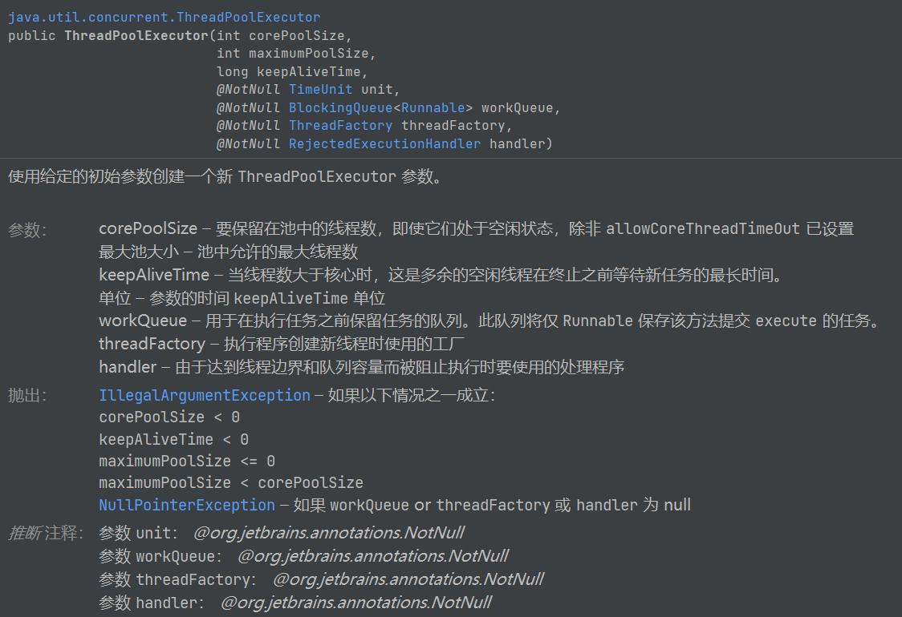
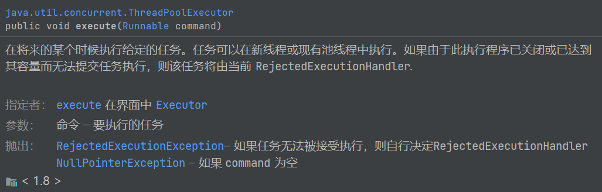
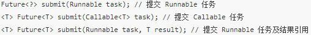

## ThreadPoolExecutor类

### 线程池状态

1. RUNNING：允许提交并处理任务
2. SHUTDOWN：不允许提交新的任务，但是会处理完已提交的任务
3. STOP：不允许提交新的任务，也不会处理阻塞队列中未执行的任务，并设置正在执行的线程的中断标志位
4. TIDYING：所有任务执行完毕，池中工作的线程数为0，等待执行terminated()勾子方法
5. TERMINATED：terminated()勾子方法执行完毕

注意：

- 线程池的shutdown() 方法，将线程池由 RUNNING（运行状态）转换为 SHUTDOWN状态
- 线程池的shutdownNow()方法，将线程池由RUNNING 或 SHUTDOWN 状态转换为 STOP 状态。
- SHUTDOWN 状态 和 STOP 状态 先会转变为 TIDYING 状态，最终都会变为 TERMINATED

### ThreadPoolExecutor构造函数

ThreadPoolExecutor继承自AbstractExecutorService，而AbstractExecutorService实现了ExecutorService接口。





当调用线程池execute() 方法添加一个任务时，线程池会做如下判断：

1. 如果有空闲线程，则直接执行该任务；
2. 如果没有空闲线程，且当前运行的线程数少于corePoolSize，则创建新的线程执行该任务；
3. 如果没有空闲线程，且当前的线程数等于corePoolSize，同时阻塞队列未满，则将任务入队列，而不添加新的线程；
4. 如果没有空闲线程，且阻塞队列已满，同时池中的线程数小于maximumPoolSize ，则创建新的线程执行任务；
5. 如果没有空闲线程，且阻塞队列已满，同时池中的线程数等于maximumPoolSize ，则根据构造函数中的 handler 指定的策略来拒绝新的任务。

当一个线程无事可做，超过一定的时间（keepAliveTime）时，线程池会判断，如果当前运行的线程数大于 corePoolSize，那么这个线程就被停掉。所以线程池的所有任务完成后，它最终会收缩到 corePoolSize 的大小。

注意：如果线程池设置了allowCoreThreadTimeout参数为true（默认false），那么当空闲线程超过keepaliveTime后直接停掉。（不会判断线程数是否大于corePoolSize）即：最终线程数会变为0。

#### workQueue 

workQueue 任务队列决定了缓存任务的排队策略，ThreadPoolExecutor线程池推荐了三种等待队列，SynchronousQueue 、LinkedBlockingQueue 和 ArrayBlockingQueue。

1. 有界队列：

   SynchronousQueue ：一个不存储元素的阻塞队列，每个插入操作必须等到另一个线程调用移除操作，否则插入操作一直处于 阻塞状态，吞吐量通常要高于LinkedBlockingQueue，静态工厂方法 Executors.newCachedThreadPool 使用了这个队列。
   ArrayBlockingQueue：一个由数组支持的有界阻塞队列。此队列按 FIFO（先进先出）原则对元素进行排序。一旦创建了这样的缓存区，就不能再增加其容量。试图向已满队列中放入元素会导致操作受阻塞；试图从空队列中提取元素将导致类似阻塞。

2. 无界队列：

   LinkedBlockingQueue：基于链表结构的无界阻塞队列，它可以指定容量也可以不指定容量（实际上任何无限容量的队列/栈都是有容量的，这个容量就是Integer.MAX_VALUE）
   PriorityBlockingQueue：是一个按照优先级进行内部元素排序的无界阻塞队列。队列中的元素必须实现 Comparable 接口，这样才能通过实现compareTo()方法进行排序。优先级最高的元素将始终排在队列的头部；PriorityBlockingQueue 不会保证优先级一样的元素的排序。

注意：keepAliveTime和maximumPoolSize及BlockingQueue的类型均有关系。如果BlockingQueue是无界的，那么永远不会触发maximumPoolSize，自然keepAliveTime也就没有了意义。

#### threadFactory

threadFactory如果不指定线程工厂时，ThreadPoolExecutor 会使用ThreadPoolExecutor.defaultThreadFactory 创建线程。默认工厂创建的线程：同属于相同的线程组，具有同为 Thread.NORM_PRIORITY 的优先级，以及名为 “pool-XXX-thread-” 的线程名（XXX为创建线程时顺序序号），且创建的线程都是非守护进程。

#### handler

handler ：表示当 workQueue 已满，且池中的线程数达到 maximumPoolSize 时，线程池拒绝添加新任务时采取的策略。（可以不指定）

| ThreadPoolExecutor.AbortPolicy()         | 抛出RejectedExecutionException异常。默认策略   |
| ---------------------------------------- | ---------------------------------------------- |
| ThreadPoolExecutor.CallerRunsPolicy()    | 由向线程池提交任务的线程来执行该任务           |
| ThreadPoolExecutor.DiscardPolicy()       | 抛弃当前的任务                                 |
| ThreadPoolExecutor.DiscardOldestPolicy() | 抛弃最旧的任务（最先提交而没有得到执行的任务） |

### Executor类

Executors类的底层实现便是ThreadPoolExecutor！ Executors 工厂方法有：

Executors.newCachedThreadPool()：无界线程池，可以进行自动线程回收
Executors.newFixedThreadPool(int)：固定大小线程池
Executors.newSingleThreadExecutor()：单个后台线程

## 线程池相关接口介绍

### ExecutorService接口

该接口是真正的线程池接口。上面的ThreadPoolExecutor以及下面的ScheduledThreadPoolExecutor都是该接口的实现类。改接口常用方法：

- Future<?> submit(Runnable task)：提交Runnable任务到线程池，返回Future对象，由于Runnable没有返回值，也就是说调用Future对象get()方法返回null；
- <T> Future<T> submit(Callable<T> task)：提交Callable任务到线程池，返回Future对象，调用Future对象get()方法可以获取Callable的返回值；
- <T> Future<T> submit(Runnable task，T result)：提交Runnable任务到线程池，返回Future对象，调用Future对象get()方法可以获取Runnable的参数值；
- invokeAll(collection of tasks)/invokeAll(collection of tasks, long timeout, TimeUnit unit)：invokeAll会按照任务集合中的顺序将所有的Future添加到返回的集合中，该方法是一个阻塞的方法。只有当所有的任务都执行完毕时，或者调用线程被中断，又或者超出指定时限时，invokeAll方法才会返回。当invokeAll返回之后每个任务要么返回，要么取消，此时客户端可以调用get/isCancelled来判断具体是什么情况。
- invokeAny(collection of tasks)/invokeAny(collection of tasks, long timeout, TimeUnit unit)：阻塞的方法，不会返回 Future 对象，而是返回集合中某一个Callable 对象的结果，而且无法保证调用之后返回的结果是哪一个 Callable，如果一个任务运行完毕或者抛出异常，方法会取消其它的 Callable 的执行。和invokeAll区别是只要有一个任务执行完了，就把结果返回，并取消其他未执行完的任务；同样，也带有超时功能；
- shutdown()：在完成已提交的任务后关闭服务，不再接受新任；
- shutdownNow()：停止所有正在执行的任务并关闭服务；
- isTerminated()：测试是否所有任务都执行完毕了；
- isShutdown()：测试是否该ExecutorService已被关闭。

#### submit()



**Runnable**

```java
public static void runnableTest() {
	int a = 1;
	//runnable
	Future<?> future1 = threadPool.submit(new Runnable(){
		@Override
		public void run() {
			int b = a + 100;
			System.out.println(b);
		}
	});
	try {
		System.out.println("feature.get");
		Object x = future1.get(900,TimeUnit.MILLISECONDS);
		System.out.println(x);//null
	} catch (InterruptedException e) {
		e.printStackTrace();
	} catch (ExecutionException e) {
		System.out.println("execute exception...");
		e.printStackTrace();
	} catch (TimeoutException e) {
		e.printStackTrace();
	}
}
```

**Callable**

```java
public static ThreadPoolExecutor threadPool = new ThreadPoolExecutor(5, 50, 300, TimeUnit.SECONDS, 
			new ArrayBlockingQueue<Runnable>(50),  
			new ThreadFactory(){ public Thread newThread(Runnable r) {
                return new Thread(r, "schema_task_pool_" + r.hashCode());
            }}, new ThreadPoolExecutor.DiscardOldestPolicy());
 
public static void callableTest() {
	int a = 1;
	//callable
	Future<Boolean> future = threadPool.submit(new Callable<Boolean>(){
		@Override
		public Boolean call() throws Exception {
			int b = a + 100;
			System.out.println(b);
			return true;
		}
	});
	try {
		System.out.println("feature.get");
		Boolean boolean1 = future.get();
		System.out.println(boolean1);
	} catch (InterruptedException e) {
		System.out.println("InterruptedException...");
		e.printStackTrace();
	} catch (ExecutionException e) {
		System.out.println("execute exception...");
		e.printStackTrace();
	} 
}
```

**Runnable+result**

```java
class RunnableTask implements Runnable {
	Person p;
	RunnableTask(Person p) {
		this.p = p;
	}
 
	@Override
	public void run() {
		p.setId(1);
		p.setName("Runnable Task...");
	}
}
class Person {
	private Integer id;
	private String name;
	
	public Person(Integer id, String name) {
		super();
		this.id = id;
		this.name = name;
	}
	public Integer getId() {
		return id;
	}
	public void setId(Integer id) {
		this.id = id;
	}
	public String getName() {
		return name;
	}
	public void setName(String name) {
		this.name = name;
	}
	@Override
	public String toString() {
		return "Person [id=" + id + ", name=" + name + "]";
	}
}
 
public static void runnableTest2() {
	//runnable + result
	Person p = new Person(0,"person");
	Future<Person> future2 = threadPool.submit(new RunnableTask(p),p);
	try {
		System.out.println("feature.get");
		Person person = future2.get();
		System.out.println(person);
	} catch (InterruptedException e) {
		e.printStackTrace();
	} catch (ExecutionException e) {
		e.printStackTrace();
	}
}
```

#### 线程池执行时Callable的call方法（Runnable的run方法）抛出异常

- 如果get方法被打断，进入InterruptedException异常；
- 如果线程执行过程（call、run方法）中抛出异常，进入ExecutionException异常；
- 如果get方法超时，进入TimeoutException异常；

#### submit()和execute()方法区别

ExecutorService、ScheduledExecutorService接口的submit()和execute()方法都是把任务提交到线程池中，但二者的区别是

- 接收的参数不一样，execute只能接收Runnable类型、submit可以接收Runnable和Callable两种类型；
- submit有返回值，而execute没有返回值；submit方便Exception处理；

#### ScheduledExecutorService接口

继承ExecutorService，并且提供了按时间安排执行任务的功能，它提供的方法主要有：

schedule(task, initDelay): 安排所提交的Callable或Runnable任务在initDelay指定的时间后执行；
scheduleAtFixedRate()：安排所提交的Runnable任务按指定的间隔重复执行；
scheduleWithFixedDelay()：安排所提交的Runnable任务在每次执行完后，等待delay所指定的时间后重复执行；
注意：该接口的实现类是ScheduledThreadPoolExecutor。

### Callable接口

**Callable和Runnale接口区别**

- Callable可以抛出异常，和Future、FutureTask配合可以用来获取异步执行的结果；
- Runnable没有返回结果，异常只能内部消化；

**执行Callable的线程的方法**

- 借助FutureTask，使用Thread的start方法来执行；
- 加入到线程池中，使用线程池的execute或submit执行；

注意：Callable无法直接使用Thread来执行；

**通过Executors工具类可以把Runnable接口转换成Callable接口**

Executors中的callable方法可以将Runnable转成Callable

### Future接口

#### Future

1. boolean cancel(boolean mayInterruptIfRunning)：试图取消对此任务的执行。如果任务已完成、或已取消，或者由于某些其他原因而无法取消，则此尝试将失败。当调用 cancel 时，如果调用成功，而此任务尚未启动，则此任务将永不运行。如果任务已经启动，则 mayInterruptIfRunning 参数确定是否应该以试图停止任务的方式来中断执行此任务的线程。此方法返回后，对 isDone() 的后续调用将始终返回 true。如果此方法返回 true，则对 isCancelled() 的后续调用将始终返回 true。
2. boolean isCancelled()：如果在任务正常完成前将其取消，则返回 true。
3. boolean isDone()：如果任务已完成，则返回 true，可能由于正常终止、异常或取消而完成，在所有这些情况中，此方法都将返回 true。
4. V get()throws InterruptedException,ExecutionException：获取异步结果，此方法会一直阻塞等到计算完成；
5. V get(long timeout,TimeUnit unit) throws InterruptedException,ExecutionException,TimeoutException：获取异步结果，此方法会在指定时间内一直阻塞等到计算完成，超时后会抛出超时异常。

Future提供了3种功能：

- 能够中断执行中的任务；
- 判断任务是否执行完成；
- 获取任务执行完成后额结果。

但是Future只是一个接口，我们无法直接创建对象，因此就需要其实现类FutureTask。

#### FutureTask

FutureTask实现了Runnable、Future两个接口。由于FutureTask实现了Runnable，因此它既可以通过Thread包装来直接执行，也可以提交给ExecuteService来执行。并且还可以直接通过get()函数获取执行结果，该函数会阻塞，直到结果返回。因此FutureTask既是Future、Runnable，又是包装了Callable( 如果是Runnable最终也会被转换为Callable )， 它是这两者的合体。

**FutureTask包装过的Callable在Thread、线程池上执行：**

```java
public static void test3() {
		int a = 1,b = 2;
		Callable<Integer> callable = new Callable<Integer>() {
			@Override
			public Integer call() throws Exception {
				return a + b;
			}
		};
		//通过futureTask来执行Callable
		FutureTask<Integer> futureTask = new FutureTask<>(callable);
		
		//1.使用Thread执行线程
		new Thread(futureTask).start();
		try {
			Integer integer = futureTask.get();
			System.out.println(integer);
		} catch (InterruptedException e) {
			e.printStackTrace();
		} catch (ExecutionException e) {
			e.printStackTrace();
		}
		
		//2.使用线程池执行线程
		Executors.newFixedThreadPool(1).submit(futureTask);
		threadPool.shutdown();
		try {
			Integer integer = futureTask.get();
			System.out.println(integer);
		} catch (InterruptedException | ExecutionException e) {
			e.printStackTrace();
		} 
	}
```

**FutureTask包装过的Runnable在Thread、线程池上执行：**

```java
public static void test4() {
		Person p = new Person(0,"person");
		RunnableTask runnableTask = new RunnableTask(p);
		
		//创建futureTask来执行Runnable
		FutureTask<Person> futureTask = new FutureTask<>(runnableTask,p);
		
		//1.使用Thread执行线程
		new Thread(futureTask).start();
		try {
			Person x = futureTask.get();
			System.out.println(x);
		} catch (InterruptedException | ExecutionException e) {
			e.printStackTrace();
		} 
		
		//2.使用线程池执行线程
		threadPool.submit(futureTask);
		threadPool.shutdown();
		try {
			Person y = futureTask.get();
			System.out.println(y);
		} catch (InterruptedException | ExecutionException e) {
			e.printStackTrace();
		}
	}
```

