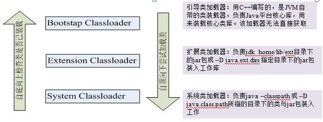
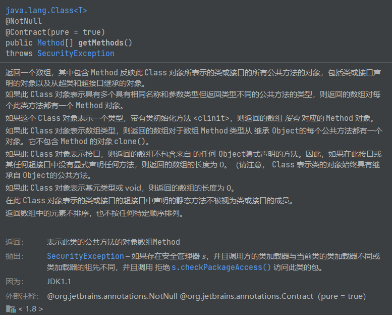
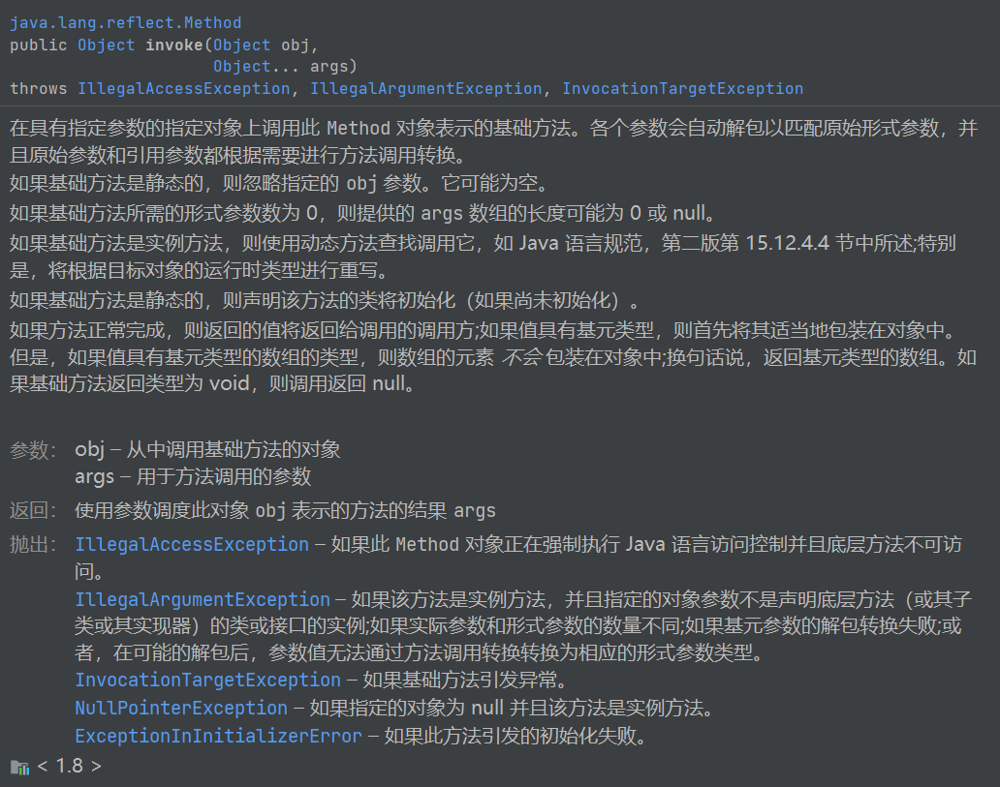
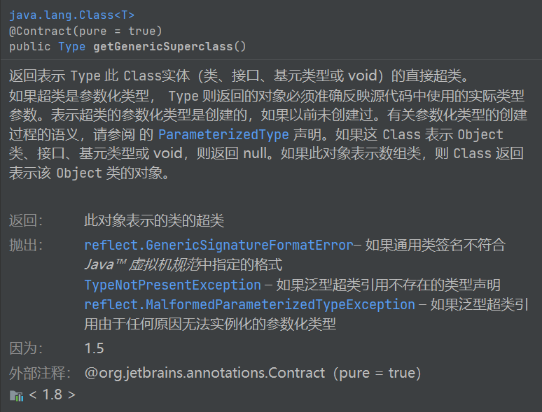
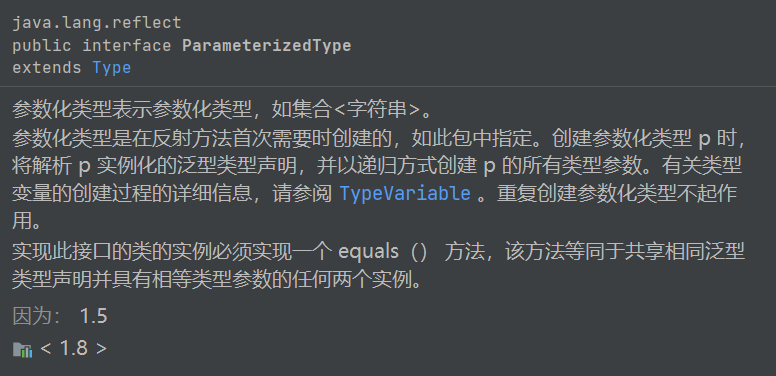
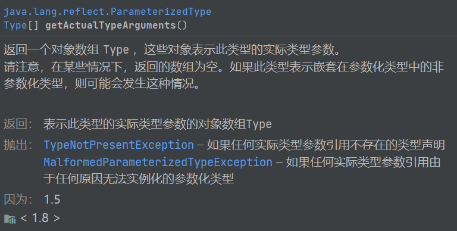

## 反射

### 概述

Reflection（反射）是Java被视为动态语言的关键，反射机制允许程序在执行期借助于Reflection API取得任何类的內部信息，并能直接操作任意对象的内部属性及方法。

Java反射机制主要提供了以下功能：

- 在运行时构造任意一个类的对象
- 在运行时获取任意一个类所具有的成员变量和方法
- 在运行时调用任意一个对象的方法（属性）
- 生成动态代理

Class 是一个类， **一个描述类的类**，封装了描述方法的 Method，描述字段的 Filed，描述构造器的 Constructor 等属性。

 **获取Class对象的三种方式：**

1. 通过类名获取---类名.class
2. 通过对象获取---对象名.class
3. 通过全类名获取---Class.forName(全类名)

**ClassLoader**

类装载器是用来把类(class)装载进 JVM 的。JVM 规范定义了两种类型的类装载器：启动类装载器(bootstrap)和用户自定义装载器(user-defined class loader)。 JVM在运行时会产生3个类加载器组成的初始化加载器层次结构 。



### 如何描述方法--Method

```java
public class ReflectionTest {
    @Test
    public void testMethod() throws Exception{
        Class clazz = Class.forName("com.atguigu.java.fanshe.Person");
        
        //        //1.获取方法      //  1.1 获取取clazz对应类中的所有方法--方法数组（一）
        //     不能获取private方法,且获取从父类继承来的所有方法
        Method[] methods = clazz.getMethods();
        for(Method method:methods){
            System.out.print(" "+method.getName());
        }
        System.out.println();
        
        //
        //  1.2.获取所有方法，包括私有方法 --方法数组（二）
        //  所有声明的方法，都可以获取到，且只获取当前类的方法
        methods = clazz.getDeclaredMethods();
        for(Method method:methods){
            System.out.print(" "+method.getName());
        }
        System.out.println();
        
        //
        //  1.3.获取指定的方法
        //  需要参数名称和参数列表，无参则不需要写
        //  对于方法public void setName(String name) {  }
        Method method = clazz.getDeclaredMethod("setName", String.class);
        System.out.println(method);
        //  而对于方法public void setAge(int age) {  }
        method = clazz.getDeclaredMethod("setAge", Integer.class);
        System.out.println(method);
        //  这样写是获取不到的，如果方法的参数类型是int型
        //  如果方法用于反射，那么要么int类型写成Integer： public void setAge(Integer age) {  }　　　　 //  要么获取方法的参数写成int.class
        
        //
        //2.执行方法
        //  invoke第一个参数表示执行哪个对象的方法，剩下的参数是执行方法时需要传入的参数
        Object obje = clazz.newInstance();
        method.invoke(obje,2);
　　　　//如果一个方法是私有方法，第三步是可以获取到的，但是这一步却不能执行　　　　//私有方法的执行，必须在调用invoke之前加上一句method.setAccessible（true）;    }
}
```





### 如何描述字段--Field

```java
@Test
    public void testField() throws Exception{
        String className = "com.atguigu.java.fanshe.Person";        
        Class clazz = Class.forName(className); 
        
        //1.获取字段
      //  1.1 获取所有字段 -- 字段数组
        //     可以获取公用和私有的所有字段，但不能获取父类字段
        Field[] fields = clazz.getDeclaredFields();
        for(Field field: fields){
            System.out.print(" "+ field.getName());
        }
        System.out.println();
        
        //  1.2获取指定字段
        Field field = clazz.getDeclaredField("name");
        System.out.println(field.getName());
        
        Person person = new Person("ABC",12);
        
        //2.使用字段
      //  2.1获取指定对象的指定字段的值
        Object val = field.get(person);
        System.out.println(val);
        
        //  2.2设置指定对象的指定对象Field值
        field.set(person, "DEF");
        System.out.println(person.getName());
        
        //  2.3如果字段是私有的，不管是读值还是写值，都必须先调用setAccessible（true）方法
        //     比如Person类中，字段name字段是公用的，age是私有的
        field = clazz.getDeclaredField("age");
        field.setAccessible(true);
        System.out.println(field.get(person));        
    }
```

### 如何描述构造器--Constructor

```java
@Test
    public void testConstructor() throws Exception{
        String className = "com.atguigu.java.fanshe.Person";
        Class<Person> clazz = (Class<Person>) Class.forName(className);
        
        //1. 获取 Constructor 对象
        //   1.1 获取全部
        Constructor<Person> [] constructors = 
                (Constructor<Person>[]) Class.forName(className).getConstructors();
        
        for(Constructor<Person> constructor: constructors){
            System.out.println(constructor); 
        }
        
        //  1.2获取某一个，需要参数列表
        Constructor<Person> constructor = clazz.getConstructor(String.class, int.class);
        System.out.println(constructor); 
        
        //2. 调用构造器的 newInstance() 方法创建对象
        Object obj = constructor.newInstance("zhagn", 1);                
    }
```

### 如何描述注解--Annotation

```java
import java.lang.annotation.ElementType;
import java.lang.annotation.Retention;
import java.lang.annotation.RetentionPolicy;
import java.lang.annotation.Target;


@Retention(RetentionPolicy.RUNTIME)
@Target(value={ElementType.METHOD})
public @interface AgeValidator {
    public int min();
    public int max();
}
```

```java
	@AgeValidator(min=18,max=35)
    public void setAge(int age) {
        this.age = age;
    }
```

```java
	@Test
    public void testAnnotation() throws Exception{
        Person person = new Person();    
        person.setAge(10);
    }
```

```java
/** Annotation 和 反射:
         * 1. 获取 Annotation
         * 
         * getAnnotation(Class<T> annotationClass) 
         * getDeclaredAnnotations() 
         * 
         */
    @Test
    public void testAnnotation() throws Exception{
        String className = "com.atguigu.java.fanshe.Person";
        
        Class clazz = Class.forName(className);
        Object obj = clazz.newInstance();    
        
        Method method = clazz.getDeclaredMethod("setAge", int.class);
        int val = 6;
        
        //获取指定名称的注解
        Annotation annotation = method.getAnnotation(AgeValidator.class);
        if(annotation != null){
            if(annotation instanceof AgeValidator){
                AgeValidator ageValidator = (AgeValidator) annotation;                
                if(val < ageValidator.min() || val > ageValidator.max()){
                    throw new RuntimeException("年龄非法");
                }
            }
        }        
        method.invoke(obj, 20);
        System.out.println(obj);          
    }
```

### 反射与泛型

1. getGenericSuperClass: 获取带泛型参数的父类, 返回值为: BaseDao<Employee, String>
   
2. Type 的子接口: ParameterizedType
   
3. 可以调用 ParameterizedType 的 Type[] getActualTypeArguments() 获取泛型参数的数组
   