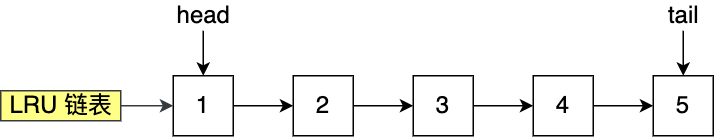
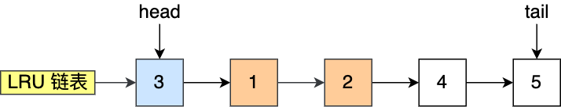
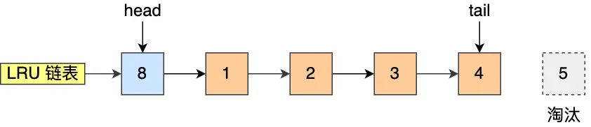
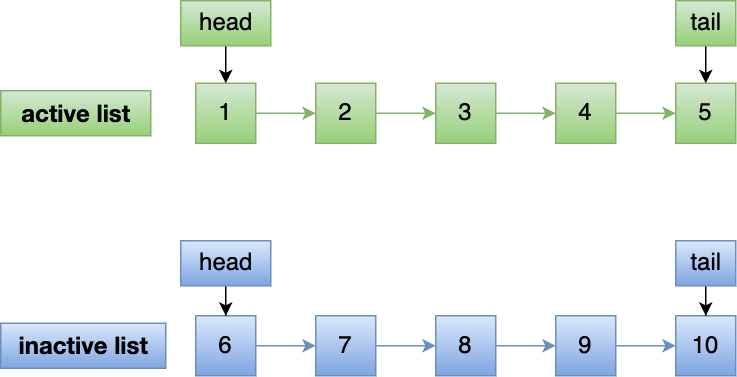
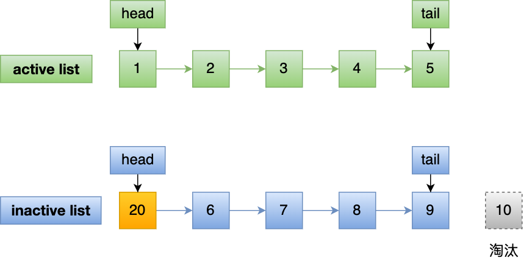
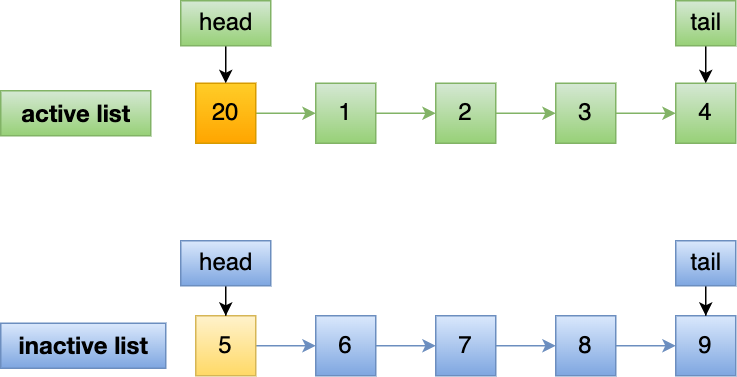
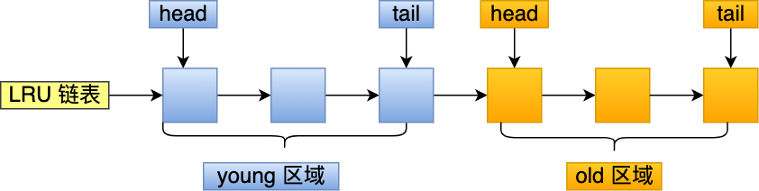
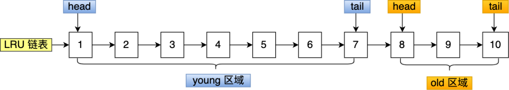
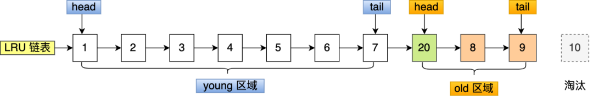
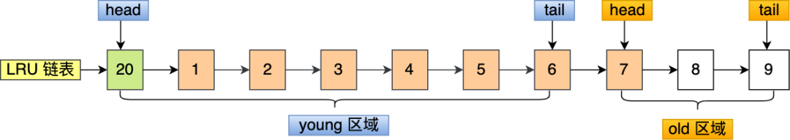

传统的 LRU 算法存在这两个问题：

- **「预读失效」导致缓存命中率下降（对应第一个问题）**
- **「缓存污染」导致缓存命中率下降（对应第二个问题）**

Redis 的缓存淘汰算法则是通过**实现 LFU 算法**来避免「缓存污染」而导致缓存命中率下降的问题（Redis 没有预读机制）。

MySQL 和 Linux 操作系统是通过**改进 LRU 算法**来避免「预读失效和缓存污染」而导致缓存命中率下降的问题。

传统的 LRU 算法的实现思路是这样的：

- 当访问的页在内存里，就直接把该页对应的 LRU 链表节点移动到链表的头部。
- 当访问的页不在内存里，除了要把该页放入到 LRU 链表的头部，还要淘汰 LRU 链表末尾的页。

假设 LRU 链表长度为 5，LRU 链表从左到右有编号为 1，2，3，4，5 的页。

如果访问了 3 号页，因为 3 号页已经在内存了，所以把 3 号页移动到链表头部即可，表示最近被访问了。

而如果接下来，访问了 8 号页，因为 8 号页不在内存里，且 LRU 链表长度为 5，所以必须要淘汰数据，以腾出内存空间来缓存 8 号页，于是就会淘汰末尾的 5 号页，然后再将 8 号页加入到头部。

传统的 LRU 算法并没有被 Linux 和 MySQL 使用，因为传统的 LRU 算法无法避免下面这两个问题：

- 预读失效导致缓存命中率下降；
- 缓存污染导致缓存命中率下降；

## 预读失效

如果**这些被提前加载进来的页，并没有被访问**，相当于这个预读工作是白做了，这个就是**预读失效**。

### Linux避免预读失效

Linux 操作系统实现两个了 LRU 链表：**活跃 LRU 链表（active_list）和非活跃 LRU 链表（inactive_list）**。

- **active list** 活跃内存页链表，这里存放的是最近被访问过（活跃）的内存页；
- **inactive list** 不活跃内存页链表，这里存放的是很少被访问（非活跃）的内存页；

**预读页就只需要加入到 inactive list 区域的头部，当页被真正访问的时候，才将页插入 active list 的头部**。如果预读的页一直没有被访问，就会从 inactive list 移除，这样就不会影响 active list 中的热点数据。

假设 active list 和 inactive list 的长度为 5，目前内存中已经有如下 10 个页：

现在有个编号为 20 的页被预读了，这个页只会被插入到 inactive list 的头部，而 inactive list 末尾的页（10号）会被淘汰掉。

**即使编号为 20 的预读页一直不会被访问，它也没有占用到 active list 的位置**，而且还会比 active list 中的页更早被淘汰出去。

如果 20 号页被预读后，立刻被访问了，那么就会将它插入到 active list 的头部， active list 末尾的页（5号），会被**降级**到 inactive list ，作为 inactive list 的头部，这个过程并不会有数据被淘汰。

### MySQL避免预读失效

MySQL 的 Innodb 存储引擎是在一个 LRU 链表上划分来 2 个区域，**young 区域 和 old 区域**。

young 区域在 LRU 链表的前半部分，old 区域则是在后半部分，这两个区域都有各自的头和尾节点，如下图：

**划分这两个区域后，预读的页就只需要加入到 old 区域的头部，当页被真正访问的时候，才将页插入 young 区域的头部**。如果预读的页一直没有被访问，就会从 old 区域移除，这样就不会影响 young 区域中的热点数据。

现在有个编号为 20 的页被预读了，这个页只会被插入到 old 区域头部，而 old 区域末尾的页（10号）会被淘汰掉。

如果 20 号页一直不会被访问，它也没有占用到 young 区域的位置，而且还会比 young 区域的数据更早被淘汰出去。

如果 20 号页被预读后，立刻被访问了，那么就会将它插入到 young 区域的头部，young 区域末尾的页（7号），会被挤到 old 区域，作为 old 区域的头部，这个过程并不会有页被淘汰。

## 缓存污染

虽然 Linux （实现两个 LRU 链表）和 MySQL （划分两个区域）通过改进传统的 LRU 数据结构，避免了预读失效带来的影响。但是如果还是使用「只要数据被访问一次，就将数据加入到活跃 LRU 链表头部（或者 young 区域）」这种方式的话，那么**还存在缓存污染的问题**。

当我们在批量读取数据的时候，由于数据被访问了一次，这些大量数据都会被加入到「活跃 LRU 链表」里，然后之前缓存在活跃 LRU 链表（或者 young 区域）里的热点数据全部都被淘汰了，**如果这些大量的数据在很长一段时间都不会被访问的话，那么整个活跃 LRU 链表（或者 young 区域）就被污染了**。

前面的 LRU 算法只要数据被访问一次，就将数据加入活跃 LRU 链表（或者 young 区域），**这种 LRU 算法进入活跃 LRU 链表的门槛太低了**！正式因为门槛太低，才导致在发生缓存污染的时候，很容就将原本在活跃 LRU 链表里的热点数据淘汰了。

所以，**只要提高进入到活跃 LRU 链表（或者 young 区域）的门槛，就能有效地保证活跃 LRU 链表（或者 young 区域）里的热点数据不会被轻易替换掉**。

### Linux避免缓存污染

在内存页被访问**第二次**的时候，才将页从 inactive list 升级到 active list 里。

### MySQL避免缓存污染

在内存页被访问**第二次**的时候，并不会马上将该页从 old 区域升级到 young 区域，因为还要进行**停留在 old 区域的时间判断**：

- 如果第二次的访问时间与第一次访问的时间**在 1 秒内**（默认值），那么该页就**不会**被从 old 区域升级到 young 区域；

- 如果第二次的访问时间与第一次访问的时间**超过 1 秒**，那么该页就**会**从 old 区域升级到 young 区域；

