## 多线程调优

### 使用异步方法提高接口响应速度

#### 为什么需要异步方法

合理使用异步方法可以让业务接口快到飞起!

 异步方法适用于逻辑与逻辑之间可以相互分割互不影响的业务中, 如生成验证码和发送验证码组成的业务, 其实无需等到真正发送成功验证码才对客户端进行响应, 可以让短信发送这一耗时操作转为异步执行, 解耦耗时操作和核心业务; 同理还有文章阅读的业务逻辑 = 查询文章详情 + 更新文章阅读量后再响应客户端, 其实也无需等到阅读量更新后才响应文章详情给客户端, 用户查看文章是主要逻辑, 而文章阅读量更新是次要逻辑, 况且阅读量就算更新失败一点数据偏差也不会影响用户阅读因此这两个数据库操作之间的一致性是较弱的, 这类都能用异步事件去优化. 所以说: 恰当的在我们的Service中加入异步方法能大大提高接口的响应速度, 提升用户体验!

**同步执行（在同一个线程中）**

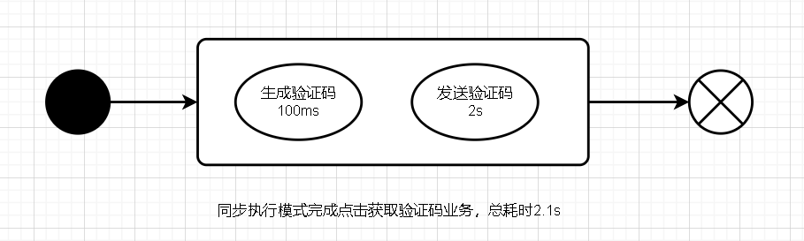

**异步执行（开启额外线程来执行）**

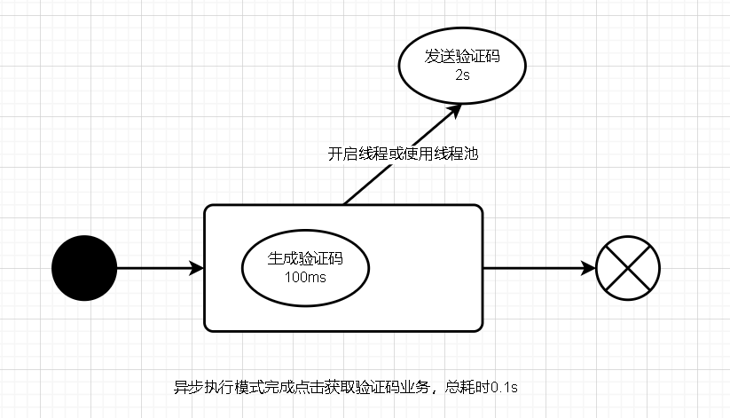

#### SpringBoot中的异步方法支持

在SpringBoot中并不需要我们自己去创建维护线程或者线程池来异步的执行方法, SpringBoot已经提供了异步方法支持注解。

```java
@EnableAsync // 使用异步方法时需要提前开启(在启动类上或配置类上)
@Async // 被async注解修饰的方法由SpringBoot默认线程池(SimpleAsyncTaskExecutor)执行
```

#### 自定义线程池执行异步方法

SpringBoot为我们默认提供了线程池(SimpleAsyncTaskExecutor)来执行我们的异步方法, 我们也可以自定义自己的线程池。

配置自定义线程池

```java
@EnableAsync // 开启多线程, 项目启动时自动创建
@Configuration
public class AsyncConfig {
    @Bean("customExecutor")
    public ThreadPoolTaskExecutor asyncOperationExecutor() {
        ThreadPoolTaskExecutor executor = new ThreadPoolTaskExecutor();
        // 设置核心线程数
        executor.setCorePoolSize(8);
        // 设置最大线程数
        executor.setMaxPoolSize(20);
        // 设置队列大小
        executor.setQueueCapacity(Integer.MAX_VALUE);
        // 设置线程活跃时间(秒)
        executor.setKeepAliveSeconds(60);
        // 设置线程名前缀+分组名称
        executor.setThreadNamePrefix("AsyncOperationThread-");
        executor.setThreadGroupName("AsyncOperationGroup");
        // 所有任务结束后关闭线程池
        executor.setWaitForTasksToCompleteOnShutdown(true);
        // 初始化
        executor.initialize();
        return executor;
    }
}
```

使用@Async注解指定执行的线程池

```java
// 文章阅读量+1
@Async("customExecutor")
public void updateReadCount() {
    // TODO 模拟耗时操作
    try {
        Thread.sleep(3000);
    } catch (InterruptedException e) {
        e.printStackTrace();
    }
    System.out.println("更新文章阅读量线程"+Thread.currentThread().getName());
}
```

#### 捕获（无返回值）异步方法中的异常

- 以实现AsyncConfigurer接口的getAsyncExecutor方法和getAsyncUncaughtExceptionHandler方法改造配置类
- 自定义异常处理类CustomAsyncExceptionHandler

```java
@EnableAsync // 开启多线程, 项目启动时自动创建
@Configuration
public class AsyncConfig implements AsyncConfigurer {
    @Override
    public Executor getAsyncExecutor() {
        ThreadPoolTaskExecutor executor = new ThreadPoolTaskExecutor();
        // 设置核心线程数
        executor.setCorePoolSize(8);
        // 设置最大线程数
        executor.setMaxPoolSize(20);
        // 设置队列大小
        executor.setQueueCapacity(Integer.MAX_VALUE);
        // 设置线程活跃时间(秒)
        executor.setKeepAliveSeconds(60);
        // 设置线程名前缀+分组名称
        executor.setThreadNamePrefix("AsyncOperationThread-");
        executor.setThreadGroupName("AsyncOperationGroup");
        // 所有任务结束后关闭线程池
        executor.setWaitForTasksToCompleteOnShutdown(true);
        // 初始化
        executor.initialize();
        return executor;
    }

    @Override
    public AsyncUncaughtExceptionHandler getAsyncUncaughtExceptionHandler() {
        return new CustomAsyncExceptionHandler();
    }
}

```

```java
public class CustomAsyncExceptionHandler implements AsyncUncaughtExceptionHandler {
 
    @Override
    public void handleUncaughtException(Throwable throwable, Method method, Object... obj) {
        System.out.println("异常捕获---------------------------------");
        System.out.println("Exception message - " + throwable.getMessage());
        System.out.println("Method name - " + method.getName());
        for (Object param : obj) {
            System.out.println("Parameter value - " + param);
        }
        System.out.println("异常捕获---------------------------------");
    }
     
}
```

#### 获取（有返回值）异步方法的返回值

使用**Future类及其子类**来接收异步方法返回值

注意:

- 无返回值的异步方法抛出异常不会影响Controller的主要业务逻辑
- 有返回值的异步方法抛出异常会影响Controller的主要业务逻辑

```java
// 异步方法---------------------------------------------------------------------
@Async
    public CompletableFuture<Integer> updateReadCountHasResult() {
        // TODO 模拟耗时操作
        try {
            Thread.sleep(3000);
        } catch (InterruptedException e) {
            e.printStackTrace();
        }
        System.out.println("更新文章阅读量线程"+Thread.currentThread().getName());
        return CompletableFuture.completedFuture(100 + 1);
    }

// Controller调用---------------------------------------------------------------------
@GetMapping("/article")
public String getArticle() throws ExecutionException, InterruptedException {
    // 查询文章
    String article = articleService.selectArticle();
    // 阅读量+1
    CompletableFuture<Integer> future = articleService.updateReadCountHasResult();
    int count = 0;
    // 循环等待异步请求结果
    while (true) {
        if(future.isCancelled()) {
            System.out.println("异步任务取消");
            break;
        }
        if (future.isDone()) {
            count = future.get();
            System.out.println(count);
            break;
        }
    }
    System.out.println("文章阅读业务执行完毕");
    return article + count;
}
```

## JVM调优

### JVM实践调优主要步骤

1. 监控分析GC日志

2. 判断JVM问题

   - 如果各项参数设置合理，系统没有超时日志出现，GC频率不高，GC耗时不高，那么没有必要进行GC优化
   - 如果GC时间超过1-3秒，或者频繁GC，则必须优化。

3. 确定调优目标

4. 调整参数

   调优一般是从满足程序的内存使用需求开始，之后是时间延迟要求，最后才是吞吐量要求，要基于这个步骤来不断优化，每一个步骤都是进行下一步的基础，不可逆行之。

5. 对比调优前后差距

6. 重复 1 、 2 、 3 、 4 、 5 步骤，找到最佳JVM参数设置

7. 找到最合适的参数，将这些参数应用到所有服务器，并进行后续跟踪

### 分析GC日志

#### 初始参数设置

**jvm调优典型参数设置：**

1. -Xms堆内存的最小值：默认情况下，当堆中可用内存小于40%时，堆内存会开始增加，一直增加到-Xmx的大小。
2. -Xmx堆内存的最大值：默认情况下，当堆中可用内存大于70%时，堆内存会开始减少，一直减小到-Xms的大小。
3. -Xmn新生代内存的最大值：
   1. 包括Eden区和两个Survivor区的总和
   2. 配置写法如：-Xmn1024k，-Xmn1024m，-Xmn1g
4. -Xss每个线程的栈内存：默认1M，一般来说是不需要改。线程栈越小意味着可以创建的线程数越多

整个堆的大小 = 年轻代大小 + 年老代大小，堆的大小不包含元空间大小，如果增大了年轻代，年老代相应就会减小，官方默认的配置为年老代大小/年轻代大小=2/1左右；

建议在开发测试环境可以用Xms和Xmx分别设置最小值最大值，但是在线上生产环境，**Xms和Xmx设置的值必须一样，防止抖动；**

1. **-XX:+PrintGCDetails** 开启GC日志创建更详细的GC日志 ，默认情况下，GC日志是关闭的

2. **-XX:+PrintGCTimeStamps，-XX:+PrintGCDateStamps** 开启GC时间提示

   - 开启时间便于我们更精确地判断几次GC操作之间的时两个参数的区别

   - 时间戳是相对于 0 （依据JVM启动的时间）的值，而日期戳（date stamp）是实际的日期字符串

   - 由于日期戳需要进行格式化，所以它的效率可能会受轻微的影响，不过这种操作并不频繁，它造成的影响也很难被我们感知。

3. **-XX:+PrintHeapAtGC** 打印堆的GC日志
4. **-Xloggc:./logs/gc.log** 指定GC日志路径

> -XX:+PrintGCDetails -XX:+PrintGCTimeStamps -XX:+PrintGCDateStamps -XX:+PrintHeapAtGC -Xloggc:E:/logs/gc-default.log
>
> 这样就会在e盘下logs文件夹下面，生成gc-default.log日志

#### GC日志解读

##### YoungGC日志含义

```log
2022-08-05T13:45:23.336+0800: 4.866: [GC (Metadata GC Threshold) [PSYoungGen: 136353K->20975K(405504K)] 160049K->48437K(720384K), 0.0092260 secs] [Times: user=0.00 sys=0.02, real=0.02 secs] 
```

日志解析：

```log
2022-08-05T13:45:23.336+0800: 本次GC发生时间
4.866: 举例启动应用的时间
[GC【表示GC的类型，youngGC】 (Metadata GC Threshold) 元空间超阈值
[PSYoungGen: 136353K->20975K(405504K年轻代总空间)] 160049K->48437K(720384K)整堆), 0.0092260 secs本次垃圾回收耗时]
[Times: user=0.00本次GC消耗CPU的时间 sys=0.02系统暂停时间, real=0.02 secs实际应用暂停时间]

```

##### FullGC日志含义

```log
2022-08-05T20:24:47.815+0800: 6.955: [Full GC (Metadata GC Threshold) [PSYoungGen: 701K->0K(72704K)] [ParOldGen: 38678K->35960K(175104K)] 39380K->35960K(247808K), [Metaspace: 56706K->56706K(1099776K)], 0.1921975 secs] [Times: user=1.03 sys=0.00, real=0.19 secs] 
```

日志解析：

```log
2022-08-05T20:24:47.815+0800:
6.955: 刚启动服务就Full GC【整堆回收！！】

[Full GC (Metadata GC Threshold) Metaspace空间超限！
[PSYoungGen: 701K->0K(72704K)] 年轻代没有回收空间
[ParOldGen: 38678K->35960K(175104K)] 39380K->35960K(247808K), 老年代也没有到阈值，整堆更没有到阈值
[Metaspace: 56706K->56706K(1099776K)], 0.1921975 secs]
[Times: user=1.03本次GC消耗CPU的时间 sys=0.00系统暂停时间, real=0.19 secs实际应用暂停时间] 

```

##### GC可视化分析

1. JVM内存占用情况

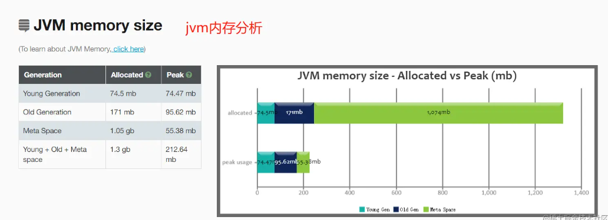

2. 关键性能指标

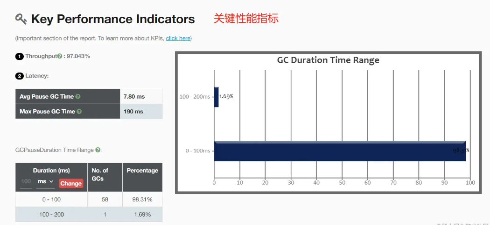

吞吐量百分比越高表明GC开销越低。

3. GC可视化交互聚合结果

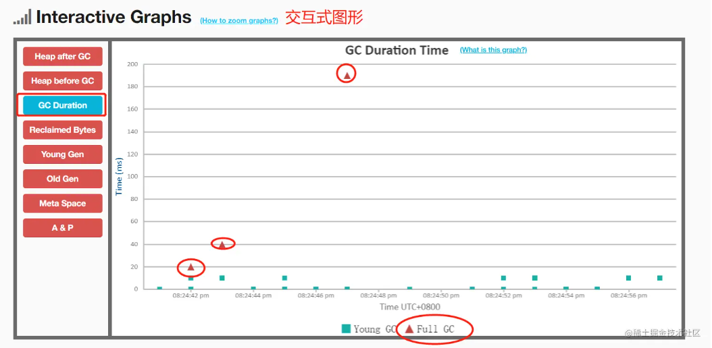

存在问题：一开始就发生了 3 次full gc , 很明显不太正常；

4. GC统计

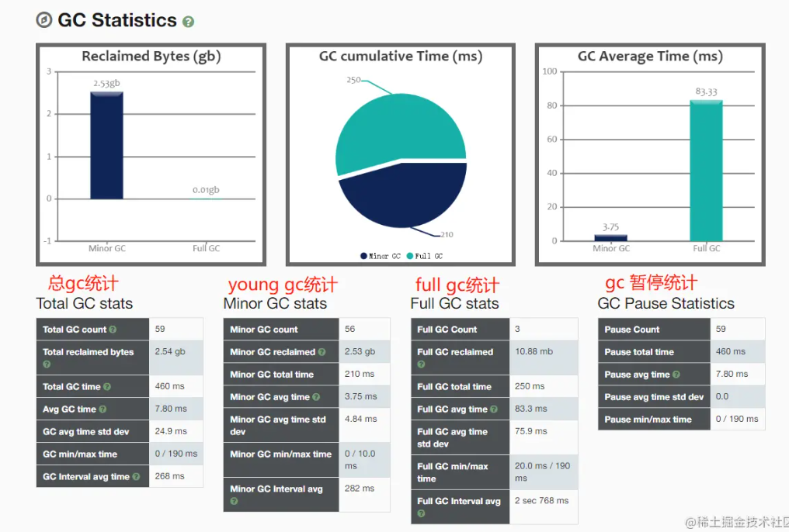

5. GC原因

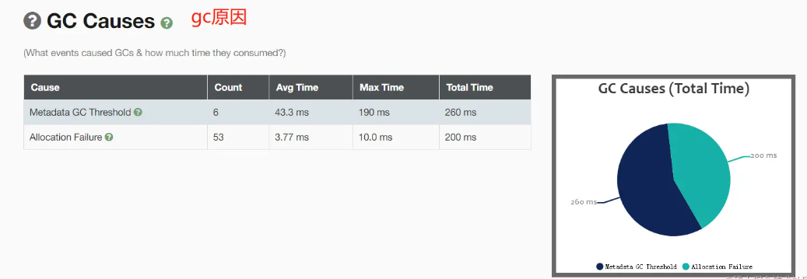

1. **Metadata GC Threshold**： 元空间超阈值
2. **Allocation Failure** ：年轻代空间不足
3. **Ergonomics**：译文是“人体工程学”，GC中的Ergonomics含义是负责自动调解gc暂停时间和吞吐量之间平衡从而产生的GC。目的是使得虚拟机性能更好的一种做法。

### 堆内存与元空间优化

#### 监控分析

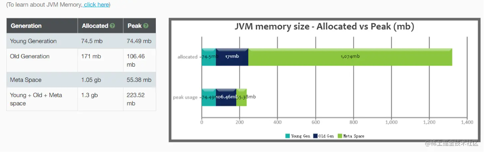

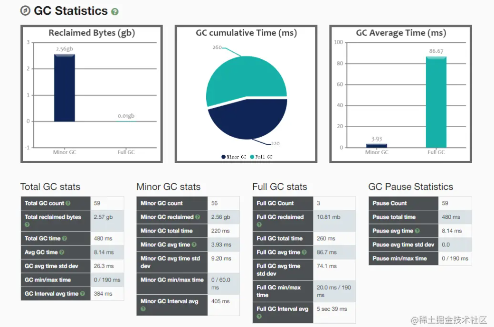

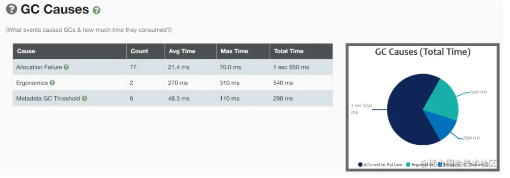

GC主要原因扩容，扩容时间为1.65秒大于 1 秒，故需要进行调优。

#### 确定目标

则其他堆空间的分配，基于以下规则来进行。

老年代的空间大小为106MB

- 堆内存：参数-Xms和-Xmx，建议扩大至3-4倍FullGC后的老年代空间占用。
  - 106 * (3-4) = (318-424)MB ，设置heap大小为424MB；
  - 经过线上一段时间，GC日志中老年代空间占用
- 元空间：参数-XX:MetaspaceSize=N，设置元空间大小为128MB;
- 新生代：参数-Xmn，建议扩大至1-1.5倍FullGC之后的老年代空间占用。106M*(1-1.5)=(209-159)M，设置新生代大小为159MB；
  - 不设置：新生代和老年代比例：1 : 2

```ini
# 调整参数，基于当前系统运行情况这是最佳配置
JAVA_OPT="${JAVA_OPT} -Xms424m -Xmx424m -Xmn159m -XX:MetaspaceSize=128m"
# -Xms堆最小内存
# -Xmx堆最大内存
# -Xmn新生代大小：
# -XX:MetaspaceSize元空间大小
```

```ini
JAVA_OPT="${JAVA_OPT} -XX:+PrintGCDetails -XX:+PrintGCTimeStamps -XX:+PrintGCDateStamps -XX:+PrintHeapAtGC -Xloggc:E:/logs/gc-best-heap-
metaspace.log"
```

#### 对比差异

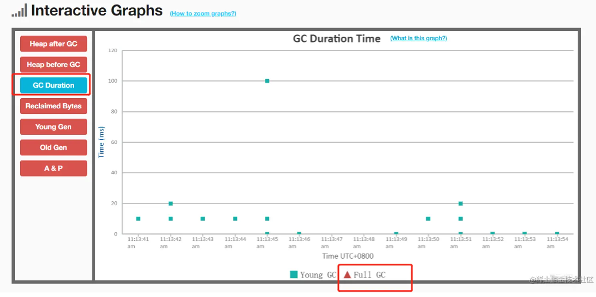

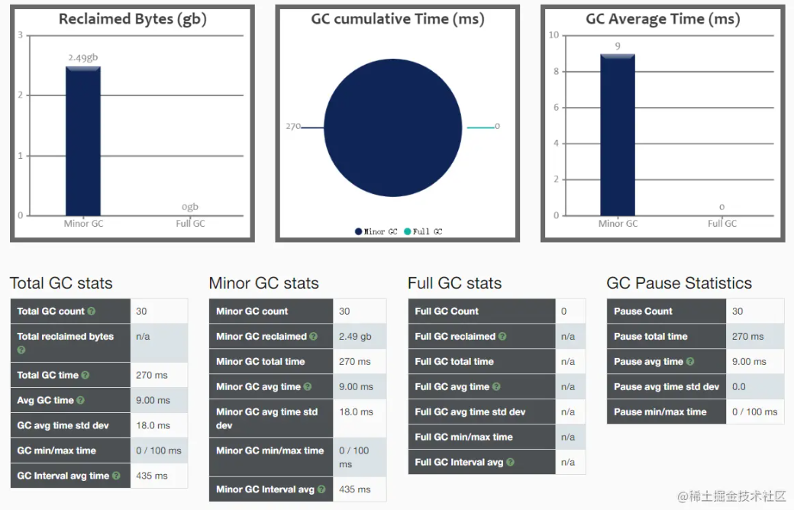

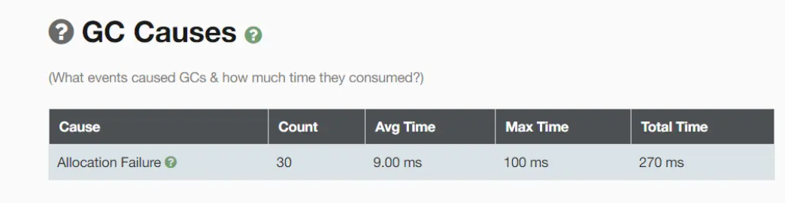

收集GC日志，发现没有因为扩容而频繁GC，GC的时间0.027秒，已经小于 1 秒，并且频率不高。

已经达到调优目标，应用到所有服务器配置。

### 线程栈堆优化-让线程数实现翻倍

使用更小的硬件承载更大的吞吐量。

-Xss每个线程的栈内存：默认1M，一般来说是不需要改的。

```ini
# 最大的线程数的影响因素：
Max Of Thread  = (机器本身可用内存 -(JVM分配的堆内存+JVM元数据区)) / Xss值
```

- 机器本身可用内存：机器内存16G
- JVM分配的堆内存：424m (上面堆内存调优的值)
- JVM元数据区：128m (上面堆内存调优的值)

```ini
# 开启一个线程，需要占用的内存1m
(16384 - (424+128)) / 1m = 15832个
(16384 - (424+128)) / 0.5m = 31664个线程数
(16384 - (424+128)) / 0.25m = 63328个线程数
# 理论大小上线：现在可以不加16GB内存，也让当前值理论最大线程数翻倍
```

对于不同版本的Java虚拟机和不同的操作系统，栈容量最小值可能会有所限制，这主要取决于操作系统内存分页大小。
譬如上述方法中的参数-Xss128k可以正常用于 32 位Windows系统下的JDK 6，但是如果用于 64 位Windows系统下的JDK 11，则会提示栈容量最小不能低于180K，而在Linux下这个值则可能是228K。

根据应用的线程所需内存大小进行调整。在相同物理内存下，减小这个值能生成更多的线程。但是操作系统对一个进程内的线程数还是有限制的，不能无限生成， 1w~2w左右 一般小的应用， 如果栈不是很深， 应该是 512k够用 了，大的应用建议使用1m。
注意：这个选项对性能影响较大，需要严格的测试确定最终大小。

### 堆内存内部优化

参数-Xmn可以设置为1-1.5倍FullGC之后的老年代空间占用 ，一般采用默认比例1:2。

-Xmn设置了新生代大小，设置完成新生代和老年代比例： 1:2

避免新生代设置过小，当新生代设置过小时，会产生两种比较明显的现象，一是minor GC次数频繁，二是可能导致 minor GC对象直接进入老年代。当老年代内存不足时，会触发Full GC。

避免新生代设置过大，当新生代设置过大时，会带来两个问题：一是老年大变小，可能导致FullGC频繁执行；二是 minor GC 执行回收的时间大幅度增加。

### 垃圾回收器优化

#### 吞吐量优先ps+po

- Perallel-Scavenge垃圾收集器：-XX:+UsePerallelGC
  - 吞吐量优先
  - 年轻代是并行回收的，老年代是串行回收的【STW】
  - 新生代收集器复制算法，老年代采用的是标记-整理算法【mark-compart】
  - 并行的多线程收集器
- Perallel-Old垃圾收集器【po是ps的老年代并行收集版本】：-XX：+UsePerallelOldGC
  - 吞吐量优先
  - 老年代采用并行垃圾回收

默认使用 ps+po 垃圾回收器组合： 并行垃圾回收器组合

> -Xms424m -Xmx424m -Xss512k -XX:MetaspaceSize=128m -XX:+UseParallelGC -XX:+UseParallelOldGC -XX:+PrintGCDetails -XX:+PrintGCTimeStamps -XX:+PrintGCDateStamps -XX:+PrintHeapAtGC -Xloggc:E:/logs/gc-default.log

#### 响应时间优化parnew+cms

- ParNew垃圾收集器【Serial的收集器的多线程版本】：-XX:UseParNewGC
  - 年轻代是并行的垃圾回收，老年代是串行垃圾回收
  - 注意：单核的CPU性能并不如Serial，没有线程切换成本
- CMS垃圾收集器： 并发 收集器(非独占式)-XX:ConcMarkSweepGC【并发的标记清楚算法的GC垃圾收集器】
  - 响应优先(低延时)
  - 可以执行并发收集的垃圾收集器
  - 垃圾收集采用的是标记清除算法
  - 缺点：容易产生内存碎片，对CPU比较敏感
  - 主要分为四个阶段：
    1. 初始标记（Initial-Mark）阶段 ：【STW】
    2. 并发标记（Concurrent-Mark）阶段 ：
    3. 重新标记（Remark）阶段 ：【STW】
    4. 并发清除（Concurrent-Sweep）阶段 ：

使用cms垃圾回收器，垃圾回收器组合： parNew+CMS, cms垃圾回收器在垃圾标记，垃圾清除的时候，和业务线程交叉执行，尽量减少stw时间，因此这垃圾回收器叫做响应时间优先；

> -Xms424m -Xmx424m -Xss512k -XX:MetaspaceSize=128m -XX:+UseParNewGC -XX:+UseConcMarkSweepGC -XX:+PrintGCDetails -XX:+PrintGCTimeStamps -XX:+PrintGCDateStamps -XX:+PrintHeapAtGC -Xloggc:E:/logs/gc-default.log

#### G1垃圾收集器

G1中提供了三种模式垃圾回收模式， Young GC、Mixed GC 和 Full GC ，在不同的条件下被触发。
G1的使用步骤：

- 配置开启G1
- 设置对的最大内存
- 设置GC最大暂停时间：设置100-300之间是比较合理：
  - 如果设置的GC的暂停时间比较小，系统吞吐量会降低
  - 默认的值是200,
  - G1设计的目标：控制用户线程执行时间90%，GC占比时间10%

##### 原理

G1垃圾收集器相对比其他收集器而言，最大的区别在于它取消了 年轻代、老年代的物理划分， 取而代之的是将堆划分为若干个区域（Region），这些区域中包含了有逻辑上的年轻代、老年代区域。
这样做的好处就是，我们再也不用单独的空间对每个代进行设置了，不用担心每个代内存是否足够。

在G1划分的区域中，年轻代的垃圾收集依然采用暂停所有应用线程的方式，将存活对象拷贝到老年代或者Survivor空间，G1收集器通过将对象从一个区域复制到另外一个区域，完成了清理工作。
这就意味着，在正常的处理过程中，G1完成了堆的压缩（至少是部分堆的压缩），这样也就不会有cms内存碎片问题的存在了。

##### Young GC

Young GC主要是对Eden区进行GC，它在Eden空间耗尽时会被触发。

基于根可达算法回收垃圾对象，判断对象是否是GC Roots，如果全量扫描老年代，那么这样扫描下来会耗费大量的时间。
于是，G1引进了RSet的概念。它的全称是Remembered Set，其作用是用来记录并跟踪其它Region指向该Region中对象的引用。

每个Region初始化时，会初始化一个RSet，该集合用来记录并跟踪其它Region指向该Region中对象的引用，每个Region默认按照512Kb划分成多个Card，所以RSet需要记录的东西应该是 xx Region的 xx Card。

##### Mixed GC

当越来越多的对象晋升到老年代old region时，为了避免堆内存被耗尽，虚拟机会触发一个混合的垃圾收集器，即Mixed GC，该算法并不是一个Old GC，除了回收整个Young Region，还会回收一部分的Old Region
注意：是一部分老年代，而不是全部老年代，可以选择哪些old region进行收集，从而可以对垃圾回收的耗时时间进行控制。也要注意的是Mixed GC 并不是 Full GC。

-XX:InitiatingHeapOccupancyPercent=n ，设置触发标记周期的 Java 堆占用率阈值。默认占用率是整个 Java 堆的 45%。

MixedGC主要分为两步：

1. 全局并发标记
2. 拷贝存活对象

##### G1收集器相关参数

```properties
# 使用 G1 垃圾收集器
-XX:+UseG1GC

# 设置期望达到的最大GC停顿时间指标（JVM会尽力实现，但不保证达到），默认值是 200 毫秒。
-XX:MaxGCPauseMillis=

# 设置的 G1 区域的大小。值是 2 的幂，范围是 1 MB 到 32 MB 之间。目标是根据最小的 Java 堆大小划分出约 2048 个区域。
# 默认是堆内存的1/2000。
-XX:G1HeapRegionSize=n

# 设置 STW 工作线程数的值。将 n 的值设置为逻辑处理器的数量。n 的值与逻辑处理器的数量相同，最多为 8。
-XX:ParallelGCThreads=n

# 设置并行标记的线程数。将 n 设置为并行垃圾回收线程数 (ParallelGCThreads)的 1/4 左右。
-XX:ConcGCThreads=n

# 设置触发标记周期的 Java 堆占用率阈值。默认占用率是整个 Java 堆的 45%。
-XX:InitiatingHeapOccupancyPercent=n
```

> -Xms424m -Xmx424m -Xss512k -XX:MetaspaceSize=128m -XX:+UseG1GC -XX:MaxGCPauseMillis=100 -XX:+PrintGCDetails -XX:+PrintGCTimeStamps -XX:+PrintGCDateStamps -XX:+PrintHeapAtGC -Xloggc:E:/logs/gc-default.log

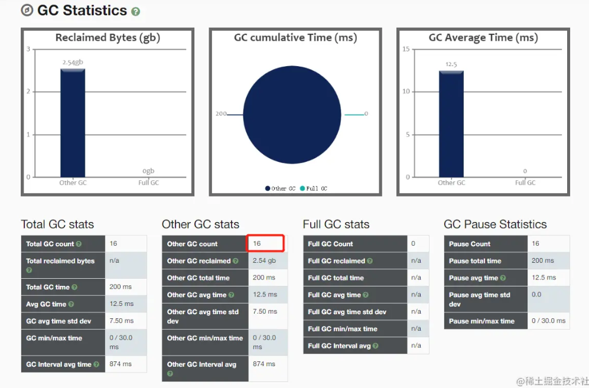

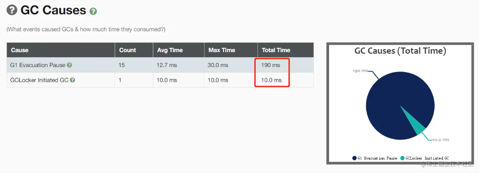

gc的次数，明显减少。暂停时间也有减少。

## 数据库调优

- 使用explain分析查询语句
- 声明NOT NULL：在查询的时候就不需要判断是否为NULL，由于减少了判断，可以降低复杂性，提高查询速度。
- 考虑使用数值类型代替字符串：MySQL对数值类型的处理速度要远远快于字符串，而且数值类型往往更加节省空间。
- 考虑使用ENUM类型：如果数据列的取值是确定有限的，可以使用ENUM类型代替。因为MySQL会把这些值表示为一系列对应的数字，这样处理的速度会提高很多。

